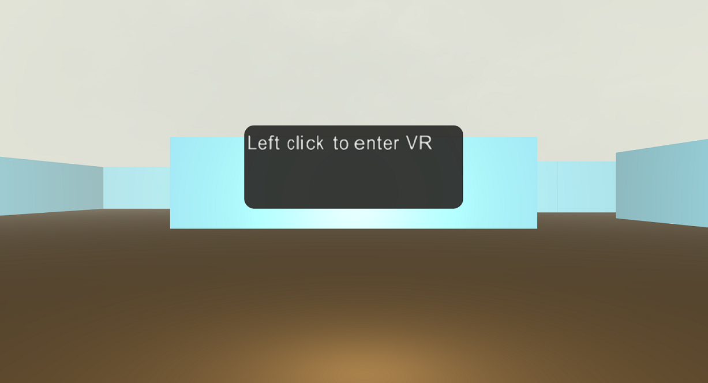
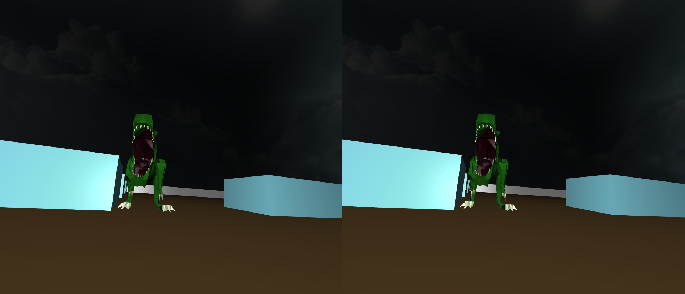

# Adding WebVR support to a 3D Babylon.js game

If you've created a 3D game with Babylon.js and thought that it might look great in virtual reality (VR), follow the simple steps in this tutorial to make that a reality.

We'll add WebVR support to the game shown here. Go ahead and plug in an Xbox controller to try it out!

<iframe height='300' scrolling='no' title='Babylon.js dino game' src='//codepen.io/MicrosoftEdgeDocumentation/embed/MmgdWp/?height=300&theme-id=23761&default-tab=result&embed-version=2&editable=true' frameborder='no' allowtransparency='true' allowfullscreen='true' style='width: 100%;'>See the Pen <a href='http://codepen.io/MicrosoftEdgeDocumentation/pen/MmgdWp/'>Babylon.js dino game</a> by Microsoft Edge Docs (<a href='http://codepen.io/MicrosoftEdgeDocumentation'>@MicrosoftEdgeDocumentation</a>) on <a href='http://codepen.io'>CodePen</a>.
</iframe>

This is a 3D game that works well on a flat screen, but what about in VR?
In this tutorial, we'll walk through the few steps it takes to get this up and running with WebVR. We’ll use a [Windows Mixed Reality](https://developer.microsoft.com/en-us/windows/mixed-reality) headset that can tap into the added support for WebVR in Microsoft Edge. After we apply these changes to the game, you can expect it also to work in other browser/headset combinations that support WebVR.


## Prerequisites

- A text editor (like [Visual Studio Code](https://code.visualstudio.com/download))
- An Xbox controller that’s plugged in to your computer
- Windows 10 Creators Update
- A computer with the [minimum required specs to run Windows Mixed Reality](https://developer.microsoft.com/en-us/windows/mixed-reality/immersive_headset_setup)
- A Windows Mixed Reality device (Optional) 


## Getting started

The simplest way to get started is to visit the [Windows-tutorials-web GitHub repo](https://github.com/Microsoft/Windows-tutorials-web), press the green **Clone or download** button, and select **Open in Visual Studio**.


If you don't want to clone the project, you can download it as a zip file.
You'll then have two folders, [before](https://github.com/Microsoft/Windows-tutorials-web/tree/master/BabylonJS-game-with-WebVR/before) and [after](https://github.com/Microsoft/Windows-tutorials-web/tree/master/BabylonJS-game-with-WebVR/after). The "before" folder is our game before any VR features are added, and the "after" folder is the finished game with VR support.

The before and after folders contain these files:
-   textures/ - A folder containing any images used in the game.
-   css/ - A folder containing the CSS for the game.
-   js/ - A folder containing the JavaScript files. The main.js file is our game, and the other files are the libraries used.
-   models/ - A folder containing the 3D models. For this game we have only one model, for the dinosaur.
-   index.html - The webpage that hosts the game's renderer. Opening this page in Edge launches the game.

You can test both versions of the game by opening their respective index.html files in Edge.


## The Mixed Reality Portal

If you're unfamiliar with Windows Mixed Reality and have the Windows 10 Creators Update installed on a computer with a compatible graphics card, try opening the **Mixed Reality Portal** app from the Start menu in Windows 10.


If you met all the requirements, you can then turn on developer features and simulate a Windows Mixed Reality headset plugged in to your computer. If you're fortunate enough to have an actual headset nearby, plug it in and run the setup.

> [!IMPORTANT]
> The Mixed Reality Portal must be open at all times during this tutorial.

You're now ready to experience WebVR with Edge.

## 2D UI in a virtual world

>[!NOTE]
> Grab the [**before**](https://github.com/Microsoft/Windows-tutorials-web/tree/master/BabylonJS-game-with-WebVR/before) folder to get the starter code.

Because the [`Canvas2D`](http://doc.babylonjs.com/classes/2.5/canvas2d) element that is currently being used doesn't work well in virtual reality, we'll be cutting or changing all the 2D UI in our game.
We'll be updating the start UI to work in VR, but we'll forgo the distance counter and game-over UI to keep things simple.


### Step 1: Creating a WorldSpaceCanvas2D object

Within the `create2d()` function, we'll strip everything out and add a new [`Text2D`](http://doc.babylonjs.com/classes/2.5/text2d) object to hold our UI text. We'll then use that `Text2D` object with a new [`WorldSpaceCanvas2D`](http://doc.babylonjs.com/classes/2.5/worldspacecanvas2d) object. `WorldSpaceCanvas2D` is 2D UI that can be placed in a 3D environment (unlike the [`ScreenSpaceCanvas2D`](http://doc.babylonjs.com/classes/2.5/screenspacecanvas2d) object, which adds a layer of UI on top of the 3D canvas).


Paste this code over the existing `var create2d = function...` code.
```javascript
    var create2d = function (scene) {
        // Start button UI
        startUI = new BABYLON.Rectangle2D({
            id: "startUI",
            children:
            [
                new BABYLON.Text2D("Left click to enter VR", {
                    size: new BABYLON.Size(110, 15), marginBottom: "20", textAlignment: "h: left, v: top",
                    wordWrap: true, fontName: "7pt Arial", fontSignedDistanceField: true
                })
            ]
        });

        var canvas = new BABYLON.WorldSpaceCanvas2D(scene, new BABYLON.Size(105, 40), {
            id: "ScreenCanvas",
            backgroundFill: "#000000F2",
            backgroundRoundRadius: 5,
            children: [startUI]
        });
        return canvas;
    };
```

Our 2D UI is now ready to be added to our scene. 


### Step 2: Positioning 2D UI

Within the `createScene` function, we'll now write a few lines of code to add the UI from our scene and position it so that it's in front of the user.


Paste this code after `skybox.material = skyboxMaterial;` .
```javascript
        canvas2d = create2d(scene);
        canvas2d.worldSpaceCanvasNode.position = new BABYLON.Vector3(0, 30, 175);
```

### Step 3: Toggling 2D UI visibility
To make the start UI disappear after the game starts, we'll tweak the **A** button-press check to include an `isVisible = false;` call on `canvas2d`.


Paste this code over your current `xboxpad.onbuttondown` call.
```javascript
        xboxpad.onbuttondown(function (buttonValue) {
            // When the A button is pressed, either start or reload the game depending on the game state
            if (buttonValue == BABYLON.Xbox360Button.A) {

                // Game is over, reload it
                if (gameOver) {
                    location.href = location.href;
                }
                // Game has begun
                else {
                    // Hide start UI
                    canvas2d.worldSpaceCanvasNode.isVisible = false;
                    begin = true;
                    // Start looping the dino walking animation
                    scene.beginAnimation(dino.skeleton, 111, 130, true, 1);
                }
            }
        });
```

### Step 4: Resizing 
As a final note on our UI, we can now update the `onWindowResize()` function to remove any references to the UI because it's no longer impacted by the size of the window.

Paste the following code over the `onWindowResize()` function.
```javascript
function onWindowResize() {
     engine.resize();
}
```


You can load the game by opening the index.html file in Edge. And there you have it: 2D UI in a 3D world!




## Detecting headsets

It's good practice for VR apps to have two types of cameras so that multiple scenarios can be supported. For this game, we'll support one camera that requires a working headset to be plugged in, and another that uses no headset. To determine which one the game will use, we must first check to see whether a headset has been detected. To do that, we’ll use [navigator.getVRDisplays()](https://msdn.microsoft.com/en-us/library/mt793853(v=vs.85).aspx).


Add this code above `window.addEventListener('DOMContentLoaded')` .
```javascript
var headset;
// If a VR headset is connected, get its info
navigator.getVRDisplays().then(function (displays) {
    if (displays[0]) {
        headset = displays[0];
    }
});
```

With the info stored in the `headset` variable, we'll now be able to choose the camera that’s right for the user.


## Selecting the initial camera

With Babylon.js, WebVR can be added quickly by using the [WebVRFreeCamera](http://doc.babylonjs.com/classes/2.5/webvrfreecamera). This camera can take keyboard input and enables you to use a VR headset to control your "head" rotation.


### Step 1: Checking for headsets

For our fallback camera, we'll be using the [UniversalCamera](https://doc.babylonjs.com/classes/2.5/universalcamera) that’s currently used in the original game.

We'll check our `headset` variable to determine whether we can use the **WebVRFreeCamera** camera.

Replace `camera = new BABYLON.UniversalCamera("Camera", new BABYLON.Vector3(0, 18, -45), scene);` with the following code.
```javascript
        if(headset){
            // Create a WebVR camera with the trackPosition property set to false so that we can control movement with the gamepad
            camera = new BABYLON.WebVRFreeCamera("vrcamera", new BABYLON.Vector3(0, 14, 0), scene, true, { trackPosition: false });
            camera.deviceScaleFactor = 1;
        } else {
            // No headset, use universal camera
            camera = new BABYLON.UniversalCamera("camera", new BABYLON.Vector3(0, 18, -45), scene);
        }
```

### Step 2: Activating the WebVRFreeCamera
To activate this camera in most browsers, the user must perform some interaction that requests the virtual experience.

Now we'll hook this functionality up to a mouse click, and update our start UI text to show a different set of instructions after doing so.


Paste the code within  `createScene()` function after `camera.applyGravity = true;` .
```javascript
        scene.onPointerDown = function () {
            startUI.children[0].text = "Dino is to your right! Press A button to start. L analog stick to move.";
            scene.onPointerDown = undefined
            camera.attachControl(canvas, true);
        }
```

A click in the game now creates a prompt like the following, or displays the game in the headset right away if the user has encountered the prompt before.


### Step 3: Adding gamepad support

Because the **WebVRFreeCamera** doesn't initially support gamepads, we'll map our gamepad buttons to the keyboard arrow keys. We'll do this by digging into the **input** property of the camera. By adding the corresponding codes for left analog stick up, down, left, and right to match up with the arrow keys, our gamepad is back in action.


Add this code below the `scene.onPointerDown = function() {...} call.
``` javascript
    // Custom input, adding Xbox controller support for left analog stick to map to keyboard arrows
    camera.inputs.attached.keyboard.keysUp.push(211);    // Left analog up
    camera.inputs.attached.keyboard.keysDown.push(212);  // Left analog down
    camera.inputs.attached.keyboard.keysLeft.push(214);  // Left analog left
    camera.inputs.attached.keyboard.keysRight.push(213); // Left analog right
```

For this game, wherever the user looks will be forward. For example, if they look at a wall and push up on the left analog stick, they'll move towards the wall.

### Step 4: Give it a try!

If we open index.html with our headset and game controller plugged in, a left click on the blue game window will switch our game to VR mode! Go ahead and put on your headset to check out the results. 

In the next section, we'll cover the unpleasantness that occurs when you exit VR mode while in the Edge browser, and what should happen when a headset isn't plugged in.


## Swapping between cameras

With only the **WebVRFreeCamera** available, things can go awry in the Edge browser when you try to escape from WebVR (because this camera works only while a headset is displaying content).

When the scene suddenly loses an active camera, the display in Edge will switch between views, causing a flickering effect. To prevent this, we'll add a backup **UniversalCamera** to display after we've taken our headset off, pressed **ESC**, or switched between tabs in Edge.


A VR headset can be plugged in but not displaying content (presenting). With the `headset` variable available to us, we can now use our `animate()` function to see whether the headset is presenting using the `isPresenting` property. If it is, keep the **WebVRFreeCamera** active; if it isn't, switch to the backup **UniversalCamera**.


Add this `if` check under `engine.runRenderLoop()` .
```javascript
    // Determine which camera should be showing depending on whether or not the headset is presenting
    if (headset) {
        if (!(headset.isPresenting)) {
            var camera2 = new BABYLON.UniversalCamera("Camera", new BABYLON.Vector3(0, 18, -45), scene);
            scene.activeCamera = camera2;
        } else {
            scene.activeCamera = camera;
        }
    }
```


## Ending the game and fog changes

The last pieces we'll add are a couple calls to adjust the color of our fog. While this doesn't relate to WebVR, it's a nice finishing touch to the game. This will add a tint to our sky when the dinosaur detects the player and after the player has been caught.

### Step 1: Player detected changes

When the dinosaur has detected the player, we'll make the fog turn red. If the player evades the dinosaur, we make sure to switch the sky back to normal (grey).


Replace your current `beginChase()` function with this code.
```javascript
    function beginChase(distanceAway) {
        if (distanceAway < CHASERANGE) {
              // Change fog to red
            scene.fogColor = new BABYLON.Color3(.5, 0, 0);
            dino.lookAt(new BABYLON.Vector3(camera.position.x, dino.position.y, camera.position.z));
            // Switch fog back to grey, dino out of range
        } else {
            scene.fogColor = new BABYLON.Color3(0.9, 0.9, 0.85);
        }
    }
```


### Step 2: Player caught changes

To make the sky turn black after the player has been caught, we'll add a color change to the beginning of the `caught()` function. Within `caught()`,we also want to prevent the player from moving their body. We can do this by removing the `FreeCameraKeyboardMoveInput`. This means the player won't be able to move, and will be allowed only to look around with their head.


Replace your current `caught()` function with this code.
```javascript
    function caught() {
        // Change fog to black
        scene.fogColor = new BABYLON.Color3(0, 0, 0);
        gameOver = true;

        // Disable all movement except head rotation
        camera.inputs.removeByType("FreeCameraKeyboardMoveInput");

        if (frameCount % ROARDIVISOR == 0) {
            dino.skeleton.beginAnimation("roar", false, .5, function () {
                dino.skeleton.beginAnimation("stand", true, .5);
            });
        }
        frameCount++;
    }
```



## Conclusion

Congratulations! You now have a complete Babylon.js game with WebVR support. From here you can take what you've learned to build an even better game, or build off this one.


