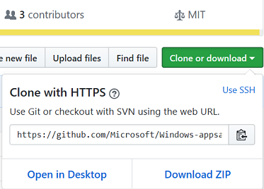

# Adding WebVR support to a 3D Babylon.js game

If you've created a 3D game with Babylon.js and thought that it might look great in virtual reality (VR), follow the simple steps in this tutorial to make that a reality.

In this tutorial, we'll walk through the few steps it takes to get a 3D game up and running with WebVR. We’ll use a [Windows Mixed Reality](https://developer.microsoft.com/mixed-reality) headset that can tap into the added support for WebVR in Microsoft Edge. After we apply these changes to the game, you can expect it also to work in other browser/headset combinations that support WebVR.


## Prerequisites

- A text editor (like [Visual Studio Code](https://code.visualstudio.com/download))
- An Xbox controller that’s plugged in to your computer
- Windows 10 Creators Update
- A computer with the [minimum required specs to run Windows Mixed Reality](https://developer.microsoft.com/windows/mixed-reality/immersive_headset_setup)
- A Windows Mixed Reality device (Optional) 


## Getting started

The simplest way to get started is to visit the [Windows-tutorials-web GitHub repo](https://github.com/Microsoft/Windows-tutorials-web), press the green **Clone or download** button, and select **Open in Visual Studio**.



If you don't want to clone the project, you can download it as a zip file.
You'll then have two folders, [before](https://github.com/Microsoft/Windows-tutorials-web/tree/master/BabylonJS-game-with-WebVR/before) and [after](https://github.com/Microsoft/Windows-tutorials-web/tree/master/BabylonJS-game-with-WebVR/after). The "before" folder is our game before any VR features are added, and the "after" folder is the finished game with VR support.

The before and after folders contain these files:
-   **textures/** - A folder containing any images used in the game.
-   **css/** - A folder containing the CSS for the game.
-   **js/** - A folder containing the JavaScript files. The main.js file is our game, and the other files are the libraries used.
-   **models/** - A folder containing the 3D models. For this game we have only one model, for the dinosaur.
-   **index.html** - The webpage that hosts the game's renderer. Opening this page in Microsoft Edge launches the game.

You can test both versions of the game by opening their respective index.html files in Microsoft Edge.


## The Mixed Reality Portal

If you're unfamiliar with Windows Mixed Reality and have the Windows 10 Creators Update installed on a computer with a compatible graphics card, try opening the **Mixed Reality Portal** app from the Start menu in Windows 10.


If you met all the requirements, you can then turn on developer features and simulate a Windows Mixed Reality headset plugged in to your computer. If you're fortunate enough to have an actual headset nearby, plug it in and run the setup.

> [!IMPORTANT]
> The Mixed Reality Portal must be open at all times during this tutorial.

You're now ready to experience WebVR with Microsoft Edge.

## 2D UI in a virtual world

>[!NOTE]
> Grab the [**before**](https://github.com/Microsoft/Windows-tutorials-web/tree/master/BabylonJS-game-with-WebVR/before) folder to get the starter sample.

[Babylon.GUI](https://doc.babylonjs.com/how_to/gui) is a VR-friendly library, enabling you to create simple, interactive user interfaces that work well for VR and non-VR displays.
An extension to Babylon.js, the `GUI` library is used throuhout the sample to create 2D elements.


A 2D text `GUI` element can be created with a few lines depending on how many attributes you want to tweak.
The following code snippet is already in our [**before**](https://github.com/Microsoft/Windows-tutorials-web/tree/master/BabylonJS-game-with-WebVR/before) sample, but let's walkthrough what's happening.
We first make an [`AdvancedDynamicTexture`](https://doc.babylonjs.com/how_to/gui#advanceddynamictexture) object to establish what the GUI will cover. The sample sets this to `CreateFullScreenUI()`, meaning our UI will cover the entire screen. 
With `AdvancedDynamicTexture` created, we then make a 2D text box that appears upon starting the game using `GUI.Rectanlge()` and `GUI.TextBlock()`.


This code is added within [**main.js**](https://github.com/Microsoft/Windows-tutorials-web/blob/master/BabylonJS-game-with-WebVR/before/js/main.js#L157-L168).
```javascript
// GUI
var advancedTexture = BABYLON.GUI.AdvancedDynamicTexture.CreateFullscreenUI("UI");

// Start UI
startUI = new BABYLON.GUI.Rectangle("start");
startUI.background = "black"
startUI.alpha = .8;
startUI.thickness = 0;
startUI.height = "60px";
startUI.width = "400px";
advancedTexture.addControl(startUI); 
var tex2 = new BABYLON.GUI.TextBlock();
tex2.text = "Stay away from the dinosaur! \n Plug in an Xbox controller and press A to start";
tex2.color = "white";
startUI.addControl(tex2); 
```


This UI is visible once created but can be toggled on or off with `isVisible` depending on what's happening in the game.
```javascript
startUI.isVisible = false;
```


## Detecting headsets

It's good practice for VR applications to have two types of cameras so that multiple scenarios can be supported. For this game, we'll support one camera that requires a working headset to be plugged in, and another that uses no headset. To determine which one the game will use, we must first check to see whether a headset has been detected. To do that, we’ll use [`navigator.getVRDisplays()`](https://developer.mozilla.org/en-US/docs/Web/API/Navigator/getVRDisplays).


Add this code above `window.addEventListener('DOMContentLoaded')` in **main.js**.
```javascript
var headset;
// If a VR headset is connected, get its info
navigator.getVRDisplays().then(function (displays) {
    if (displays[0]) {
        headset = displays[0];
    }
});
```

With the info stored in the `headset` variable, we'll now be able to choose the camera that’s right for the user.


## Creating and selecting the initial camera

With Babylon.js, WebVR can be added quickly by using the [`WebVRFreeCamera`](https://doc.babylonjs.com/api/classes/babylon.webvrfreecamera). This camera can take keyboard input and enables you to use a VR headset to control your "head" rotation.


### Step 1: Checking for headsets

For our fallback camera, we'll be using the [`UniversalCamera`](https://doc.babylonjs.com/api/classes/babylon.universalcamera) that’s currently used in the original game.

We'll check our `headset` variable to determine whether we can use the `WebVRFreeCamera` camera.

Replace `camera = new BABYLON.UniversalCamera("Camera", new BABYLON.Vector3(0, 18, -45), scene);` with the following code.
```javascript
        if(headset){
            // Create a WebVR camera with the trackPosition property set to false so that we can control movement with the gamepad
            camera = new BABYLON.WebVRFreeCamera("vrcamera", new BABYLON.Vector3(0, 14, 0), scene, true, { trackPosition: false });
            camera.deviceScaleFactor = 1;
        } else {
            // No headset, use universal camera
            camera = new BABYLON.UniversalCamera("camera", new BABYLON.Vector3(0, 18, -45), scene);
        }
```


### Step 2: Activating the WebVRFreeCamera
To activate this camera in most browsers, the user must perform some interaction that requests the virtual experience.
We'll hook this functionality up to a mouse click.


Paste the code within  `createScene()` function after `camera.applyGravity = true;` .
```javascript
        scene.onPointerDown = function () {
            scene.onPointerDown = undefined
            camera.attachControl(canvas, true);
        }
```

A click in the game now creates a prompt like the following, or displays the game in the headset right away if the user has accepted the prompt before.


We can also add a piece of code that will display the `UniversalCamera` view before we switch to our `WebVRFreeCamera`, allowing the user to look at the game instead of a blue window. 

Add the following after `engine.runRenderLoop(function () {`.
```javascript
            if (headset) {
                if (!(headset.isPresenting)) {
                    var camera2 = new BABYLON.UniversalCamera("Camera", new BABYLON.Vector3(0, 18, -45), scene);
                    scene.activeCamera = camera2;
                } else {
                    scene.activeCamera = camera;
                }
            }
```

### Step 3: Adding gamepad support

Since the `WebVRFreeCamera` doesn't initially support gamepads, we'll map our gamepad buttons to the keyboard arrow keys. We'll do this by digging into the `inputs` property of the camera. By adding the corresponding codes for left analog stick up, down, left, and right to match up with the arrow keys, our gamepad is back in action.


Add this code below the `scene.onPointerDown = function() {...}` call.
``` javascript
    // Custom input, adding Xbox controller support for left analog stick to map to keyboard arrows
    camera.inputs.attached.keyboard.keysUp.push(211);    // Left analog up
    camera.inputs.attached.keyboard.keysDown.push(212);  // Left analog down
    camera.inputs.attached.keyboard.keysLeft.push(214);  // Left analog left
    camera.inputs.attached.keyboard.keysRight.push(213); // Left analog right
```


### Step 4: Give it a try!

If we open **index.html** with our headset and game controller plugged in, a left click on the blue game window will switch our game to VR mode! Go ahead and put on your headset to check out the results. 


## Conclusion

Congratulations! You now have a complete Babylon.js game with WebVR support. From here you can take what you've learned to build an even better game, or build off this one.
