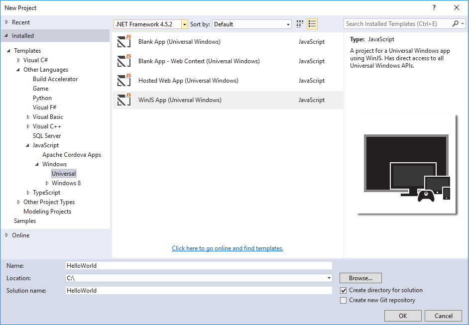
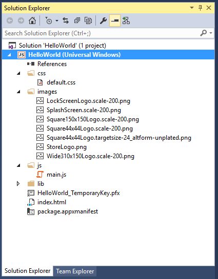
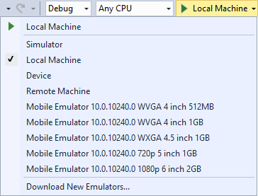
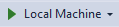
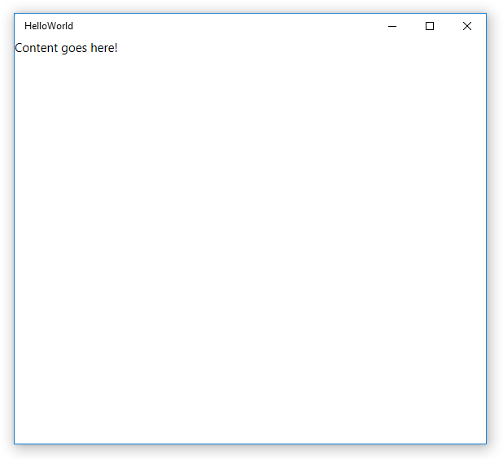
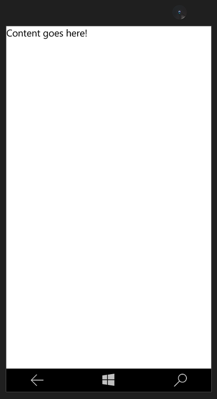
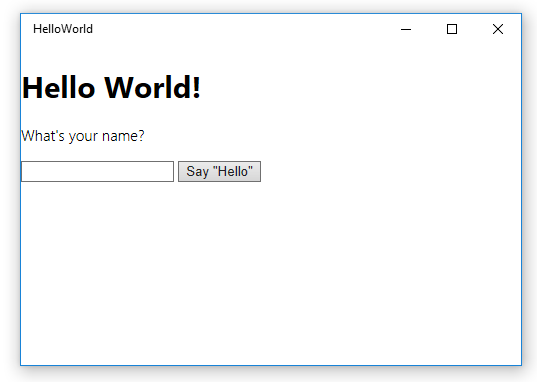
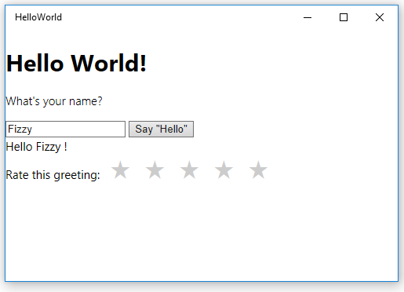

# Create a "Hello, world" app (WinJS)

This tutorial teaches you how to use JavaScript and HTML to create a simple "Hello, world" WinJS app that targets the Universal Windows Platform (UWP) on Windows 10. With a single project in Microsoft Visual Studio, you can build an app that runs on any Windows 10 device.

> [!NOTE]
> This tutorial uses WinJS to create an app. If you are looking for a JavaScript-only solution, see [this project](create-a-hello-world-app-js-uwp.md) instead.


Here you'll learn how to:

-   Create a new **Visual Studio 2015** project that targets **Windows 10** and the **UWP**.
-   Add HTML content to your start page
-   Handle touch, pen, and mouse input
-   Run the project on the local desktop and on the phone emulator in Visual Studio
-   Use a Windows Library for JavaScript control

## Before you start...

-   [What's a Universal Windows app](whats-a-uwp.md)?
-   To complete this tutorial, you need Windows 10 and Visual Studio 2015. [Get set up](get-set-up.md).
-   We also assume you're using the default window layout in Visual Studio. If you change the default layout, you can reset it in the **Window** menu by using the **Reset Window Layout** command.

## Step 1: Create a new project in Visual Studio

Let's create a new app named `HelloWorld`. Here's how:
1.  Launch Visual Studio 2015.

2.  From the **File** menu, select **New > Project...** to open the *New Project* dialog.

3.  From the list of templates on the left, expand **Installed > Templates > JavaScript > Windows**, and then choose **Universal** to see the list of UWP project templates. Choose **WinJS App (Universal Windows)**.

    

    For this tutorial, we use the **WinJS App** template. This template creates a minimal UWP app that compiles and runs, but contains no user interface controls or data. You add controls and data to the app over the course of this tutorials.

   (If you don't see these options, make sure you have the Universal Windows App Development Tools installed. See [Get set up](get-set-up.md) for more info.)

4.  In the **Name** text box, type "HelloWorld".
5.  Click **OK** to create the project.
6.  You will be asked to select a **Target Version** and **Minimum Version** of Windows to support. The default settings are fine, so click **OK**.

    Visual Studio creates your project and displays it in the **Solution Explorer**.

    

Although the **WinJS App** is a minimal template, it still contains a handful of files:

-   A manifest file (package.appxmanifest) that describes your app (its name, description, tile, start page, splash screen, and so on) and lists the files that your app contains.
-   A set of logo images (images/Square150x150Logo.scale-200.png, images/Square44x44Logo.scale-200.png, and images/Wide310x150Logo.scale-200.png)to display in the start menu.
-   An image (images/StoreLogo.png) to represent your app in the Windows Store.
-   A splash screen (images/SplashScreen.scale-200.png) to show when your app starts.
-   A start page (index.html) and an accompanying JavaScript file (main.js) that run when your app starts.

To view and edit the files, double-click the file in the **Solution Explorer**.

These files are essential to all UWP apps using JavaScript. Any project that you create in Visual Studio contains them.

## Step 2: Launch the app


At this point, you've created a very simple app. This is a good time to build, deploy, and launch your app and see what it looks like. You can debug your app on the local machine, in a simulator or emulator, or on a remote device. Here's the target device menu in Visual Studio.



### Start the app on a Desktop device

By default, the app runs on the local machine. The target device menu provides several options for debugging your app on devices from the desktop device family.

-   **Simulator**
-   **Local Machine**
-   **Remote Machine**

**To start debugging on the local machine**

1.  In the target device menu () on the **Standard** toolbar, make sure that **Local Machine** is selected. (It's the default selection.)
2.  Click the **Start Debugging** button () on the toolbar.

   –or–

   From the **Debug** menu, click **Start Debugging**.

   –or–

   Press F5.

The app opens in a window, and a default splash screen appears first. The splash screen is defined by an image (SplashScreen.png) and a background color (specified in your app's manifest file).

The splash screen disappears, and then your app appears. It contains a black screen with the text "Content goes here".



Press the Windows key to open the **Start** menu, then show all apps. Notice that deploying the app locally adds its tile to the **Start** menu. To run the app again (not in debugging mode), tap or click its tile in the **Start** menu.

It doesn't do much—yet—but congratulations, you've built your first UWP app!

**To stop debugging**

-   Click the **Stop Debugging** button () in the toolbar.

   –or–

   From the **Debug** menu, click **Stop debugging**.

   –or–

   Close the app window.

### Start the app on a mobile device emulator

Your app runs on any Windows 10 device, so let’s see how it looks on a Windows Phone.

In addition to the options to debug on a desktop device, Visual Studio provides options for deploying and debugging your app on a physical mobile device connected to the computer, or on a mobile device emulator. You can choose among emulators for devices with different memory and display configurations.

-   **Device**
-   **Emulator <SDK version> WVGA 4 inch 512MB**
-   **Emulator <SDK version> WVGA 4 inch 1GB**
-   etc... (Various emulators in other configurations)

(If you don't see the emulators, make sure you have the Universal Windows App Development Tools installed. See [Get set up](get-set-up.md) for more info.)

It's a good idea to test your app on a device with a small screen and limited memory, so use the **Emulator 10.0.14393.0 WVGA 4 inch 512MB** option.

**To start debugging on a mobile device emulator**

1.  In the target device menu () on the **Standard** toolbar, pick **Emulator 10.0.14393.0 WVGA 4 inch 512MB**.
2.  Click the **Start Debugging** button () in the toolbar.

   –or–

   From the **Debug** menu, click **Start Debugging**.


Visual Studio starts the selected emulator and then deploys and starts your app. On the initial launch, the emulator may take a little time to start. You may see an error regarding HyperV, and clicking **Retry** should resolve this. On the mobile device emulator, the app looks like this.



## Step 3: Modify your start page

One of the files that Visual Studio created for you is **index.html**, your app's start page. When the app runs, it displays the content of its start page. The start page also contains references to the app's code files and style sheets. Here's the start page that Visual Studio created for you:

```html
<!DOCTYPE html>
<html>
<head>
    <meta charset="utf-8" />
    <title>HelloWorld</title>

    <!-- WinJS references -->
    <link href="lib/winjs-4.0.1/css/ui-light.css" rel="stylesheet" />
    <script src="lib/winjs-4.0.1/js/base.js"></script>
    <script src="lib/winjs-4.0.1/js/ui.js"></script>

    <!-- HelloWorld references -->
    <link href="/css/default.css" rel="stylesheet" />
    <script src="/js/main.js"></script>
</head>
<body class="win-type-body">
    <div>Content goes here!</div>
</body>
</html>
```

Let's add some new content to your default.html file. Just as you would add content to any other HTML file, you add your content inside the [body](https://msdn.microsoft.com/library/windows/apps/Hh453011) element. You can use HTML5 elements to create your app (with a [few exceptions](https://msdn.microsoft.com/library/windows/apps/Hh465380)). That means you can use HTML5 elements like [h1](https://msdn.microsoft.com/library/windows/apps/Hh441078), [p](https://msdn.microsoft.com/library/windows/apps/Hh453431), [button](https://msdn.microsoft.com/library/windows/apps/Hh453017), [div](https://msdn.microsoft.com/library/windows/apps/Hh453133), and [img](https://msdn.microsoft.com/library/windows/apps/Hh466114).

**Edit your start page**

1.  Replace the existing content in the **body** element with a first-level heading that says "Hello, world!", some text that asks the user's name, an **input** element to accept the user's name, a **button**, and a **div** element. Assign IDs to the **input**, the **button**, and the **div**.

 ```html
    <body class="win-type-body">
        <h1>Hello, world!</h1>
        <p>What's your name?</p>
        <input id="nameInput" type="text" />
        <button id="helloButton">Say "Hello"</button>
        <div id="greetingOutput"></div>
    </body>
 ```

2.  Run the app on the local machine. It look like this.



   You can type in the **input** element, but right now, clicking the **button** doesn't do anything. Some objects, such as **button**, can send messages when certain events occur. These event messages give you the opportunity to take some action in response to the event. You put code to respond to the event in an event handler method.

   In the next steps, we create an event handler for the **button** that displays a personalized greeting. We add our event handler code to our main.js file.

## Step 4: Create an event handler

When we created our new project, Visual Studio created a /js/main.js file for us. This file contains code for handling your app's life cycle. It's also where you write additional code that provides interactivity for your index.html file.

Open the main.js file.

Before we start adding our own code, let's take a look at the first and the last few lines of code in the file:

```javascript
(function () {
    "use strict";

     // Omitted code

 })();
```

You might be wondering what's going on here. These lines of code wrap the rest of the main.js code in a self-executing anonymous function. A self-executing anonymous function makes it easier to avoid naming conflicts or situations where you accidently modify a value that you didn't intend to modify. It also keeps unnecessary identifiers out of the global namespace, which helps performance. It looks a little strange, but it's a good programming practice.

The next line of code turns on [strict mode](https://msdn.microsoft.com/library/windows/apps/br230269.aspx) for your JavaScript code. Strict mode provides additional error checking for your code. For example, it prevents you from using implicitly declared variables or assigning a value to a read-only property.

Take a look at the rest of the code in main.js. It handles your app's [activated](https://msdn.microsoft.com/library/windows/apps/BR212679) and [checkpoint](https://msdn.microsoft.com/library/windows/apps/BR229839) events. We go into more detail about these events later. For now, just know that the **activated** event fires when your app starts.

```javascript
   (function () {
    "use strict";

    var app = WinJS.Application;
    var activation = Windows.ApplicationModel.Activation;
    var isFirstActivation = true;

    app.onactivated = function (args) {
		  if (args.detail.kind === activation.ActivationKind.voiceCommand) {
			// TODO: Handle relevant ActivationKinds. For example, if your app can be started by voice commands,
			// this is a good place to decide whether to populate an input field or choose a different initial view.
	  	}
		  else if (args.detail.kind === activation.ActivationKind.launch) {
			// A Launch activation happens when the user launches your app via the tile
			// or invokes a toast notification by clicking or tapping on the body.
			  if (args.detail.arguments) {
				// TODO: If the app supports toasts, use this value from the toast payload to determine where in the app
				// to take the user in response to them invoking a toast notification.
		 	  }
			  else if (args.detail.previousExecutionState === activation.ApplicationExecutionState.terminated) {
				// TODO: This application had been suspended and was then terminated to reclaim memory.
				// To create a smooth user experience, restore application state here so that it looks like the app never stopped running.
				// Note: You may want to record the time when the app was last suspended and only restore state if they've returned after a short period.
			}
		}

		if (!args.detail.prelaunchActivated) {
			// TODO: If prelaunchActivated were true, it would mean the app was prelaunched in the background as an optimization.
			// In that case it would be suspended shortly thereafter.
			// Any long-running operations (like expensive network or disk I/O) or changes to user state which occur at launch
			// should be done here (to avoid doing them in the prelaunch case).
			// Alternatively, this work can be done in a resume or visibilitychanged handler.
		}

		if (isFirstActivation) {
			// TODO: The app was activated and had not been running. Do general startup initialization here.
			document.addEventListener("visibilitychange", onVisibilityChanged);
			args.setPromise(WinJS.UI.processAll());
		}

		isFirstActivation = false;
	};
```

Let's define an event handler for your [button](https://msdn.microsoft.com/library/windows/apps/Hh453017). Our new event handler gets the user's name from the `nameInput` [input](https://msdn.microsoft.com/library/windows/apps/Hh453271) control and uses it to output a greeting to the `greetingOutput` **div** element that you created in the last section.

### Using events that work for touch, mouse, and pen input

In a UWP app, you don’t need to worry about the differences between touch, mouse, and other forms of pointer input. You can just use events that you know, like [click](https://msdn.microsoft.com/library/windows/apps/Hh441312), and they work for all forms of input.

**Tip**   Your app can also use the new *MSPointer\** and *MSGesture\** events, which work for touch, mouse, and pen input and can provide additional info about the device that triggered the event. For more info, see [Responding to user interaction](https://msdn.microsoft.com/library/windows/apps/Hh700412) and [Gestures, manipulations, and interactions](https://msdn.microsoft.com/library/windows/apps/Hh761498).

Let's go ahead and create the event handler.

**Create the event handler**

1.  In main.js, after the [**app.oncheckpoint**](https://msdn.microsoft.com/library/windows/apps/BR229839) event handler and before the call to [**app.start**](https://msdn.microsoft.com/library/windows/apps/BR229705), create a [**click**](https://msdn.microsoft.com/library/windows/apps/Hh441312) event handler function named `buttonClickHandler` that takes a single parameter named `eventInfo`.
```javascript
    function buttonClickHandler(eventInfo) {

        }
```

2.  Inside our event handler, retrieve the user's name from the `nameInput` [**input**](https://msdn.microsoft.com/library/windows/apps/Hh453271) control and use it to create a greeting. Use the `greetingOutput` [**div**](https://msdn.microsoft.com/library/windows/apps/Hh453133) to display the result.
```javascript
    function buttonClickHandler(eventInfo) {
            var userName = document.getElementById("nameInput").value;
            var greetingString = "Hello, " + userName + "!";
            document.getElementById("greetingOutput").innerText = greetingString;
        }
 ```

You added your event handler to main.js. Now you need to register it.

## Step 5: Register the event handler when your app launches


The only thing we need to do now is register the event handler with the button. The recommended way to register an event handler is to call [addEventListener](https://msdn.microsoft.com/library/windows/apps/Hh441145) from our code. A good place to register the event handler is when our app is activated. Fortunately, as you saw Visual Studio generated some code for us in our main.js file that handles our app's activation.


Inside the [onactivated](https://msdn.microsoft.com/library/windows/apps/BR212679) handler, the code checks to see what type of activation occurred. There are many different types of activations. For example, your app is activated when the user launches your app and when the user wants to open a file that is associated with your app. (For more info, see [App lifecycle](https://msdn.microsoft.com/library/windows/apps/Mt243287).)

We're interested in the [launch](https://msdn.microsoft.com/library/windows/apps/BR224693) activation. An app is *launched* whenever it is not running and then a user activates it. It calls [WinJS.UI.processAll](https://msdn.microsoft.com/library/windows/apps/Hh440975) regardless of whether the app had been shut down in the past or whether this is the very first time it's being launched. The **WinJS.UI.processAll** is enclosed in a call to the [setPromise](https://msdn.microsoft.com/library/windows/apps/JJ215609) method, which makes sure the splash screen isn't taken down until the app's page is ready.

**Tip**   The **WinJS.UI.processAll** function scans your default.html file for WinJS controls and initializes them. So far, we haven't added any of these controls, but it's a good idea to leave this code in case you want to add them later.

A good place to register event handlers for non-WinJS controls is just after the call to **WinJS.UI.processAll**.

**Register your event handler**

-   In the [**onactivated**](https://msdn.microsoft.com/library/windows/apps/BR212679) event handler in main.js, retrieve `helloButton` and use [**addEventListener**](https://msdn.microsoft.com/library/windows/apps/Hh441145) to register our event handler for the [**click**](https://msdn.microsoft.com/library/windows/apps/Hh441312) event. Add this code after the call to [**WinJS.UI.processAll**](https://msdn.microsoft.com/library/windows/apps/Hh440975).

```javascript
   app.onactivated = function (args) {
           // Omitted code
           if (isFirstActivation) {
              document.addEventListener("visibilitychange", onVisibilityChanged);
              args.setPromise(WinJS.UI.processAll());

              // Add your code to retrieve the button and register the event handler.
              var helloButton = document.getElementById("helloButton");
              helloButton.addEventListener("click", buttonClickHandler, false);
            }

```    


Run the app. When you enter your name in the text box and click the button, the app displays a personalized greeting.

**Note**   If you're curious as to why we use [addEventListener](https://msdn.microsoft.com/library/windows/apps/Hh441145) to register our event in code rather than setting the [onclick](https://msdn.microsoft.com/library/windows/apps/Hh441312) event in our HTML, see [Coding basic apps](https://msdn.microsoft.com/library/windows/apps/Hh780660) for a detailed explanation.

## Step 6: Add a Windows Library for JavaScript control


In addition to standard HTML controls, your app can use any of the controls in the [Windows Library for JavaScript](https://msdn.microsoft.com/library/windows/apps/BR229782), such as the [WinJS.UI.DatePicker](https://msdn.microsoft.com/library/windows/apps/BR211681), [WinJS.UI.FlipView](https://msdn.microsoft.com/library/windows/apps/BR211711), [WinjS.UI.ListView](https://msdn.microsoft.com/library/windows/apps/BR211837), and [WinJS.UI.Rating](https://msdn.microsoft.com/library/windows/apps/BR211895) controls.

Unlike HTML controls, WinJS controls don't have dedicated markup elements: you can't create a [Rating](https://msdn.microsoft.com/library/windows/apps/BR211895) control by adding a `<rating />` element, for example. To add a WinJS control, you create a **div** element and use the [data-win-control](https://msdn.microsoft.com/library/windows/apps/Hh440969) attribute to specify the type of control you want. To add a **Rating** control, you set the attribute to "WinJS.UI.Rating".

**Add a Rating control to your app.**

1.  In your index.html file, add a [label](https://msdn.microsoft.com/library/windows/apps/Hh453321) and a [Rating](https://msdn.microsoft.com/library/windows/apps/BR211895) control after the `greetingOutput` **div**.

```html
    <body class="win-type-body">
        <h1>Hello, world!</h1>
        <p>What's your name?</p>
        <input id="nameInput" type="text" />
        <button id="helloButton">Say "Hello"</button>
        <div id="greetingOutput"></div>
        <label for="ratingControlDiv">
            Rate this greeting:
        </label>
        <div id="ratingControlDiv" data-win-control="WinJS.UI.Rating">
        </div>
    </body>
```

2.  Run the app on the local machine. Notice the new [**Rating**](https://msdn.microsoft.com/library/windows/apps/BR211895) control.

   

> For the **Rating** to load, your page must call [WinJS.UI.processAll](https://msdn.microsoft.com/library/windows/apps/Hh440975). Because our app is using one of the Visual Studio templates, your main.js already includes a call to **WinJS.UI.processAll**, as described earlier, so you don't have to add any code.

Right now, clicking the **Rating** control changes the rating, but it doesn't do anything else. Let's use an event handler to do something when the user changes the rating.

## Step 7: Register an event handler for a Windows Library for JavaScript control


Registering an event handler for a WinJS control is a little different than registering an event handler for a standard HTML control. Earlier, we mentioned that the **onactivated** event handler calls **WinJS.UI.processAll** method to initialize WinJS in your markup. The **WinJS.UI.processAll** call is enclosed in a call to the **setPromise** method, like this:

```javascript
            args.setPromise(WinJS.UI.processAll());           
```

If **Rating** was a standard HTML control, you could add your event handler after this call to **WinJS.UI.processAll**. But it's a little more complicated for a WinJS control like our **Rating**. Because **WinJS.UI.processAll** creates the **Rating** control for us, we can't add the event handler to **Rating** until after **WinJS.UI.processAll** has finished its processing.

If **WinJS.UI.processAll** were a typical method, we could register the **Rating** event handler right after we call it. But the **WinJS.UI.processAll** method is asynchronous, so any code that follows it might run before **WinJS.UI.processAll** completes. So, what do we do? We use a [Promise](https://msdn.microsoft.com/library/windows/apps/BR211867) object to receive notification when **WinJS.UI.processAll** completes.

Like all asynchronous WinJS methods, **WinJS.UI.processAll** returns a **Promise** object. A **Promise** is a "promise" that something will happen in the future; when that thing happens, the **Promise** is said to have completed.

[Promise](https://msdn.microsoft.com/library/windows/apps/BR211867) objects have a [then](https://msdn.microsoft.com/library/windows/apps/BR229728) method that takes a "completed" function as a parameter. The **Promise** calls this function when it completes.

By adding your code to a "completed" function and passing it to the **Promise** object's **then** method, you can be sure your code executes after **WinJS.UI.processAll** is complete.

**Output the rating value the user selects**

1.  In your index.html file, create a [**div**](https://msdn.microsoft.com/library/windows/apps/Hh453133) element to display the rating value and give it the **id** "ratingOutput".

```html
        <body class="win-type-body">
        <h1>Hello, world!</h1>
        <p>What's your name?</p>
        <input id="nameInput" type="text" />
        <button id="helloButton">Say "Hello"</button>
        <div id="greetingOutput"></div>
        <label for="ratingControlDiv">
            Rate this greeting:
        </label>
        <div id="ratingControlDiv" data-win-control="WinJS.UI.Rating">
        </div>
        <div id="ratingOutput"></div>
    </body>
```

2.  In our main.js file, create an event handler for the **Rating** control's [change](https://msdn.microsoft.com/library/windows/apps/BR211891) event named `ratingChanged`. The [eventInfo](https://msdn.microsoft.com/library/windows/apps/Hh465776) parameter contains a **detail.tentativeRating** property that provides the new user rating. Retrieve this value and display it in the output **div**.

```javascript
        function ratingChanged(eventInfo) {

            var ratingOutput = document.getElementById("ratingOutput");
            ratingOutput.innerText = eventInfo.detail.tentativeRating;
        }
```

3.  Update the code in the [onactivated](https://msdn.microsoft.com/library/windows/apps/BR212679) event handler that calls [WinJS.UI.processAll](https://msdn.microsoft.com/library/windows/apps/Hh440975) by adding a call to the [then](https://msdn.microsoft.com/library/windows/apps/BR229728) method and passing it a `completed` function. In the `completed` function, retrieve the `ratingControlDiv` element that hosts the [Rating](https://msdn.microsoft.com/library/windows/apps/BR211895) control. Then use the [winControl](https://msdn.microsoft.com/library/windows/apps/Hh770814) property to retrieve the actual **Rating** control. (This example defines the `completed` function inline.)

```javascript
           args.setPromise(WinJS.UI.processAll().then(function completed() {

                    // Retrieve the div that hosts the Rating control.
                    var ratingControlDiv = document.getElementById("ratingControlDiv");

                    // Retrieve the actual Rating control.
                    var ratingControl = ratingControlDiv.winControl;

                    // Register the event handler.
                    ratingControl.addEventListener("change", ratingChanged, false);

                }));
```

4.  While it's fine to register event handlers for HTML controls after the call to [**WinJS.UI.processAll**](https://msdn.microsoft.com/library/windows/apps/Hh440975), it's also OK to register them inside your `completed` function. For simplicity, let's go ahead and move all your event handler registrations inside the [**then**](https://msdn.microsoft.com/library/windows/apps/BR229728) event handler.

    Here's the updated [**onactivated**](https://msdn.microsoft.com/library/windows/apps/BR212679) event handler:

```javascript
    (function () {
	"use strict";

	var app = WinJS.Application;
	var activation = Windows.ApplicationModel.Activation;
	var isFirstActivation = true;

	app.onactivated = function (args) {
		if (args.detail.kind === activation.ActivationKind.voiceCommand) {
			// TODO: Handle relevant ActivationKinds. For example, if your app can be started by voice commands,
			// this is a good place to decide whether to populate an input field or choose a different initial view.
		}
		else if (args.detail.kind === activation.ActivationKind.launch) {
			// A Launch activation happens when the user launches your app via the tile
			// or invokes a toast notification by clicking or tapping on the body.
			if (args.detail.arguments) {
				// TODO: If the app supports toasts, use this value from the toast payload to determine where in the app
				// to take the user in response to them invoking a toast notification.
			}
			else if (args.detail.previousExecutionState === activation.ApplicationExecutionState.terminated) {
				// TODO: This application had been suspended and was then terminated to reclaim memory.
				// To create a smooth user experience, restore application state here so that it looks like the app never stopped running.
				// Note: You may want to record the time when the app was last suspended and only restore state if they've returned after a short period.
			}
		}

		if (!args.detail.prelaunchActivated) {
			// TODO: If prelaunchActivated were true, it would mean the app was prelaunched in the background as an optimization.
			// In that case it would be suspended shortly thereafter.
			// Any long-running operations (like expensive network or disk I/O) or changes to user state which occur at launch
			// should be done here (to avoid doing them in the prelaunch case).
			// Alternatively, this work can be done in a resume or visibilitychanged handler.
		}

		if (isFirstActivation) {
			// TODO: The app was activated and had not been running. Do general startup initialization here.
		    document.addEventListener("visibilitychange", onVisibilityChanged);

		    args.setPromise(WinJS.UI.processAll().then(function completed() {
		        var ratingControlDiv = document.getElementById("ratingControlDiv");
		        var ratingControl = ratingControlDiv.winControl;
		        ratingControl.addEventListener("change",ratingChanged, false);
		    }));

			var helloButton = document.getElementById("helloButton");
			helloButton.addEventListener("click", buttonClickHandler, false);

		}

		isFirstActivation = false;
	};

```        

    Run the app. When you select a rating value, it outputs the numeric value below the [**Rating**](https://msdn.microsoft.com/library/windows/apps/BR211895) control.


## Summary

Congratulations, you've created your first app for Windows 10 and the UWP using JavaScript and HTML!

What's next? The [WinJS](https://developer.microsoft.com/windows/develop/winjs) docs will get you going with the Windows library for JavaScript, or jump straight to [next steps](learn-more.md).
