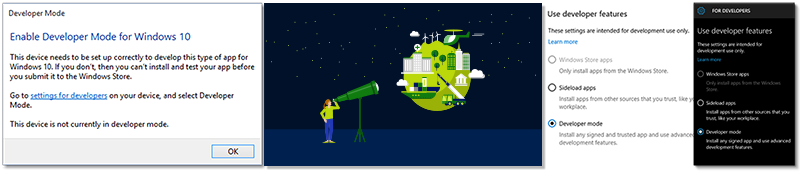
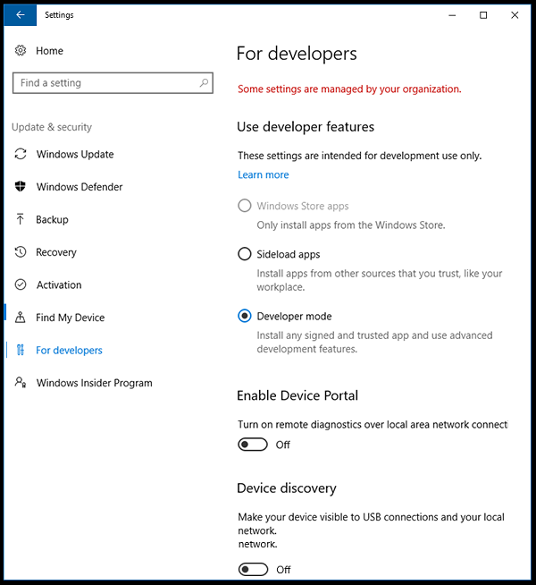
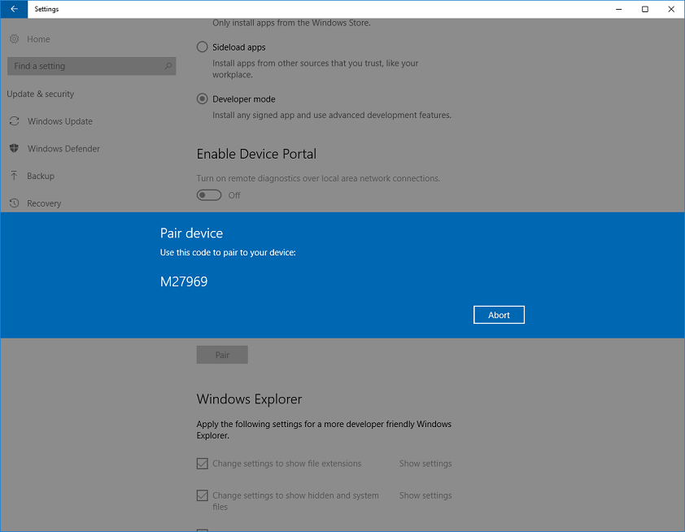

# Enable your device for development

## Activate Developer Mode, sideload apps and access other developer features

If you are using your computer for ordinary day-to-day activities such as games, web browsing, email or Office apps, you do *not* need to activate Developer Mode and in fact, you shouldn't activate it. The rest of the information on this page won't matter to you, and you can safely get back to whatever it is you were doing. Thanks for stopping by!

However, if you are writing software with Visual Studio on a computer for first time, you *will* need to enable Developer Mode on both the development PC, and on any devices you'll use to test your code. Opening a UWP project when Developer Mode is not enabled will either open the **For developers** settings page, or cause this dialog to appear in Visual Studio:

When you see this dialog, click **settings for developers** to open the **For developers** settings page.

> [!NOTE]
> You can go to the **For developers** page at any time to enable or disable Developer Mode: simply enter "for developers" into the Cortana search box in the taskbar.

## Accessing settings for Developers

To enable Developer mode, or access other settings:

1.  From the **For developers** settings dialog, choose the level of access that you need.
2.  Read the disclaimer for the setting you chose, then click **Yes** to accept the change.

> [!NOTE]
> If your device is owned by an organization, some options might be disabled by your organization.

Here's the settings page on the desktop device family:

Here's the settings page on the mobile device family:

## Which setting should I choose: sideload apps or Developer Mode?

You can enable a device for development, or just for sideloading.

-   *Windows Store apps* is the default setting. If you aren't developing apps, or using special internal apps issued by your company, keep this setting active.
-   *Sideloading* is installing and then running or testing an app that has not been certified by the Windows Store. For example, an app that is internal to your company only.
-   *Developer mode* lets you sideload apps, and also run apps from Visual Studio in debug mode. 

By default, you can only install Universal Windows Platform (UWP) apps from the Windows Store. Changing these settings to use developer features can change the level of security of your device. You should not install apps from unverified sources.

### Sideload apps

The Sideload apps setting is typically used by companies or schools that need to install custom apps on managed devices without going through the Windows Store. In this case, it's common for the organization to enforce a policy that disables the *Windows Store apps* setting, as shown previously in the image of the settings page. The organization also provides the required certificate and install location to sideload apps. For more info, see the TechNet articles [Sideload apps in Windows 10](https://technet.microsoft.com/library/mt269549.aspx) and [Get started with app deployment in Microsoft Intune](https://technet.microsoft.com/library/dn646955.aspx).

Device family specific info

-   On the desktop device family: You can install an app package (.appx) and any certificate that is needed to run the app by running the Windows PowerShell script that is created with the package ("Add-AppDevPackage.ps1"). For more info, see [Packaging UWP apps](../packaging/packaging-uwp-apps.md).

-   On the mobile device family: If the required certificate is already installed, you can tap the file to install any .appx sent to you via email or on an SD card.

**Sideload apps** is a more secure option than Developer Mode because you cannot install apps on the device without a trusted certificate.

> [!NOTE]
> If you sideload apps, you should still only install apps from trusted sources. When you install a sideloaded app that has not been certified by the Windows Store, you are agreeing that you have obtained all rights necessary to sideload the app and that you are solely responsible for any harm that results from installing and running the app. See the Windows &gt; Windows Store section of this [privacy statement](http://go.microsoft.com/fwlink/?LinkId=521839).

### Developer Mode

Developer Mode replaces the Windows 8.1 requirements for a developer license.  In addition to sideloading, the Developer Mode setting enables debugging and additional deployment options. This includes starting an SSH service to allow this device to be deployed to. In order to stop this service, you have to disable Developer Mode.

Device family specific info

-   On the desktop device family:

    Enable Developer Mode to develop and debug apps in Visual Studio. As stated previously, you will be prompted in Visual Studio if Developer Mode is not enabled.

    Allows enabling of the Windows subsystem for Linux. For more info, see [About Bash on Ubuntu on Windows](https://msdn.microsoft.com/commandline/wsl/about).

-   On the mobile device family:

    Enable developer mode to deploy apps from Visual Studio and debug them on the device.

    You can tap the file to install any .appx sent to you via email or on an SD card. Do not install apps from unverified sources.

## Additional Developer Mode features

For each device family, additional developer features might be available. These features are available only when Developer Mode is enabled on the device, and might vary depending on your OS version.

When you enable Developer Mode, a package of options is installed that includes:
- Installs Windows Device Portal. Device Portal is enabled and firewall rules are configured for it only when the **Enable Device Portal** option is turned on.
- Installs, enables, and configures firewall rules for SSH services that allow remote installation of apps.
- (Desktop only) Allows enabling of the Windows subsystem for Linux. For more info, see [About Bash on Ubuntu on Windows](https://msdn.microsoft.com/commandline/wsl/about).

This image shows developer features for the mobile device family on Windows 10:

 

### Device Portal

To learn more about device discovery and Device Portal, see [Windows Device Portal overview](../debug-test-perf/device-portal.md).

For device specific setup instructions, see:
- [Device Portal for Desktop](https://msdn.microsoft.com/windows/uwp/debug-test-perf/device-portal-desktop)
- [Device Portal for HoloLens](https://developer.microsoft.com/windows/holographic/using_the_windows_device_portal)
- [Device Portal for IoT](https://developer.microsoft.com/windows/iot/docs/DevicePortal)
- [Device Portal for Mobile](../debug-test-perf/device-portal-mobile.md)
- [Device Portal for Xbox](../debug-test-perf/device-portal-xbox.md)

If you encounter problems enabling Developer Mode or Device Portal, see the [Known Issues](https://social.msdn.microsoft.com/Forums/en-US/home?forum=Win10SDKToolsIssues&sort=relevancedesc&brandIgnore=True&searchTerm=%22device+portal%22) forum to find workarounds for these issues. 

###SSH

SSH services are enabled when you enable Developer Mode on your device.  This is used when your device is a deployment target for UWP applications.   The names of the services are 'SSH Server Broker' and 'SSH Server Proxy'.

> [!NOTE]
> This is not Microsoft's OpenSSH implementation, which you can find on [GitHub](https://github.com/PowerShell/Win32-OpenSSH).

In order to take advantage of the SSH services, you can enable device discovery to allow pin pairing. If you intend to run another SSH service, you can set this up on a different port or turn off the Developer Mode SSH services. To turn off the SSH services, simply disable Developer Mode.  

### Device Discovery

When you enable device discovery, you are allowing your device to be visible to other devices on the network through mDNS.  This feature also allows you to get the SSH pin for pairing to this device.  

You should enable device discovery only if you intend to make the device a deployment target. For example, if you use Device Portal to deploy an app to a phone for testing, you need to enable device discovery on the phone, but not on your development PC.

### Error reporting (Mobile only)

Set this value to specify how many crash dumps are saved on your phone.

Collecting crash dumps on your phone gives you instant access to important crash information directly after the crash occurs. Dumps are collected for developer-signed apps only. You can find the dumps in your phone's storage in the Documents\\Debug folder. For more info about dump files, see [Using dump files](https://msdn.microsoft.com/library/d5zhxt22.aspx).

### Optimizations for Windows Explorer, Remote Desktop, and PowerShell (Desktop only)

 On the desktop device family, the **For developers** settings page has shortcuts to settings that you can use to optimize your PC for development tasks. For each setting, you can select the checkbox and click **Apply**, or click the **Show settings** link to open the settings page for that option. 

**Tip**  
There are several tools you can use to deploy an app from a Windows 10 PC to a Windows 10 mobile device. Both devices must be connected to the same subnet of the network by a wired or wireless connection, or they must be connected by USB. Either of the ways listed installs only the app package (.appx); they do not install certificates.

-   Use the Windows 10 Application Deployment (WinAppDeployCmd) tool. Learn more about [the WinAppDeployCmd tool](http://msdn.microsoft.com/library/windows/apps/mt203806.aspx).
-   Starting in Windows 10, Version 1511, you can use [Device Portal](#device_portal) to deploy from your browser to a mobile device running Windows 10, Version 1511 or later. Use the **[Apps](../debug-test-perf/device-portal.md#apps)** page in Device Portal to upload an app package (.appx) and install it on the device.

## Use group policies or registry keys to enable a device

For most developers, you want to use the settings app to enable your device for debugging. In certain scenarios, such as automated tests, you can use other ways to enable your Windows 10 desktop device for development.

You can use gpedit.msc to set the group policies to enable your device, unless you have Windows 10 Home. If you do have Windows 10 Home, you need to use regedit or PowerShell commands to set the registry keys directly to enable your device.

**Use gpedit to enable your device**

1.  Run **Gpedit.msc**.
2.  Go to Local Computer Policy &gt; Computer Configuration &gt; Administrative Templates &gt; Windows Components &gt; App Package Deployment
3.  To enable sideloading, edit the policies to enable:

    -   **Allow all trusted apps to install**

    - OR -

    To enable developer mode, edit the policies to enable both:

    -   **Allow all trusted apps to install**
    -   **Allows development of Windows Store apps and installing them from an integrated development environment (IDE)**

4.  Reboot your machine.

**Use regedit to enable your device**

1.  Run **regedit**.
2.  To enable sideloading, set the value of this DWORD to 1:

    -   **HKLM\\SOFTWARE\\Microsoft\\Windows\\CurrentVersion\\AppModelUnlock\\AllowAllTrustedApps**

    - OR -

    To enable developer mode, set the values of this DWORD to 1:

    -   **HKLM\\SOFTWARE\\Microsoft\\Windows\\CurrentVersion\\AppModelUnlock\\AllowDevelopmentWithoutDevLicense**

**Use PowerShell to enable your device**

1.  Run PowerShell with administrator privileges.
2.  To enable sideloading, run this command:

    -   **PS C:\\WINDOWS\\system32&gt; reg add "HKEY\_LOCAL\_MACHINE\\SOFTWARE\\Microsoft\\Windows\\CurrentVersion\\AppModelUnlock" /t REG\_DWORD /f /v "AllowAllTrustedApps" /d "1"**

    - OR -

    To enable developer mode, run this command:

    -   **PS C:\\WINDOWS\\system32&gt; reg add "HKEY\_LOCAL\_MACHINE\\SOFTWARE\\Microsoft\\Windows\\CurrentVersion\\AppModelUnlock" /t REG\_DWORD /f /v "AllowDevelopmentWithoutDevLicense" /d "1"**

## Upgrade your device from Windows 8.1 to Windows 10

When you create or sideload apps on your Windows 8.1 device, you have to install a developer license. If you upgrade your device from Windows 8.1 to Windows 10, this information remains. Run the following command to remove this information from your upgraded Windows 10 device. This step is not required if you upgrade directly from Windows 8.1 to Windows 10, Version 1511 or later.

**To unregister a developer license**

1.  Run PowerShell with administrator privileges.
2.  Run this command: **unregister-windowsdeveloperlicense**.

After this you need to enable your device for development as described in this topic so that you can continue to develop on this device. If you don't do that, you might get an error when you debug your app, or you try to create a package for it. Here is an example of this error:

Error : DEP0700 : Registration of the app failed.

## See Also

* [Your first app](your-first-app.md)
* [Publishing your Windows Store app](https://developer.microsoft.com/store/publish-apps).
* [How-to articles on developing UWP apps](https://developer.microsoft.com/windows/apps/develop)
* [Code Samples for UWP developers](https://developer.microsoft.com/windows/samples)
* [What's a Universal Windows app?](whats-a-uwp.md)
* [Sign up for Windows account](sign-up.md)