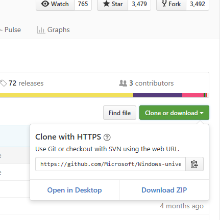
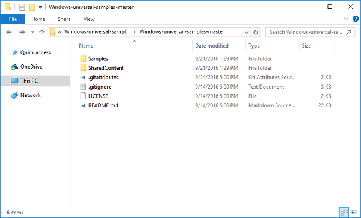
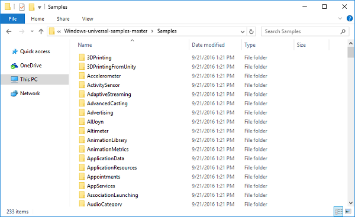
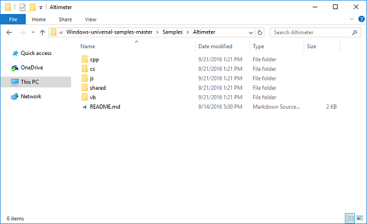
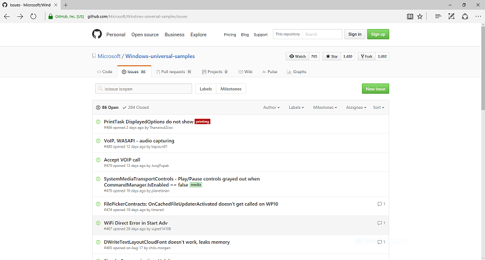

# Get Windows app samples

Many official Windows code samples are available in various GitHub repositories, including [Universal Windows Platform (UWP) app samples](https://github.com/microsoft/Windows-universal-samples), [Windows classic samples](https://github.com/microsoft/Windows-classic-samples), along with a collection of [Windows developer documentation samples](#windows-developer-documentation-samples). These samples demonstrate most Windows features and their API use patterns.

:::image type="content" source="images/github-windows-samples-page.png" alt-text="GitHub Windows universal samples repository":::

To make finding specific samples a little bit easier, you can browse and search a categorized collection of code samples for various Microsoft developer tools and technologies through the [sample browser](/samples/browse/).

:::image type="content" source="images/samples-browser-windows.png" alt-text="Microsoft samples browser":::

### Windows developer documentation samples

Here's a list of mini-app samples created specifically to support Windows developer documentation. Unless noted, the following samples are all Universal Windows Platform (UWP) apps that have been updated to use the latest [WinUI 2.4](/windows/apps/winui/winui2/release-notes/winui-2.4) controls.

- [Rss Reader](https://github.com/Microsoft/Windows-appsample-rssreader) - Retrieve RSS feeds and view articles
- [Family Notes](https://github.com/Microsoft/Windows-appsample-familynotes) - Explore different input modalities and scenarios of user awareness
- [Customer Orders](https://github.com/Microsoft/Windows-appsample-customers-orders-database) - Features useful to enterprise developers, like Azure Active Directory (AAD) authentication, UI controls (including a data grid), Sqlite and SQL Azure database integration, Entity Framework, and cloud API services
- [Lunch Scheduler](https://github.com/Microsoft/Windows-appsample-lunch-scheduler) - Schedule lunches with your friends and coworkers
- [Coloring Book](https://github.com/Microsoft/Windows-appsample-coloringbook) - Windows Ink (including the Windows Ink Toolbar) and radial controller (for Wheel devices such as the Surface Dial) features
- [Network Helper (Quiz Game)](https://github.com/Microsoft/Windows-appsample-networkhelper) - Network discovery and communication
- [HUE Lights Controller](https://github.com/Microsoft/Windows-appsample-huelightcontroller) - Intelligent home automation with Cortana and Bluetooth Low Energy (Bluetooth LE)
- [Marble Maze](https://github.com/Microsoft/Windows-appsample-marble-maze) - Basic 3D game using DirectX
- [PhotoLab](https://github.com/Microsoft/Windows-appsample-photo-lab) - View and edit image files

## Download the code

To download the samples, go to one of the Microsoft repos such as
[Universal Windows Platform (UWP) app samples](https://github.com/microsoft/Windows-universal-samples). Select **Clone or download**, and then select **Download ZIP**.

The samples download .zip file always has the latest samples. You don’t need a GitHub account to download the file. When an SDK update is released or if you want to pick up any recent changes and additions, just download the latest zip file.

> [!NOTE]
> To open, build, and run Windows samples, you must have Visual Studio  and the Windows SDK. You can get a free copy of [Visual Studio Community](https://www.microsoft.com/?ref=go).  
>
> For the samples to work correctly, be sure to unzip the entire archive and not individual samples. Many of the samples depend on common files in the *SharedContent* folder and use linked files, including sample template files and image assets, to reduce duplication.

## Open the samples

After you download the .zip file, open the samples in Visual Studio.

1. Before you unzip the archive, right-click the file, select **Properties** > **Unblock** > **Apply**. Then, unzip the archive in a local folder on your computer.

    

2. Each folder in the Samples folder contains a Windows feature sample.

    

3. Select a sample. Supported languages are indicated by a language-specific sub-folder.

    

4. Select the folder for the language you want to use. In the folder contents, you’ll see a Visual Studio solution (.sln) file that you can open in Visual Studio.

    

## Give feedback, ask questions, and report issues

If you have problems or questions, use the **Issues** tab in the repository to create a new issue.

