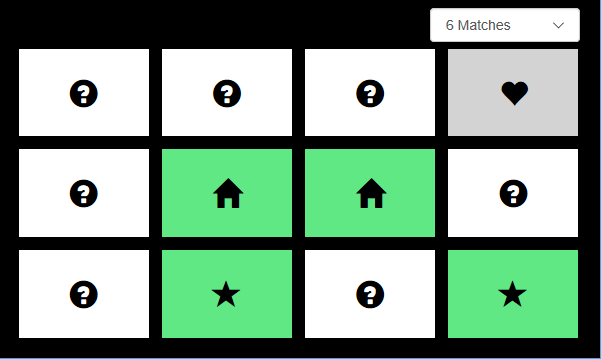
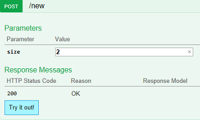
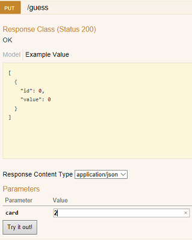
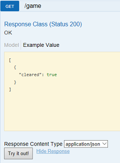
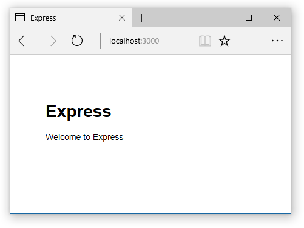
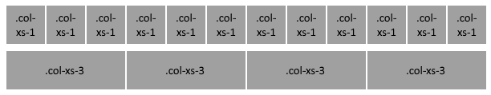

# Create a single-page web app with REST API backend

**Build a Hosted Web App for the Microsoft Store with popular fullstack web technologies**



This two-part tutorial provides a quick tour of modern fullstack web development as you build a simple memory game that works both in the browser and as a Hosted Web App for the Microsoft Store. In Part I you'll build a simple REST API service for the game's backend. By hosting the game logic in the cloud as an API service, you preserve the game state so your user can keep playing their same game instance across different devices. In Part II you'll build the front-end UI as a single-page web app with responsive layout.

We'll be using some of the most popular web technologies, including the [Node.js](https://nodejs.org/en/) runtime and [Express](https://expressjs.com/) for server-side development, the [Bootstrap](https://getbootstrap.com/) UI framework, the [Pug](https://www.npmjs.com/package/pug) template engine, and [Swagger](https://swagger.io/tools/) for building RESTful APIs. You'll also gain experience with the [Azure Portal](https://ms.portal.azure.com/) for cloud hosting and working with the [Visual Studio Code](https://code.visualstudio.com/) editor.

## Prerequisites

If you don't already have these resources on your machine, follow these download links:

 - [Node.js](https://nodejs.org/en/download/) - Be sure to select the option to add Node to your PATH.

 - [Express generator](https://expressjs.com/en/starter/generator.html)- After you install Node, install Express by running `npm install express-generator -g`

 - [Visual Studio Code](https://code.visualstudio.com/)

If you want to complete the final steps of hosting your API service and memory game app on Microsoft Azure, you'll need to [create a free Azure account](https://azure.microsoft.com/free/) if you haven't already done so.

If you decide to bail on (or postpone) the Azure part, simply skip the final sections of parts I and II, which cover Azure hosting and packaging your app for the Microsoft Store. The API service and web app you build will still run locally (from `http://localhost:8000` and `http://localhost:3000`, respectively) on your machine.

## Part I: Build a REST API backend

We'll first build a simple memory game API to power our memory game web app. We'll use [Swagger](https://swagger.io/) to define our API and generate scaffolding code and a web UI for manual testing.

If you'd like to skip this part and move straight to [Part II: Build a single-page web application](#part-ii-build-a-single-page-web-application), here's the [finished code for Part I](https://github.com/Microsoft/Windows-tutorials-web/tree/master/Single-Page-App-with-REST-API/backend). Follow the *README* instructions to get the code up and running locally, or see *5. Host your API service on Azure and enable CORS* to run it from Azure.

### Game overview

*Memory* (also known as [*Concentration*](https://en.wikipedia.org/wiki/Concentration_(game)) and [*Pelmanism*](https://en.wikipedia.org/wiki/Pelmanism_(system))), is a simple game consisting of a deck of card pairs. The cards are placed face-down on the table, and the player inspects the card values, two at a time, looking for matches. After each turn the cards are again placed face-down, unless a matching pair is found, in which case those two cards are cleared from the game. The game objective is to find all card pairs in the fewest amount of turns.

For instructional purposes, the game structure we'll use is very simple: it's single game, single player. However, the game logic is server-side (rather than on the client) to preserve the game state, so that you could keep playing the same game across different devices.

The data structure for a memory game consists simply of an array of JavaScript objects, each representing a single card, with indices in the array acting as card IDs. On the server, each card object has a value and a **cleared** flag. For example, a board of 2-matches (4 cards) might be randomly generated and serialized like this.

```json
[
	{ "cleared":"false",
	    "value":"0",
	},
	{ "cleared":"false",
	    "value":"1",
	},
	{ "cleared":"false",
	    "value":"1",
	},
	{ "cleared":"false",
	    "value":"0",
	}
]
```

When the board array is passed to the client, value keys are removed from the array to prevent cheating (for example, inspecting the HTTP response body by using F12 browser tools). Here's how that same new game would look to a client calling the **GET /game** REST endpoint:

```json
[{ "cleared":"false"},{ "cleared":"false"},{ "cleared":"false"},{ "cleared":"false"}]
```

Speaking of endpoints, the memory game service will consist of three REST APIs.

#### POST /new
Initializes a new game board of the specified size (# of matches).

| Parameter | Description |
|-----------|-------------|
| int *size* |Number of matching pairs to be shuffled into the game "board". Example: `http://memorygameapisample/new?size=2`|

| Response | Description |
|----------|-------------|
| 200 OK | New memory game of requested size is ready.|
| 400 BAD REQUEST| Requested size is outside of acceptable range.|


#### GET /game
Retrieves the current state of the memory game board.

*No parameters*

| Response | Description |
|----------|-------------|
| 200 OK | Returns JSON array of card objects. Each card has a **cleared** property indicating whether its match has already been found. Matched cards also report their **value**. Example: `[{"cleared":"false"},{"cleared":"false"},{"cleared":"true","value":1},{"cleared":"true","value":1}]`|

#### PUT /guess
Specifies a card to reveal and checks for a match to the previously revealed card.

| Parameter | Description |
|-----------|-------------|
| int *card* | Card ID (index in game board array) of the card to reveal. Each complete "guess" consists of two specified cards (i.e., two calls to **/guess** with valid and unique *card* values). Example: `http://memorygameapisample/guess?card=0`|

| Response | Description |
|----------|-------------|
| 200 OK | Returns JSON with the **id** and **value** of the specified card. Example: `[{"id":0,"value":1}]`|
| 400 BAD REQUEST |  Error with the specified card. See HTTP response body for further details.|

### 1. Spec out the API and generate code stubs

We'll use [Swagger](https://swagger.io/) to transform the design of our memory game API into working Node.js server code. Here's how you might define our [memory game APIs as Swagger metadata](https://github.com/Microsoft/Windows-tutorials-web/blob/master/Single-Page-App-with-REST-API/backend/api.json). We'll use this to generate server code stubs.

1. Create a new folder (in your local *GitHub* directory, for example), and download the [**api.json**](https://raw.githubusercontent.com/Microsoft/Windows-tutorials-web/master/Single-Page-App-with-REST-API/backend/api.json?token=ACEfklXAHTeLkHYaI5plV20QCGuqC31cks5ZFhVIwA%3D%3D) file containing our memory game API definitions. Make sure your folder name doesn't contain any spaces.

2. Open your favorite shell ([or use Visual Studio Code's integrated terminal!](https://code.visualstudio.com/docs/editor/integrated-terminal)) to that folder and run the following Node Package Manager (NPM) command to install the [Yeoman](https://yeoman.io/) (yo) code-scaffolding tool and Swagger generator for your global (**-g**) Node environment:

    ```
    npm install -g yo
    npm install -g generator-swaggerize
    ```

3. Now we can generate the server scaffolding code by using Swagger:

    ```
    yo swaggerize
    ```

4. The **swaggerize** command will ask you several questions.
    - Path (or URL) to swagger document: **api.json**
    - Framework: **express**
    - What would you like to call this project (YourFolderNameHere): **[enter]**

    Answer everything else as you like; the information is mostly to supply the *package.json* file with your contact info so you can distribute your code as an NPM package.

5. Finally, install all the dependencies (listed in *package.json*) for your new project and [Swagger UI](https://swagger.io/swagger-ui/) support.

    ```
    npm install
    npm install swaggerize-ui
    ```

    Now start VS Code and **File** > **Open Folder...**, and move to the MemoryGameAPI directory. This is the Node.js API server you just created! It uses the popular [ExpressJS](https://expressjs.com/en/4x/api.html) web application framework to structure and run your project.

### 2. Customize the server code and setup debugging

The *server.js* file in your project root acts as the "main" function of your server. Open it in VS Code and copy the following into it. The lines modified from the generated code are commented with further explanation.

```javascript
'use strict';

var port = process.env.PORT || 8000; // Better flexibility than hardcoding the port

var Http = require('http');
var Express = require('express');
var BodyParser = require('body-parser');
var Swaggerize = require('swaggerize-express');
var SwaggerUi = require('swaggerize-ui'); // Provides UI for testing our API
var Path = require('path');

var App = Express();
var Server = Http.createServer(App);

App.use(function(req, res, next) {  // Enable cross origin resource sharing (for app frontend)
    res.header('Access-Control-Allow-Origin', '*');
    res.header('Access-Control-Allow-Methods', 'GET,PUT,POST,OPTIONS');
    res.header('Access-Control-Allow-Headers', 'Content-Type, Authorization, Content-Length, X-Requested-With');

    // Prevents CORS preflight request (for PUT game_guess) from redirecting
    if ('OPTIONS' == req.method) {
      res.send(200);
    }
    else {
      next(); // Passes control to next (Swagger) handler
    }
});

App.use(BodyParser.json());
App.use(BodyParser.urlencoded({
    extended: true
}));

App.use(Swaggerize({
    api: Path.resolve('./config/swagger.json'),
    handlers: Path.resolve('./handlers'),
    docspath: '/swagger'   //  Hooks up the testing UI
}));

App.use('/', SwaggerUi({    // Serves the testing UI from our base URL
  docs: '/swagger'          //
}));

Server.listen(port, function () {  // Starts server with our modfied port settings
 });
```

With that, it's time to run your server! Let's set up Visual Studio Code for Node debugging while we're at it. Select on the **Debug** panel icon (Ctrl+Shift+D) and then the gear icon (Open launch.json), and modify "configurations" to this:

```json
"configurations": [
    {
        "type": "node",
        "request": "launch",
        "name": "Launch Program",
        "program": "${workspaceRoot}/server.js"
    }
]
```

Now press F5 and open your browser to [https://localhost:8000](https://localhost:8000). The page should open to the Swagger UI for our memory game API, and from there you can expand the details and input fields for each of the methods. You can even try calling the APIs, although their responses will contain only mocked-up data (provided by the [Swagmock](https://www.npmjs.com/package/swagmock) module). It's time to add our game logic to make these APIs real.

### 3. Set up your route handlers

The Swagger file (config\swagger.json) instructs our server how to handle various client HTTP requests by mapping each URL path it defines to a handler file (in \handlers), and each method defined for that path (for example, **GET**, **POST**) to an `operationId` (function) within that handler file.

In this layer of our program we'll add some input checking before passing the various client requests to our data model. Download (or copy and paste):

 - This [game.js](https://raw.githubusercontent.com/Microsoft/Windows-tutorials-web/master/Single-Page-App-with-REST-API/backend/handlers/game.js?token=ACEfkvhw6BUnkeSsZgnzVe086T5WLwjfks5ZFhW5wA%3D%3D) code to your **handlers\game.js** file
 - This [guess.js](https://raw.githubusercontent.com/Microsoft/Windows-tutorials-web/master/Single-Page-App-with-REST-API/backend/handlers/guess.js?token=ACEfkswel02rHVr0e61bVsNdpv_i1Rtuks5ZFhXPwA%3D%3D) code to your **handlers\guess.js** file
 - This [new.js](https://raw.githubusercontent.com/Microsoft/Windows-tutorials-web/master/Single-Page-App-with-REST-API/backend/handlers/new.js?token=ACEfkgk2QXJeRc0aaLzY5ulFsAR4Juidks5ZFhXawA%3D%3D) code to your **handlers\new.js** file

 You can skim the comments in those files for more details about the changes, but in essence they check for basic input errors (for example, the client requests a new game with less than one match) and send descriptive error messages as needed. The handlers also route valid client requests through to their corresponding data files (in \data) for further processing. Let's work on those next.

### 4. Set up your data model

It's time to swap out the placeholder data-mocking service with a real data model of our memory game board.

This layer of our program represents the memory cards themselves and provides the bulk of the game logic, including "shuffling" the deck for a new game, identifying pairs of matched cards, and keeping track of game state. Copy and paste:

 - This [game.js](https://raw.githubusercontent.com/Microsoft/Windows-tutorials-web/master/Single-Page-App-with-REST-API/backend/data/game.js?token=ACEfksAceJNQmhF82aHjQTx78jILYKfCks5ZFhX4wA%3D%3D) code to your **data\game.js** file
 - This [guess.js](https://raw.githubusercontent.com/Microsoft/Windows-tutorials-web/master/Single-Page-App-with-REST-API/backend/data/guess.js?token=ACEfkvY69Zr1AZQ4iXgfCgDxeinT21bBks5ZFhYBwA%3D%3D) code to your **data\guess.js** file
 - This [new.js](https://raw.githubusercontent.com/Microsoft/Windows-tutorials-web/master/Single-Page-App-with-REST-API/backend/data/new.js?token=ACEfkiqeDN0HjZ4-gIKRh3wfVZPSlEmgks5ZFhYPwA%3D%3D) code to your **data\new.js** file

For simplicity, we're storing our game board in a global variable (`global.board`) on our Node server. But realistically you'd use cloud storage (like Google [Cloud Datastore](https://cloud.google.com/datastore/) or Azure [DocumentDB](https://azure.microsoft.com/services/cosmos-db/)) to make this into a viable memory-game API service that concurrently supports multiple games and players.

Make sure you've saved all the changes in VS Code, fire up your server again (F5 in VS Code or `npm start` from shell, and then browse to [https://localhost:8000](https://localhost:8000)) to test out the game API.

Each time you press the **Try it out!** button on one of the **/game**, **/guess**, or **/new** operations, check the resulting **Response Body** and **Response Code** below to verify that everything's working as expected.

Try: 

1. Creating a new `size=2` game.

    

2. Guessing a couple of values.

    

3. Checking the game board as the game progresses.

    

If everything looks good, your API service is ready to host on Azure! If you're running into problems, try commenting out the following lines in \data\game.js.

```javascript
for (var i=0; i < board.length; i++){
    var card = {};
    card.cleared = board[i].cleared;

    // Only reveal cleared card values
    //if ("true" == card.cleared) {        // To debug the board, comment out this line
        card.value = board[i].value;
    //}                                    // And this line
    currentBoardState.push(card);
}
```

With this change, the **GET /game** method will return all the card values (including the ones that haven't been cleared). This is a useful debug hack to keep in place as you build the front-end for the memory game.

### 5. (Optional) Host your API service on Azure and enable CORS

The Azure docs will walk you through:

 - [Registering a new *API App* with Azure Portal](/azure/app-service/app-service-web-tutorial-rest-api#createapiapp)
 - [Setting up Git deployment for your API app](/azure/app-service/app-service-web-tutorial-rest-api#deploy-the-api-with-git), and
 - [Deploying your API app code to Azure](/azure/app-service/app-service-web-tutorial-rest-api#deploy-the-api-with-git)

When registering your app, try to differentiate your *App name* (to avoid naming collisions with others requesting variations on the *http://memorygameapi.azurewebsites.net* URL).

If you've made it this far and Azure is now serving up your swagger UI, there's just one final step to the memory game backend. From [Azure Portal](https://portal.azure.com), select your newly created *App Service* and then select or search for the **CORS** (Cross-Origin Resource Sharing) option. Under **Allowed Origins**, add an asterisk (`*`) and click **Save**. This lets you make cross-origin calls to your API service from your memory-game front-end as you develop it on your local machine. Once you finalize the memory-game front-end and deploy that to Azure, you can replace this entry with the specific URL of your web app.

### Going further

To make the memory game API a viable back-end service for a production app, you'll want to extend the code to support multiple players and games. For that you'll probably need to plumb in [authentication](https://swagger.io/docs/specification/authentication/) (for managing player identities), a [NoSQL database](https://azure.microsoft.com/blog/dear-documentdb-customers-welcome-to-azure-cosmos-db/) (for tracking games and players), and some basic [unit testing](https://apigee.com/about/blog/api-technology/swagger-test-templates-test-your-apis) for your API.

Here are some useful resources for going further:

 - [Advanced Node.js debugging with Visual Studio Code](https://code.visualstudio.com/docs/nodejs/nodejs-debugging)

 - [Azure Web + Mobile docs](/azure/#pivot=services&panel=web)

 - [Azure DocumentDB docs](https://azure.microsoft.com/blog/dear-documentdb-customers-welcome-to-azure-cosmos-db/)

## Part II: Build a single-page web application

Now that you've built (or [downloaded](https://github.com/Microsoft/Windows-tutorials-web/tree/master/Single-Page-App-with-REST-API/backend)) the [REST API backend](#part-i-build-a-rest-api-backend) from Part I,  you're ready to create the single-page memory game front-end with [Node](https://nodejs.org/en/), [Express](https://expressjs.com/), and [Bootstrap](https://getbootstrap.com/).

Part II of this tutorial will give you experience with: 

* [Node.js](https://nodejs.org/en/): to create the server hosting your game
* [jQuery](https://jquery.com/): a JavaScript library
* [Express](https://expressjs.com/): for the web application framework
* [Pug](https://pugjs.org/): (formerly Jade) for the templating engine
* [Bootstrap](https://getbootstrap.com/): for the responsive layout
* [Visual Studio Code](https://code.visualstudio.com/): for code authoring, markdown viewing, and debugging

### 1. Create a Node.js application by using Express

Let's start by creating the Node.js project using Express.

1. Open a command prompt and navigate to the directory where you want to store your game. 
2. Use the Express generator to create a new application called *memory* using the templating engine, *Pug*.

    ```
    express --view=pug memory
    ```

3. In the memory directory, install the dependencies listed in the package.json file. The package.json file is created in the root of your project. This file contains the modules that are required for your Node.js app.  

    ```
    cd memory
    npm install
    ```

    After running this command, you should see a folder called node_modules that contains all of the modules needed for this app. 

4. Now, run your application.

    ```
    npm start
    ```

5. View your application by going to [https://localhost:3000/](https://localhost:3000/).

    

6. Change the default title of your web app by editing index.js in the memory\routes directory. Change `Express` in the line below to `Memory Game` (or another title of your choosing).

    ``` javascript
    res.render('index', { title: 'Express' });
    ```

7. To refresh the app to see your new title, stop your app by pressing **Crtl + C**, **Y** in the command prompt, and then restart it with `npm start`.

### 2. Add client-side game logic code
You can find the files you need for this half of the tutorial in the [Start](https://github.com/Microsoft/Windows-tutorials-web/tree/master/Single-Page-App-with-REST-API/frontend/Start) folder. If you get lost, the finished code is available in the [Final](https://github.com/Microsoft/Windows-tutorials-web/tree/master/Single-Page-App-with-REST-API/frontend/Final) folder. 

1. Copy the scripts.js file inside of the [Start](https://github.com/Microsoft/Windows-tutorials-web/tree/master/Single-Page-App-with-REST-API/frontend/Start) folder and paste it in memory\public\javascripts. This file contains all the game logic needed to run the game, including:

    * Creating/starting a new game.
    * Restoring a game stored on the server.
    * Drawing the game board and cards based on user selection.
    * Flipping the cards.

2. In script.js, let's start by modifying the `newGame()` function. This function:

    * Handles the size of the game selection from the user.
    * Fetches the [gameboard array](#part-i-build-a-rest-api-backend) from the server.
    * Calls the `drawGameBoard()` function to place the game board to the screen.

    Add the following code inside of `newGame()` after the `// Add code from Part 2.2 here` comment.

    ``` javascript
    // extract game size selection from user
    var size = $("#selectGameSize").val();

    // parse game size value
    size = parseInt(size, 10);
    ```

    This code retrieves the value from the dropdown menu with `id="selectGameSize"` (which we will create later) and stores it in a variable (`size`).  We use the [`parseInt()`](https://developer.mozilla.org/en-US/docs/Web/JavaScript/Reference/Global_Objects/parseInt) function to parse the string value from the dropdown to return an integer, so we can pass the `size` of the requested game board to the server. 

    We use the [`/new`](#part-i-build-a-rest-api-backend) method created in Part I of this tutorial to post the chosen size of the game board to the server. The method returns a single JSON array of cards and `true/false` values indicating whether the cards have been matched. 

3. Next, fill in the `restoreGame()` function that restores the last game played. For simplicity's sake, the app always loads the last game played. If there is not a game stored on the server, use the drop-down menu to start a new game. 

	Copy and paste this code into `restoreGame()`.

   ``` javascript 
   // reset the game
   gameBoardSize = 0;
   cardsFlipped = 0;

   // fetch the game state from the server 
   $.get("http://localhost:8000/game", function (response) {
       // store game board size
       gameBoardSize = response.length;

       // draw the game board
       drawGameBoard(response);
   });
   ```

	The game will now fetch the game state from the server. For more information about the [`/game`](#part-i-build-a-rest-api-backend) method being used in this step, see Part I of this tutorial. If you are using Azure (or another service) to host the backend API, replace the *localhost* address above with your production URL.

4. Now we want to create the `drawGameBoard()` function.  This function:

    * Detects the size of the game and applies specific CSS styles.
    * Generates the cards in HTML.
    * Adds the cards to the page.

    Copy and paste this code into the `drawGameBoard()` function in *scripts.js*:

    ``` javascript
    // create output
    var output = "";
    // detect board size CSS class
    var css = "";
    switch (board.length / 4) {
        case 1:
            css = "rows1";
            break;
        case 2:
            css = "rows2";
            break;
        case 3:
            css = "rows3";
            break;
        case 4:
            css = "rows4";
            break;   
    }
    // generate HTML for each card and append to the output
    for (var i = 0; i < board.length; i++) {
        if (board[i].cleared == "true") {
            // if the card has been cleared apply the .flip class
            output += "<div class=\"flipContainer col-xs-3 " + css + "\"><div class=\"cards flip matched\" id=\"" + i + "\" onClick=\"flipCard(this)\">\
                <div class=\"front\"><span class=\"glyphicon glyphicon-question-sign\"></span></div>\
                <div class=\"back\">" + lookUpGlyphicon(board[i].value) + "</div>\
                </div></div>";
        } else {
            output += "<div class=\"flipContainer col-xs-3 " + css + "\"><div class=\"cards\" id=\"" + i + "\" onClick=\"flipCard(this)\">\
                <div class=\"front\"><span class=\"glyphicon glyphicon-question-sign\"></span></div>\
                <div class=\"back\"></div>\
                </div></div>";
        }
    }
    // place the output on the page
    $("#game-board").html(output);
    ```

5. Next, we need to complete the `flipCard()` function.  This function handles the majority of the game logic, including getting the values of the selected cards from the server by using the [`/guess`](#part-i-build-a-rest-api-backend) method developed in Part I of the tutorial. Don't forget to replace the *localhost* address with your production URL if you are cloud hosting the REST API backend.

    In the `flipCard()` function, uncomment this code:

    ``` javascript
    // post this guess to the server and get this card's value
    $.ajax({
        url: "http://localhost:8000/guess?card=" + selectedCards[0],
        type: 'PUT',
        success: function (response) {
            // display first card value
            $("#" + selectedCards[0] + " .back").html(lookUpGlyphicon(response[0].value));

            // store the first card value
            selectedCardsValues.push(response[0].value);
        }
    });
    ```

> [!TIP] 
> If you're using Visual Studio Code, select all the lines of code you wish to uncomment, and press Crtl + K, U

Here we use [`jQuery.ajax()`](https://api.jquery.com/jQuery.ajax/) and the **PUT** [`/guess`](#part-i-build-a-rest-api-backend) method created in Part I. 

This code executes in the following order.

* The `id` of the first card the user selected is added as the first value to the selectedCards[] array: `selectedCards[0]` 
* The value (`id`) in `selectedCards[0]` is posted to the server using the [`/guess`](#part-i-build-a-rest-api-backend) method
* The server responds with the `value` of that card (an integer)
* A [Bootstrap glyphicon](https://getbootstrap.com/components/) is added to the back of the card whose `id` is `selectedCards[0]`
* The first card's `value` (from the server) is stored in the `selectedCardsValues[]` array: `selectedCardsValues[0]`. 

The user's second guess follows the same logic. If the cards that the user selected have the same IDs, (for example, `selectedCards[0] == selectedCards[1]`), the cards are a match! The CSS class `.matched` is added to the matched cards (turning them green) and the cards remained flipped.

Now we need to add logic to check whether the user matched all of the cards and won the game. Inside of the `flipCard()` function, add the following lines of code under the `//check if the user won the game` comment. 

``` javascript
if (cardsFlipped == gameBoardSize) {
    setTimeout(function () {
        output = "<div id=\"playAgain\"><p>You Win!</p><input type=\"button\" onClick=\"location.reload()\" value=\"Play Again\" class=\"btn\" /></div>";
        $("#game-board").html(output);
    }, 1000);
}   
```

If the number of cards flipped matches the size of the game board (for example, `cardsFlipped == gameBoardSize`), there are no more cards to flip and the user has won the game. We'll add some simple HTML to the `div` with `id="game-board"` to let the user know they won and can play again.  

### 3. Create the user interface 
Now let's see all this code in action by creating the user interface. In this tutorial, we use the templating engine [Pug](https://pugjs.org/) (formally Jade).  *Pug* is clean, whitespace-sensitive syntax for writing HTML. Here's an example. 

```
body
    h1 Memory Game
    #container
        p We love tutorials!
```

becomes

``` html
<body>
    <h1>Memory Game</h1>
    <div id="container">
        <p>We love tutorials!</p>
    </div>
</body>
```


1. Replace the layout.pug file in memory\views with the provided layout.pug file in the Start folder. Inside of layout.pug, you'll see links to:

    * Bootstrap
    * jQuery
    * A custom CSS file
    * The JavaScript file we just finished modifying

2. Open the file named index.pug in the directory memory\views.
This file extends the layout.pug file and will render our game. Inside of layout.pug, paste the following lines of code:

    ```
    extends layout
    block content  
        div
            form(method="GET")
            select(id="selectGameSize" class="form-control" onchange="newGame()")
                option(value="0") New Game
                option(value="2") 2 Matches
                option(value="4") 4 Matches
                option(value="6") 6 Matches
                option(value="8") 8 Matches         
            #game-board
                script restoreGame();
    ```

> [!TIP] 
> Remember: Pug is whitespace sensitive. Make sure all of your indentations are correct!

### 4. Use Bootstrap's grid system to create a responsive layout
Bootstrap's [grid system](https://getbootstrap.com/css/#grid) is a fluid grid system that scales a grid as a device's viewport changes. The cards in this game use Bootstrap's predefined grid system classes for the layout, including:
* `.container-fluid`: specifies the fluid container for the grid
* `.row-fluid`: specifies the fluid rows
* `.col-xs-3`: specifies the number of columns

Bootstrap's grid system allows a grid system to collapse into one vertical column, like you would see on a navigation menu on a mobile device.  However, because we want our game always to have columns, we use the predefined class `.col-xs-3`, which keeps the grid horizontal at all times. 

The grid system allows up to 12 columns. Since we only want 4 columns in our game, we use the class `.col-xs-3`. This class specifies that we need each of our columns to span the width of 3 of the 12 available columns mentioned before. This image shows a 12-column grid and a 4-column grid, like the one used in this game.



1. Open scripts.js and find the `drawGameBoard()` function.  In the block of code where we generate the HTML for each card, can you spot the `div` element with `class="col-xs-3"`? 

2. Inside of index.pug, let's add the predefined Bootstrap classes mentioned previously to create our fluid layout.  Change index.pug to the following.

    ```
    extends layout

    block content   

        .container-fluid
            form(method="GET")
            select(id="selectGameSize" class="form-control" onchange="newGame()")
                option(value="0") New Game
                option(value="2") 2 Matches
                option(value="4") 4 Matches
                option(value="6") 6 Matches
                option(value="8") 8 Matches         
            #game-board.row-fluid 
                script restoreGame();
    ```

### 5. Add a card-flip animation with CSS Transforms
Replace the style.css file in memory\public\stylesheets with the style.css file from the Start folder.

Adding a flip motion using [CSS Transforms](https://developer.mozilla.org/docs/Web/CSS/CSS_Transforms) gives the cards a realistic, 3D flipping motion. The cards in the game are created by using the following HTML structure and programmatically added to the game board (in the `drawGameBoard()` function shown previously).

``` html
<div class="flipContainer">
    <div class="cards">
        <div class="front"></div>
        <div class="back"></div>
    </div>
</div>
```

1. To start, give [perspective](https://developer.mozilla.org/en-US/docs/Web/CSS/transform) to the parent container of the animation (`.flipContainer`).  This gives the illusion of depth for its child elements: the higher the value, the farther away from the user the element will appear. Let's add the following perspective to the `.flipContainer` class in style.css.

    ``` css
    perspective: 1000px; 
    ```

2. Now add the following properties to the `.cards` class in style.css. The `.cards` `div` is the element that will actually be doing the flipping animation, showing either the front or the back of the card. 

    ``` css
    transform-style: preserve-3d;
    transition-duration: 1s;
    ```

    The [`transform-style`](https://developer.mozilla.org/en-US/docs/Web/CSS/transform-style) property establishes a 3D-rendering context, and the children of the `.cards` class (`.front` and `.back` are members of the 3D space. Adding the [`transition-duration`](https://developer.mozilla.org/en-US/docs/Web/CSS/transition-duration) property specifies the number of seconds for the animation to finish. 

3.  Using the [`transform`](https://developer.mozilla.org/en-US/docs/Web/CSS/transform) property, we can rotate the card around the Y-axis.  Add the following CSS to `cards.flip`.

    ``` css
    transform: rotateY(180deg);
    ```

    The style defined in `cards.flip` is toggled on and off in the `flipCard` function by using [`.toggleClass()`](https://api.jquery.com/toggleClass/). 

    ``` javascript
    $(card).toggleClass("flip");
    ```

    Now when a user clicks on a card, the card is rotated 180 degrees.

### 6. Test and play
Congratulations! You've finished creating the web app! Let's test it. 

1. Open a command prompt in your memory directory and enter the following command: `npm start`

2. In your browser, go to [https://localhost:3000/](https://localhost:3000/) and play a game!

3. If you encounter any errors, you can use Visual Studio Code's Node.js debugging tools by pressing F5 on your keyboard and typing `Node.js`. For more information about debugging in Visual Studio Code, check out this [article](https://code.visualstudio.com/docs/editor/debugging#_launch-configurations). 

    You can also compare your code to the code provided in the Final folder.

4. To stop the game, in the command prompt type: **Ctrl + C**, **Y**. 

### Going further

You can now deploy your app to Azure (or any other cloud hosting service) for testing across different device form factors, such as mobile, tablet, and desktop. (Don't forgot to test across different browsers too!) Once your app is ready for production, you can easily package it as a *Hosted Web App* (HWA) for the *Universal Windows Platform* (UWP) and distribute it from the Microsoft Store.

The basic steps for publishing to the Microsoft Store are:

 1. Create a [Windows Developer](https://developer.microsoft.com/store/register) account
 2. Use the app submission [checklist](../publish/app-submissions.md)
 3. Submit your app for [certification](../publish/the-app-certification-process.md)

Here are some useful resources for going further:

 - [Deploy your application development project to Azure Websites](/azure/cosmos-db/documentdb-nodejs-application#_Toc395783182)

 - [Convert your web application to a Universal Windows Platform (UWP) app](/microsoft-edge/progressive-web-apps)

 - [Publish Windows apps](../publish/index.md)