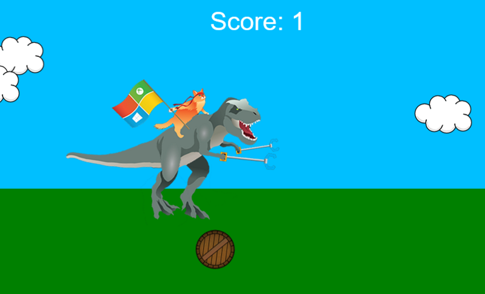
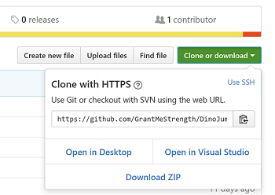
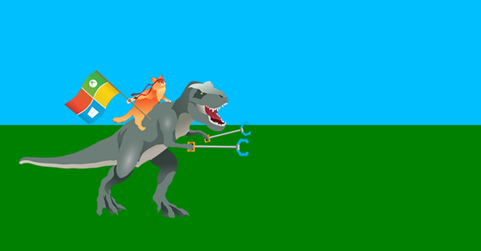

# Create a UWP game in JavaScript

## A simple 2D UWP game for the Microsoft Store, written in JavaScript and CreateJS





## Introduction


Publishing an app to the Microsoft Store means you can share it (or sell it!) with millions of people, on many different devices.  

In order to publish your app to the Microsoft Store it must be written as a UWP (Universal Windows Platform) app. However the UWP is extremely flexible, and supports a wide variety of languages and frameworks. To prove the point, this sample is a simple game written in JavaScript, making use of several CreateJS libraries, and demonstrates how to draw sprites, create a game loop, support the keyboard and mouse, and adapt to different screen sizes.

This project is built with JavaScript using Visual Studio. With some minor changes, it can also hosted on a website or adapted to other platforms. 

**Note:** This is a not a complete (or good!) game; it is designed to demonstrate using JavaScript and a third party library to make an app ready to publish to the Microsoft Store. 


## Requirements

To play with this project, you'll need the following:

* A Windows computer (or a virtual machine) running the current version of Windows 10.
* A copy of Visual Studio. The free Visual Studio Community Edition can be downloaded from the [Visual Studio homepage](https://visualstudio.com).

This project makes use of the CreateJS JavaScript framework. CreateJS is a free set of tools, released under a MIT license, designed to make it easy to create sprite-based games. The CreateJS libraries are already present in the project (look for *js/easeljs-0.8.2.min.js*, and *js/preloadjs-0.6.2.min.js* in the Solution Explorer view). More information about CreateJS can be found at the [CreateJS home page](https://www.createjs.com).

**Note:** Javascript UWP app development is not supported in Visual Studio 2019. You must use Visual Studio 2017 to develop a Javascript UWP app.

## Getting started

The complete source code for the app is stored on [GitHub](https://github.com/Microsoft/Windows-appsample-get-started-js2d).

The simplest way to get started it to visit GitHub, click on the green **Clone or download** button, and select **Open in Visual Studio**. 



You can also download the project as a zip file, or use any other standard ways to work with [GitHub projects](./get-app-samples.md).

Once the solution has been loaded into Visual Studio, you'll see several files, including:

* Images/ - a folder containing the various icons required by UWP apps, as well as the game's SpriteSheet and some other bitmaps.
* js/ - a folder containing the JavaScript files. The main.js file is our game, the other files are EaselJS and PreloadJS.
* index.html - the webpage which contains the canvas object which hosts the game's graphics.

Now you can run the game!

Press **F5** to start the app running. You should see a window open, and our familiar dinosaur standing in an idyllic (if sparse) landscape. We will now examine the app, explain some important parts, and unlock the rest of the features as we go.



**Note:** Something go wrong? Be sure you have installed Visual Studio with web support. You can check by creating a new project - if there is no support for JavaScript, you will need to re-install Visual Studio and check the *Microsoft Web Developer Tools* box.

## Walkthough

If you started the game with F5, you're probably wondering what is going on. And the answer is "not a lot", as a lot of the code is currently commented-out. So far, all you'll see is the dinosaur, and a ineffectual plea to press Space. 

### 1. Setting the Stage

If you open and examine **index.html**, you'll see it's almost empty. This file is the default web page that contains our app, and it does only two important things. First, it includes the JavaScript source code for the **EaselJS** and **PreloadJS** CreateJS libraries, and also **main.js** (our own source code file).
Second, it defines a &lt;canvas&gt; tag, which is where all our graphics are going to appear. A &lt;canvas&gt; is a standard HTML5 document component. We give it a name (gameCanvas) so our code in **main.js** can reference it. By the way, if you are going to write your own JavaScript game from scratch, you too will need to copy the **EaselJS** and **PreloadJS** files into your solution, and then create a canvas object.

EaselJS provides us with a new object called a *stage*. The stage is linked to the canvas, and is used for displaying images and text. Any object we want to be displayed on the stage must first be added as a child of the stage, like this:

```
    stage.addChild(myObject);
```

You will see that line of code appear several times in **main.js**

Speaking of which, now is a good time to open **main.js**.

### 2. Loading the bitmaps

EaselJS provides us with several different types of graphical objects. We can create simple shapes (such as the blue rectangle used for the sky), or bitmaps (such as the clouds we're about to add), text objects, and sprites. Sprites use a (SpriteSheet)[https://createjs.com/docs/easeljs/classes/SpriteSheet.html]: a single bitmap containing multiple images. For example, we use this SpriteSheet to store the different frame of dinosaur animation:


We make the dinosaur walk, by defining the different frames and how fast they should be animated in this code:

```
    // Define the animated dino walk using a spritesheet of images,
    // and also a standing-still state, and a knocked-over state.
    var data = {
        images: [loader.getResult("dino")],
        frames: { width: 373, height: 256 },
        animations: {
            stand: 0,
            lying: { 
                frames: [0, 1],
                speed: 0.1
            },
            walk: {
                frames: [0, 1, 2, 3, 2, 1],
                speed: 0.4
            }
        }
    }

    var spriteSheet = new createjs.SpriteSheet(data);
    dino_walk = new createjs.Sprite(spriteSheet, "walk");
    dino_stand = new createjs.Sprite(spriteSheet, "stand");
    dino_lying = new createjs.Sprite(spriteSheet, "lying");

```

Right now, we're going to add some little fluffy clouds to the stage. Once the game is running, they'll drift across the screen. The image for the cloud is already in the solution, in the *images* folder.

Look through **main.js** until you find the **init()** function. This is called when the game starts, and it's where we begin to set up all our graphic objects.

Find the following code, and remove the comments (\\) from the line that references the cloud image.

```
 manifest = [
	    { src: "walkingDino-SpriteSheet.png", id: "dino" },
		{ src: "barrel.png", id: "barrel" },
		{ src: "fluffy-cloud-small.png", id: "cloud" },
    ];
```

JavaScript needs a little help when it comes to loading resources such as images, and so we're using a feature of the CreateJS library that can preload images, called a [LoadQueue](https://www.createjs.com/docs/preloadjs/classes/LoadQueue.html). We can't be sure how long it will take the images to load, so we use the LoadQueue to take care of it. Once the images are available, the queue will tell us they are ready. In order to do that, we first create a new object that lists all our images, and then we create a LoadQueue object. You'll see in the code below how it is set-up to call a function called **loadingComplete()** when everything is ready.

```
    // Now we create a special queue, and finally a handler that is
    // called when they are loaded. The queue object is provided by preloadjs.

    loader = new createjs.LoadQueue(false);
    loader.addEventListener("complete", loadingComplete);
    loader.loadManifest(manifest, true, "../images/");
```    

When the function **loadingComplete()** is called, the images are loaded and ready to use. You'll see a commented-out section that creates the clouds, now their bitmap is available. Remove the comments, so it looks like this:

```
    // Create some clouds to drift by..
    for (var i = 0; i < 3; i++) {
        cloud[i] = new createjs.Bitmap(loader.getResult("cloud"));
        cloud[i].x = Math.random()*1024; // Random start location
        cloud[i].y = 64 + i * 48;
        stage.addChild(cloud[i]);
    }
```
This code creates three cloud objects each using our pre-loaded image, defines their location, and then adds them to the stage.

Run the app again (press F5) and you'll see our clouds have appeared.

### 3. Moving the clouds

Now we're going to make the clouds move. The secret to moving clouds - and moving anything, in fact - is to set-up a [ticker](https://www.createjs.com/docs/easeljs/classes/Ticker.html) function that is repeatedly called multiple times a second. 
Every time this function is called, it redraws the graphics in a slightly different place.

<p data-height="500" data-theme-id="23761" data-slug-hash="vxZVRK" data-default-tab="result" data-user="MicrosoftEdgeDocumentation" data-embed-version="2" data-pen-title="CreateJS - Animating clouds" data-preview="true" data-editable="true" class="codepen">See the Pen <a href="https://codepen.io/MicrosoftEdgeDocumentation/pen/vxZVRK/">CreateJS - Animating clouds</a> by Microsoft Edge Docs (<a href="https://codepen.io/MicrosoftEdgeDocumentation">@MicrosoftEdgeDocumentation</a>) on <a href="https://codepen.io">CodePen</a>.</p>
 
The code to do that is already in the **main.js** file, provided by the CreateJS library, EaselJS. It looks like this:

```
    // Set up the game loop and keyboard handler.
    // The keyword 'tick' is required to automatically animated the sprite.
    createjs.Ticker.timingMode = createjs.Ticker.RAF;
    createjs.Ticker.addEventListener("tick", gameLoop);
```

This code will call a function called **gameLoop()** between 30 and 60 frames a second. The exact speed depends on the speed of your computer.

Look for the **gameLoop()** function, and down towards the end you'll see a function called **animateClouds()**. Edit it so that it is not commented out.

```
    // Move clouds
    animateClouds();
```

If you look at the defintion of this function, you'll see how it takes each cloud in turn, and changes its x co-ordinate. If the x-ordinate is off the side of screen, it is reset to the far right. Each cloud also moves at a slightly different speed.

```
function animate_clouds()
{
    // Move the cloud sprites across the sky. If they get to the left edge, 
    // move them over to the right.

    for (var i = 0; i < 3; i++) {    
        cloud[i].x = cloud[i].x - (i+1);
        if (cloud[i].x < -128)
            cloud[i].x = width + 128;
    }
}
```

If you run the app now, you'll see that the clouds have started drifting. Finally we have motion!

### 4. Adding keyboard and mouse input

A game that you can't interact with isn't a game. So let's allow the player to use the keyboard or the mouse to do something. Back in the **loadingComplete()** function, you'll see the following. Remove the comments.

```
    // This code will call the method 'keyboardPressed' is the user presses a key.
    this.document.onkeydown = keyboardPressed;

    // Add support for mouse clicks
    stage.on("stagemousedown", mouseClicked);
```

We now have two functions being called whenever the player hits a key or clicks the mouse. Both event will call **userDidSomething()**, a function which looks at the gamestate variable to decide what the game is currently doing, and what needs to happen next as a result.

Gamestate is a common design pattern used in games. Everything that happens, happens in the **gameLoop()** function called by the ticker timer. The gameLoop() keeps track of whether the game is playing, or in a "game over state", or a "ready-to-play state", or any other states defined by the author, using a variable. This state variable is tested in a switch statement, and that defines what other functions are called. So if the state is set to "playing", the functions to make the dinosaur jump and make the barrels move will be called. If the dinosaur is killed by something, the gamestate variable will be set to "game over state", and the "Game over!" message will be displayed instead. If you are interested in game design patterns, the book [Game Programming Patterns](https://gameprogrammingpatterns.com/) is very helpful.

Try running the app again, and finally you'll be able to start playing. Press space (or click the mouse, or tap the screen) to start things happening. 

You'll see a barrel come rolling towards you: press space or click again at just the right time, and the dinosaur will leap. Time it wrong, and your game is over.

The barrel is animated in the same way as the clouds (although it gets faster each time), and we check the position of the dinosaur and the barrel to make sure they haven't collided:

```
 // Very simple check for collision between dino and barrel
                if ((barrel.x > 220 && barrel.x < 380)
                    &&
                    (!jumping))
                {
                    barrel.x = 380;
                    GameState = GameStateEnum.GameOver;
                }
```

If the dinosaur isn't jumping and the barrel is nearby, the code changes the state varaible to the state we've called *GameOver*. As you can imagine, *GameOver* stops the game.

And so the main mechanics of our game are complete.

### 5. Resizing support

We're almost done here! But before we stop, there is one annoying problem to take care of first. When the game is running, try resizing the window. You'll see that the game quickly becomes very messed-up, as objects are no longer where they should be. We can take care of that by creating a handler for the window resizing event generated when the player resizes the window, or when the device is rotated from landscape to portrait.

The code to do this is already present (in fact, we call it when the game first starts, to make sure the default window size works, because when a UWP app is launched, you can't be certain what size the window will be).

Just uncomment this line to call the function when the screen size event is fired:

```
    // This code makes the app call the method 'resizeGameWindow' if the user resizes the current window.
     window.addEventListener('resize', resizeGameWindow);
```

If you run the app again, you should now be able to resize the window and get better results.

## Publishing to the Microsoft Store

Now you have a UWP app, it is possible to publish it to the Microsoft Store (assuming you have improved it first!) 

There are a few steps to the process.

1. You must be [registered](https://developer.microsoft.com/store/register) as a Windows Developer.
2. You must use the app submission [checklist](../publish/app-submissions.md).
3. The app must be submitted for [certification](../publish/the-app-certification-process.md).

For more details, see [Publishing your UWP app](../publish/index.md).

## Suggestions for other features.

What next? Here are a few suggestions for features to add to your (soon to be) award-winning app.

1. Sound effects. The CreateJS library includes support for sound, with a library called [SoundJS](https://www.createjs.com/soundjs).
2. Gamepad support. There is an [API available](https://gamedevelopment.tutsplus.com/tutorials/using-the-html5-gamepad-api-to-add-controller-support-to-browser-games--cms-21345).
3. Make it a much, much better game! That part is up to you, but there are lots of resources available online. 

## Other links

* [Make a simple Windows game with JavaScript](https://www.sitepoint.com/creating-a-simple-windows-8-game-with-javascript-game-basics-createjseaseljs/)
* [Picking an HTML/JS game engine](https://html5gameengine.com/)
* [Using CreateJS in your JS based game](https://blogs.msdn.microsoft.com/cbowen/2012/09/19/using-createjs-in-your-javascript-based-windows-8-game/)
* [Game development courses on LinkedIn Learning](https://www.linkedin.com/learning/topics/game-development)