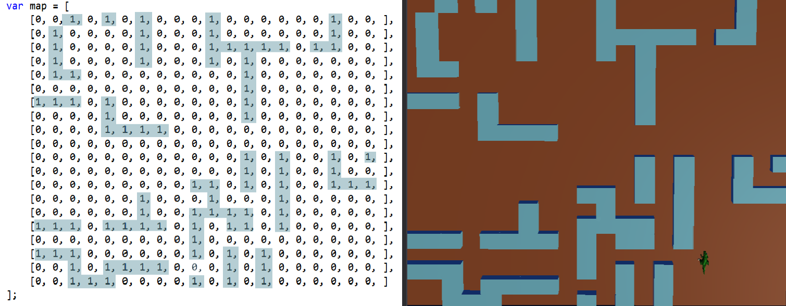

# Creating a 3D JavaScript game using three.js

## Introduction

For web developers or JavaScript tinkerers, developing UWP apps with JavaScript is an easy way in to getting your apps out to the world. No need to worry about learning a language like C# or C++!

For this sample, we’re going to be taking advantage of the **three.js** library. This library builds off of WebGL, an API that's used for rendering 2D and 3D graphics for web browsers. **three.js** takes this complicated API and simplifies it, making 3D development much easier. 


Want to get a glimpse of the app we'll be making before reading further? Check it out on CodePen!

<iframe height='300' scrolling='no' title='Dino game final' src='//codepen.io/MicrosoftEdgeDocumentation/embed/preview/NpKejy/?height=300&theme-id=23761&default-tab=result&embed-version=2&editable=true' frameborder='no' allowtransparency='true' allowfullscreen='true' style='width: 100%;'>See the Pen <a href='https://codepen.io/MicrosoftEdgeDocumentation/pen/NpKejy/'>Dino game final</a> by Microsoft Edge Docs (<a href='https://codepen.io/MicrosoftEdgeDocumentation'>@MicrosoftEdgeDocumentation</a>) on <a href='https://codepen.io'>CodePen</a>.
</iframe>

> [!NOTE] 
> This is a not a complete game; it is designed to demonstrate using JavaScript and a third-party library to make an app ready to publish to the Microsoft Store.


## Requirements

To play with this project, you'll need the following:
-	A Windows computer (or a virtual machine) running the current version of Windows 10.
-	A copy of Visual Studio. The free Visual Studio Community Edition can be downloaded from the [Visual Studio homepage](https://visualstudio.com/).
This project makes use of the **three.js** JavaScript library. **three.js** is released under the MIT license. This library is already present in the project (look for `js/libs` in the Solution Explorer view). More information about this library can be found at the [**three.js**](https://threejs.org/) home page.

## Getting started

The complete source code for the app is stored on [GitHub](https://github.com/Microsoft/Windows-appsample-get-started-js3d).

The simplest way to get started is to visit GitHub, click on the green Clone or download button, and select Open in Visual Studio. 


If you don't want to clone the project, you can download it as a zip file.
Once the solution has been loaded into Visual Studio, you'll see several files, including:
-	Images/ - a folder containing the various icons required by UWP apps.
- css/ - a folder containing the CSS to be used.
-	js/ - a folder containing the JavaScript files. The main.js file is our game while the other files are the third-party libraries.
-	models/ - a folder containing the 3D models. For this game, we only have one for the dinosaur.
-	index.html - the webpage that hosts the game's renderer.

Now you can run the game!

Press F5 to start the app. You should see a window open, prompting you to click on the screen. You’ll also see a dinosaur moving around in the background. Go ahead and close out of the game and we’ll begin examining the app and its key components.

> [!NOTE] 
> Something go wrong? Be sure you have installed Visual Studio with web support. You can check by creating a new project - if there is no support for JavaScript, you will need to re-install Visual Studio and check the Microsoft Web Developer Tools box.

## Walkthrough

When you start up this game, you’ll see a prompt to click on the screen. The [Pointer Lock API](https://developer.mozilla.org/docs/Web/API/Pointer_Lock_API) is used to allow you to look around with your mouse. Moving is done by pressing the W, A, S, D/arrow keys.
The goal of this game is to stay away from the dinosaur. Once the dinosaur is close enough to you, it’ll start chasing you until you either get out of range or get too close and lose the game.

### 1. Setting up your initial HTML file

Within **index.html**, you'll need to add a little HTML to get started. This file is the default web page that contains our app.

Right now, we'll set it up with the libraries we'll be using and the `div` (named `container`) that we'll use to render our graphics to. We'll also set it to point to our **main.js** (our game code).


```html
<!DOCTYPE html>
<html lang='en'>

<head>
    <link rel="stylesheet" type="text/css" href="css/stylesheet.css" />
</head>

    <body>
        <div id='container'></div>
        <script src='js/libs/three.js'></script>
        <script src="js/controls/PointerLockControls.js"></script>
        <script src="js/main.js"></script>
    </body>

</html>
```


Now that we have our starter HTML ready to go, let's head over to **main.js** and make some graphics!

### 2. Creating your scene

In the section of the walkthrough we're going to adding the foundation of the game.

We'll start off by fleshing out a `scene`. A `scene` in **three.js** is where your camera, objects, and lights will be added. You'll also need a renderer which will take what your camera sees in the scene and display it.

In **main.js** we'll make a function that does all of this called `init()` which calls on some additional functions:

```javascript
var UNITWIDTH = 90; // Width of a cubes in the maze
var UNITHEIGHT = 45; // Height of the cubes in the maze

var camera, scene, renderer;

init();
animate();

function init() {
    // Create the scene where everything will go
    scene = new THREE.Scene();

    // Add some fog for effects
    scene.fog = new THREE.FogExp2(0xcccccc, 0.0015);

    // Set render settings
    renderer = new THREE.WebGLRenderer();
    renderer.setClearColor(scene.fog.color);
    renderer.setPixelRatio(window.devicePixelRatio);
    renderer.setSize(window.innerWidth, window.innerHeight);

    // Get the HTML container and connect renderer to it
    var container = document.getElementById('container');
    container.appendChild(renderer.domElement);

    // Set camera position and view details
    camera = new THREE.PerspectiveCamera(60, window.innerWidth / window.innerHeight, 1, 2000);
    camera.position.y = 20; // Height the camera will be looking from
    camera.position.x = 0;
    camera.position.z = 0;

    // Add the camera
    scene.add(camera);

    // Add the walls(cubes) of the maze
    createMazeCubes();

    // Add lights to the scene
    addLights();

    // Listen for if the window changes sizes and adjust
    window.addEventListener('resize', onWindowResize, false);
}

```

The other functions we'll need to create include:
- `createMazeCubes()`
- `addLights()`
- `onWindowResize()`
- `animate()` / `render()`
- Unit conversion functions

#### createMazeCubes()

The `createMazeCubes()` function will add a simple cube to our scene. Later on we'll make the funcion add many cubes to make our maze.

```javascript
function createMazeCubes() {

  // Make the shape of the cube that is UNITWIDTH wide/deep, and UNITHEIGHT tall
  var cubeGeo = new THREE.BoxGeometry(UNITWIDTH, UNITHEIGHT, UNITWIDTH);
  // Make the material of the cube and set it to blue
  var cubeMat = new THREE.MeshPhongMaterial({
    color: 0x81cfe0,
  });
  
  // Combine the geometry and material to make the cube
  var cube = new THREE.Mesh(cubeGeo, cubeMat);

  // Add the cube to the scene
  scene.add(cube);

  // Update the cube's position
  cube.position.y = UNITHEIGHT / 2;
  cube.position.x = 0;
  cube.position.z = -100;
  // rotate the cube by 30 degrees
  cube.rotation.y = degreesToRadians(30);
}

```

#### addLights()

The `addLights()` function is a simple function that groups the creation of our lights and adds them to the scene.

```javascript
function addLights() {
  var lightOne = new THREE.DirectionalLight(0xffffff);
  lightOne.position.set(1, 1, 1);
  scene.add(lightOne);

  // Add a second light with half the intensity
  var lightTwo = new THREE.DirectionalLight(0xffffff, .5);
  lightTwo.position.set(1, -1, -1);
  scene.add(lightTwo);
}
```

#### onWindowResize()

The `onWindowResize` function is called whenever our event listener hears that a `resize` event was fired. This happens whenever the user adjusts the size of the window. If this happens, we want to make sure tha the image stays proportional and can be seen in the entire window.

```javascript
function onWindowResize() {

  camera.aspect = window.innerWidth / window.innerHeight;
  camera.updateProjectionMatrix();

  renderer.setSize(window.innerWidth, window.innerHeight);
}
```

#### animate()

The last thing we'll need is our `animate()` function, which will also call the `render()` function. The [`requestAnimationFrame()`](https://developer.mozilla.org/docs/Web/API/window/requestAnimationFrame) function is used to constantly update our renderer. Later on, we'll use these functions to update our renderer with cool animations like moving around the maze.

```javascript
function animate() {
    render();
    // Keep updating the renderer
    requestAnimationFrame(animate);
}

function render() {
    renderer.render(scene, camera);
}
```

#### Unit conversion functions

In **three.js** rotations are measured in radians. To make things easy for us, we'll go ahead and add some functions so that we can easily convert between degrees and radians. 


```javascript
function degreesToRadians(degrees) {
  return degrees * Math.PI / 180;
}

function radiansToDegrees(radians) {
  return radians * 180 / Math.PI;
}
```

Who would remember that 30 degrees is .523 radians? 
It's much simpler to instead do `degreesToRadians(30)` to get our rotation amount which is used in our `createMazeCubes()` function.

___

That was quite a bit of code to take in, but we now have a beautiful cube the is rendered to our `container`! Check out the results in the CodePen.

You can copy and paste all the JavaScript in this CodePen to get caught up if you encountered issues, or edit it to adjust some lights and change some colors. 

<iframe height='300' scrolling='no' title='Lights, camera, cube!' src='//codepen.io/MicrosoftEdgeDocumentation/embed/YZWygZ/?height=300&theme-id=23761&default-tab=result&embed-version=2&editable=true' frameborder='no' allowtransparency='true' allowfullscreen='true' style='width: 100%;'>See the Pen <a href='https://codepen.io/MicrosoftEdgeDocumentation/pen/YZWygZ/'>Lights, camera, cube!</a> by Microsoft Edge Docs (<a href='https://codepen.io/MicrosoftEdgeDocumentation'>@MicrosoftEdgeDocumentation</a>) on <a href='https://codepen.io'>CodePen</a>.
</iframe>


### 3. Making the maze

While staring at a cube is breathtaking, what’s even better is a whole maze made out of cubes! It’s a pretty well-known secret in the games community that one of the quickest ways to creating a level is by placing cubes all over with a 2D array.
 


Placing 1’s where cubes are and 0’s where empty space is allows for a manual and simple way for you to create/tweak the maze.

We achieve this by replacing our old `createMazeCubes()` function with one that uses a nested loop to create and place multiple cubes. We'll also create an array name `collidableObjects` and add the cubes to it for collision detection later in this tutorial:

```javascript
var totalCubesWide; // How many cubes wide the maze will be
var collidableObjects = []; // An array of collidable objects used later

function createMazeCubes() {
  // Maze wall mapping, assuming even square
  // 1's are cubes, 0's are empty space
  var map = [
    [0, 0, 1, 0, 1, 0, 1, 0, 0, 0, 1, 0, 0, 0, 0, 0, 0, 1, 0, 0, ],
    [0, 1, 0, 0, 0, 0, 1, 0, 0, 0, 1, 0, 0, 0, 0, 0, 0, 1, 0, 0, ],
    [0, 1, 0, 0, 0, 0, 1, 0, 0, 0, 1, 1, 1, 1, 1, 0, 1, 1, 0, 0, ],
    [0, 1, 0, 0, 0, 0, 1, 0, 0, 0, 1, 0, 1, 0, 0, 0, 0, 0, 0, 0, ],
    [0, 1, 1, 0, 0, 0, 0, 0, 0, 0, 0, 0, 1, 0, 0, 0, 0, 0, 0, 0, ],
    [0, 0, 0, 0, 0, 0, 0, 0, 0, 0, 0, 0, 1, 0, 0, 0, 0, 0, 0, 0, ],
    [1, 1, 1, 0, 1, 0, 0, 0, 0, 0, 0, 0, 1, 0, 0, 0, 0, 0, 0, 0, ],
    [0, 0, 0, 0, 1, 0, 0, 0, 0, 0, 0, 0, 1, 0, 0, 0, 0, 0, 0, 0, ],
    [0, 0, 0, 0, 1, 1, 1, 1, 0, 0, 0, 0, 0, 0, 0, 0, 0, 0, 0, 0, ],
    [0, 0, 0, 0, 0, 0, 0, 0, 0, 0, 0, 0, 0, 0, 0, 0, 0, 0, 0, 0, ],
    [0, 0, 0, 0, 0, 0, 0, 0, 0, 0, 0, 0, 1, 0, 1, 0, 0, 1, 0, 1, ],
    [0, 0, 0, 0, 0, 0, 0, 0, 0, 0, 0, 0, 1, 0, 1, 0, 0, 1, 0, 0, ],
    [0, 0, 0, 0, 0, 0, 0, 0, 0, 1, 1, 0, 1, 0, 1, 0, 0, 1, 1, 1, ],
    [0, 0, 0, 0, 0, 0, 1, 0, 0, 0, 1, 0, 0, 0, 1, 0, 0, 0, 0, 0, ],
    [0, 0, 0, 0, 0, 0, 1, 0, 0, 1, 1, 1, 1, 0, 1, 0, 0, 0, 0, 0, ],
    [1, 1, 1, 0, 1, 1, 1, 1, 0, 1, 0, 1, 1, 0, 1, 0, 0, 0, 0, 0, ],
    [0, 0, 0, 0, 0, 0, 0, 0, 0, 1, 0, 0, 0, 0, 0, 0, 0, 0, 0, 0, ],
    [1, 1, 1, 0, 0, 0, 0, 0, 0, 1, 0, 1, 0, 1, 0, 0, 0, 0, 0, 0, ],
    [0, 0, 1, 0, 1, 1, 1, 1, 0, 0, 0, 1, 0, 1, 0, 0, 0, 0, 0, 0, ],
    [0, 0, 1, 1, 1, 0, 0, 0, 0, 1, 0, 1, 0, 1, 0, 0, 0, 0, 0, 0, ]
  ];

  // wall details
  var cubeGeo = new THREE.BoxGeometry(UNITWIDTH, UNITHEIGHT, UNITWIDTH);
  var cubeMat = new THREE.MeshPhongMaterial({
    color: 0x81cfe0,
  });

  // Keep cubes within boundry walls
  var widthOffset = UNITWIDTH / 2;
  // Put the bottom of the cube at y = 0
  var heightOffset = UNITHEIGHT / 2;
  
  // See how wide the map is by seeing how long the first array is
  totalCubesWide = map[0].length;

  // Place walls where 1`s are
  for (var i = 0; i < totalCubesWide; i++) {
    for (var j = 0; j < map[i].length; j++) {
      // If a 1 is found, add a cube at the corresponding position
      if (map[i][j]) {
        // Make the cube
        var cube = new THREE.Mesh(cubeGeo, cubeMat);
        // Set the cube position
        cube.position.z = (i - totalCubesWide / 2) * UNITWIDTH + widthOffset;
        cube.position.y = heightOffset;
        cube.position.x = (j - totalCubesWide / 2) * UNITWIDTH + widthOffset;
        // Add the cube
        scene.add(cube);
        // Used later for collision detection
        collidableObjects.push(cube);
      }
    }
  }
    // The size of the maze will be how many cubes wide the array is * the width of a cube
    mapSize = totalCubesWide * UNITWIDTH;
}

```

Now that we know how many cubes are being used (and how big they are), we can now use the calculated `mapSize` variable to set the dimensions of the ground plane:

```javascript
var mapSize;    // The width/depth of the maze

function createGround() {
    // Create ground geometry and material
    var groundGeo = new THREE.PlaneGeometry(mapSize, mapSize);
    var groundMat = new THREE.MeshPhongMaterial({ color: 0xA0522D, side: THREE.DoubleSide});

    var ground = new THREE.Mesh(groundGeo, groundMat);
    ground.position.set(0, 1, 0);
    // Rotate the place to ground level
    ground.rotation.x = degreesToRadians(90);
    scene.add(ground);
}
```

The last piece of the maze we'll add is perimeter walls to box everything in. We'll use a loop to make two planes (our walls) at a time, using the `mapSize` variable we calculated in `createGround()` to determine how wide they should be. The new walls will also be added to our `collidableObjects` array for future collision detection:

```javascript
function createPerimWalls() {
    var halfMap = mapSize / 2;  // Half the size of the map
    var sign = 1;               // Used to make an amount positive or negative

    // Loop through twice, making two perimeter walls at a time
    for (var i = 0; i < 2; i++) {
        var perimGeo = new THREE.PlaneGeometry(mapSize, UNITHEIGHT);
        // Make the material double sided
        var perimMat = new THREE.MeshPhongMaterial({ color: 0x464646, side: THREE.DoubleSide });
        // Make two walls
        var perimWallLR = new THREE.Mesh(perimGeo, perimMat);
        var perimWallFB = new THREE.Mesh(perimGeo, perimMat);

        // Create left/right wall
        perimWallLR.position.set(halfMap * sign, UNITHEIGHT / 2, 0);
        perimWallLR.rotation.y = degreesToRadians(90);
        scene.add(perimWallLR);
        // Used later for collision detection
        collidableObjects.push(perimWallLR);
        // Create front/back wall
        perimWallFB.position.set(0, UNITHEIGHT / 2, halfMap * sign);
        scene.add(perimWallFB);

        // Used later for collision detection
        collidableObjects.push(perimWallFB);

        sign = -1; // Swap to negative value
    }
}
```


Don't forget to add a call to `createGround()` and `createPerimWalls` after `createMazeCubes()` in your `init()` function so that they get compiled!
___

We now have a beautiful maze to look at but can't really get a feel for just how cool it is because our camera is stuck in one spot. It's time to kick this game up a notch and add in some camera controls.

Feel free to test things out in the CodePen like changing the colors of the cubes or removing the ground by commenting out `createGround()` in the `init()` function.


<iframe height='300' scrolling='no' title='Maze building' src='//codepen.io/MicrosoftEdgeDocumentation/embed/JWKYzG/?height=300&theme-id=23761&default-tab=result&embed-version=2&editable=true' frameborder='no' allowtransparency='true' allowfullscreen='true' style='width: 100%;'>See the Pen <a href='https://codepen.io/MicrosoftEdgeDocumentation/pen/JWKYzG/'>Maze building</a> by Microsoft Edge Docs (<a href='https://codepen.io/MicrosoftEdgeDocumentation'>@MicrosoftEdgeDocumentation</a>) on <a href='https://codepen.io'>CodePen</a>.
</iframe>

### 4. Allowing the player to look around

Now it’s time to get in that maze and start looking around. To do this we’ll be using the **PointerLockControls.js** library and our camera.

The **PoinerLockControls.js** library uses the mouse to rotate the camera in the direction that the mouse is moved, allowing the player to look around. 

First let's add some new elements to our **index.html** file:

```html
<div id="blocker">
    <div id="instructions">
    <strong>Click to look!</strong>
    </div>
</div>

<script src="main.js"></script>
```

You'll also need all the CSS in the CodePen at the bottom of this section. It should be pasted into your **stylesheet.css** file.

Switching back to **main.js**, add a few new global variables; `controls` to store our controller, `controlsEnabled` to keep track of the controller state, and `blocker` to grab the `blocker` element in **index.html**:

```javascript
var controls;
var controlsEnabled = false;

// HTML elements to be changed
var blocker = document.getElementById('blocker');
```


Now in our `init()` function we can make a new `PoinerLockControls` object, pass it our `camera`, and add the `camera` (accessed with `controls.getObject()`).

```javascript
controls = new THREE.PointerLockControls(camera);
scene.add(controls.getObject());
```

The camera is now connected, but we need to somehow let the mouse and controller interact so that we can look around. 

For this situation, the [Pointer Lock API](/microsoft-edge/dev-guide/dom/pointer-lock) comes to the rescue by letting us connect mouse movements to our camera. The Pointer Lock API also makes the mouse disappear for a more immersive experience. By pressing ESC we end the mouse to camera connection and make the mouse reappear. Additions of the `getPointerLock()` and `lockChange()` functions will help us do just that.

The `getPointerLock()` function listens for when a mouse click happens. After the click, our rendered game (in the `container` element) tries to get control of the mouse. We also add an event listener to detect when the player activates or deactivates the lock which then calls `lockChange()`. 

```javascript
function getPointerLock() {
  document.onclick = function () {
    container.requestPointerLock();
  }
  document.addEventListener('pointerlockchange', lockChange, false); 
}

```

Our `lockChange()` function needs to either disable or enable the controls and `blocker` element. We can determine the state of the pointer lock by checking if the [`pointerLockElement`](https://developer.mozilla.org/docs/Web/API/Document/pointerLockElement) property's target for mouse events is set to our `container`.

```javascript
function lockChange() {
    // Turn on controls
    if (document.pointerLockElement === container) {
        // Hide blocker and instructions
        blocker.style.display = "none";
        controls.enabled = true;
    // Turn off the controls
    } else {
      // Display the blocker and instruction
        blocker.style.display = "";
        controls.enabled = false;
    }
}
```

Now we can add a call to `getPointerLock()` just before our `init()` function.
```javascript
// Get the pointer lock state
getPointerLock();
init();
animate();
```

---

At this point we now have the ability to **look** around, but the real 'wow' factor is being able to **move** around. Things are about to get a little mathematical with vectors, but what's 3D graphics without a bit of math?

<iframe height='300' scrolling='no' title='Look around' src='//codepen.io/MicrosoftEdgeDocumentation/embed/gmwbMo/?height=300&theme-id=23761&default-tab=result&embed-version=2&editable=true' frameborder='no' allowtransparency='true' allowfullscreen='true' style='width: 100%;'>See the Pen <a href='https://codepen.io/MicrosoftEdgeDocumentation/pen/gmwbMo/'>Look around</a> by Microsoft Edge Docs (<a href='https://codepen.io/MicrosoftEdgeDocumentation'>@MicrosoftEdgeDocumentation</a>) on <a href='https://codepen.io'>CodePen</a>.
</iframe>


### 5. Adding player movement

To dig into how to get our player moving, we've got to think back to our calculus days. We want to apply velocity (movement) to the `camera` along a certain vector (direction).

Let's add a few more global variables to keep track of which direction the player is moving, and set an initial velocity vector:

```javascript
// Flags to determine which direction the player is moving
var moveForward = false;
var moveBackward = false;
var moveLeft = false;
var moveRight = false;

// Velocity vector for the player
var playerVelocity = new THREE.Vector3();

// How fast the player will move
var PLAYERSPEED = 800.0;

var clock;
```

In the beginning of the `init()` function, set `clock` to a new `Clock` object. We'll be using this to keep track of the change in time (delta) it takes to render new frames. You'll also need to add a call to `listenForPlayerMovement()`, which gathers user input. 

```
clock = new THREE.Clock();
listenForPlayerMovement();
```

Our `listenForPlayerMovement()` function is what will be flipping our direction states. At the bottom of the function we have two event listeners that are waiting for keys to be pressed and released. Once one of these events are fired, we'll then check to see if it's a key that we want to trigger or stop movement.

For this game, we've set it up so that the player can move around with the W, A, S, D keys or the arrow keys.

```javascript
function listenForPlayerMovement() {
    
    // A key has been pressed
    var onKeyDown = function(event) {

    switch (event.keyCode) {

      case 38: // up
      case 87: // w
        moveForward = true;
        break;

      case 37: // left
      case 65: // a
        moveLeft = true;
        break;

      case 40: // down
      case 83: // s
        moveBackward = true;
        break;

      case 39: // right
      case 68: // d
        moveRight = true;
        break;
    }
  };

  // A key has been released
    var onKeyUp = function(event) {

    switch (event.keyCode) {

      case 38: // up
      case 87: // w
        moveForward = false;
        break;

      case 37: // left
      case 65: // a
        moveLeft = false;
        break;

      case 40: // down
      case 83: // s
        moveBackward = false;
        break;

      case 39: // right
      case 68: // d
        moveRight = false;
        break;
    }
  };

  // Add event listeners for when movement keys are pressed and released
  document.addEventListener('keydown', onKeyDown, false);
  document.addEventListener('keyup', onKeyUp, false);
}
```

Now that we're able to determine which direction the user wants to go (which is now stored as `true` in one of the global direction flags), it's time for some action. This action happens to come in the form of the `animatePlayer()` function.

This function will be called from within `animate()`, passing in `delta` to get the change in time between frames so that our movement doesn't seem out of sync during changes in framerate:

```javascript
function animate() {
  render();
  requestAnimationFrame(animate);
  // Get the change in time between frames
  var delta = clock.getDelta();
  animatePlayer(delta);
}
```

Now it's time for the fun part! Our momentum vector (`playerVeloctiy`) has three parameters, `(x, y, z)`, with `y` being the vertical momentum. Since we aren't doing any jumping in this game, we'll only be working with the `x` and `z` parameters. Initially this vector is set to (0, 0, 0).

As seen in the code below, a series of checks are done to see which direction flag is flipped to `true`. Once we have the direction, we add or subtract from `x` and `y` to apply momentum in that direction. If no movement keys are being pressed, the vector will be set back to `(0, 0, 0)`.


```javascript

function animatePlayer(delta) {
  // Gradual slowdown
  playerVelocity.x -= playerVelocity.x * 10.0 * delta;
  playerVelocity.z -= playerVelocity.z * 10.0 * delta;

  if (moveForward) {
    playerVelocity.z -= PLAYERSPEED * delta;
  } 
  if (moveBackward) {
    playerVelocity.z += PLAYERSPEED * delta;
  } 
  if (moveLeft) {
    playerVelocity.x -= PLAYERSPEED * delta;
  } 
  if (moveRight) {
    playerVelocity.x += PLAYERSPEED * delta;
  }
  if( !( moveForward || moveBackward || moveLeft ||moveRight)) {
    // No movement key being pressed. Stop movememnt
    playerVelocity.x = 0;
    playerVelocity.z = 0;
  }
  controls.getObject().translateX(playerVelocity.x * delta);
  controls.getObject().translateZ(playerVelocity.z * delta);
}
```

In the end, we apply the whatever the updated `x` and `y` values are to the camera as translations to make the player actually move.

---

Congratulations! You now have a player controlled camera that can move and look around. We still slip right through walls, but that's something to worry about later. Next we'll add our dinosaur.

<iframe height='300' scrolling='no' title='Move around' src='//codepen.io/MicrosoftEdgeDocumentation/embed/qrbKZg/?height=300&theme-id=23761&default-tab=result&embed-version=2&editable=true' frameborder='no' allowtransparency='true' allowfullscreen='true' style='width: 100%;'>See the Pen <a href='https://codepen.io/MicrosoftEdgeDocumentation/pen/qrbKZg/'>Move around</a> by Microsoft Edge Docs (<a href='https://codepen.io/MicrosoftEdgeDocumentation'>@MicrosoftEdgeDocumentation</a>) on <a href='https://codepen.io'>CodePen</a>.
</iframe>

> [!NOTE]
> If you use these controls in your UWP app you may experience movement lag and unregistered `keyUp` events. We're looking into this and hope to fix this portion of the sample soon!

### 6. Load that dino!

If you cloned or downloaded this projects repo, you'll see a `models` folder with `dino.json` inside. This JSON file is a 3D dinosaur model that was made and exported from Blender.


We'll have to add more global variables to get this dino loaded up:

```javascript
var DINOSCALE = 20;  // How big our dino is scaled to

var clock;
var dino;
var loader = new THREE.JSONLoader();

var instructions = document.getElementById('instructions');
```

Now that we have our `JSONLoader` created, we'll pass in the path to our **dino.json** and a callback with the geometry and materials gathered from the file.
Loading the dino is an asynchronous task, meaning nothing will render until the dino is completely loaded. In our **index.html** we changed the string in the `instructions` element to `"Loading..."` to let the player know things are in progress.

After the dino is loaded, update the `instructions` element with the actual instructions of the game, and move the `animate()` function from the end of `init()` to the end of the function callback seen below:

```javascript
   // load the dino JSON model and start animating once complete
    loader.load('./models/dino.json', function (geometry, materials) {


        // Get the geometry and materials from the JSON
        var dinoObject = new THREE.Mesh(geometry, new THREE.MultiMaterial(materials));

        // Scale the size of the dino
        dinoObject.scale.set(DINOSCALE, DINOSCALE, DINOSCALE);
        dinoObject.rotation.y = degreesToRadians(-90);
        dinoObject.position.set(30, 0, -400);
        dinoObject.name = "dino";
        scene.add(dinoObject);
        
        // Store the dino
        dino = scene.getObjectByName("dino"); 

        // Model is loaded, switch from "Loading..." to instruction text
        instructions.innerHTML = "<strong>Click to Play!</strong> </br></br> W,A,S,D or arrow keys = move </br>Mouse = look around";

        // Call the animate function so that animation begins after the model is loaded
        animate();
    });
```

---

We now have our dino model loaded in. Check it out!

<iframe height='300' scrolling='no' title='Adding the dino' src='//codepen.io/MicrosoftEdgeDocumentation/embed/xqOwBw/?height=300&theme-id=23761&default-tab=result&embed-version=2&editable=true' frameborder='no' allowtransparency='true' allowfullscreen='true' style='width: 100%;'>See the Pen <a href='https://codepen.io/MicrosoftEdgeDocumentation/pen/xqOwBw/'>Adding the dino</a> by Microsoft Edge Docs (<a href='https://codepen.io/MicrosoftEdgeDocumentation'>@MicrosoftEdgeDocumentation</a>) on <a href='https://codepen.io'>CodePen</a>.
</iframe>

### 7. Move that dino!

Creating AI for a game can get extremely complex, so for this example we'll make this dino have a simple movement behavior. Our dino will move straight, slipping its way through walls and off into the distant fog.

To do this, first add the global variable `dinoVelocity`.

```javascript
var DINOSPEED = 400.0;

var dinoVelocity = new THREE.Vector3();
```
 Next, call the `animateDino()` function from the `animation()` function and add in the below code:

```javascript
function animateDino(delta) {
    // Gradual slowdown
    dinoVelocity.x -= dinoVelocity.x * 10.0 * delta;
    dinoVelocity.z -= dinoVelocity.z * 10.0 * delta;

    dinoVelocity.z += DINOSPEED * delta;
    // Move the dino
    dino.translateZ(dinoVelocity.z * delta);
}
```
---

Watching the dino sail away isn't very fun, but once we add collision detection things will get more interesting.

<iframe height='300' scrolling='no' title='Moving the dino - no collision' src='//codepen.io/MicrosoftEdgeDocumentation/embed/preview/jBMbbL/?height=300&theme-id=23761&default-tab=result&embed-version=2&editable=true' frameborder='no' allowtransparency='true' allowfullscreen='true' style='width: 100%;'>See the Pen <a href='https://codepen.io/MicrosoftEdgeDocumentation/pen/jBMbbL/'>Moving the dino - no collision</a> by Microsoft Edge Docs (<a href='https://codepen.io/MicrosoftEdgeDocumentation'>@MicrosoftEdgeDocumentation</a>) on <a href='https://codepen.io'>CodePen</a>.
</iframe>

### 8. Collision detection for the player

So we now have the player and the dino moving around, but there's still that annoying issue with everyone going through walls. When we first started adding our cubes and walls earlier in this tutorial, we pushed them into the `collidableObjects` array. This array is what we'll be using to tell if a player is too close to something they can't walk through.

We'll be using raycasters to determine when an intersection is about to occur. You could imagine a raycaster as a laser beam coming out of the camera at some specified direction, reporting back if it hit an object and exactly how far away it is.

```javascript
var PLAYERCOLLISIONDISTANCE = 20;
```

We'll be making a new function called `detectPlayerCollision()` that will return `true` if the player is too close to a collidable object.
For the player, we're going to apply one raycaster to it, changing which direction it's pointing depending on which direction they're going.

To do this, we create `rotationMatrix`, an undefined matrix. As we check which direction we're going, we'll end up with either a defined `rotationMatrix`, or undefined if you're moving forward.
If defined, the `rotationMatrix` will be applied to the direction of the controls. 

A raycaster will then be created, starting from and camera and reaching out in the `cameraDirection` direction.


```javascript
function detectPlayerCollision() {
    // The rotation matrix to apply to our direction vector
    // Undefined by default to indicate ray should coming from front
    var rotationMatrix;
    // Get direction of camera
    var cameraDirection = controls.getDirection(new THREE.Vector3(0, 0, 0)).clone();

    // Check which direction we're moving (not looking)
    // Flip matrix to that direction so that we can reposition the ray
    if (moveBackward) {
        rotationMatrix = new THREE.Matrix4();
        rotationMatrix.makeRotationY(degreesToRadians(180));
    }
    else if (moveLeft) {
        rotationMatrix = new THREE.Matrix4();
        rotationMatrix.makeRotationY(degreesToRadians(90));
    }
    else if (moveRight) {
        rotationMatrix = new THREE.Matrix4();
        rotationMatrix.makeRotationY(degreesToRadians(270));
    }

    // Player is not moving forward, apply rotation matrix needed
    if (rotationMatrix !== undefined) {
        cameraDirection.applyMatrix4(rotationMatrix);
    }

    // Apply ray to player camera
    var rayCaster = new THREE.Raycaster(controls.getObject().position, cameraDirection);

    // If our ray hit a collidable object, return true
    if (rayIntersect(rayCaster, PLAYERCOLLISIONDISTANCE)) {
        return true;
    } else {
        return false;
    }
}
```

Our `detectPlayerCollision()` function relies on the `rayIntersect()` helper function.
This takes a raycaster and value representing how close we can get to an object in the `collidableObjects` array before determining a collision has occured.

```javascript
function rayIntersect(ray, distance) {
    var intersects = ray.intersectObjects(collidableObjects);
    for (var i = 0; i < intersects.length; i++) {
        // Check if there's a collision
        if (intersects[i].distance < distance) {
            return true;
        }
    }
    return false;
}
```

Now that we can determine when a collision is about to occur, we can spruce up our `animatePlayer()` function:

```javascript
function animatePlayer(delta) {
    // Gradual slowdown
    playerVelocity.x -= playerVelocity.x * 10.0 * delta;
    playerVelocity.z -= playerVelocity.z * 10.0 * delta;

    // If no collision and a movement key is being pressed, apply movement velocity
    if (detectPlayerCollision() == false) {
        if (moveForward) {
            playerVelocity.z -= PLAYERSPEED * delta;
        }
        if (moveBackward) {
            playerVelocity.z += PLAYERSPEED * delta;
        } 
        if (moveLeft) {
            playerVelocity.x -= PLAYERSPEED * delta;
        }
        if (moveRight) {
            playerVelocity.x += PLAYERSPEED * delta;
        }

        controls.getObject().translateX(playerVelocity.x * delta);
        controls.getObject().translateZ(playerVelocity.z * delta);
    } else {
        // Collision or no movement key being pressed. Stop movememnt
        playerVelocity.x = 0;
        playerVelocity.z = 0;
    }
}
```

---

We now have player collision detection, so go ahead and try to run into some walls!

<iframe height='300' scrolling='no' title='Moving the player - collision' src='//codepen.io/MicrosoftEdgeDocumentation/embed/preview/qraOeO/?height=300&theme-id=23761&default-tab=result&embed-version=2&editable=true' frameborder='no' allowtransparency='true' allowfullscreen='true' style='width: 100%;'>See the Pen <a href='https://codepen.io/MicrosoftEdgeDocumentation/pen/qraOeO/'>Moving the player - collision</a> by Microsoft Edge Docs (<a href='https://codepen.io/MicrosoftEdgeDocumentation'>@MicrosoftEdgeDocumentation</a>) on <a href='https://codepen.io'>CodePen</a>.
</iframe>


### 9. Collision detection and animation for dino

It's time to stop our dino from moving through walls, and instead have it go a random direction once it's too close to a collidable object.

First let's figure out when our dino has a collision. 

We'll need to set anothe global variable for the collision distance:

```javascript
var DINOCOLLISIONDISTANCE = 55;     
```

Now that we've specifed at what distance we want our dino to collide at, let's add a function similar to `detectPlayerCollision()`, but a bit simpler.
The `detectDinoCollision` function is simple in that we always have one raycaster coming straight out the front of the dino. No need to rotate it around like for the player collision.

```javascript
function detectDinoCollision() {
    // Get the rotation matrix from dino
    var matrix = new THREE.Matrix4();
    matrix.extractRotation(dino.matrix);
    // Create direction vector
    var directionFront = new THREE.Vector3(0, 0, 1);

    // Get the vectors coming from the front of the dino
    directionFront.applyMatrix4(matrix);

    // Create raycaster
    var rayCasterF = new THREE.Raycaster(dino.position, directionFront);
    // If we have a front collision, we have to adjust our direction so return true
    if (rayIntersect(rayCasterF, DINOCOLLISIONDISTANCE))
        return true;
    else
        return false;
}
```

Let's take a peek at what our final `animateDino()` function will look like when hooked up with collision detection:


```javascript
function animateDino(delta) {
    // Gradual slowdown
    dinoVelocity.x -= dinoVelocity.x * 10.0 * delta;
    dinoVelocity.z -= dinoVelocity.z * 10.0 * delta;


    // If no collision, apply movement velocity
    if (detectDinoCollision() == false) {
        dinoVelocity.z += DINOSPEED * delta;
        // Move the dino
        dino.translateZ(dinoVelocity.z * delta);

    } else {
        // Collision. Adjust direction
        var directionMultiples = [-1, 1, 2];
        var randomIndex = getRandomInt(0, 2);
        var randomDirection = degreesToRadians(90 * directionMultiples[randomIndex]);

        dinoVelocity.z += DINOSPEED * delta;
        dino.rotation.y += randomDirection;
    }
}
```

We always want our dino to turn either -90, 90, or 180 degrees. To make this straight forward, above we've made the `directionMultiples` array which will produce these numbers when multiplied by 90.
To make selecting the rotation degrees random, we've added the `getRandomInt()` helper function to grab a value of 0, 1, or 2, which will represent a random index of the array.

```javascript
function getRandomInt(min, max) {
    min = Math.ceil(min);
    max = Math.floor(max);
    return Math.floor(Math.random() * (max - min)) + min;
}
```

Once this is all done, we multiply the random index of the array by 90 to get the degree (converted to radians) of rotation.
By adding this value to the dino's `y` rotation with `dino.rotation.y += randomDirection;`, the dino now makes random turns upon collision.


---

We did it! We now have a dino with AI that can move around our maze!

<iframe height='300' scrolling='no' title='Moving the dino - collision' src='//codepen.io/MicrosoftEdgeDocumentation/embed/preview/bqwMXZ/?height=300&theme-id=23761&default-tab=result&embed-version=2&editable=true' frameborder='no' allowtransparency='true' allowfullscreen='true' style='width: 100%;'>See the Pen <a href='https://codepen.io/MicrosoftEdgeDocumentation/pen/bqwMXZ/'>Moving the dino - collision</a> by Microsoft Edge Docs (<a href='https://codepen.io/MicrosoftEdgeDocumentation'>@MicrosoftEdgeDocumentation</a>) on <a href='https://codepen.io'>CodePen</a>.
</iframe>

### 10. Starting the chase

Once the dino is within a certain distance to the player, we want it to start chasing them. Since this is just an example, there aren't any advanced algorithms applied for the dino to track the player down. Instead, the dino will look at the player and walk towards them. In an open part of the maze this works great, but the dino does get stuck when a wall is in the way.

In our `animate()` function we'll add a boolean variable that is determined by what is returned by `triggerChase()`:

```javascript
function animate() {
    render();
    requestAnimationFrame(animate);

    // Get the change in time between frames
    var delta = clock.getDelta();

    // If the player is in dino's range, trigger the chase
    var isBeingChased = triggerChase();

    animateDino(delta);
    animatePlayer(delta);
}
```

Our `triggerChase` function will check to see if the player is in chasing range of the dino, and then make the dino always face the player, which allows it to move in the player's direction. 

```javascript
function triggerChase() {
    // Check if in dino detection range of the player
    if (dino.position.distanceTo(controls.getObject().position) < 300) {
        // Set the dino target's y value to the current y value. We only care about x and z for movement.
        var lookTarget = new THREE.Vector3();
        lookTarget.copy(controls.getObject().position);
        lookTarget.y = dino.position.y;

        // Make dino face camera
        dino.lookAt(lookTarget);

        // Get distance between dino and camera with a unit offset
        // Game over when dino is the value of CATCHOFFSET units away from camera
        var distanceFrom = Math.round(dino.position.distanceTo(controls.getObject().position)) - CATCHOFFSET;
        // Alert and display distance between camera and dino
        dinoAlert.innerHTML = "Dino has spotted you! Distance from you: " + distanceFrom;
        dinoAlert.style.display = '';
        return true;
        // Not in agro range, don't start distance countdown
    } else {
        dinoAlert.style.display = 'none';
        return false;
    }
}
```

The second half of `triggerChase` deals with displaying some text that lets the player know how far away the dino is. We also introduce `CATCHOFFSET` to specify how far away `0` should be. If we didn't have the offset, `0` would be right on top of the player which doesn't make for a very cinematic end to all this.


```javascript
var dinoAlert = document.getElementById('dino-alert');
dinoAlert.style.display = 'none';
```

---

At this point we have a wild dinosaur that starts following the player once you get too close, and doesn't stop until it's position is on top of the player.
The final step is to add some game over conditions once the dino is `CATCHOFFSET` units away.

<iframe height='300' scrolling='no' title='The chase' src='//codepen.io/MicrosoftEdgeDocumentation/embed/preview/NpRBqR/?height=300&theme-id=23761&default-tab=result&embed-version=2&editable=true' frameborder='no' allowtransparency='true' allowfullscreen='true' style='width: 100%;'>See the Pen <a href='https://codepen.io/MicrosoftEdgeDocumentation/pen/NpRBqR/'>The chase</a> by Microsoft Edge Docs (<a href='https://codepen.io/MicrosoftEdgeDocumentation'>@MicrosoftEdgeDocumentation</a>) on <a href='https://codepen.io'>CodePen</a>.
</iframe>


### 11. Ending the game


We've come a long away from a simple cube, and now it's time to end things.

Let's first set a variable to keep track of whether the game is over or not:

```javascript
var gameOver = false;
```

Now we need to update our `animate()` function one last time to check if the dino is too close to the player.
If the dino is too close, we'll start a new function called `caught()` and will stop the player and dino from moving, if not, we'll carry on with business as usual and let the player and dino move around.

```javascript
function animate() {
    render();
    requestAnimationFrame(animate);

    // Get the change in time between frames
    var delta = clock.getDelta();
    // Update our frames per second monitor

    // If the player is in dino's range, trigger the chase
    var isBeingChased = triggerChase();
    // If the player is too close, trigger the end of the game
    if (dino.position.distanceTo(controls.getObject().position) < CATCHOFFSET) {
        caught();
    // Player is at an undetected distance
    // Keep the dino moving and let the player keep moving too
    } else {
        animateDino(delta);
        animatePlayer(delta);
    }
}
```

If the dino catches the player, `caught()` will display our `blocker` element and update the text to indicate that the game has been lost.
The `gameOver` variable is also set to `true`, which now lets us know the game is over.  


```javascript
function caught() {
    blocker.style.display = '';
    instructions.innerHTML = "GAME OVER </br></br></br> Press ESC to restart";
    gameOver = true;
    instructions.style.display = '';
    dinoAlert.style.display = 'none';
}
```


Now that we know whether the game is over or not, we can add a check for game over to our `lockChange()` function.
Now when the user presses ESC once the game is over, we can add `location.reload` to restart the game.

```javascript
function lockChange() {
    if (document.pointerLockElement === container) {
        blocker.style.display = "none";
        controls.enabled = true;
    } else {
        if (gameOver) {
            location.reload();
        }
        blocker.style.display = "";
        controls.enabled = false;
    }
}
```

---

That's it! It was quite the journey, but we now have a game made with **three.js**.

Head back up to the top of the page to see the [final CodePen](#introduction)!


## Publishing to the Microsoft Store
Now you have a UWP app, it is possible to publish it to the Microsoft Store (assuming you have improved it first!) 
There are a few steps to the process.

1.	You must be [registered](https://developer.microsoft.com/store/register) as a Windows Developer.
2.	You must use the app submission [checklist](../publish/app-submissions.md).
3.	The app must be submitted for [certification](../publish/the-app-certification-process.md).
For more details, see [Publishing your UWP app](../publish/index.md).