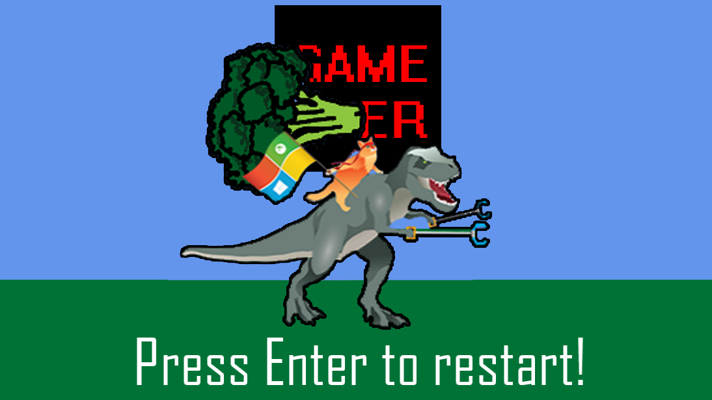
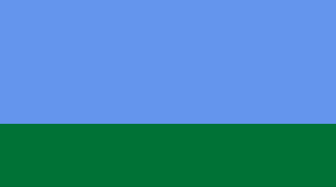
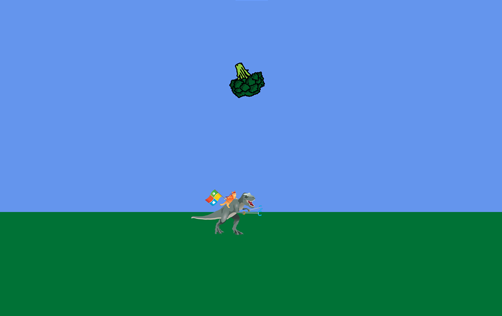
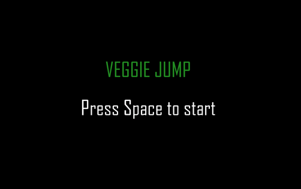
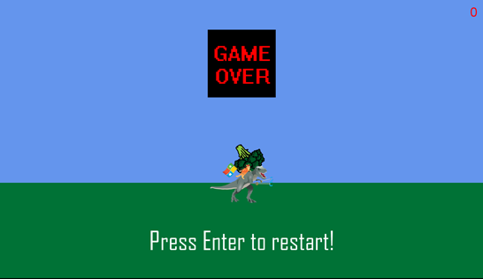

# Create a UWP game in MonoGame 2D

## A simple 2D UWP game for the Microsoft Store, written in C# and MonoGame




## Introduction

MonoGame is a lightweight game development framework. This tutorial will teach you the basics of game development in MonoGame, including how to load content, draw sprites, animate them, and handle user input. Some more advanced concepts like collision detection and scaling up for high-DPI screens are also discussed. This tutorial takes 30-60 minutes.

## Prerequisites
+	Windows 10 and Microsoft Visual Studio 2019.  [Click here to learn how to get set up with Visual Studio](./get-set-up.md).
+ The .NET desktop development framework. If you don't already have this installed, you can get it by re-running the Visual Studio installer and modifying your installation of Visual Studio 2019.
+	Basic knowledge of C# or a similar object-oriented programming language. [Click here to learn how to get started with C#](./create-a-hello-world-app-xaml-universal.md).
+	Familiarity with basic computer science concepts like classes, methods, and variables is a plus.

## Why MonoGame?
There’s no shortage of options when it comes to game development environments. From full-featured engines like Unity to comprehensive and complex multimedia APIs like DirectX, it can be hard to know where to start. MonoGame is a set of tools, with a level of complexity falling somewhere between a game engine and a grittier API like DirectX. It provides an easy-to-use content pipeline, and all the functionality required to create lightweight games that run on a wide variety of platforms. Best of all, MonoGame apps are written in pure C#, and you can distribute them quickly via the Microsoft Store or other similar distribution platforms.

## Get the code
If you don’t feel like working through the tutorial step-by-step and just want to see MonoGame in action, [click here to get the finished app](https://github.com/Microsoft/Windows-appsample-get-started-mg2d).

Open the project in Visual Studio 2019, and press **F5** to run the sample. The first time you do this may take a while, as Visual Studio needs to fetch any NuGet packages that are missing from your installation.

If you’ve done this, skip the next section about setting up MonoGame to see a step-by-step walkthrough of the code.

**Note:** The game created in this sample is not meant to be complete (or any fun at all). Its only purpose is to demonstrate all the core concepts of 2D development in MonoGame. Feel free to use this code and make something much better—or just start from scratch after you’ve mastered the basics!

## Set up MonoGame project
1. Install **MonoGame 3.6** for Visual Studio from [MonoGame.net](https://www.monogame.net/)

2. Start Visual Studio 2019.

3. Go to **File -> New -> Project**

4. Under the Visual C# project templates, select **MonoGame** and **MonoGame Windows 10 Universal Project**

5. Name your project “MonoGame2D" and select OK. With the project created, it will probably look like it is full of errors—these should go away after you run the project for the first time, and any missing NuGet packages are installed.

6. Make sure **x86** and **Local Machine** are set as the target platform, and press **F5** to build and run the empty project. If you followed the steps above, you should see an empty blue window after the project finishes building.

## Method overview
Now you’ve created the project, open the **Game1.cs** file from the **Solution Explorer**. This is where the bulk of the game logic is going to go. Many crucial methods are automatically generated here when you create a new MonoGame project. Let’s quickly review them:

**public Game1()** The constructor. We aren’t going to change this method at all for this tutorial.

**protected override void Initialize()** Here we initialize any class variables that are used. This method is called once at the start of the game.

**protected override void LoadContent()** This method loads content (eg. textures, audio, fonts) into memory before the game starts. Like Initialize, it’s called once when the app starts.

**protected override void UnloadContent()** This method is used to unload non content-manager content. We don’t use this one at all.

**protected override void Update(GameTime gameTime)** This method is called once for every cycle of the game loop. Here we update the states of any object or variable used in the game. This includes things like an object’s position, speed, or color. This is also where user input is handled. In short, this method handles every part of the game logic except drawing objects on screen.

**protected override void Draw(GameTime gameTime)** This is where objects are drawn on the screen, using the positions given by the Update method.

## Draw a sprite
So you’ve run your fresh MonoGame project and found a nice blue sky—let’s add some ground.
In MonoGame, 2D art is added to the app in the form of “sprites.” A sprite is just a computer graphic that is manipulated as a single entity. Sprites can be moved, scaled, shaped, animated, and combined to create anything you can imagine in the 2D space.

### 1. Download a texture
For our purposes, this first sprite is going to be extremely boring. [Click here to download this featureless green rectangle](https://github.com/Microsoft/Windows-appsample-get-started-mg2d/blob/master/MonoGame2D/Content/grass.png).

### 2. Add the texture to the Content folder
- Open the **Solution Explorer**
- Right click **Content.mgcb** in the **Content** folder and select **Open With**. From the popup menu select **Monogame Pipeline**, and select **OK**.
- In the new window, Right-Click the **Content** item and select **Add -> Existing Item**.
- Locate and select the green rectangle in the file browser.
- Name the item “grass.png” and select **Add**.

### 3. Add class variables
To load this image as a sprite texture, open **Game1.cs** and add the following class variables.

```CSharp
const float SKYRATIO = 2f/3f;
float screenWidth;
float screenHeight;
Texture2D grass;
```

The SKYRATIO variable tells us how much of the scene we want to be sky versus grass—in this case, two-thirds. **screenWidth** and **screenHeight** will keep track of the app window size, while **grass** is where we’ll store our green rectangle.

### 4. Initialize class variables and set window size
The **screenWidth** and **screenHeight** variables still need to be initialized, so add this code to the **Initialize** method:

```CSharp
ApplicationView.PreferredLaunchWindowingMode = ApplicationViewWindowingMode.FullScreen;

screenHeight = (float)ApplicationView.GetForCurrentView().VisibleBounds.Height;
screenWidth = (float)ApplicationView.GetForCurrentView().VisibleBounds.Width;

this.IsMouseVisible = false;
```

Along with getting the screen’s height and width, we also set the app’s windowing mode to **Fullscreen**, and make the mouse invisible.

### 5. Load the texture
To load the texture into the grass variable, add the following to the **LoadContent** method:

```CSharp
grass = Content.Load<Texture2D>("grass");
```

### 6. Draw the sprite
To draw the rectangle, add the following lines to the **Draw** method:

```CSharp
GraphicsDevice.Clear(Color.CornflowerBlue);
spriteBatch.Begin();
spriteBatch.Draw(grass, new Rectangle(0, (int)(screenHeight * SKYRATIO),
  (int)screenWidth, (int)screenHeight), Color.White);
spriteBatch.End();
```

Here we use the **spriteBatch.Draw** method to place the given texture within the borders of a Rectangle object. A **Rectangle** is defined by the x and y coordinates of its top left and bottom right corner. Using the **screenWidth**, **screenHeight**, and **SKYRATIO** variables we defined earlier, we draw the green rectangle texture across the bottom one-third of the screen. If you run the program now you should see the blue background from before, partially covered by the green rectangle.



## Scale to high DPI screens
If you’re running Visual Studio on a high pixel-density monitor, like those found on a Surface Pro or Surface Studio, you may find that the green rectangle from the steps above doesn’t quite cover the bottom third of the screen. It’s probably floating above the bottom-left corner of the screen. To fix this and unify the experience of our game across all devices, we will need to create a method that scales certain values relative to the screen’s pixel density:

```CSharp
public float ScaleToHighDPI(float f)
{
  DisplayInformation d = DisplayInformation.GetForCurrentView();
  f *= (float)d.RawPixelsPerViewPixel;
  return f;
}
```

Next replace the initializations of **screenHeight** and **screenWidth** in the **Initialize** method with this:

```CSharp
screenHeight = ScaleToHighDPI((float)ApplicationView.GetForCurrentView().VisibleBounds.Height);
screenWidth = ScaleToHighDPI((float)ApplicationView.GetForCurrentView().VisibleBounds.Width);
```

If you’re using a high DPI screen and try to run the app now, you should see the green rectangle covering the bottom third of the screen as intended.

## Build the SpriteClass
Before we start animating sprites, we’re going to make a new class called “SpriteClass,” which will let us reduce the surface-level complexity of sprite manipulation.

### 1. Create a new class
In the **Solution Explorer**, right-click **MonoGame2D (Universal Windows)** and select **Add -> Class**. Name the class “SpriteClass.cs” then select **Add**.

### 2. Add class variables
Add this code to the class you just created:

```CSharp
public Texture2D texture
{
  get;
}

public float x
{
  get;
  set;
}

public float y
{
  get;
  set;
}

public float angle
{
  get;
  set;
}

public float dX
{
  get;
  set;
}

public float dY
{
  get;
  set;
}

public float dA
{
  get;
  set;
}

public float scale
{
  get;
  set;
}
```

Here we set up the class variables we need to draw and animate a sprite. The **x** and **y** variables represent the sprite’s current position on the plane, while the **angle** variable is the sprite’s current angle in degrees (0 being upright, 90 being tilted 90 degrees clockwise). It’s important to note that, for this class, **x** and **y** represent the coordinates of the **center** of the sprite, (the default origin is the top-left corner). This is makes rotating sprites easier, as they will rotate around whatever origin they are given, and rotating around the center gives us a uniform spinning motion.

After this, we have **dX**, **dY**, and **dA**, which are the per-second rates of change for the **x**, **y**, and **angle** variables respectively.

### 3. Create a constructor
When creating an instance of **SpriteClass**, we provide the constructor with the graphics device from **Game1.cs**, the path to the texture relative to the project folder, and the desired scale of the texture relative to its original size. We’ll set the rest of the class variables after we start the game, in the update method.

```CSharp
public SpriteClass (GraphicsDevice graphicsDevice, string textureName, float scale)
{
  this.scale = scale;
  if (texture == null)
  {
    using (var stream = TitleContainer.OpenStream(textureName))
    {
      texture = Texture2D.FromStream(graphicsDevice, stream);
    }
  }
}
```

### 4. Update and Draw
There are still a couple of methods we need to add to the SpriteClass declaration:

```CSharp
public void Update (float elapsedTime)
{
  this.x += this.dX * elapsedTime;
  this.y += this.dY * elapsedTime;
  this.angle += this.dA * elapsedTime;
}

public void Draw (SpriteBatch spriteBatch)
{
  Vector2 spritePosition = new Vector2(this.x, this.y);
  spriteBatch.Draw(texture, spritePosition, null, Color.White, this.angle, new Vector2(texture.Width/2, texture.Height/2), new Vector2(scale, scale), SpriteEffects.None, 0f);
}
```

The **Update** SpriteClass method is called in the **Update** method of Game1.cs, and is used to update the sprites **x**, **y**, and **angle** values based on their respective rates of change.

The **Draw** method is called in the **Draw** method of Game1.cs, and is used to draw the sprite in the game window.

## User input and animation
Now we have the SpriteClass built, we’ll use it to create two new game objects, The first is an avatar that the player can control with the arrow keys and the space bar. The second is an object that the player must avoid.

### 1. Get the textures
For the player’s avatar we’re going to use Microsoft’s very own ninja cat, riding on his trusty t-rex. [Click here to download the image](https://github.com/Microsoft/Windows-appsample-get-started-mg2d/blob/master/MonoGame2D/Content/ninja-cat-dino.png).

Now for the obstacle that the player needs to avoid. What do ninja-cats and carnivorous dinosaurs both hate more than anything? Eating their veggies! [Click here to download the image](https://github.com/Microsoft/Windows-appsample-get-started-mg2d/blob/master/MonoGame2D/Content/broccoli.png).

Just as before with the green rectangle, add these images to **Content.mgcb** via the **MonoGame Pipeline**, naming them “ninja-cat-dino.png” and “broccoli.png” respectively.

### 2. Add class variables
Add the following code to the list of class variables in **Game1.cs**:

```CSharp
SpriteClass dino;
SpriteClass broccoli;

bool spaceDown;
bool gameStarted;

float broccoliSpeedMultiplier;
float gravitySpeed;
float dinoSpeedX;
float dinoJumpY;
float score;

Random random;
```

**dino** and **broccoli** are our SpriteClass variables. **dino** will hold the player avatar, while **broccoli** holds the broccoli obstacle.

**spaceDown** keeps track of whether the spacebar is being held down as opposed to pressed and released.

**gameStarted** tells us whether the user has started the game for the first time.

**broccoliSpeedMultiplier** determines how fast the broccoli obstacle moves across the screen.

**gravitySpeed** determines how fast the player avatar accelerates downward after a jump.

**dinoSpeedX** and **dinoJumpY** determine how fast the player avatar moves and jumps.
score tracks how many obstacles the player has successfully dodged.

Finally, **random** will be used to add some randomness to the behavior of the broccoli obstacle.

### 3. Initialize variables
Next we need to initialize these variables. Add the following code to the Initialize method:

```CSharp
broccoliSpeedMultiplier = 0.5f;
spaceDown = false;
gameStarted = false;
score = 0;
random = new Random();
dinoSpeedX = ScaleToHighDPI(1000f);
dinoJumpY = ScaleToHighDPI(-1200f);
gravitySpeed = ScaleToHighDPI(30f);
```

Note that the last three variables need to be scaled for high DPI devices, because they specify a rate of change in pixels.

### 4. Construct SpriteClasses
We will construct SpriteClass objects in the **LoadContent** method. Add this code to what you already have there:

```CSharp
dino = new SpriteClass(GraphicsDevice, "Content/ninja-cat-dino.png", ScaleToHighDPI(1f));
broccoli = new SpriteClass(GraphicsDevice, "Content/broccoli.png", ScaleToHighDPI(0.2f));
```

The broccoli image is quite a lot larger than we want it to appear in the game, so we’ll scale it down to 0.2 times its original size.

### 5. Program obstacle behaviour
We want the broccoli to spawn somewhere offscreen, and head in the direction of the player’s avatar, so they need to dodge it. To accomplish this, add this method to the **Game1.cs** class:

```CSharp
public void SpawnBroccoli()
{
  int direction = random.Next(1, 5);
  switch (direction)
  {
    case 1:
      broccoli.x = -100;
      broccoli.y = random.Next(0, (int)screenHeight);
      break;
    case 2:
      broccoli.y = -100;
      broccoli.x = random.Next(0, (int)screenWidth);
      break;
    case 3:
      broccoli.x = screenWidth + 100;
      broccoli.y = random.Next(0, (int)screenHeight);
      break;
    case 4:
      broccoli.y = screenHeight + 100;
      broccoli.x = random.Next(0, (int)screenWidth);
      break;
  }

  if (score % 5 == 0) broccoliSpeedMultiplier += 0.2f;

  broccoli.dX = (dino.x - broccoli.x) * broccoliSpeedMultiplier;
  broccoli.dY = (dino.y - broccoli.y) * broccoliSpeedMultiplier;
  broccoli.dA = 7f;
}
```

The first part of the of the method determines what off screen point the broccoli object will spawn from, using two random numbers.

The second part determines how fast the broccoli will travel, which is determined by the current score. It will get faster for every five broccoli the player successfully dodges.

The third part sets the direction of the broccoli sprite’s motion. It heads in the direction of the player avatar (dino) when the broccoli is spawned. We also give it a **dA** value of 7f, which will cause the broccoli to spin through the air as it chases the player.

### 6. Program game starting state
Before we can move on to handling keyboard input, we need a method that sets the initial game state of the two objects we’ve created. Rather than the game starting as soon as the app runs, we want the user to start it manually, by pressing the spacebar. Add the following code, which sets the initial state of the animated objects, and resets the score:

```CSharp
public void StartGame()
{
  dino.x = screenWidth / 2;
  dino.y = screenHeight * SKYRATIO;
  broccoliSpeedMultiplier = 0.5f;
  SpawnBroccoli();  
  score = 0;
}
```

### 7. Handle keyboard input
Next we need a new method to handle user input via the keyboard. Add this method to **Game1.cs**:

```CSharp
void KeyboardHandler()
{
  KeyboardState state = Keyboard.GetState();

  // Quit the game if Escape is pressed.
  if (state.IsKeyDown(Keys.Escape))
  {
    Exit();
  }

  // Start the game if Space is pressed.
  if (!gameStarted)
  {
    if (state.IsKeyDown(Keys.Space))
    {
      StartGame();
      gameStarted = true;
      spaceDown = true;
      gameOver = false;
    }
    return;
  }            
  // Jump if Space is pressed
  if (state.IsKeyDown(Keys.Space) || state.IsKeyDown(Keys.Up))
  {
    // Jump if the Space is pressed but not held and the dino is on the floor
    if (!spaceDown && dino.y >= screenHeight * SKYRATIO - 1) dino.dY = dinoJumpY;

    spaceDown = true;
  }
  else spaceDown = false;

  // Handle left and right
  if (state.IsKeyDown(Keys.Left)) dino.dX = dinoSpeedX * -1;

  else if (state.IsKeyDown(Keys.Right)) dino.dX = dinoSpeedX;
  else dino.dX = 0;
}
```

Above we have a series of four if-statements:

The first quits the game if the **Escape** key is pressed.

The second starts the game if the **Space** key is pressed, and the game is not already started.

The third makes the dino avatar jump if **Space** is pressed, by changing its **dY** property. Note that the player cannot jump unless they are on the “ground” (dino.y = screenHeight * SKYRATIO), and will also not jump if the space key is being held down rather than pressed once. This stops the dino from jumping as soon as the game is started, piggybacking on the same keypress that starts the game.

Finally, the last if/else clause checks if the left or right directional arrows are being pressed, and if so changes the dino’s **dX** property accordingly.

**Challenge:** can you make the keyboard handling method above work with the WASD input scheme as well as the arrow keys?

### 8. Add logic to the Update method
Next we need to add logic for all of these parts to the **Update** method in **Game1.cs**:

```CSharp
float elapsedTime = (float)gameTime.ElapsedGameTime.TotalSeconds;
KeyboardHandler(); // Handle keyboard input
// Update animated SpriteClass objects based on their current rates of change
dino.Update(elapsedTime);
broccoli.Update(elapsedTime);

// Accelerate the dino downward each frame to simulate gravity.
dino.dY += gravitySpeed;

// Set game floor so the player does not fall through it
if (dino.y > screenHeight * SKYRATIO)
{
  dino.dY = 0;
  dino.y = screenHeight * SKYRATIO;
}

// Set game edges to prevent the player from moving offscreen
if (dino.x > screenWidth - dino.texture.Width/2)
{
  dino.x = screenWidth - dino.texture.Width/2;
  dino.dX = 0;
}
if (dino.x < 0 + dino.texture.Width/2)
{
  dino.x = 0 + dino.texture.Width/2;
  dino.dX = 0;
}

// If the broccoli goes offscreen, spawn a new one and iterate the score
if (broccoli.y > screenHeight+100 || broccoli.y < -100 || broccoli.x > screenWidth+100 || broccoli.x < -100)
{
  SpawnBroccoli();
  score++;
}
```

### 9. Draw SpriteClass objects
Finally, add the following code to the **Draw** method of **Game1.cs**, just after the last call of **spriteBatch.Draw**:

```CSharp
broccoli.Draw(spriteBatch);
dino.Draw(spriteBatch);
```

In MonoGame, new calls of **spriteBatch.Draw** will draw over any prior calls. This means that both the broccoli and the dino sprite will be drawn over the existing grass sprite, so they can never be hidden behind it regardless of their position.

Try running the game now, and moving around the dino with the arrow keys and the spacebar. If you followed the steps above, you should be able to make your avatar move within the game window, and the broccoli should spawn at an ever-increasing speed.



## Render text with SpriteFont
Using the code above, we keep track of the player’s score behind the scenes, but we don’t actually tell the player what it is. We also have a fairly unintuitive introduction when the app starts up—the player sees a blue and green window, but has no way of knowing they need to press Space to get things rolling.

To fix both these problems, we’re going to use a new kind of MonoGame object called **SpriteFonts**.

### 1. Create SpriteFont description files
In the **Solution Explorer** find the **Content** folder. In this folder, Right-Click the **Content.mgcb** file and select **Open With**. From the popup menu select **MonoGame Pipeline**, then press **OK**. In the new window, Right-Click the **Content** item and select **Add -> New Item**. Select **SpriteFont Description**, name it “Score” and press **OK**. Then, add another SpriteFont description named “GameState” using the same procedure.

### 2. Edit descriptions
Right click the **Content** folder in the **MonoGame Pipeline** and select **Open File Location**. You should see a folder with the SpriteFont description files that you just created, as well as any images you’ve added to the Content folder so far. You can now close and save the MonoGame Pipeline window. From the **File Explorer** open both description files in a text editor (Visual Studio, NotePad++, Atom, etc).

Each description contains a number of values that describe the SpriteFont. We're going to make a few changes:

In **Score.spritefont**, change the **<Size>** value from 12 to 36.

In **GameState.spritefont**, change the **<Size>** value from 12 to 72, and the **<FontName>** value from Arial to Agency. Agency is another font that comes standard with Windows 10 machines, and will add some flair to our intro screen.

### 3. Load SpriteFonts
Back in Visual Studio, we’re first going to add a new texture for the intro splash screen. [Click here to download the image](https://github.com/Microsoft/Windows-appsample-get-started-mg2d/blob/master/MonoGame2D/Content/start-splash.png).

As before, add the texture to the project by right-clicking the Content and selecting **Add -> Existing Item**. Name the new item “start-splash.png”.

Next, add the following class variables to **Game1.cs**:

```CSharp
Texture2D startGameSplash;
SpriteFont scoreFont;
SpriteFont stateFont;
```

Then add these lines to the **LoadContent** method:

```CSharp
startGameSplash = Content.Load<Texture2D>("start-splash");
scoreFont = Content.Load<SpriteFont>("Score");
stateFont = Content.Load<SpriteFont>("GameState");
```

### 4. Draw the score
Go to the **Draw** method of **Game1.cs** and add the following code just before **spriteBatch.End();**

```CSharp
spriteBatch.DrawString(scoreFont, score.ToString(),
new Vector2(screenWidth - 100, 50), Color.Black);
```

The code above uses the sprite description we created (Arial Size 36) to draw the player’s current score near the top right corner of the screen.

### 5. Draw horizontally centered text
When making a game, you will often want to draw text that is centered, either horizontally or vertically. To horizontally center the introductory text, add this code to the **Draw** method just before **spriteBatch.End();**

```CSharp
if (!gameStarted)
{
  // Fill the screen with black before the game starts
  spriteBatch.Draw(startGameSplash, new Rectangle(0, 0,
  (int)screenWidth, (int)screenHeight), Color.White);

  String title = "VEGGIE JUMP";
  String pressSpace = "Press Space to start";

  // Measure the size of text in the given font
  Vector2 titleSize = stateFont.MeasureString(title);
  Vector2 pressSpaceSize = stateFont.MeasureString(pressSpace);

  // Draw the text horizontally centered
  spriteBatch.DrawString(stateFont, title,
  new Vector2(screenWidth / 2 - titleSize.X / 2, screenHeight / 3),
  Color.ForestGreen);
  spriteBatch.DrawString(stateFont, pressSpace,
  new Vector2(screenWidth / 2 - pressSpaceSize.X / 2,
  screenHeight / 2), Color.White);
  }
```

First we create two Strings, one for each line of text we want to draw. Next, we measure the width and height of each line when printed, using the **SpriteFont.MeasureString(String)** method. This gives us the size as a **Vector2** object, with the **X** property containing its width, and **Y** its height.

Finally, we draw each line. To center the text horizontally, we make the **X** value of its position vector equal to **screenWidth / 2 - textSize.X / 2**.

**Challenge:** how would you change the procedure above to center the text vertically as well as horizontally?

Try running the game. Do you see the intro splash screen? Does the score count up each time the broccoli respawns?



## Collision detection
So we have a broccoli that follows you around, and we have a score that ticks up each time a new one spawns—but as it is there is no way to actually lose this game. We need a way to know if the dino and broccoli sprites collide, and if when they do, to declare the game over.

### 1. Get the textures
The last image we need, is one for “game over”. [Click here to download the image](https://github.com/Microsoft/Windows-appsample-get-started-mg2d/blob/master/MonoGame2D/Content/game-over.png).

Just as before with the green rectangle, ninja-cat and broccoli images, add this image to **Content.mgcb** via the **MonoGame Pipeline**, naming it “game-over.png”.

### 2. Rectangular collision
When detecting collisions in a game, objects are often simplified to reduce the complexity of the math involved. We are going to treat both the player avatar and broccoli obstacle as rectangles for the purpose of detecting collision between them.

Open **SpriteClass.cs** and add a new class variable:

```CSharp
const float HITBOXSCALE = .5f;
```

This value will represent how “forgiving” the collision detection is for the player. With a value of .5f, the edges of the rectangle in which the dino can collide with the broccoli—often call the “hitbox”—will be half of the full size of the texture. This will result in few instances where the corners of the two textures collide, without any parts of the images actually appearing to touch. Feel free to tweak this value to your personal taste.

Next, add a new method to **SpriteClass.cs**:

```CSharp
public bool RectangleCollision(SpriteClass otherSprite)
{
  if (this.x + this.texture.Width * this.scale * HITBOXSCALE / 2 < otherSprite.x - otherSprite.texture.Width * otherSprite.scale / 2) return false;
  if (this.y + this.texture.Height * this.scale * HITBOXSCALE / 2 < otherSprite.y - otherSprite.texture.Height * otherSprite.scale / 2) return false;
  if (this.x - this.texture.Width * this.scale * HITBOXSCALE / 2 > otherSprite.x + otherSprite.texture.Width * otherSprite.scale / 2) return false;
  if (this.y - this.texture.Height * this.scale * HITBOXSCALE / 2 > otherSprite.y + otherSprite.texture.Height * otherSprite.scale / 2) return false;
  return true;
}
```

This method detects if two rectangular objects have collided. The algorithm works by testing to see if there is a gap between any of the sides of the rectangles. If there is any gap, there is no collision—if no gap exists, there must be a collision.

### 3. Load new textures

Then, open **Game1.cs** and add two new class variables, one to store the game over sprite texture, and a Boolean to track the game’s state:

```CSharp
Texture2D gameOverTexture;
bool gameOver;
```

Then, initialize **gameOver** in the **Initialize** method:

```CSharp
gameOver = false;
```

Finally, load the texture into **gameOverTexture** in the **LoadContent** method:

```CSharp
gameOverTexture = Content.Load<Texture2D>("game-over");
```

### 4. Implement “game over” logic
Add this code to the **Update** method, just after the **KeyboardHandler** method is called:

```CSharp
if (gameOver)
{
  dino.dX = 0;
  dino.dY = 0;
  broccoli.dX = 0;
  broccoli.dY = 0;
  broccoli.dA = 0;
}
```

This will cause all motion to stop when the game has ended, freezing the dino and broccoli sprites in their current positions.

Next, at the end of the **Update** method, just before **base.Update(gameTime)**, add this line:

```CSharp
if (dino.RectangleCollision(broccoli)) gameOver = true;
```

This calls the **RectangleCollision** method we created in **SpriteClass**, and flags the game as over if it returns true.

### 5. Add user input for resetting the game
Add this code to the **KeyboardHandler** method, to allow the user to reset the game if they press Enter:

```CSharp
if (gameOver && state.IsKeyDown(Keys.Enter))
{
  StartGame();
  gameOver = false;
}
```

### 6. Draw game over splash and text
Finally, add this code to the Draw method, just after the first call of **spriteBatch.Draw** (this should be the call that draws the grass texture).

```CSharp
if (gameOver)
{
  // Draw game over texture
  spriteBatch.Draw(gameOverTexture, new Vector2(screenWidth / 2 - gameOverTexture.Width / 2, screenHeight / 4 - gameOverTexture.Width / 2), Color.White);

  String pressEnter = "Press Enter to restart!";

  // Measure the size of text in the given font
  Vector2 pressEnterSize = stateFont.MeasureString(pressEnter);

  // Draw the text horizontally centered
  spriteBatch.DrawString(stateFont, pressEnter, new Vector2(screenWidth / 2 - pressEnterSize.X / 2, screenHeight - 200), Color.White);
}
```

Here we use the same method as before to draw text horizontally centered (reusing the font we used for the intro splash), as well as centering **gameOverTexture** in the top half of the window.

And we’re done! Try running the game again. If you followed the steps above, the game should now end when the dino collides with the broccoli, and the player should be prompted to restart the game by pressing the Enter key.



## Publish to the Microsoft Store
Because we built this game as a UWP app, it is possible to publish this project to the Microsoft Store. There are a few steps to the process.

You must be [registered](https://developer.microsoft.com/store/register) as a Windows Developer.

You must use the [app submission checklist](../publish/app-submissions.md).

The app must be submitted for [certification](../publish/the-app-certification-process.md).

For more details, see [Publishing your UWP app](../publish/index.md).