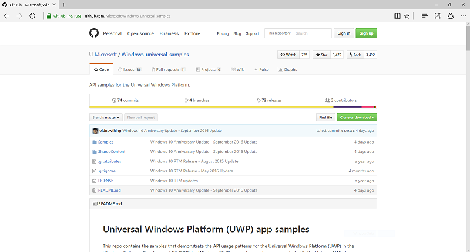

# Get UWP app samples

The Universal Windows Platform (UWP) app samples are available through repositories on GitHub. See [Samples](https://developer.microsoft.com/windows/samples "Dev Center samples") for a searchable, categorized list, or browse the
[Microsoft/Windows-universal-samples](https://github.com/Microsoft/Windows-universal-samples "Universal Windows Platform app samples GitHub repository")
repository, which contains samples that demonstrate all of the UWP features
and their API usage patterns.  

## Download the code

To download the samples, go to the
[repository](https://github.com/Microsoft/Windows-universal-samples "Universal Windows Platform app samples GitHub repository") and
select **Clone or download**, then **Download ZIP**. Or, just click
[here](https://github.com/Microsoft/Windows-universal-samples/archive/master.zip "Universal Windows Platform app samples zip file download").

The zip file will always have the latest samples. You don’t need
a GitHub account to download it. When an SDK update is released or if
you want to pick up any recent changes/additions, just check back for
the latest zip file.

> [!NOTE]
> The UWP samples require Visual Studio 2015 or later and the Windows SDK to open, build, and run. You can get a free copy of Visual
> Studio Community with support for building UWP apps
> [here](http://go.microsoft.com/fwlink/p/?LinkID=280676 "Windows development tools downloads").  
>
> Also, be sure
> to unzip the entire archive, and not just individual
> samples. The samples all depend on the SharedContent folder in the
> archive. The UWP feature samples use Linked files in Visual Studio to
> reduce duplication of common files, including sample template files
> and image assets. These common files are stored in the SharedContent
> folder at the root of the repository, and are referred to in the
> project files using links.

After you download the zip file, open the samples in Visual Studio:

1.  Before you unzip the archive, right-click it, select **Properties** > **Unblock** > **Apply**. Then,
    unzip the archive to a local folder on your machine.

    
2.  Within the samples folder, you’ll see a number of folders, each
    of which contains a UWP feature sample.

    

3.  Select a sample, such as Altimeter, and you’ll see multiple folders
    indicating the languages supported.

    

4.  Select the language you’d like to use, such as CS for C\#, and you’ll see a Visual Studio solution file,
    which you can open in Visual Studio.

    

## Give feedback, ask questions, and report issues

If you have problems or questions, just use the Issues tab on the repository to create a new
issue and we’ll do what we can to help.

