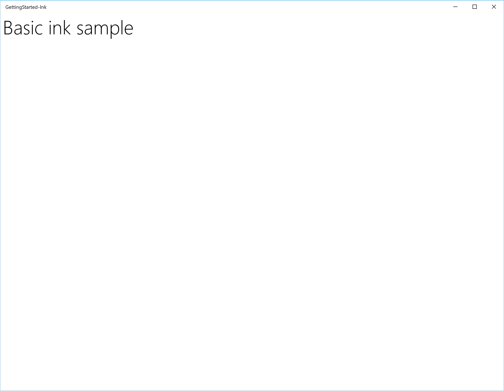
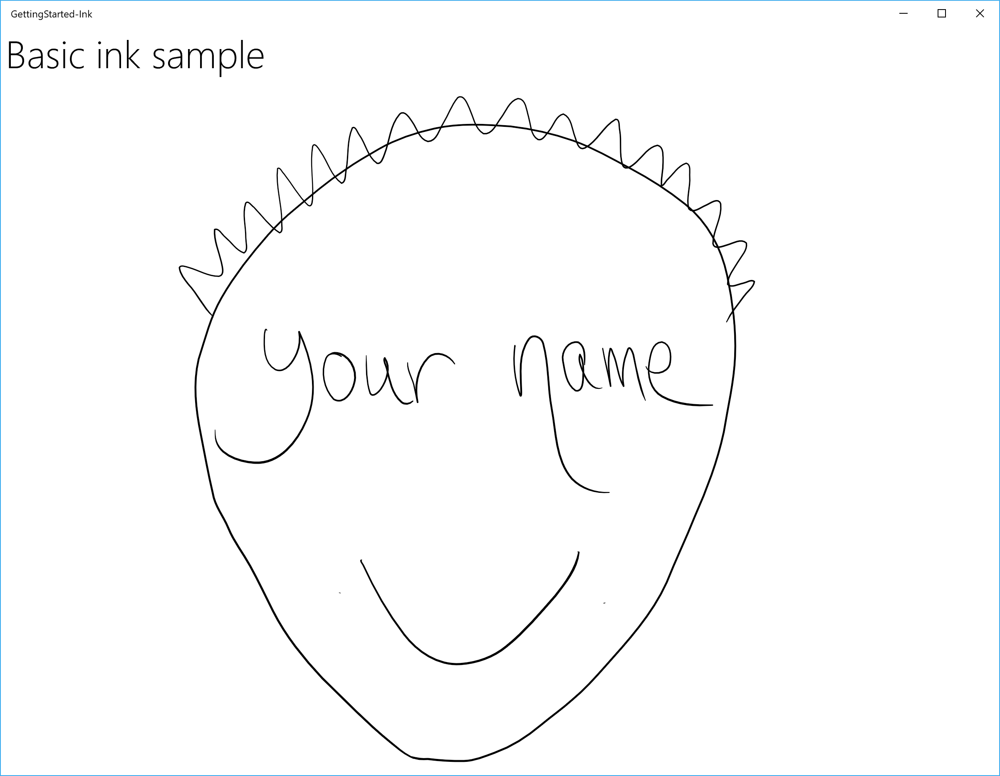
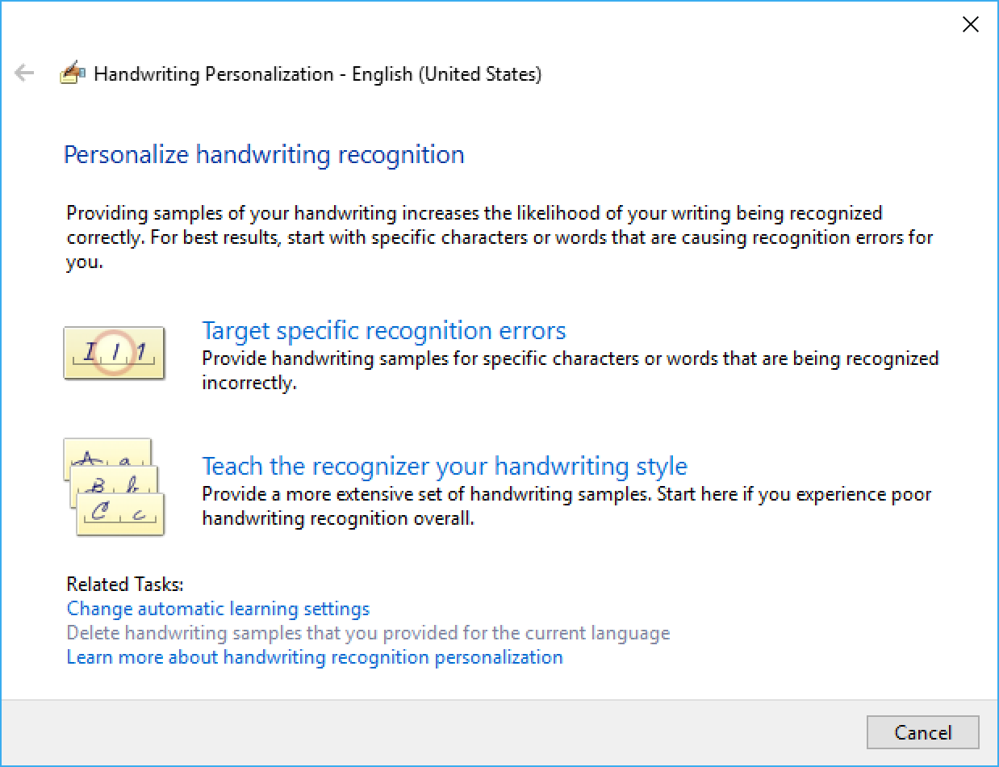
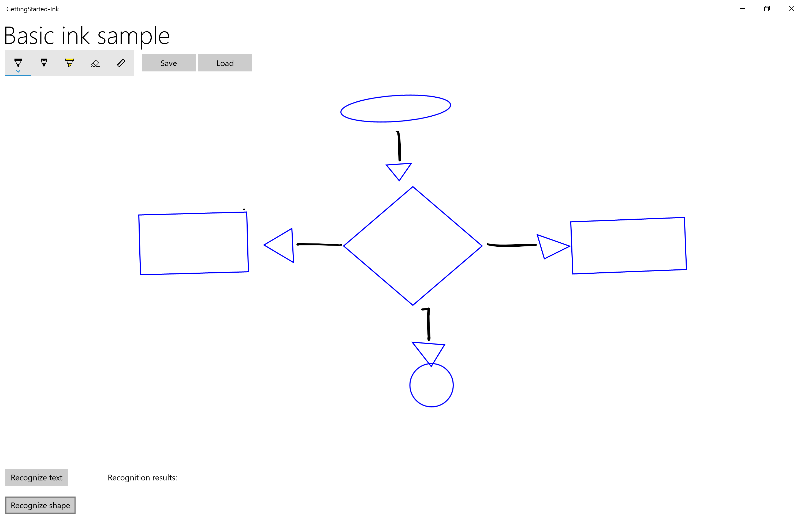

# Input: Support ink in your UWP app

* Karl Bridge

* 20 minute lab

With Windows Ink, you can provide your customers with the digital equivalent of almost any pen and paper experience imaginable, from quick handwritten notes and annotations to whiteboard demos to architectural and engineering drawings to personal masterpieces.

  
*Surface Pen* (available for purchase at the [Microsoft Store](https://aka.ms/purchasesurfacepen)).

In this topic, we step through how to create a basic UWP app that supports writing and drawing with Windows Ink. 

We focus on the following:
* Adding basic ink support
* Adding an ink toolbar
* Supporting handwriting recognition
* Supporting basic shape recognition
* Saving and loading ink

For more detail on implementing these features, see our [Pen interactions and Windows Ink in UWP apps](https://docs.microsoft.com/en-us/windows/uwp/input-and-devices/pen-and-stylus-interactions) topics)

## Prerequisites
To work with this project, you'll need the following:

* A Windows computer (or a virtual machine) running the current version of Windows 10
* [Visual Studio 2017 and the RS2 SDK](https://developer.microsoft.com/windows/downloads)
* **[OPTIONAL]** A digital pen and a computer with a display that supports input from that digital pen.  

   > [!NOTE] 
   > While Windows Ink can support drawing with a mouse and touch (we show how to do this in Step 3 of this getting started) for an optimal Windows Ink experience, we recommend that you have a digital pen and a computer with a display that supports input from that digital pen.

## Before you start
If you're new to UWP app development with Visual Studio, have a look through these topics for help getting your devleopment environment set up and for getting familiar with the tools and the platform:  
* [Get set up](https://docs.microsoft.com/en-us/windows/uwp/get-started/get-set-up)
* [Create a "Hello, world" app (XAML)](https://docs.microsoft.com/en-us/windows/uwp/get-started/create-a-hello-world-app-xaml-universal)

## Sample code
Throughout this step by step, we use a sample ink app to demonstrate the concepts and functionality discussed.

Download this Visual Studio sample and source code from [GitHub](https://github.com/) at [windows-appsample-get-started-ink sample](https://aka.ms/appsample-ink):

1. Select the green **Clone or download** button  

2. If you have a GitHub account, you can clone the repo to your local machine by choosing **Open in Visual Studio** 
3. If you don't have a GitHub account, or you just want a local copy of the project, choose **Download ZIP** (you'll have to check back regularly to download the latest updates)

> [!IMPORTANT]
> Most of the code in the sample is commented out. As we go through each step, you'll be asked to uncomment various sections of the code. In Visual Studio, just highlight the lines of code, and press CTRL-K and then CTRL-U.

## Components of the Windows Ink platform

The following objects provide the bulk of the inking experience for UWP apps.

| Component | Description |
| --- | --- |
| [**InkCanvas**](https://msdn.microsoft.com/library/windows/apps/dn858535) | A XAML UI platform control that, by default, receives and displays all input from a pen as either an ink stroke or an erase stroke. |
| [**InkPresenter**](https://msdn.microsoft.com/library/windows/apps/dn922011) | A code-behind object, instantiated along with an [**InkCanvas**](https://msdn.microsoft.com/library/windows/apps/dn858535) control (exposed through the [**InkCanvas.InkPresenter**](https://msdn.microsoft.com/library/windows/apps/dn899081) property). This object provides all default inking functionality exposed by the **InkCanvas**, along with a comprehensive set of APIs for additional customization and personalization. |
| [**InkToolbar**](https://msdn.microsoft.com/library/windows/apps/windows.ui.xaml.controls.inktoolbar.aspx) | A XAML UI platform control containing a customizable and extensible collection of buttons that activate ink-related features in an associated InkCanvas. |
| [**IInkD2DRenderer**](https://msdn.microsoft.com/library/mt147263)<br/>We do not cover this functionality here, for more information, see the [Complex ink sample](http://go.microsoft.com/fwlink/p/?LinkID=620314). | Enables the rendering of ink strokes onto the designated Direct2D device context of a Universal Windows app, instead of the default [**InkCanvas**](https://msdn.microsoft.com/library/windows/apps/dn858535) control. |

<!-- Update the title, then add numbered steps, code blocks, images, Play points, etc. -->
## Step 1: Get started

Once you've downloaded the ink sample app, test that the app runs:
1. Open the sample ink project with Visual Studio
2. Set the **Solution Platforms** dropdown to a non-ARM selection
3. Press **F5** to compile, deploy, and run 

   > [!NOTE]
   > Alternatively, you can select the **Debug > Start debugging** menu item, or select the **Local Machine** Run button shown here:
   > 

The app window should launch, and after a splash screen is displayed for a few seconds, the initial app screen (shown here) should be displayed:



Ok, we now have the basic UWP app used throughout the rest of this topic. In the following steps, we add our ink functionality.

## Step 2: Basic inking with InkCanvas

If you're impatient, you've probably already noticed that the app, in it's initial form, doesn't let you draw anything with the pen (although you can use the pen as a standard pointer device to interact with the app). 

We fix that little shortcoming in this step.

To add basic inking functionality, just place an [**InkCanvas**](https://msdn.microsoft.com/library/windows/apps/dn858535) UWP platform control on the appropriate page in your app.

> [!NOTE]
> An InkCanvas has default Height and Width properties of zero, unless it is the child of an element that automatically sizes its child elements. 

### In the sample:
1. Open the MainPage.xaml.cs file
2. Find the code marked with the title of this step ("// Step 2: Basic inking with InkCanvas")
3. Uncomment the following lines (these references are required for the functionality used in the subsequent steps):  

``` csharp
    using Windows.UI.Input.Inking;
    using Windows.UI.Input.Inking.Analysis;
    using Windows.UI.Xaml.Shapes;
    using Windows.Storage.Streams;
```

4. Open the MainPage.xaml file
5. Find the code marked with the title of this step ("\<!-- Step 2: Basic inking with InkCanvas -->")
6. Uncomment the following line:  

``` xaml
    <InkCanvas x:Name="inkCanvas" />
```

That's it! 

Now run the app again and scribble, write your name or, if you're holding a mirror (or have a very good memory), draw your self portrait.



## Step 3: Inking with touch and mouse

You'll notice that, by default, ink is supported for pen input only. If you try to write or draw with your finger, your mouse, or your touchpad, you'll be disappointed.

To turn that frown upside down, you need to add a second line of code. This time in the code-behind for the XAML file in which you declared your InkCanvas. 

In this step, we introduce the InkPresenter object, which is used for finer-grained management of the input, processing, and rendering of ink input (standard and modified) on your InkCanvas.

> [!NOTE]
> Standard ink input (pen tip or eraser tip/button) is not modified with a secondary affordance, such as a pen barrel button, right mouse button, or similar. 

To enable mouse and touch inking, set the InputDeviceTypes property of the InkPresenter to the desired combination of CoreInputDeviceTypes values.

### In the sample:
1. Open the MainPage.xaml.cs file
2. Find the code marked with the title of this step ("// Step 3: Inking with touch and mouse")
3. Uncomment the following line:  

``` csharp
    inkCanvas.InkPresenter.InputDeviceTypes =
        Windows.UI.Core.CoreInputDeviceTypes.Mouse | 
        Windows.UI.Core.CoreInputDeviceTypes.Touch | 
        Windows.UI.Core.CoreInputDeviceTypes.Pen;
```

Run the app again and you'll find all your finger-painting-on-a-computer-screen dreams have come true!

> [!NOTE]
> When specifying inut device types, you must indicate support for each specific input type (including pen), as setting this property overrides the default InkCanvas setting.

## Step 4: Add an ink toolbar

The InkToolbar is a UWP platform control that provides a customizable and extensible collection of buttons for activating ink-related features. 

By default, the InkToolbar includes a basic set of buttons that let users quickly select between a pen, a pencil, a highlighter, or an eraser, all of which can be used in conjunction with a stencil (ruler or protractor). The pen, pencil, and highlighter buttons each also provide a flyout for selecting ink color and stroke size.

To add a default InkToolbar to an inking app, just place it on the same page as your InkCanvas and associate the two controls.

### In the sample:
1. Open the MainPage.xaml file
2. Find the code marked with the title of this step ("\<!-- Step 4: Add an ink toolbar -->")
3. Uncomment the following lines:  

``` xaml
    <InkToolbar x:Name="inkToolbar" 
                        VerticalAlignment="Top" 
                        Margin="10,0,10,0"
                        TargetInkCanvas="{x:Bind inkCanvas}">
    </InkToolbar>
```

> [!NOTE]
> To keep the UI and code as uncluttered and simple as possible, we use a basic Grid layout and declare the InkToolbar after the InkCanvas in a grid row. If declared before the InkCanvas, the InkToolbar is rendered first, below the canvas and inaccessible to the user. 

Now run the app again to see the InkToolbar and try out some of the tools.


### Challenge: Add a custom button
<table class="wdg-noborder">
<tr>
 <td width=125></td>
    <td width=500><h3>Challenge</h3><p><!--TO-DO - Describe a harder task to solve on their own: -->
Here's an example of a custom InkToolbar (from Sketchpad in the Windows Ink Workspace):


See [Add an InkToolbar to a Universal Windows Platform (UWP) inking app](https://docs.microsoft.com/en-us/windows/uwp/input-and-devices/ink-toolbar) for more details on customizing an InkToolbar.

</tr>
</table>

## Step 5: Handwriting recognition

Now that you can write and draw in your app, let's try to do something useful with those scribbles.

In this step, we use the handwriting recognition features of Windows Ink to try to decipher what you've written.

> [!NOTE]
> Handwriting recognition can be improved through the **Pen & Windows Ink** settings:
> - Open the Start menu and select **Settings**
> - From the Settings screen select **Devices > Pen & Windows Ink**
> 
> - Select **Get to know my handwriting** to open the Handwriting Personalization dialog
> 

### In the sample:
1. Open the MainPage.xaml file
2. Find the code marked with the title of this step ("\<!-- Step 5: Handwriting recognition -->")
3. Uncomment the following lines:  

``` xaml
    <Button x:Name="recognizeText" 
            Content="Recognize text"  
            Grid.Row="0" Grid.Column="0"
            Margin="10,10,10,10"
            Click="recognizeText_ClickAsync"/>
    <TextBlock x:Name="recognitionResult" 
                Text="Recognition results: "
                VerticalAlignment="Center" 
                Grid.Row="0" Grid.Column="1"
                Margin="50,0,0,0" />
```

4. Open the MainPage.xaml.cs file
5. Find the code marked with the title of this step ("Step 5: Handwriting recognition")
6. Uncomment the following lines:  

- These are the global variables required for this step

``` csharp
    InkAnalyzer analyzerText = new InkAnalyzer();
    IReadOnlyList<InkStroke> strokesText = null;
    InkAnalysisResult resultText = null;
    IReadOnlyList<IInkAnalysisNode> words = null;
```

- This is the handler for the "Recognize text" button, where we do the recognition processing

``` csharp
    private async void recognizeText_ClickAsync(object sender, RoutedEventArgs e)
    {
        strokesText = inkCanvas.InkPresenter.StrokeContainer.GetStrokes();
        // Ensure an ink stroke is present.
        if (strokesText.Count > 0)
        {
            analyzerText.AddDataForStrokes(strokesText);

            resultText = await analyzerText.AnalyzeAsync();

            if (resultText.Status == InkAnalysisStatus.Updated)
            {
                words = analyzerText.AnalysisRoot.FindNodes(InkAnalysisNodeKind.InkWord);
                foreach (var word in words)
                {
                    InkAnalysisInkWord concreteWord = (InkAnalysisInkWord)word;
                    foreach (string s in concreteWord.TextAlternates)
                    {
                        recognitionResult.Text += s;
                    }
                }
            }
            analyzerText.ClearDataForAllStrokes();
        }
    }
```

7. Run the app again, write something, and click the "Recognize text" button
8. The results of the recognition are displayed beside the button

### Challenge 1: International recognition
<table class="wdg-noborder">
<tr>
 <td width=125></td>
    <td width=500><h3>Challenge</h3><p><!--TO-DO - Describe a harder task to solve on their own: -->
Windows Ink supports text recognition for many of the of the languages supported by Windows. Each language pack inlcudes a handwriting recognition engine that can be installed with the language pack. 

You can query the installed handwriting recognition engines and use that info to target those languages.

See [Recognize Windows Ink strokes as text](https://docs.microsoft.com/en-us/windows/uwp/input-and-devices/convert-ink-to-text) for more details on international handwriting recognition.
</tr>
</table>


### Challenge 2: Dynamic recognition
<table class="wdg-noborder">
<tr>
 <td width=125></td>
    <td width=500><h3>Challenge</h3><p><!--TO-DO - Describe a harder task to solve on their own: -->
For this walkthrough, we require that a button be pressed to initiate recognition. You can also perform dynamic recognition using a basic timing function.

See [Recognize Windows Ink strokes as text](https://docs.microsoft.com/en-us/windows/uwp/input-and-devices/convert-ink-to-text) for more details on dynamic recognition.
</tr>
</table>

## Step 6: Shape recognition

Ok, so now you can convert your handwritten notes into something a little more legible, but what about those shaky, caffeinated doodles from your morning Flowcharters Anonymous meeting?

Using ink analysis, your app can also recognize a set of core shapes, including:
- Circle
- Diamond
- Drawing
- Ellipse
- EquilateralTriangle
- Hexagon
- IsoscelesTriangle
- Parallelogram
- Pentagon
- Quadrilateral
- Rectangle
- RightTriangle
- Square
- Trapezoid
- Triangle

In this step, we use the shape recognition features of Windows Ink to try to clean up your doodles.

For this example, we don't attempt to redraw ink strokes (although that is possible). Instead, we add a standard canvas under the InkCanvas where we draw equivalent Ellipse or Polygon objects derived from the original ink. We then delete the corresponding ink strokes.

### In the sample:
1. Open the MainPage.xaml file
2. Find the code marked with the title of this step ("\<!-- Step 6: Shape recognition -->")
3. Uncomment the following lines:  

``` xaml
   <Canvas x:Name="canvas" />

   and

    <Button Grid.Row="1" x:Name="recognizeShape" Click="recognizeShape_ClickAsync"
        Content="Recognize shape" 
        Margin="10,10,10,10" />
```

4. Open the MainPage.xaml.cs file
5. Find the code marked with the title of this step ("// Step 6: Shape recognition")
6. Uncomment the following lines:  

``` csharp
    private async void recognizeShape_ClickAsync(object sender, RoutedEventArgs e)
    {
        ...
    }

    private void DrawEllipse(InkAnalysisInkDrawing shape)
    {
        ...
    }

    private void DrawPolygon(InkAnalysisInkDrawing shape)
    {
        ...
    }
```

7. Run the app, draw some shapes, and click the "Recognize shape" button

Here's an example of a rudimentary flowchart from a digital napkin:


Here's the same flowchart after shape recognition:




## Step 7: Saving and loading ink

So, you're done doodling, you like what you see, but think you might like to tweak a couple of things later? You can save your ink strokes to an Ink Serialized Format (ISF) file and load them for editing whenever the inspiration strikes. 

The ISF file is a basic GIF image that inlcudes additional metadata describing ink stroke properties and behaviors. Apps that are not ink-enabled can ignore the extra metadata and still load the basic GIF image (including alpha-channel background transparency).

In this step, we hook up the Save and Load buttons located beside the ink toolbar.

### In the sample:
1. Open the MainPage.xaml file
2. Find the code marked with the title of this step ("\<!-- Step 7: Saving and loading ink -->")
3. Uncomment the following lines: 

``` xaml
    <Button x:Name="buttonSave" 
            Content="Save" 
            Click="buttonSave_ClickAsync"
            Width="100"
            Margin="5,0,0,0"/>
    <Button x:Name="buttonLoad" 
            Content="Load"  
            Click="buttonLoad_ClickAsync"
            Width="100"
            Margin="5,0,0,0"/>
```

4. Open the MainPage.xaml.cs file
5. Find the code marked with the title of this step ("// Step 7: Saving and loading ink")
6. Uncomment the following lines:  

``` csharp
    private async void buttonSave_ClickAsync(object sender, RoutedEventArgs e)
    {
        ...
    }

    private async void buttonLoad_ClickAsync(object sender, RoutedEventArgs e)
    {
        ...
    }
```

7. Run the app and draw something
8. Select the "Save" button and save your drawing
9. Erase the ink or restart the app
10. Select the "Load" button and open the ink file you just saved

### Challenge: Use the clipboard to copy and paste ink strokes 
<table class="wdg-noborder">
<tr>
 <td width=125></td>
    <td width=500><h3>Challenge</h3><p><!--TO-DO - Describe a harder task to solve on their own: -->
Windows ink also supports copying and pasting ink strokes to and from the clipboard.

See [Store and retrieve Windows Ink stroke data](https://docs.microsoft.com/en-us/windows/uwp/input-and-devices/save-and-load-ink) for more details on using the clipboard with ink.
</tr>
</table>

## Summary

Congratulations, you've completed the **Get Started Tutorial: Support ink in your UWP app**! We showed you the basic code required for supporting ink in your UWP apps, and how to provide some of the richer user experiences supported by the Windows Ink platform.

## Find a problem?
[Capture it](report-a-problem.md), so we can fix it later.
