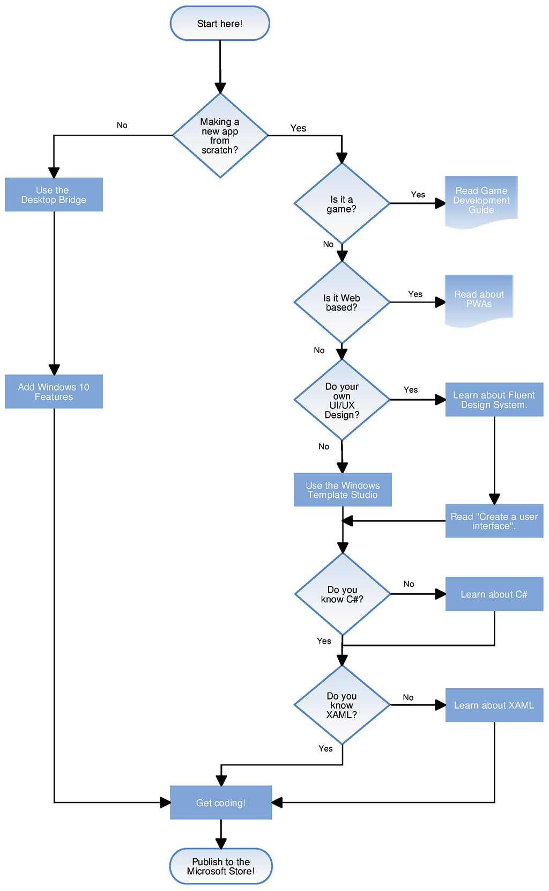

# What's next?

Ready to write Windows 10 apps? Here's an overview of the process.

* [Game Development Guide](https://docs.microsoft.com/windows/uwp/gaming/e2e)
* [Desktop Bridge](https://docs.microsoft.com/windows/uwp/porting/desktop-to-uwp-root)
* [Progressive Web Apps](https://blogs.windows.com/msedgedev/2018/02/06/welcoming-progressive-web-apps-edge-windows-10/)
* [Fluent Design System](https://docs.microsoft.com/windows/uwp/design/fluent-design-system/)
* [Create a user interface](https://docs.microsoft.com/windows/uwp/design/basics/xaml-basics-ui)
* [Windows Template Studio](https://blogs.windows.com/buildingapps/2017/05/16/announcing-windows-template-studio/#s4qWPf4JrolMComv.97)
* [C# Reference](https://msdn.microsoft.com/library/618ayhy6(VS.110).aspx)
* [XAML overview](https://docs.microsoft.com/en-us/windows/uwp/xaml-platform/xaml-overview)
* [Publish Windows apps](https://docs.microsoft.com/en-us/windows/uwp/publish/)

## Other resources

 If you're completely new to the UWP platform, try some of the <a href="https://channel9.msdn.com/">Channel 9</a> videos and <a href="https://mva.microsoft.com">Microsoft Virtual Academy</a> and [LinkedIn Learning](https://www.linkedin.com/topic/windows-programming) courses. If you are already familiar with Windows development, you can start reading through the topics below, or go straight to [downloading some samples](https://msdn.microsoft.com/windows/uwp/get-started/get-uwp-app-samples).

<table class="wdg-noborder">
<tr>
    <h2>UWP and the UWP app Lifecycle</h2>
How does an app start, what happens when you start another one? Here’s the story.
 <ul>
    <li><a href="https://msdn.microsoft.com/windows/uwp/get-started/universal-application-platform-guide">Guide to Universal Windows Platform (UWP) apps</a></li>
    <li><a href="https://msdn.microsoft.com/windows/uwp/launch-resume/app-lifecycle">UWP app lifecycle</a></li>
    <li><a href="https://developer.microsoft.com/windows/windows-10-for-developers">What's cool in Windows 10</a></ul>  
</tr>
<tr>
    <h2>UX and UI</h2>
What controls do you have at your disposal, and how can they be used? These topics explain how controls and code work together, and how you can customize them to suit the look of your app.
 <ul>
    <li><a href="https://developer.microsoft.com/windows/design">Design and UI</a></li>
    <li><a href="https://msdn.microsoft.com/windows/uwp/layout/layouts-with-xaml">Define page layouts with XAML</a></li>
    <li><a href="https://msdn.microsoft.com/windows/uwp/controls-and-patterns/controls-by-function">Controls by function</a></li>
      <li><a href="https://msdn.microsoft.com/windows/uwp/controls-and-patterns/controls-and-events-intro">Intro to controls and patterns</a></li>
     <li><a href="https://msdn.microsoft.com/windows/uwp/controls-and-patterns/styling-controls">Styling controls</a></li>
      <li><a href="https://msdn.microsoft.com/windows/uwp/layout/screen-sizes-and-breakpoints-for-responsive-design">Screen sizes and break points for responsive design</a></li>
      <li><a href="https://developer.microsoft.com/windows/projects/campaigns/welcome-toolbox">Use the UWP Community Toolkit for a selection of prebuilt controls and patterns</a></li>
    </ul>  
</tr>
<tr>
    <h2>Data and Services</h2>
Learn about data binding, which lets your code automatically populate lists and grids. Discover how to link to external resources to get data into your apps.
 <ul>
    <li><a href="https://msdn.microsoft.com/windows/uwp/data-binding/index">Data binding</a></li>
    <li><a href="https://msdn.microsoft.com/windows/uwp/controls-and-patterns/listview-and-gridview">ListViews, GridViews and data binding</a></li>
     <li><a href="https://msdn.microsoft.com/windows/uwp/data-access/index">Data access</a></li>
    </ul> 
</tr>
<tr>
    <h2>Publishing</h2>
Share your work with the world, make money. We’ll walk you through the process of getting your app onto the store.
 <ul>
    <li><a href="https://msdn.microsoft.com/windows/uwp/publish/index">Publish Windows apps</a></li>
    <li><a href="https://msdn.microsoft.com/windows/uwp/packaging/index">Packaging apps</a></li>
    </ul>  
</tr>

</table>

## Windows Developer Blog

The [Windows Developer Blog](https://blogs.windows.com/buildingapps) includes regular postings on the latest in coding techniques, project ideas, and tools. Here are some you might find useful as you explore Windows development.

* [Animations with the Visual layer](https://blogs.windows.com/buildingapps/2016/09/16/animations-with-the-visual-layer/#JM2XkQcL7MRSXe3X.97)
* [Interop between XAML and the Visual layer](https://blogs.windows.com/buildingapps/2016/08/26/interop-between-xaml-and-the-visual-layer/#ue6O7MWpqrVFE81K.97)
* [Creating beautiful effects for UWP](https://blogs.windows.com/buildingapps/2016/09/12/creating-beautiful-effects-for-uwp/#85jsfw6PFXX825rR.97)
* [Beautiful apps made possible and easy with Windows.UI](https://blogs.windows.com/buildingapps/2016/08/23/beautiful-apps-made-possible-and-easy-with-windows-ui/#GBREkRSBwsRvi2uL.97)
* [Polishing your app with animation and audio cues](https://blogs.windows.com/buildingapps/2016/08/09/polishing-your-app-with-animations-and-audio-cues/#hziKxt2xPwUE1oqU.97) 
* [Adding color to your design](https://blogs.windows.com/buildingapps/2016/07/28/adding-color-to-your-design/#HcPqMlfPsuKETOIo.97)

