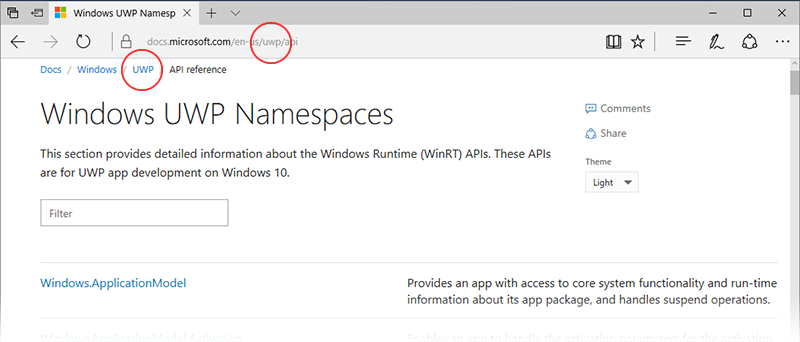

# What's next?

So you want to write an app and publish it to the Microsoft Store: where do you start? If you're completely new to the UWP platform, try some of the <a href="https://channel9.msdn.com/">Channel 9</a> videos and <a href="https://mva.microsoft.com">Microsoft Virtual Academy</a> and [LinkedIn Learning](https://www.linkedin.com/topic/windows-programming) courses. If you are already familiar with Windows development, you can start reading through the topics below, or go straight to [downloading some samples](https://msdn.microsoft.com/windows/uwp/get-started/get-uwp-app-samples).

There are many tools and frameworks available to help you write apps, and many support cross-platform development. For example, if you want to write 2D games, you might want to look at <a href="http://www.monogame.net">Monogame</a> or some of the many [JavaScript/HTML frameworks](https://html5gameengine.com/). For 3D games, there's <a href="http://www.unity3d.com">Unity</a>, and don't forget <a href="http://www.xamarin.com">Xamarin</a> if your focus is mobile devices.

If you want to get started writing something that isn't a game, our recommendation is that you look through the UWP topics to get a feel for the platform, and then investigate creating your user interface by using, and then customizing, XAML controls. 
You'll use XAML to design your app ([here's a tutorial](../design/layout/grid-tutorial.md) that will walk you through it), but XAML's main strength is the use of *data binding* which couples the controls to the information your app wants to display: if you are new to the Windows platform, this will be an important concept to understand.

<table class="wdg-noborder">
<tr>
    <h2>UWP and the UWP app Lifecycle</h2>
How does an app start, what happens when you start another one? Here’s the story.
 <ul>
    <li><a href="https://msdn.microsoft.com/windows/uwp/get-started/universal-application-platform-guide">Guide to Universal Windows Platform (UWP) apps</a></li>
    <li><a href="https://msdn.microsoft.com/windows/uwp/launch-resume/app-lifecycle">UWP app lifecycle</a></li>
    <li><a href="https://developer.microsoft.com/windows/windows-10-for-developers">What's cool in Windows 10</a></ul>  
</tr>
<tr>
    <h2>UX and UI</h2>
What controls do you have at your disposal, and how can they be used? These topics explain how controls and code work together, and how you can customize them to suit the look of your app.
 <ul>
    <li><a href="https://developer.microsoft.com/windows/design">Design and UI</a></li>
    <li><a href="https://msdn.microsoft.com/windows/uwp/layout/layouts-with-xaml">Define page layouts with XAML</a></li>
    <li><a href="https://msdn.microsoft.com/windows/uwp/controls-and-patterns/controls-by-function">Controls by function</a></li>
      <li><a href="https://msdn.microsoft.com/windows/uwp/controls-and-patterns/controls-and-events-intro">Intro to controls and patterns</a></li>
     <li><a href="https://msdn.microsoft.com/windows/uwp/controls-and-patterns/styling-controls">Styling controls</a></li>
      <li><a href="https://msdn.microsoft.com/windows/uwp/layout/screen-sizes-and-breakpoints-for-responsive-design">Screen sizes and break points for responsive design</a></li>
      <li><a href="https://developer.microsoft.com/windows/projects/campaigns/welcome-toolbox">Use the UWP Community Toolkit for a selection of prebuilt controls and patterns</a></li>
    </ul>  
</tr>
<tr>
    <h2>Data and Services</h2>
Learn about data binding, which lets your code automatically populate lists and grids. Discover how to link to external resources to get data into your apps.
 <ul>
    <li><a href="https://msdn.microsoft.com/windows/uwp/data-binding/index">Data binding</a></li>
    <li><a href="https://msdn.microsoft.com/windows/uwp/controls-and-patterns/listview-and-gridview">ListViews, GridViews and data binding</a></li>
     <li><a href="https://msdn.microsoft.com/windows/uwp/data-access/index">Data access</a></li>
    </ul> 
</tr>
<tr>
    <h2>Publishing</h2>
Share your work with the world, make money. We’ll walk you through the process of getting your app onto the store.
 <ul>
    <li><a href="https://msdn.microsoft.com/windows/uwp/publish/index">Publish Windows apps</a></li>
    <li><a href="https://msdn.microsoft.com/windows/uwp/packaging/index">Packaging apps</a></li>
    </ul>  
</tr>
<tr>
<h2>Other resources</h2>
Samples, tutorials, videos, other tools and SDKs. Take it to the next level.

<ul>
<li><a href="https://developer.microsoft.com/windows/develop">How-to articles</a></li>
<li><a href="https://developer.microsoft.com/windows/samples">Code samples</a></li>
<li><a href="https://msdn.microsoft.com/library/618ayhy6(VS.110).aspx">C# reference</a></li>
<li><a href="https://msdn.microsoft.com/library/windows/apps/bg124285.aspx">API Reference</a></li>
<li><a href="https://msdn.microsoft.com/windows/uwp/xbox-apps/index">Writing apps for Xbox One</a></li>
<li><a href="https://www.microsoft.com/microsoft-hololens/developers">Developing for HoloLens</a></li>
<li><a href="https://msdn.microsoft.com/windows/uwp/porting/index">Porting apps to Windows 10</a></li>
<li><a href="https://msdn.microsoft.com/windows/uwp/enterprise/index">Writing apps for the Enterprise</a></li>
<li><a href="https://blogs.windows.com/buildingapps/2016/08/17/introducing-the-uwp-community-toolkit/#D1IfVxCZMQGZqlc7.97">The UWP Community Toolkit</a></li></ul>  
</tr>
</table>

## Windows Developer Blog

The [Windows Developer Blog](https://blogs.windows.com/buildingapps) includes regular postings on the latest in coding techniques, project ideas, and tools. Here are some you might find useful as you explore Windows development.

* [Animations with the Visual layer](https://blogs.windows.com/buildingapps/2016/09/16/animations-with-the-visual-layer/#JM2XkQcL7MRSXe3X.97)
* [Interop between XAML and the Visual layer](https://blogs.windows.com/buildingapps/2016/08/26/interop-between-xaml-and-the-visual-layer/#ue6O7MWpqrVFE81K.97)
* [Creating beautiful effects for UWP](https://blogs.windows.com/buildingapps/2016/09/12/creating-beautiful-effects-for-uwp/#85jsfw6PFXX825rR.97)
* [Beautiful apps made possible and easy with Windows.UI](https://blogs.windows.com/buildingapps/2016/08/23/beautiful-apps-made-possible-and-easy-with-windows-ui/#GBREkRSBwsRvi2uL.97)
* [Polishing your app with animation and audio cues](https://blogs.windows.com/buildingapps/2016/08/09/polishing-your-app-with-animations-and-audio-cues/#hziKxt2xPwUE1oqU.97) 
* [Adding color to your design](https://blogs.windows.com/buildingapps/2016/07/28/adding-color-to-your-design/#HcPqMlfPsuKETOIo.97)

## Finding help in the Dev Center

The [docs.microsoft.com](http://docs.microsoft.com) site contains a multitude of documentation for many different tools, frameworks and platforms. When you are browsing for topics and samples, you should make sure you are reading UWP specific content. 
You'll find the UWP reference starts at the [Windows Dev Center](https://developer.microsoft.com/windows/apps), and the API reference you need is at [Develop UWP apps](https://docs.microsoft.com/uwp/api/).
When reading content that is specifically for UWP, the URL path will contain **uwp**, and so will the path displayed at the top of the page, like this:

When using a search engine, appending "Windows app development" to your search string will more often than not lead you to UWP content.

## Important Dev Center topics

Here is a list of the key sections of content in the DevCenter. 

<table style="width:100%">
<colgroup>
<col width="20%" />
<col width="80%" />
</colgroup>

<tbody>

<tr class="even" style="background-color: #f2f2f2">
<td align="left"><strong>Design</strong></td>
<td align="left"><a href="http://go.microsoft.com/fwlink/p/?LinkId=533896">Design guidelines for UWP apps.</a></td>
</tr>

<tr class="odd" style="background-color: #ffffff">
<td align="left"><strong>Develop</strong></td>
<td align="left"><a href="http://go.microsoft.com/fwlink/p/?LinkId=529575">Detailed info and coding examples for the many of the features available to your app.</a></td>
</tr>
<tr class="even" style="background-color: #f2f2f2">
<td align="left"><strong>Language reference</strong></td>
<td align="left"><a href="https://msdn.microsoft.com/library/windows/apps/bg124285.aspx">The programming languages available for UWP development.</a></td>
</tr>
<tr class="odd" style="background-color: #ffffff">
<td align="left"><strong>Games</strong></td>
<td align="left"><a href="http://go.microsoft.com/fwlink/p/?LinkId=534184">Developing games with DirectX.</a></td>
</tr>
<tr class="even" style="background-color: #f2f2f2">
<td align="left"><strong>Internet of Things</strong></td>
<td align="left"><a href="http://go.microsoft.com/fwlink/p/?LinkId=534186">Building your own connected devices.</a></td>
</tr>
<tr class="odd" style="background-color: #ffffff">
<td align="left"><strong>Porting</strong></td>
<td align="left"><a href="https://msdn.microsoft.com/library/windows/apps/Mt238321">Leverage your Android and iOS skills to quickly make UWP apps.</a></td>
</tr>
<tr class="even" style="background-color: #f2f2f2">
<td align="left"><strong>Windows Bridges</strong></td>
<td align="left"><a href="https://developer.microsoft.com/windows/bridges">Tools for updating older apps and iOS apps to UWP.</a></td>
</tr>
<tr class="odd" style="background-color: #ffffff">
<td align="left"><strong>Xamarin</strong></td>
<td align="left"><a href="https://www.xamarin.com">Use C# to write apps for iOS, Android and Windows 10.</a></td>
</tr>
<tr class="even" style="background-color: #f2f2f2">
<td align="left"><strong>Task snippets</strong></td>
<td align="left"><a href="https://github.com/Microsoft/Windows-task-snippets">Ready-to-use code that accomplish small but useful tasks.</a></td>
</tr>
<tr class="odd" style="background-color: #ffffff">
<td align="left"><strong>How-to topics</strong></td>
<td align="left"><a href="https://developer.microsoft.com/windows/develop">Sample code covering specific UWP features.</a></td>
</tr>
<tr class="even" style="background-color: #f2f2f2">
<td align="left"><strong>Hardware</strong></td>
<td align="left"><a href="https://www.microsoftstore.com/store/msusa/en_US/cat/Developer/categoryID.69418300?icid=en_US_Store_UH_BusEd_Dev">Hardware for developers from the Microsoft Store.</a></td>
</tr>
</table>

