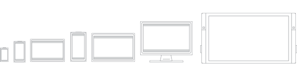

# What's a Universal Windows Platform (UWP) app?

A UWP app is:

- Secure: UWP apps declare which device resources and data they access. The user must authorize that access.
- Able to use a common API on all devices that run Windows 10.
- Able to use device specific capabilities and adapt the UI to different device screen sizes, resolutions, and DPI.
- Available from the Microsoft Store on all devices (or only those that you specify) that run on Windows 10. The Microsoft Store provides multiple ways to make money on your app.
- Able to be installed and uninstalled without risk to the machine or incurring "machine rot".
- Engaging: use live tiles, push notifications, and user activities that interact with Windows Timeline and Cortana's Pick Up Where I Left Off, to engage users.
- Programmable in C#, C++, Visual Basic, and Javascript. For UI, use XAML, HTML, or DirectX.

Let's look at these in more detail.

## Secure

UWP apps declare in their manifest the device capabilities they need such as access to the microphone, location, Webcam, USB devices, files, and so on. The user must acknowledge and authorize that access before the app is granted the capability.

## A common API surface across all devices

Windows 10 introduces the Universal Windows Platform (UWP), which provides a common app platform on every device that runs Windows 10. The UWP core APIs are the same on all Windows devices. If your app only uses the core APIs, it will run on any Windows 10 device no matter whether you are targeting a desktop PC, Xbox, Mixed-reality headset, and so on.

A UWP app written in C++ /WinRT or C++ /CX has access to the Win32 APIs that are part of the UWP. These Win32 APIs are implemented by all Windows 10 devices.

## Extension SDKs expose the unique capabilities of specific device types

If you target the universal APIs, your app can run on all devices that run Windows 10. But if you want your UWP app to take advantage of device specific APIs, you can.

Extension SDKs let you call specialized APIs for different devices. For example, if your UWP app targets an IoT device, you can add the IoT extension SDK to your project to target features specific to IoT devices. For more information about adding extension SDKs, see the **Extension SDKs** section in [Device families overview](https://docs.microsoft.com/uwp/extension-sdks/device-families-overview#extension-sdks).

You can write your app so that you expect it to run only on a particular type of device, and then limit its distribution from the Microsoft Store to just that type of device. Or, you can conditionally test for the presence of an API at runtime and adapt your app's behavior accordingly. For more information, see the **Writing Code** section in [Device families overview](https://docs.microsoft.com/uwp/extension-sdks/device-families-overview#writing-code). 

The following video provides a brief overview of device families and adaptive coding:
<iframe src="https://channel9.msdn.com/Blogs/One-Dev-Minute/Introduction-to-UWP-and-Device-Families/player" width="640" height="360" allowFullScreen frameBorder="0"></iframe>

## Adaptive controls and input

UI elements respond to the size and DPI of the screen the app is running on by adjusting their layout and scale. UWP apps work well with multiple types of input such as keyboard, mouse, touch, pen, and Xbox One controllers. If you need to further tailor your UI to a specific screen size or device, new layout panels and tooling help you design UI that can adapt to the different devices and form factors that your app may run on.

Windows helps you target your UI to multiple devices with the following features:

- Universal controls and layout panels help you to optimize your UI for the screen resolution of the device. For example, controls such as buttons and sliders automatically adapt to device screen size and DPI density. Layout panels help adjust the layout of content based on the size of the screen. Adaptive scaling adjusts to resolution and DPI differences across devices.
- Common input handling allows you to receive input through touch, a pen, a mouse, a keyboard, or a controller such as a Microsoft Xbox controller.
- Tooling that helps you to design UI that can adapt to different screen resolutions.

Some aspects of your app's UI will automatically adapt across devices. Your app's user-experience design, however, may need to adapt depending on the device the app is running on. For example, a photo app could adapt its UI when running on a small, handheld device to ensure that usage is ideal for single-handed use. When a photo app is running on a desktop computer, the UI should adapt to take advantage of the additional screen space.

## There's one store for all devices

A unified app store makes your app available on Windows 10 devices such as PC, tablet, Xbox, HoloLens, Surface Hub, and Internet of Things (IoT) devices. You can submit your app to the store and make it available to all types of devices, or only those you choose. You submit and manage all your apps for Windows devices in one place. Have a C++ desktop app that you want to modernize with UWP features and sell in the Microsoft store? That's okay, too.

UWP apps integrate with [Application Insights](http://azure.microsoft.com/services/application-insights/) for detailed telemetry and analytics—a crucial tool for understanding your users and improving your apps.

### Monetize your app

You can choose how you'll monetize your app. There are a number of ways to make money with your app. All you need to do is choose the one that works best for you, for example:

- A paid download is the simplest option. Just name the price.
- Trials let users try your app before buying it, providing easier discoverability and conversion than the more traditional "freemium" options.
- Sale prices to incentivize users.
- In-app purchases and ads are also available.

### Apps from the Microsoft Store provide a seamless install, uninstall, and upgrade experience

All UWP apps are distributed using a packaging system that protects the user, device, and system. Users never need regret installing an app because UWP apps can be uninstalled without leaving anything behind except the documents created with the app.

Apps can be deployed and updated seamlessly. App packaging can be modularized so that you can download content and extensions on demand.

## Deliver relevant, real-time info to your users to keep them coming back

There are a variety of ways to keep users engaged with your UWP app:

- Live tiles and lock screen tiles that show contextually relevant and timely info from your app at a glance.
- Push notifications that bring real-time alerts to your user’s attention.
- User Activities allow users to pick up where they left off in your app, even across devices.
- The Action Center organizes notifications from your app.
- Background execution and triggers bring your app into action when the user needs it.
- Your app can use voice and Bluetooth LE devices to help users interact with the world around them.
- Integrate Cortana to add voice command capability to your app.

##  Use a language you already know

UWP apps use the Windows Runtime, the native API provided by the operating system. This API is implemented in C++ and is supported in C#, Visual Basic, C++, and JavaScript. Some options for writing UWP apps include:

- XAML UI and C#, VB, or C++
- DirectX UI and C++
- JavaScript and HTML

## Links to help you get going

### Get set up

Check out [Get set up](get-set-up.md) to download the tools you need to start creating apps, and then [write your first app](your-first-app.md).

### Design your app

The Microsoft design system is named Fluent. The Fluent Design System is a set of UWP features combined with best practices for creating apps that perform beautifully on all types of Windows-powered devices. Fluent experiences adapt and feel natural on devices from tablets to laptops, from PCs to televisions, and on virtual reality devices. See [The Fluent Design System for UWP apps](https://docs.microsoft.com/windows/uwp/design/fluent-design-system) for an introduction to Fluent Design.

Good [design](http://go.microsoft.com/fwlink/?LinkId=258848) is the process of deciding how users will interact with your app, in addition to how it will look and function. User experience plays a huge part in determining how happy people will be with your app, so don't skimp on this step. [Design basics](https://dev.windows.com/design) introduces you to designing a Universal Windows app. See the [Introduction to Universal Windows Platform (UWP) apps for designers](https://msdn.microsoft.com/library/windows/apps/dn958439) for information on designing UWP apps that delight your users. Before you start coding, see the [device primer](../design/devices/index.md) to help you think through the interaction experience of using your app on all the different form factors you want to target.

In addition to interaction on different devices, [plan your app](https://msdn.microsoft.com/library/windows/apps/hh465427) to embrace the benefits of working across multiple devices. For example:

- Design your workflow using [Navigation design basics for UWP apps](https://msdn.microsoft.com/library/windows/apps/dn958438) to accommodate mobile, small-screen, and large-screen devices. [Lay out your user interface](https://msdn.microsoft.com/library/windows/apps/dn958435) to respond to different screen sizes and resolutions.

- Consider how you'll accommodate multiple kinds of input. See the [Guidelines for interactions](https://msdn.microsoft.com/library/windows/apps/dn611861) to learn how users can interact with your app by using [Cortana](https://msdn.microsoft.com/library/windows/apps/dn974233), [Speech](https://msdn.microsoft.com/library/windows/apps/dn596121), [Touch interactions](https://msdn.microsoft.com/library/windows/apps/hh465370), the [Touch keyboard](https://msdn.microsoft.com/library/windows/apps/hh972345) and more.  Or, see the [Guidelines for text and text input](https://msdn.microsoft.com/library/windows/apps/dn611864) for more traditional interaction experiences.

### Add services

- Use [cloud services](http://go.microsoft.com/fwlink/?LinkId=526377) to sync across devices.
- Learn how to [connect to web services](https://msdn.microsoft.com/library/windows/apps/xaml/hh761504) to support your app experience.
- Learn how to [Add Cortana to your app](https://mva.microsoft.com/training-courses/integrating-cortana-in-your-apps-8487?l=20D3s5Xz_5904984382) so that your app can respond to voice commands.
- Include [Push notifications](https://msdn.microsoft.com/library/windows/apps/mt187203) and [in-app purchases](https://msdn.microsoft.com/library/windows/apps/mt219684) in your planning. These features should work across devices.

### Submit your app to the store

The new unified Windows Dev Center dashboard lets you manage and submit all of your apps for Windows devices in one place. See [Using the unified Windows Dev Center dashboard](../publish/using-the-windows-dev-center-dashboard.md) to learn how to submit your apps for publication in the Microsoft Store.

New features simplify processes while giving you more control. You'll also find detailed [analytic reports](https://msdn.microsoft.com/library/windows/apps/mt148522) combined [payout details](https://msdn.microsoft.com/library/windows/apps/dn986925), ways to [promote your app and engage with your customers](https://msdn.microsoft.com/library/windows/apps/mt148526), and much more.

For more introductory material, see [An Introduction to Building Windows Apps for Windows 10 Devices](https://msdn.microsoft.com/magazine/dn973012.aspx)

### More advanced topics

- Learn how to use [User Activities](https://blogs.windows.com/buildingapps/2017/12/19/application-engagement-windows-timeline-user-activities/#tHuZ6tLPtCXqYKvw.97) so that user activity in your app appear in Windows Timeline and Cortana's Pick Up Where I Left Off feature.
- Learn how to use [Tiles, badges, and notifications for UWP apps](https://docs.microsoft.com/windows/uwp/design/shell/tiles-and-notifications/).
- For the full list of Win32 APIs available to UWP apps, see [API Sets for UWP apps](https://msdn.microsoft.com/library/windows/desktop/mt186421) and [Dlls for UWP apps](https://msdn.microsoft.com/library/windows/desktop/mt186422).
- See [Universal Windows apps in .NET](https://blogs.msdn.microsoft.com/dotnet/2015/07/30/universal-windows-apps-in-net) for an overview of writing .NET UWP apps.
- For a list of .NET types that you can use in a UWP app, see [.NET for UWP apps](https://msdn.microsoft.com/library/mt185501.aspx)
- [.NET Native - What it means for Universal Windows Platform (UWP) developers](https://blogs.windows.com/buildingapps/2015/08/20/net-native-what-it-means-for-universal-windows-platform-uwp-developers/#TYsD3tJuBJpK3Hc7.97)
- Learn how to add modern experiences for Windows 10 users to your existing desktop app and distribute it in the Microsoft Store with the [Desktop Bridge](https://developer.microsoft.com/windows/bridges/desktop).

## How the Universal Windows Platform relates to Windows Runtime APIs
If you're building a Universal Windows Platform (UWP) app, then you can get a lot of mileage and convenience out of treating the terms "Universal Windows Platform (UWP)" and "Windows Runtime (WinRT)" as more or less synonymous. But it *is* possible to look under the covers of the technology, and determine just what the difference is between those ideas. If you're curious about that, then this last section is for you.

The Windows Runtime, and WinRT APIs, are an evolution of Windows APIs. Originally, Windows was programmed via flat, C-style Win32 APIs. To those were added COM APIs ([DirectX](https://msdn.microsoft.com/library/windows/desktop/ee663274) being a prominent example). Windows Forms, WPF, .NET, and managed languages brought their own way of writing Windows apps, and their own flavor of API technology. The Windows Runtime is, under the covers, the next stage of COM. At the actual application binary interface (ABI) layer, its roots in COM become visible. But the Windows Runtime was designed to be callable from a great range of different programming languages. And callable in a way that's very natural to each of those languages. To this end, access to the Windows Runtime is made available via what are known as language projections. There is a Windows Runtime language projection into C#, into Visual Basic, into standard C++, into JavaScript, and so on. Furthermore, once packaged appropriately (see [Desktop Bridge](/windows/uwp/porting/desktop-to-uwp-root)), you can call WinRT APIs from an app built in one of a great range of application models: Win32, .NET, WinForms, and WPF.

And, of course, you can call WinRT APIs from your UWP app. UWP is an application model built on top of the Windows Runtime. Technically, the UWP application model is based on [CoreApplication](/uwp/api/windows.applicationmodel.core.coreapplication), although that detail may be hidden from you, depending on your choice of programming language. As this topic has explained, from a value proposition point of view, the UWP lends itself to writing a single binary that can, should you choose, be published to the Microsoft Store and run on any one of a great range of device form factors. The device reach of your UWP app depends on the subset of UWP APIs that you limit your app to calling, or that you call conditionally.

Hopefully, this section has been successful in describing the difference between the technology underlying Windows Runtime APIs, and the mechanism and business value of the Universal Windows Platform.
