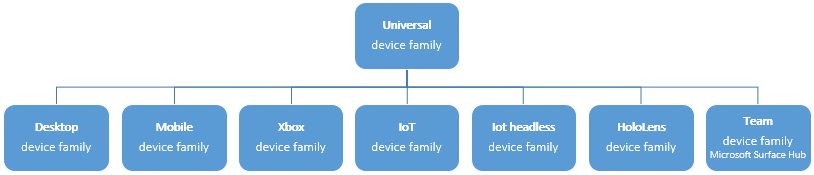
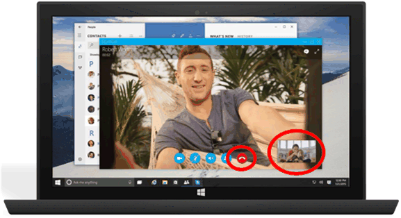
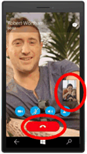
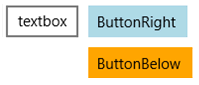
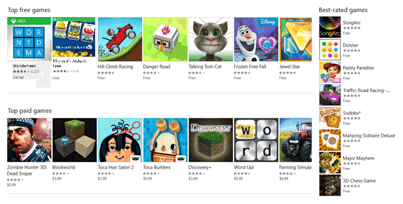
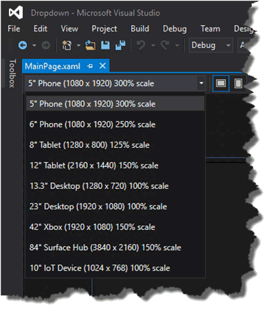

# Intro to the Universal Windows Platform

In this guide, you'll learn about the Universal Windows Platform (UWP) and Windows 10:

-   What a device family is and how to decide which one to target.
-   What an Extension SDK is and how it provides access to APIs specific to a class of devices.
-   New UI controls and panels for adapting your UI to different screen sizes or rotations.
-   How to understand and control the API surface that is available to your app.

Windows 10 introduces the Universal Windows Platform (UWP), which provides a common app platform on every device that runs Windows 10. The UWP provides a guaranteed core API across devices. This means you can create a single app package that can be installed onto a wide range of devices. And, with that single app package, the Microsoft Store provides a unified distribution channel to reach all the device types your app can run on. Apps that target the UWP can call not only the WinRT APIs that are common to all devices, but also APIs (including Win32 and .NET APIs) that are specific to the class of device that the app is running on.


Because your UWP app runs on a wide variety of devices with different form factors and types of input, you want it to be tailored to each device and be able to unlock the unique capabilities of each device. In addition to the guaranteed core API layer, you can write code to access device specific APIs so that your app lights up features specific to one type of device while presenting a different experience on other devices. Adaptive UI controls and new layout panels help you to tailor your UI across a broad range of device screen resolutions and sizes.

## Device families

In order to understand how Windows 10 allows you to target different classes of devices, it's helpful to understand a concept called device families. A device family identifies the APIs, system characteristics, and behaviors that you can expect across a class of devices. It also determines the set of devices on which your app can be installed from the Store. A device family (with the exception of the Universal device family) is implemented as an extension SDK, which is covered in further detail in the [Extension SDKs](#extension-sdks) section. This diagram demonstrates the device family hierarchy.



A device family defines a set of APIs, is versioned, and is the foundation of an OS. PCs and tablets run the desktop OS, which is based on the desktop device family. Phones run the mobile OS, which is based on the mobile device family.

Each child device family adds its own APIs to the ones it inherits. The resulting union of APIs in a child device family is guaranteed to be present in the OS based on that device family, and on every device running that OS.

One benefit of the universal device family is that your app can run on a variety of devices; phones, tablets, desktop computers, Surface Hubs, Xbox consoles, and HoloLens, to name a few. Your app can also use adaptive code to dynamically detect and use features of a device that are outside of the universal device family.

The decision about which device family (or families) your app will target is yours to make. And that decision impacts your app in these important ways. It determines:

-   The set of APIs that your app can assume to be present when it runs (and can therefore call freely).
-   The set of API calls that are safe only inside conditional statements.
-   The set of devices on which your app can be installed from the Store (and consequently the form factors that you need to consider when you design the UI).

There are two main consequences of making a device family choice: the API surface that can be called unconditionally by the app, and the number of devices the app can reach. These two factors involve tradeoffs and are inversely related. For example, a UWP app is an app that specifically targets the universal device family, and consequently is available to all devices. An app that targets the universal device family can assume the presence of only the APIs in the universal device family. Other APIs must be called conditionally. Also, such an app must have a highly adaptive UI and comprehensive input capabilities because it can run on a wide variety of devices. A Windows mobile app is an app that specifically targets the mobile device family, and is available to devices whose OS is based on the mobile device family (which includes phones, tablets, and similar devices). A mobile device family app can assume the presence of all APIs in the mobile device family, and its UI has to be moderately adaptive. An app that targets the IoT device family can be installed only on IoT devices and can assume the presence of all APIs in the IoT device family. That app can be very specialized in its UI and input capabilities because you know that it will run only on a specific type of device.

<iframe src="https://channel9.msdn.com/Blogs/One-Dev-Minute/Introduction-to-UWP-and-Device-Families/player" width="640" height="360" allowFullScreen frameBorder="0"></iframe>

Here are some considerations to help you decide which device family to target:

**Maximizing your app's reach**

To reach the maximum range of devices with your app, and to have it run on as many devices as possible, your app will target the universal device family. By doing so, the app automatically targets every device family that's based on universal (in the diagram, all the children of universal). That means that the app runs on every OS based on those device families, and on all the devices that run those operating systems. The only APIs that are guaranteed to be available on all those devices is the set defined by the particular version of the universal device family that you target. To find out how an app can call APIs outside of its target device family version, see [Writing Code](#writing-code) later in this topic.

**Limiting your app to one kind of device**

You may not want your app to run on a wide range of devices; perhaps it's specialized for a desktop PC or for an Xbox console. In that case you can choose to target your app at one of the child device families. For example, if you target the desktop device family, the APIs guaranteed to be available to your app, include the APIs inherited from the universal device family, as well as the APIs that are particular to the desktop device family.

**Limiting your app to a subset of all possible devices**

Instead of targeting the universal device family, or targeting one of the child device families, you can instead target two (or more) child device families. Targeting desktop and mobile might make sense for your app. Or desktop and HoloLens. Or desktop, Xbox and Surface Hub, and so on.

**Excluding support for a particular version of a device family**

In rare cases, you may want your app to run everywhere except on devices with a particular version of a particular device family. For example, let's say your app targets version 10.0.x.0 of the universal device family. When the operating system version changes in the future, say to 10.0.x.2, at that point you can specify that your app runs everywhere except version 10.0.x.1 of Xbox by targeting your app to 10.0.x.0 of universal and 10.0.x.2 of Xbox. Your app will then be unavailable to the set of device family versions within Xbox 10.0.x.1 (inclusive) and earlier.

By default, Microsoft Visual Studio specifies **Windows.Universal** as the target device family in the app package manifest file. To specify the device family or device families that your app is offered to from within the Store, manually configure the [**TargetDeviceFamily**](https://msdn.microsoft.com/library/windows/apps/dn986903) element in your Package.appxmanifest file.

## Extension SDKs

Once you have decided on the device family that your app will target, add a reference to the Extension SDK(s) that implement the APIs for that device family.  If you are targeting the Universal device family, you don't need to reference an extension SDK. But if you are targeting a device family besides Universal, in Visual Studio you will add a reference to the extension SDK that matches the device family you have chosen.  For example, if you are targeting the mobile device family, you would add a reference to the _Windows Mobile Extensions for the UWP_ in Visual Studio's Reference Manager.

Selecting a device family does not prohibit you from adding extension SDKs for other types of devices. You will just need to ensure that you test for the presence of APIs not included in the device family you have chosen as described below in [Writing Code](#writing-code).

## UI and universal input

A UWP app can run on many devices that have different forms of input, screen resolutions, DPI density, and other unique characteristics. Windows 10 provides new universal controls, layout panels, and tooling to help you adapt your UI to the devices your app may run on. For example, you can tailor the UI to take advantage of the difference in screen resolution when your app is running on a desktop computer versus on a mobile device.

Some aspects of your app's UI will automatically adapt across devices. Controls such as buttons and sliders automatically adapt across device families and input modes. Your app's user-experience design, however, may need to adapt depending on the device the app is running on. For example, a photo app should adapt to the UI when running on a small, hand-held device to ensure that usage is ideal for single-hand use. When a photo app is running on a desktop computer, the UI should adapt to take advantage of the additional screen space.

Windows helps you target your UI to multiple devices with the following features:

-   Universal controls and layout panels help you to optimize your UI for the screen resolution of the device.
-   Common input handling allows you to receive input through touch, a pen, a mouse, a keyboard, or a controller such as a Microsoft Xbox controller.
-   Tooling helps you to design UI that can adapt to different screen resolutions.
-   Adaptive scaling adjusts to resolution and DPI differences across devices.

### Universal controls and layout panels

Windows 10 includes new controls such as the calendar and split view. The pivot control, which was previously available only for Windows Phone, is also now available for the universal device family.

Controls have been updated to work well on larger screens, adapt themselves based on the number of screen pixels available on the device, and work well with multiple types of input such as keyboard, mouse, touch, pen, and controllers such as the Xbox controller.

You may find that you need to adapt your overall UI layout based on the screen resolution of the device your app will be running on. For example, a communication app running on the desktop may include a picture-in-picture of the caller and controls well suited to mouse input:



However, when the app runs on a phone, because there is less screen real-estate to work with, your app may eliminate the picture-in-picture view and make the call button larger to facilitate one-handed operation:



To help you adapt your overall UI layout based on the amount of available screen space, Windows 10 introduces adaptive panels and design states.

### Design adaptive UI with adaptive panels

Layout panels give sizes and positions to their children, depending on available space. For example, [**StackPanel**](https://msdn.microsoft.com/library/windows/apps/br209635) orders its children sequentially (horizontally or vertically). [**Grid**](https://msdn.microsoft.com/library/windows/apps/br242704) is like a CSS grid that places its children into cells.

The new [**RelativePanel**](https://msdn.microsoft.com/library/windows/apps/dn879546) implements a style of layout that is defined by the relationships between its child elements. It's intended for use in creating app layouts that can adapt to changes in screen resolution. The **RelativePanel** eases the process of rearranging elements by defining relationships between elements, which allows you to build more dynamic UI without using nested layouts.

In the following example, **blueButton** will appear to the right of **textBox1** regardless of changes in orientation or layout, and **orangeButton** will appear immediately below, and aligned with, **blueButton**—even as the width of **textBox1** changes as text is typed into it. It would previously have required rows and columns in a **Grid** to achieve this effect, but now it can be done using far less markup.



```XML
<RelativePanel>
    <TextBox x:Name="textBox1" Text="textbox" Margin="5"/>
    <Button x:Name="blueButton" Margin="5" Background="LightBlue" Content="ButtonRight" RelativePanel.RightOf="textBox1"/>
    <Button x:Name="orangeButton" Margin="5" Background="Orange" Content="ButtonBelow" RelativePanel.RightOf="textBox1" RelativePanel.Below="blueButton"/>
</RelativePanel>
```

### Use visual state triggers to build UI that can adapt to available screen space

Your UI may need to adapt to changes in window size. Adaptive visual states allows you to change the visual state in response to changes in the size of the window.

StateTriggers define a threshold at which a visual state is activated, which then sets layout properties as appropriate for the window size that triggered the state change.

In the following example, when the window size is 720 pixels or more in width, the visual state named **wideView** is triggered, which then arranges the **Best-rated games** panel to appear to the right of, and aligned with the top of, the **Top free games** panel.



When the window is less than 720 pixels, the **narrowView** visual state is triggered because the **wideView** trigger is no longer satisfied and so no longer in effect. The **narrowView** visual state positions the **Best-rated games** panel below, and aligned with the left of, the **Top paid games** panel:


Here is the XAML for the visual state triggers described above. The definition of the panels, alluded to by "`...`" below, has been removed for brevity.

```XML
<Grid Background="{ThemeResource ApplicationPageBackgroundThemeBrush}">
    <VisualStateManager.VisualStateGroups>
        <VisualStateGroup>
            <VisualState x:Name="wideView">
                <VisualState.StateTriggers>
                    <AdaptiveTrigger MinWindowWidth="720" />
                </VisualState.StateTriggers>
                <VisualState.Setters>
                    <Setter Target="best.(RelativePanel.RightOf)" Value="free"/>
                    <Setter Target="best.(RelativePanel.AlignTopWidth)" Value="free"/>
                </VisualState.Setters>
            </VisualState>
            <VisualState x:Name="narrowView">
                <VisualState.Setters>
                    <Setter Target="best.(RelativePanel.Below)" Value="paid"/>
                    <Setter Target="best.(RelativePanel.AlignLeftWithPanel)" Value="true"/>
                </VisualState.Setters>
                <VisualState.StateTriggers>
                    <AdaptiveTrigger MinWindowWidth="0" />
                </VisualState.StateTriggers>
            </VisualState>
        </VisualStateGroup>
    </VisualStateManager.VisualStateGroups>
    ...
</Grid>
```

### Tooling

By default, you'll probably want to target the broadest possible device family. When you're ready to see how your app looks and lays out on a particular device, use the device preview toolbar in Visual Studio to preview your UI on a small or medium mobile device, on a PC, or on a large TV screen. That way you can tailor and test your adaptive visual states:



You don’t have to make a decision up front about every device type that you'll support. You can add an additional device size to your project later.

### Adaptive scaling

Windows 10 introduces an evolution of the existing scaling model. In addition to scaling vector content, there is a unified set of scale factors that provides a consistent size for UI elements across a variety of screen sizes and display resolutions. The scale factors are also compatible with the scale factors of other operating systems such as iOS and Android. This makes it easier to share assets between these platforms.

The Store picks the assets to download based in part of the DPI of the device. Only the assets that best match the device are downloaded.

### Common input handling

You can build a Universal Windows app using universal controls that handle various inputs such as mouse, keyboard, touch, pen, and controller (such as the Xbox controller). Traditionally, inking has been associated only with pen input, but with Windows 10, you can ink with touch on some devices, and with any pointer input. Inking is supported on many devices (including mobile devices) and can easily be incorporated with a just few lines of code.

The following APIs provide access to input:

-   [**CoreIndependentInputSource**](https://msdn.microsoft.com/library/windows/apps/dn298460) is a new API that allows you to consume raw input on the main thread or a background thread.
-   [**PointerPoint**](https://msdn.microsoft.com/library/windows/apps/br242038) unifies raw touch, mouse, and pen data into a single, consistent set of interfaces and events that can be consumed on the main thread or background thread by using **CoreInput.**
-   [**PointerDevice**](https://msdn.microsoft.com/library/windows/apps/br225633) is a device API that supports querying device capabilities so that you can determine what kinds of input are available on the device.
-   The new [**InkCanvas**](https://msdn.microsoft.com/library/windows/apps/dn858535) XAML control and [**InkPresenter**](https://msdn.microsoft.com/library/windows/apps/dn922011) Windows Runtime APIs allow you to access ink stroke data.

## Writing code

Your programming language options for your [Windows 10 project in Visual Studio](https://msdn.microsoft.com/library/windows/apps/dn609832.aspx#target_win10) include Visual C++, C#, Visual Basic, and JavaScript. For Visual C++, C#, and Visual Basic, you can use XAML for a full-fidelity, native UI experience. For Visual C++ you can choose DirectX either instead of or as well as using XAML. For JavaScript, your presentation layer will be HTML, and HTML is of course a cross-platform web standard. Much of your code and UI will be universal and it will run the same way everywhere. But for code tailored to particular device families, and for UI tailored to particular form factors, you'll have the option to use adaptive code and adaptive UI. Let's consider these different cases:

**Calling an API that's implemented by your target device family**

Whenever you want to call an API in a UWP app, you'll want to know whether the API is implemented by the device family that your app is targeting. Visual Studio Intellisense only shows you the APIs that are available for the extension SDKs that you have chosen. If you have not selected an extension SDK, you'll see only the APIs available to the Universal device family.

The API documentation also tells you which device family an API is part of. If you look at the Requirements section, you'll see what the implementing device family is and which version of that device family the API appears in.

**Calling an API that's NOT implemented by your target device family**

There will be cases when you want to call an API in an extension SDK that you've referenced, but that API is not part of the device family you are targeting. For example, you may be targeting the universal device family, but have a desktop API that you'd like to use if the app happens to be running on a desktop device. In that case, you can opt to write adaptive code in order to call that API.

**Writing adaptive code with the ApiInformation class**

There are two steps to write adaptive code. The first step is to make the APIs that you want to access available to your project. To do that, add a reference to the extension SDK that represents the device family that owns the APIs that you want to conditionally call. See [Extension SDKs](../porting/w8x-to-uwp-porting-to-a-uwp-project.md#extension-sdks).

The second step is to use the [**Windows.Foundation.Metadata.ApiInformation**](https://msdn.microsoft.com/library/windows/apps/dn949001) class in a condition in your code to test for the presence of the API you want to call. This condition is evaluated wherever your app runs, but it evaluates to true only on devices where the API is present and therefore available to call.

If you want to call just a small number of APIs, you could use the [**ApiInformation.IsTypePresent**](https://msdn.microsoft.com/library/windows/apps/dn949016) method like this.

```csharp
    // Note: Cache the value instead of querying it more than once.
    bool isHardwareButtonsAPIPresent =
        Windows.Foundation.Metadata.ApiInformation.IsTypePresent("Windows.Phone.UI.Input.HardwareButtons");

    if (isHardwareButtonsAPIPresent)
    {
        Windows.Phone.UI.Input.HardwareButtons.CameraPressed +=
            HardwareButtons_CameraPressed;
    }
```

In this case, there is confidence that the presence of the [**HardwareButtons**](https://msdn.microsoft.com/library/windows/apps/jj207557) class implies the presence of the [**CameraPressed**](https://msdn.microsoft.com/library/windows/apps/dn653805) event, because the class and the member have the same requirements info. But in time, new members will be added to already-introduced classes, and those members will have later "introduced in" version numbers. In such cases, instead of using **IsTypePresent**, you can test for the presence of individual members by using **IsEventPresent**, **IsMethodPresent**, **IsPropertyPresent**, and similar methods. Here's an example.

```csharp
    bool isHardwareButtons_CameraPressedAPIPresent =
        Windows.Foundation.Metadata.ApiInformation.IsEventPresent
            ("Windows.Phone.UI.Input.HardwareButtons", "CameraPressed");
```

The set of APIs within a device family is further broken down into subdivisions known as API contracts. You can use the **ApiInformation.IsApiContractPresent** method to test for the presence of an API contract. This is useful if you want to test for the presence of a large number of APIs that all exist in the same version of an API contract.

```csharp
    bool isWindows_Devices_Scanners_ScannerDeviceContract_1_0Present =
        Windows.Foundation.Metadata.ApiInformation.IsApiContractPresent
            ("Windows.Devices.Scanners.ScannerDeviceContract", 1, 0);
```

**Win32 APIs in the UWP**

A UWP app or Windows Runtime Component written in C++/CX has access to the Win32 APIs that are part of the UWP. These Win32 APIs are implemented by all Windows 10 device families. Link your app with Windowsapp.lib. Windowsapp.lib is an "umbrella" lib that provides the exports for the UWP APIs. Linking to Windowsapp.lib will add to your app dependencies on dlls that are present on all Windows 10 device families.

For the full list of Win32 APIs available to UWP apps, see [API Sets for UWP apps](https://msdn.microsoft.com/library/windows/desktop/mt186421) and [Dlls for UWP apps](https://msdn.microsoft.com/library/windows/desktop/mt186422).

## User experience

A Universal Windows app allows you to take advantage of the unique capabilities of the device on which it is running. Your app can make use of all of the power of a desktop device, the natural interaction of direct manipulation on a tablet (including touch and pen input), the portability and convenience of mobile devices, the collaborative power of [Surface Hub](http://go.microsoft.com/fwlink/?LinkId=526365), and other devices that support UWP apps.

Good [design](http://go.microsoft.com/fwlink/?LinkId=258848) is the process of deciding how users will interact with your app, as well as how it will look and function. User experience plays a huge part in determining how happy people will be with your app, so don't skimp on this step. [Design basics](https://dev.windows.com/design) introduce you to designing a Universal Windows app. See the [Introduction to Universal Windows Platform (UWP) apps for designers](https://msdn.microsoft.com/library/windows/apps/dn958439) for information on designing UWP apps that delight your users. Before you start coding, see the [device primer](../design/devices/index.md) to help you think through the interaction experience of using your app on all the different form factors you want to target.


In addition to interaction on different devices, [plan your app](https://msdn.microsoft.com/library/windows/apps/hh465427) to embrace the benefits of working across multiple devices. For example:

-   Use [cloud services](http://go.microsoft.com/fwlink/?LinkId=526377) to sync across devices. Learn how to [connect to web services](https://msdn.microsoft.com/library/windows/apps/xaml/hh761504) in support of your app experience.

-   Consider how you can support users moving from one device to another, picking up where they left off. Include [notifications](https://msdn.microsoft.com/library/windows/apps/mt187203) and [in-app purchases](https://msdn.microsoft.com/library/windows/apps/mt219684) in your planning. These features should work across devices.

-   Design your workflow using [Navigation design basics for UWP apps](https://msdn.microsoft.com/library/windows/apps/dn958438) to accommodate mobile, small-screen, and large-screen devices. [Lay out your user interface](https://msdn.microsoft.com/library/windows/apps/dn958435) to respond to different screen sizes and resolutions.

-   Consider whether there are features of your app that don’t make sense on a small mobile screen. There may also be areas that don’t make sense on a stationary desktop machine and require a mobile device to light up. For example, most scenarios around [location](https://msdn.microsoft.com/library/windows/apps/mt219698) imply a mobile device.

-   Consider how you'll accommodate multiple kinds of input. See the [Guidelines for interactions](https://msdn.microsoft.com/library/windows/apps/dn611861) to learn how users can interact with your app by using [Cortana](https://msdn.microsoft.com/library/windows/apps/dn974233), [Speech](https://msdn.microsoft.com/library/windows/apps/dn596121), [Touch interactions](https://msdn.microsoft.com/library/windows/apps/hh465370), the [Touch keyboard](https://msdn.microsoft.com/library/windows/apps/hh972345) and more.

    See the [Guidelines for text and text input](https://msdn.microsoft.com/library/windows/apps/dn611864) for more traditional interaction experiences.

## Submit a Universal Windows app through your Dashboard


The new unified Windows Dev Center dashboard lets you manage and submit all of your apps for Windows devices in one place. New features simplify processes while giving you more control. You'll also find detailed [analytic reports](https://msdn.microsoft.com/library/windows/apps/mt148522) combined [payout details](https://msdn.microsoft.com/library/windows/apps/dn986925), ways to [promote your app and engage with your customers](https://msdn.microsoft.com/library/windows/apps/mt148526), and much more.

See [Using the unified Windows Dev Center dashboard](../publish/using-the-windows-dev-center-dashboard.md) to learn how to submit your apps for publication in the Microsoft Store.

## See Also ##
For more introductory material, see [Windows 10 - An Introduction to Building Windows Apps for Windows 10 Devices](https://msdn.microsoft.com/magazine/dn973012.aspx)
