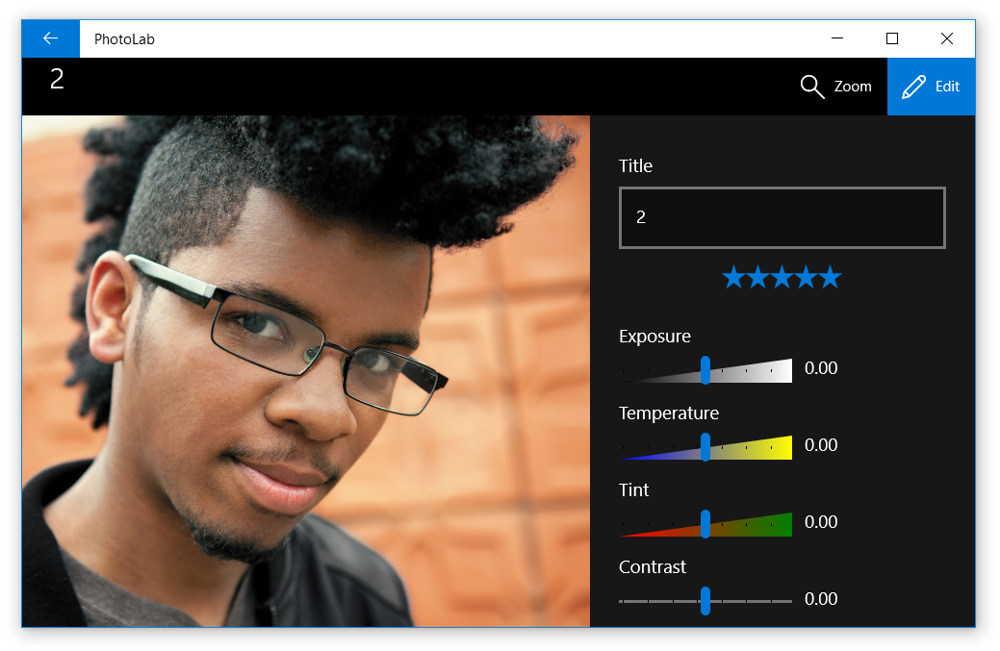

# UI basics tutorials

This tutorial series covers four fundamental aspects of XAML programming: user interfaces, data binding, custom styles, and adaptive layouts. Each tutorial track starts with a partially-complete version of the [PhotoLab Sample](https://github.com/Microsoft/Windows-appsample-photo-lab), and builds one missing component of the final app step-by-step. Note that these tutorials do not build up to the full sample, so be sure to check out the [completed version](https://github.com/Microsoft/Windows-appsample-photo-lab) after you've mastered the basics.

## PhotoLab overview
The PhotoLab app has two primary pages:

**MainPage.xaml:** displays a photo gallery view, along with some information about each image file.

**DetailPage.xaml:** displays a single photo after it has been selected. A flyout editting menu allows the photo to be altered, renamed, and saved.

## Tutorial overview
Here's a quick summary of each tutorial track.

+ [**Create user interfaces**](xaml-basics-ui.md) shows how to create the basic photo gallery interface.
+ [**Create data bindings**](xaml-basics-data-binding.md) shows how to add data bindings to the photo gallery, populating it with real image data.
+ [**Create custom styles**](xaml-basics-style.md) shows how to add fancy custom styles to the photo editing menu.
+ [**Create adaptive layouts**](xaml-basics-adaptive-layout.md) shows how to make the gallery layout adaptive, so it looks good on every device and screen size.

## See Also

* [UWP Tutorials](create-uwp-apps.md)
* [Intro to app UI design](../layout/design-and-ui-intro.md)