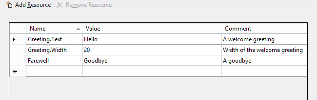

# Put UI strings into resources
<link rel="stylesheet" href="https://az835927.vo.msecnd.net/sites/uwp/Resources/css/custom.css">

Put string resources for your UI into resource files. You can then reference those strings from your code or markup.

<div class="important-apis" >
<b>Important APIs</b><br/>
<ul>
<li>[**ApplicationModel.Resources.ResourceLoader**](https://msdn.microsoft.com/library/windows/apps/br206014)</li>
<li>[**WinJS.Resources.processAll**](https://msdn.microsoft.com/library/windows/apps/br211864)</li>
</ul>
</div>


This topic shows the steps to add several language string resources to your Universal Windows app, and how to briefly test it.

## Put strings into resource files, instead of putting them directly in code or markup.


1.  Open your solution (or create a new one) in Visual Studio.

2.  Open package.appxmanifest in Visual Studio, go to the **Application** tab, and (for this example) set the Default language to "en-US". If there are multiple package.appxmanifest files in your solution, do this for each one.
    <br>**Note**  This specifies the default language for the project. The default language resources are used if the user's preferred language or display languages do not match the language resources provided in the application.
3.  Create a folder to contain the resource files.
    1.  In the Solution Explorer, right-click the project (the Shared project if your solution contains multiple projects) and select **Add** &gt; **New Folder**.
    2.  Name the new folder "Strings".
    3.  If the new folder is not visible in Solution Explorer, select **Project** &gt; **Show All Files** from the Microsoft Visual Studio menu while the project is still selected.

4.  Create a sub-folder and a resource file for English (United States).
    1.  Right-click the Strings folder and add a new folder beneath it. Name it "en-US". The resource file is to be placed in a folder that has been named for the [BCP-47](http://go.microsoft.com/fwlink/p/?linkid=227302) language tag. See [How to name resources using qualifiers](https://msdn.microsoft.com/library/windows/apps/xaml/hh965324) for details on the language qualifier and a list of common language tags.
    2.  Right-click the en-US folder and select **Add** &gt; **New Item…**.
    3.  Select "Resources File (.resw)".

    4.  Click **Add**. This adds a resource file with the default name "Resources.resw". We recommend that you use this default filename. Apps can partition their resources into other files, but you must be careful to refer to them correctly (see [How to load string resources](https://msdn.microsoft.com/library/windows/apps/xaml/hh965323)).
    5.  If you have .resx files with only string resources from previous .NET projects, select **Add** &gt; **Existing Item…**, add the .resx file, and rename it to .resw.
    6.  Open the file and use the editor to add these resources:


        Strings/en-US/Resources.resw
        
        In this example, "Greeting.Text" and "Farewell" identify the strings that are to be displayed. "Greeting.Width" identifies the Width property of the "Greeting" string. The comments are a good place to provide any special instructions to translators who localize the strings to other languages.

## Associate controls to resources.

You need to associate every control that needs localized text with the .resw file. You do this using the **x:Uid** attribute on your XAML elements like this:

```XML
<TextBlock x:Uid="Greeting" Text="" />
```

For the resource name, you give the **Uid** attribute value, plus you specify what property is to get the translated string (in this case the Text property). You can specify other properties/values for different languages such as Greeting.Width, but be careful with such layout-related properties. You should strive to allow the controls to lay out dynamically based on the device's screen.

Note that attached properties are handled differently in resw files such as AutomationProperties.Name. You need to explicitly write out the namespace like this:

```XML
MediumButton.[using:Windows.UI.Xaml.Automation]AutomationProperties.Name
```

## Add string resource identifiers to code and markup.

In your code, you can dynamically reference strings:

**C#**
```CSharp
var loader = new Windows.ApplicationModel.Resources.ResourceLoader();
var str = loader.GetString("Farewell");
```

**C++**
```cpp
auto loader = ref new Windows::ApplicationModel::Resources::ResourceLoader();
auto str = loader->GetString("Farewell");
```


## Add folders and resource files for two additional languages.


1.  Add another folder under the Strings folder for German. Name the folder "de-DE" for Deutsch (Deutschland).
2.  Create another resources file in the de-DE folder, and add the following:

    strings/de-DE/Resources.resw

    


3.  Create one more folder named "fr-FR", for français (France). Create a new resources file and add the following:

    strings/fr-FR/Resources.resw
    
    

## Build and run the app.


Test the app for your default display language.

1.  Press F5 to build and run the app.
2.  Note that the greeting and farewell are displayed in the user's preferred language.
3.  Exit the app.

Test the app for the other languages.

1.  Bring up **Settings** on your device.
2.  Select **Time & language**.
3.  Select **Region & language** (or on a phone or phone emulator, **Language**).
4.  Note that the language that was displayed when you ran the app is the top language listed that is English, German, or French. If your top language is not one of these three, the app falls back to the next one on the list that the app supports.
5.  If you do not have all three of these languages on your machine, add the missing ones by clicking **Add a language** and adding them to the list.
6.  To test the app with another language, select the language in the list and click **Set as default** (or on a phone or phone emulator, tap and hold the language in the list and then tap **Move up** until it is at the top). Then run the app.

## Related topics


* [How to name resources using qualifiers](https://msdn.microsoft.com/library/windows/apps/xaml/hh965324)
* [How to load string resources](https://msdn.microsoft.com/library/windows/apps/xaml/hh965323)
* [The BCP-47 language tag](http://go.microsoft.com/fwlink/p/?linkid=227302)
 

 


