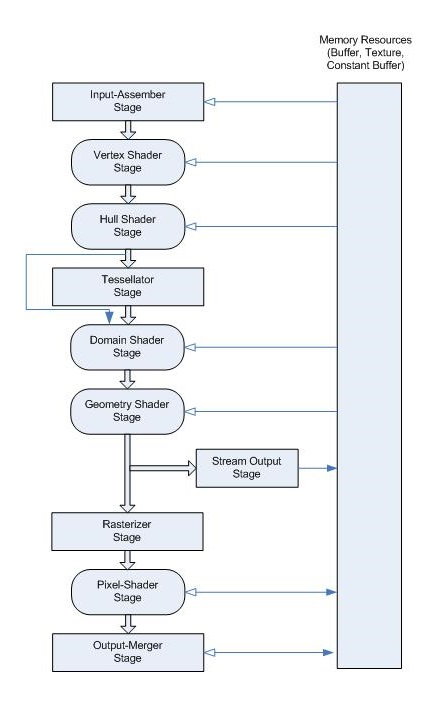

---
title: Graphics pipeline
description: The Direct3D graphics pipeline is designed for generating graphics for realtime gaming applications. Data flows from input to output through each of the configurable or programmable stages.
ms.assetid: C9519AD0-5425-48BD-9FF4-AED8959CA4AD
keywords:
- Graphics pipeline
- Pipeline stages
author: PeterTurcan
ms.author: pettur
ms.date: 02/08/2017
ms.topic: article
ms.prod: windows
ms.technology: uwp
---

# Graphics pipeline


The Direct3D graphics pipeline is designed for generating graphics for realtime gaming applications. Data flows from input to output through each of the configurable or programmable stages.

All of the stages can be configured using the Direct3D API. Stages that feature common shader cores (the rounded rectangular blocks) are programmable by using the [HLSL](https://msdn.microsoft.com/library/windows/desktop/bb509561) programming language. This makes the pipeline extremely flexible and adaptable.

The most commonly used are the Vertex Shader (VS) stage and the Pixel Shader (PS) stage. If you don't provide even these shader stages, a default no-op, pass-through vertex and pixel shader are used.



## Input Assembler stage

 

| | |
|-|-|
|Purpose|The [Input Assembler (IA) stage](input-assembler-stage--ia-.md) supplies primitive and adjacency data to the pipeline, such as triangles, lines and points, including semantics IDs to help make shaders more efficient by reducing processing to primitives that haven't already been processed.|
|Input|Primitive data (triangles, lines, and/or points), from user-filled buffers in memory. And possibly adjacency data. A triangle would be 3 vertices for each triangle and possibly 3 vertices for adjacency data per triangle.|
|Output|Primitives with attached system-generated values (such as a primitive ID, an instance ID, or a vertex ID).|
| | |

<!---
<table>
<colgroup>
<col width="50%" />
<col width="50%" />
</colgroup>
<tbody>
<tr class="odd">
<td align="left">Purpose</td>
<td align="left">The [Input Assembler (IA) stage](input-assembler-stage--ia-.md) supplies primitive and adjacency data to the pipeline, such as triangles, lines and points, including semantics IDs to help make shaders more efficient by reducing processing to primitives that haven't already been processed.</td>
</tr>
<tr class="even">
<td align="left">Input</td>
<td align="left"> Primitive data (triangles, lines, and/or points), from user-filled buffers in memory. And possibly adjacency data. A triangle would be 3 vertices for each triangle and possibly 3 vertices for adjacency data per triangle.  </td>
</tr>
<tr class="odd">
<td align="left">Output</td>
<td align="left">Primitives with attached system-generated values (such as a primitive ID, an instance ID, or a vertex ID). </td>
</tr>
</tbody>
</table>
 -->



## Vertex Shader stage
 

| | |
|-|-|
|Purpose|The [Vertex Shader (VS) stage](vertex-shader-stage--vs-.md) processes vertices, typically performing operations such as transformations, skinning, and lighting. A vertex shader takes a single input vertex and produces a single output vertex. Individual per-vertex operations, such as Transformations, Skinning, Morphing and Per-vertex lighting.|
|Input|A single vertex, with VertexID and InstanceID system-generated values. Each vertex shader input vertex can be comprised of up to 16 32-bit vectors (up to 4 components each).|
|Output|A single vertex. Each output vertex can be comprised of as many as 16 32-bit 4-component vectors.|
| | |

<!---
<table>
<colgroup>
<col width="50%" />
<col width="50%" />
</colgroup>
<tbody>
<tr class="odd">
<td align="left">Purpose</td>
<td align="left">The [Vertex Shader (VS) stage](vertex-shader-stage--vs-.md) processes vertices, typically performing operations such as transformations, skinning, and lighting. A vertex shader takes a single input vertex and produces a single output vertex. Individual per-vertex operations, such as:
<ul>
<li>Transformations</li>
<li>Skinning</li>
<li>Morphing</li>
<li>Per-vertex lighting</li>
</ul></td>
</tr>
<tr class="even">
<td align="left">Input</td>
<td align="left">A single vertex, with VertexID and InstanceID system-generated values. Each vertex shader input vertex can be comprised of up to 16 32-bit vectors (up to 4 components each).</td>
</tr>
<tr class="odd">
<td align="left">Output</td>
<td align="left">A single vertex. Each output vertex can be comprised of as many as 16 32-bit 4-component vectors.</td>
</tr>
</tbody>
</table>
-->
 

## Hull Shader stage
 

| | |
|-|-|
|Purpose|The [Hull Shader (HS) stage](hull-shader-stage--hs-.md) is one of the tessellation stages, which efficiently break up a single surface of a model into many triangles. A hull shader is invoked once per patch, and it transforms input control points that define a low-order surface into control points that make up a patch. It also does some per-patch calculations to provide data for the Tessellator (TS) stage and the Domain Shader (DS) stage.|
|Input|Between 1 and 32 input control points, which together define a low-order surface.|
|Output|Between 1 and 32 output control points, which together make up a patch. The hull shader declares the state for the Tessellator (TS) stage, including the number of control points, the type of patch face, and the type of partitioning to use when tessellating.|
| | |

<!---
<table>
<colgroup>
<col width="50%" />
<col width="50%" />
</colgroup>
<tbody>
<tr class="odd">
<td align="left">Purpose</td>
<td align="left">The [Hull Shader (HS) stage](hull-shader-stage--hs-.md) is one of the tessellation stages, which efficiently break up a single surface of a model into many triangles. A hull shader is invoked once per patch, and it transforms input control points that define a low-order surface into control points that make up a patch. It also does some per-patch calculations to provide data for the Tessellator (TS) stage and the Domain Shader (DS) stage.</td>
</tr>
<tr class="even">
<td align="left">Input</td>
<td align="left">Between 1 and 32 input control points, which together define a low-order surface. </td>
</tr>
<tr class="odd">
<td align="left">Output</td>
<td align="left">Between 1 and 32 output control points, which together make up a patch. The hull shader declares the state for the Tessellator (TS) stage, including the number of control points, the type of patch face, and the type of partitioning to use when tessellating. </td>
</tr>
</tbody>
</table>
-->

## Tessellator stage
 

| | |
|-|-|
|Purpose|The [Tessellator (TS) stage](tessellator-stage--ts-.md) creates a sampling pattern of the domain that represents the geometry patch and generates a set of smaller objects (triangles, points, or lines) that connect these samples.|
|Input|The tessellator operates once per patch using the tessellation factors (which specify how finely the domain will be tessellated) and the type of partitioning (which specifies the algorithm used to slice up a patch) that are passed in from the hull-shader stage. |
|Output|The tessellator outputs uv (and optionally w) coordinates and the surface topology to the domain-shader stage.|
| | |

<!---
<table>
<colgroup>
<col width="50%" />
<col width="50%" />
</colgroup>
<tbody>
<tr class="odd">
<td align="left">Purpose</td>
<td align="left">The [Tessellator (TS) stage](tessellator-stage--ts-.md) creates a sampling pattern of the domain that represents the geometry patch and generates a set of smaller objects (triangles, points, or lines) that connect these samples.   </td>
</tr>
<tr class="even">
<td align="left">Input</td>
<td align="left"> The tessellator operates once per patch using the tessellation factors (which specify how finely the domain will be tessellated) and the type of partitioning (which specifies the algorithm used to slice up a patch) that are passed in from the hull-shader stage. </td>
</tr>
<tr class="odd">
<td align="left">Output</td>
<td align="left">The tessellator outputs uv (and optionally w) coordinates and the surface topology to the domain-shader stage.     </td>
</tr>
</tbody>
</table>
 -->

## Domain Shader stage
 

| | |
|-|-|
|Purpose|The [Domain Shader (DS) stage](domain-shader-stage--ds-.md) calculates the vertex position of a subdivided point in the output patch; it calculates the vertex position that corresponds to each domain sample. A domain shader is run once per tessellator stage output point and has read-only access to the hull shader output patch and output patch constants, and the tessellator stage output UV coordinates.|
|Input|A domain shader consumes output control points from the [Hull Shader (HS) stage](hull-shader-stage--hs-.md). The hull shader outputs include: Control points, Patch constant data, and Tessellation factors (the tessellation factors can include the values used by the fixed-function tessellator as well as the raw values - before rounding by integer tessellation - which facilitates geomorphing, for example). A domain shader is invoked once per output coordinate from the [Tessellator (TS) stage](tessellator-stage--ts-.md).|
|Output|The Domain Shader (DS) stage outputs the vertex position of a subdivided point in the output patch.|
| | |

<!---
<table>
<colgroup>
<col width="50%" />
<col width="50%" />
</colgroup>
<tbody>
<tr class="odd">
<td align="left">Purpose</td>
<td align="left">The [Domain Shader (DS) stage](domain-shader-stage--ds-.md) calculates the vertex position of a subdivided point in the output patch; it calculates the vertex position that corresponds to each domain sample. A domain shader is run once per tessellator stage output point and has read-only access to the hull shader output patch and output patch constants, and the tessellator stage output UV coordinates.</td>
</tr>
<tr class="even">
<td align="left">Input</td>
<td align="left"><ul>
<li>A domain shader consumes output control points from the [Hull Shader (HS) stage](hull-shader-stage--hs-.md). The hull shader outputs include:
<ul>
<li>Control points.</li>
<li>Patch constant data.</li>
<li>Tessellation factors. The tessellation factors can include the values used by the fixed-function tessellator as well as the raw values (before rounding by integer tessellation, for example), which facilitates geomorphing, for example.</li>
</ul></li>
<li>A domain shader is invoked once per output coordinate from the [Tessellator (TS) stage](tessellator-stage--ts-.md).</li>
</ul></td>
</tr>
<tr class="odd">
<td align="left">Output</td>
<td align="left">The Domain Shader (DS) stage outputs the vertex position of a subdivided point in the output patch.</td>
</tr>
</tbody>
</table>
-->
 

## Geometry Shader stage
 

| | |
|-|-|
|Purpose|The [Geometry Shader (GS) stage](geometry-shader-stage--gs-.md) processes entire primitives: triangles, lines, and points, along with their adjacent vertices. It supports geometry amplification and de-amplification. It is useful for algorithms including Point Sprite Expansion, Dynamic Particle Systems, Fur/Fin Generation, Shadow Volume Generation, Single Pass Render-to-Cubemap, Per-Primitive Material Swapping, and Per-Primitive Material Setup - including generation of barycentric coordinates as primitive data so that a pixel shader can perform custom attribute interpolation. |
|Input|Unlike vertex shaders, which operate on a single vertex, the geometry shader's inputs are the vertices for a full primitive (three vertices for triangles, two vertices for lines, or single vertex for point).|
|Output|The Geometry Shader (GS) stage is capable of outputting multiple vertices forming a single selected topology. Available geometry shader output topologies are <strong>tristrip</strong>, <strong>linestrip</strong>, and <strong>pointlist</strong>. The number of primitives emitted can vary freely within any invocation of the geometry shader, though the maximum number of vertices that could be emitted must be declared statically. Strip lengths emitted from a geometry shader invocation can be arbitrary, and new strips can be created via the [RestartStrip](https://msdn.microsoft.com/library/windows/desktop/bb509660) HLSL function.|
| | |

<!---
<table>
<colgroup>
<col width="50%" />
<col width="50%" />
</colgroup>
<tbody>
<tr class="odd">
<td align="left">Purpose</td>
<td align="left">The [Geometry Shader (GS) stage](geometry-shader-stage--gs-.md) processes entire primitives: triangles, lines, and points, along with their adjacent vertices. It is useful for algorithms including Point Sprite Expansion, Dynamic Particle Systems, and Shadow Volume Generation. It supports geometry amplification and de-amplification.
<ul>
<li>Point Sprite Expansion</li>
<li>Dynamic Particle Systems</li>
<li>Fur/Fin Generation</li>
<li>Shadow Volume Generation</li>
<li>Single Pass Render-to-Cubemap</li>
<li>Per-Primitive Material Swapping</li>
<li>Per-Primitive Material Setup, including generation of barycentric coordinates as primitive data so that a pixel shader can perform custom attribute interpolation.</li>
</ul></td>
</tr>
<tr class="even">
<td align="left">Input</td>
<td align="left">Unlike vertex shaders, which operate on a single vertex, the geometry shader's inputs are the vertices for a full primitive (three vertices for triangles, two vertices for lines, or single vertex for point).</td>
</tr>
<tr class="odd">
<td align="left">Output</td>
<td align="left">The Geometry Shader (GS) stage is capable of outputting multiple vertices forming a single selected topology. Available geometry shader output topologies are <strong>tristrip</strong>, <strong>linestrip</strong>, and <strong>pointlist</strong>. The number of primitives emitted can vary freely within any invocation of the geometry shader, though the maximum number of vertices that could be emitted must be declared statically. Strip lengths emitted from a geometry shader invocation can be arbitrary, and new strips can be created via the [RestartStrip](https://msdn.microsoft.com/library/windows/desktop/bb509660) HLSL function.</td>
</tr>
</tbody>
</table>
-->
 

## Stream Output stage
 

| | |
|-|-|
|Purpose|The [Stream Output (SO) stage](stream-output-stage--so-.md) continuously outputs (or streams) vertex data from the previous active stage to one or more buffers in memory. Data streamed out to memory can be recirculated back into the pipeline as input data, or read-back from the CPU.|
|Input|Vertex data from a previous pipeline stage.|
|Output|The Stream Output (SO) stage continuously outputs (or streams) vertex data from the previous active stage, such as the Geometry Shader (GS) stage, to one or more buffers in memory. If the Geometry Shader (GS) stage is inactive, and the Stream Output (SO) stage is active, it continuously outputs vertex data from the Domain Shader (DS) stage to buffers in memory (or if the DS is also inactive, from the Vertex Shader (VS) stage).|
| | |

<!---
<table>
<colgroup>
<col width="50%" />
<col width="50%" />
</colgroup>
<tbody>
<tr class="odd">
<td align="left">Purpose</td>
<td align="left">The [Stream Output (SO) stage](stream-output-stage--so-.md) continuously outputs (or streams) vertex data from the previous active stage to one or more buffers in memory. Data streamed out to memory can be recirculated back into the pipeline as input data, or read-back from the CPU.</td>
</tr>
<tr class="even">
<td align="left">Input</td>
<td align="left">Vertex data from a previous pipeline stage.   </td>
</tr>
<tr class="odd">
<td align="left">Output</td>
<td align="left">The Stream Output (SO) stage continuously outputs (or streams) vertex data from the previous active stage, such as the Geometry Shader (GS) stage, to one or more buffers in memory. If the Geometry Shader (GS) stage is inactive, and the Stream Output (SO) stage is active, it continuously outputs vertex data from the Domain Shader (DS) stage to buffers in memory (or if the DS is also inactive, from the Vertex Shader (VS) stage).</td>
</tr>
</tbody>
</table>
-->

## Rasterizer stage
 

| | |
|-|-|
|Purpose|The [Rasterizer (RS) stage](rasterizer-stage--rs-.md) clips primitives that aren't in view, prepares primitives for the Pixel Shader (PS) stage, and determines how to invoke pixel shaders. Converts vector information (composed of shapes or primitives) into a raster image (composed of pixels) for the purpose of displaying real-time 3D graphics.|
|Input|Vertices (x,y,z,w) coming into the Rasterizer stage are assumed to be in homogeneous clip-space. In this coordinate space the X axis points right, Y points up and Z points away from camera.|
|Output|The actual pixels that need to be rendered. Includes some vertex attributes for use in interpolation by the Pixel Shader.|
| | |

<!---
<table>
<colgroup>
<col width="50%" />
<col width="50%" />
</colgroup>
<tbody>
<tr class="odd">
<td align="left">Purpose</td>
<td align="left">The [Rasterizer (RS) stage](rasterizer-stage--rs-.md) clips primitives that aren't in view, prepares primitives for the Pixel Shader (PS) stage, and determines how to invoke pixel shaders. Converts vector information (composed of shapes or primitives) into a raster image (composed of pixels) for the purpose of displaying real-time 3D graphics.</td>
</tr>
<tr class="even">
<td align="left">Input</td>
<td align="left">Vertices (x,y,z,w) coming into the Rasterizer stage are assumed to be in homogeneous clip-space. In this coordinate space the X axis points right, Y points up and Z points away from camera.</td>
</tr>
<tr class="odd">
<td align="left">Output</td>
<td align="left">The actual pixels that need to be rendered. Includes some vertex attributes for use in interpolation by the pixel Shader.</td>
</tr>
</tbody>
</table>
 -->

## Pixel Shader stage
 

| | |
|-|-|
|Purpose|The [Pixel Shader (PS) stage](pixel-shader-stage--ps-.md) receives interpolated data for a primitive and generates per-pixel data such as color.|
|Input|When the pipeline is configured without a geometry shader, a pixel shader is limited to 16, 32-bit, 4-component inputs. Otherwise, a pixel shader can take up to 32, 32-bit, 4-component inputs. Pixel shader input data includes vertex attributes (that can be interpolated with or without perspective correction) or can be treated as per-primitive constants. Pixel shader inputs are interpolated from the vertex attributes of the primitive being rasterized, based on the interpolation mode declared. If a primitive gets clipped before rasterization, the interpolation mode is honored during the clipping process as well. |
|Output|A pixel shader can output up to 8, 32-bit, 4-component colors, or no color if the pixel is discarded. Pixel shader output register components must be declared before they can be used; each register is allowed a distinct output-write mask.|
| | |

<!---
<table>
<colgroup>
<col width="50%" />
<col width="50%" />
</colgroup>
<tbody>
<tr class="odd">
<td align="left">Purpose</td>
<td align="left">The [Pixel Shader (PS) stage](pixel-shader-stage--ps-.md) receives interpolated data for a primitive and generates per-pixel data such as color.</td>
</tr>
<tr class="even">
<td align="left">Input</td>
<td align="left">
When the pipeline is configured without a geometry shader, a pixel shader is limited to 16, 32-bit, 4-component inputs. Otherwise, a pixel shader can take up to 32, 32-bit, 4-component inputs.

Pixel shader input data includes vertex attributes (that can be interpolated with or without perspective correction) or can be treated as per-primitive constants. Pixel shader inputs are interpolated from the vertex attributes of the primitive being rasterized, based on the interpolation mode declared. If a primitive gets clipped before rasterization, the interpolation mode is honored during the clipping process as well.
</td>
</tr>
<tr class="odd">
<td align="left">Output</td>
<td align="left">
A pixel shader can output up to 8, 32-bit, 4-component colors, or no color if the pixel is discarded. Pixel shader output register components must be declared before they can be used; each register is allowed a distinct output-write mask.
</td>
</tr>
</tbody>
</table>
-->
 

## Output Merger stage
 

| | |
|-|-|
|Purpose|The [Output Merger (OM) stage](output-merger-stage--om-.md) combines various types of output data (pixel shader values, depth and stencil information) with the contents of the render target and depth/stencil buffers to generate the final pipeline result.|
|Input|Output Merger inputs are the Pipeline state, the pixel data generated by the pixel shaders, the contents of the render targets and the contents of the depth/stencil buffers.|
|Output|The final rendered pixel color.|
| | |


<!---
<table>
<colgroup>
<col width="50%" />
<col width="50%" />
</colgroup>
<tbody>
<tr class="odd">
<td align="left">Purpose</td>
<td align="left">The [Output Merger (OM) stage](output-merger-stage--om-.md) combines various types of output data (pixel shader values, depth and stencil information) with the contents of the render target and depth/stencil buffers to generate the final pipeline result.</td>
</tr>
<tr class="even">
<td align="left">Input</td>
<td align="left"><ul>
<li>Pipeline state</li>
<li>The pixel data generated by the pixel shaders</li>
<li>The contents of the render targets</li>
<li>The contents of the depth/stencil buffers.</li>
</ul></td>
</tr>
<tr class="odd">
<td align="left">Output</td>
<td align="left">The final rendered pixel color.</td>
</tr>
</tbody>
</table>


| | |
|-|-|
|Purpose|xxxx|
|Input|yyyy|
|Output|zzzz|
| | |
-->

## Related topics


[Direct3D Graphics Learning Guide](index.md)

[Compute pipeline](compute-pipeline.md)

 

 
