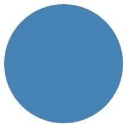
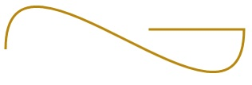

---
author: Jwmsft
ms.assetid: 54CC0BD4-1961-44D7-AB40-6E8B58E42D65
title: Draw shapes
description: Learn how to draw shapes, such as ellipses, rectangles, polygons, and paths. The Path class is the way to visualize a fairly complex vector-based drawing language in a XAML UI; for example, you can draw Bezier curves.
ms.author: jimwalk
ms.date: 02/08/2017
ms.topic: article
ms.prod: windows
ms.technology: uwp
keywords: windows 10, uwp
---
# Draw shapes

\[ Updated for UWP apps on Windows 10. For Windows 8.x articles, see the [archive](http://go.microsoft.com/fwlink/p/?linkid=619132) \]


**Important APIs**

-   [**Path**](https://msdn.microsoft.com/library/windows/apps/BR243355)
-   [**Windows.UI.Xaml.Shapes namespace**](https://msdn.microsoft.com/library/windows/apps/BR243401)
-   [**Windows.UI.Xaml.Media namespace**](https://msdn.microsoft.com/library/windows/apps/BR243045)

Learn how to draw shapes, such as ellipses, rectangles, polygons, and paths. The [**Path**](https://msdn.microsoft.com/library/windows/apps/BR243355) class is the way to visualize a fairly complex vector-based drawing language in a XAML UI; for example, you can draw Bezier curves.

## Introduction

Two sets of classes define a region of space in XAML UI: [**Shape**](https://msdn.microsoft.com/library/windows/apps/BR243377) classes and [**Geometry**](https://msdn.microsoft.com/library/windows/apps/BR210041) classes. The main difference between these classes is that a **Shape** has a brush associated with it and can be rendered to the screen, and a **Geometry** simply defines a region of space and is not rendered unless it helps contribute information to another UI property. You can think of a **Shape** as a [**UIElement**](https://msdn.microsoft.com/library/windows/apps/BR208911) with its boundary defined by a **Geometry**. This topic covers mainly the **Shape** classes.

The [**Shape**](https://msdn.microsoft.com/library/windows/apps/BR243377) classes are [**Line**](https://msdn.microsoft.com/library/windows/apps/BR243345), [**Ellipse**](https://msdn.microsoft.com/library/windows/apps/BR243343), [**Rectangle**](https://msdn.microsoft.com/library/windows/apps/BR243371), [**Polygon**](https://msdn.microsoft.com/library/windows/apps/BR243359), [**Polyline**](https://msdn.microsoft.com/library/windows/apps/BR243365), and [**Path**](https://msdn.microsoft.com/library/windows/apps/BR243355). **Path** is interesting because it can define an arbitrary geometry, and the [**Geometry**](https://msdn.microsoft.com/library/windows/apps/BR210041) class is involved here because that's one way to define the parts of a **Path**.

## Fill and Stroke for shapes

For a [**Shape**](https://msdn.microsoft.com/library/windows/apps/BR243377) to render to the app canvas, you must associate a [**Brush**](https://msdn.microsoft.com/library/windows/apps/BR228076) with it. Set the [**Fill**](https://msdn.microsoft.com/library/windows/apps/windows.ui.xaml.shapes.shape.fill) property of the **Shape** to the **Brush** you want. For more info about brushes, see [Using brushes](using-brushes.md).

A [**Shape**](https://msdn.microsoft.com/library/windows/apps/BR243377) can also have a [**Stroke**](https://msdn.microsoft.com/library/windows/apps/windows.ui.xaml.shapes.shape.stroke), which is a line that is drawn around the shape's perimeter. A **Stroke** also requires a [**Brush**](https://msdn.microsoft.com/library/windows/apps/BR228076) that defines its appearance, and should have a non-zero value for [**StrokeThickness**](https://msdn.microsoft.com/library/windows/apps/windows.ui.xaml.shapes.shape.strokethickness). **StrokeThickness** is a property that defines the perimeter's thickness around the shape edge. If you don't specify a **Brush** value for **Stroke**, or if you set **StrokeThickness** to 0, then the border around the shape is not drawn.

## Ellipse

An [**Ellipse**](https://msdn.microsoft.com/library/windows/apps/BR243343) is a shape with a curved perimeter. To create a basic **Ellipse**, specify a [**Width**](https://msdn.microsoft.com/library/windows/apps/BR208751), [**Height**](https://msdn.microsoft.com/library/windows/apps/BR208718), and a [**Brush**](https://msdn.microsoft.com/library/windows/apps/BR228076) for the [**Fill**](https://msdn.microsoft.com/library/windows/apps/windows.ui.xaml.shapes.shape.fill).

The next example creates an [**Ellipse**](https://msdn.microsoft.com/library/windows/apps/BR243343) with a [**Width**](https://msdn.microsoft.com/library/windows/apps/BR208751) of 200 and a [**Height**](https://msdn.microsoft.com/library/windows/apps/BR208718) of 200, and uses a [**SteelBlue**](https://msdn.microsoft.com/library/windows/apps/Hh748056) colored [**SolidColorBrush**](https://msdn.microsoft.com/library/windows/apps/BR242962) as its [**Fill**](https://msdn.microsoft.com/library/windows/apps/windows.ui.xaml.shapes.shape.fill).

```xml
<Ellipse Fill="SteelBlue" Height="200" Width="200" />
```

```csharp
var ellipse1 = new Ellipse();
ellipse1.Fill = new SolidColorBrush(Windows.UI.Colors.SteelBlue);
ellipse1.Width = 200;
ellipse1.Height = 200;

layoutRoot.Children.Add(ellipse1);
```

Here's the rendered [**Ellipse**](https://msdn.microsoft.com/library/windows/apps/BR243343).



In this case the [**Ellipse**](https://msdn.microsoft.com/library/windows/apps/BR243343) is what most people would consider a circle, but that's how you declare a circle shape in XAML: use an **Ellipse** with equal [**Width**](https://msdn.microsoft.com/library/windows/apps/BR208751) and [**Height**](https://msdn.microsoft.com/library/windows/apps/BR208718).

When an [**Ellipse**](https://msdn.microsoft.com/library/windows/apps/BR243343) is positioned in a UI layout, its size is assumed to be the same as a rectangle with that [**Width**](https://msdn.microsoft.com/library/windows/apps/BR208751) and [**Height**](https://msdn.microsoft.com/library/windows/apps/BR208718); the area outside the perimeter does not have rendering but still is part of its layout slot size.

A set of 6 [**Ellipse**](https://msdn.microsoft.com/library/windows/apps/BR243343) elements are part of the control template for the [**ProgressRing**](https://msdn.microsoft.com/library/windows/apps/BR227538) control, and 2 concentric **Ellipse** elements are part of a [**RadioButton**](https://msdn.microsoft.com/library/windows/apps/BR227544).

## <span id="Rectangle"></span><span id="rectangle"></span><span id="RECTANGLE"></span>Rectangle

A [**Rectangle**](https://msdn.microsoft.com/library/windows/apps/BR243371) is a four-sided shape with its opposite sides being equal. To create a basic **Rectangle**, specify a [**Width**](https://msdn.microsoft.com/library/windows/apps/BR208751), a [**Height**](https://msdn.microsoft.com/library/windows/apps/BR208718), and a [**Fill**](https://msdn.microsoft.com/library/windows/apps/windows.ui.xaml.shapes.shape.fill).

You can round the corners of a [**Rectangle**](https://msdn.microsoft.com/library/windows/apps/BR243371). To create rounded corners, specify a value for the [**RadiusX**](https://msdn.microsoft.com/library/windows/apps/windows.ui.xaml.shapes.rectangle.radiusx.aspx) and [**RadiusY**](https://msdn.microsoft.com/library/windows/apps/windows.ui.xaml.shapes.rectangle.radiusy) properties. These properties specify the x-axis and y-axis of an ellipse that defines the curve of the corners. The maximum allowed value of **RadiusX** is the [**Width**](https://msdn.microsoft.com/library/windows/apps/BR208751) divided by two and the maximum allowed value of **RadiusY** is the [**Height**](https://msdn.microsoft.com/library/windows/apps/BR208718) divided by two.

The next example creates a [**Rectangle**](https://msdn.microsoft.com/library/windows/apps/BR243371) with a [**Width**](https://msdn.microsoft.com/library/windows/apps/BR208751) of 200 and a [**Height**](https://msdn.microsoft.com/library/windows/apps/BR208718) of 100. It uses a [**Blue**](https://msdn.microsoft.com/library/windows/apps/Hh747837) value of [**SolidColorBrush**](https://msdn.microsoft.com/library/windows/apps/BR242962) for its [**Fill**](https://msdn.microsoft.com/library/windows/apps/windows.ui.xaml.shapes.shape.fill) and a [**Black**](https://msdn.microsoft.com/library/windows/apps/Hh747833) value of **SolidColorBrush** for its [**Stroke**](https://msdn.microsoft.com/library/windows/apps/windows.ui.xaml.shapes.shape.stroke). We set the [**StrokeThickness**](https://msdn.microsoft.com/library/windows/apps/windows.ui.xaml.shapes.shape.strokethickness) to 3. We set the [**RadiusX**](https://msdn.microsoft.com/library/windows/apps/windows.ui.xaml.shapes.rectangle.radiusx.aspx) property to 50 and the [**RadiusY**](https://msdn.microsoft.com/library/windows/apps/windows.ui.xaml.shapes.rectangle.radiusy) property to 10, which gives the **Rectangle** rounded corners.

```xml
<Rectangle Fill="Blue"
           Width="200"
           Height="100"
           Stroke="Black"
           StrokeThickness="3"
           RadiusX="50"
           RadiusY="10" />
```

```csharp
var rectangle1 = new Rectangle();
rectangle1.Fill = new SolidColorBrush(Windows.UI.Colors.Blue);
rectangle1.Width = 200;
rectangle1.Height = 100;
rectangle1.Stroke = new SolidColorBrush(Windows.UI.Colors.Black);
rectangle1.StrokeThickness = 3;
rectangle1.RadiusX = 50;
rectangle1.RadiusY = 10;

layoutRoot.Children.Add(rectangle1);

```

Here's the rendered [**Rectangle**](https://msdn.microsoft.com/library/windows/apps/BR243371).



**Tip**  There are some scenarios for UI definitions where instead of using a [**Rectangle**](https://msdn.microsoft.com/library/windows/apps/BR243371), a [**Border**](https://msdn.microsoft.com/library/windows/apps/BR209250) might be more appropriate. If your intention is to create a rectangle shape around other content, it might be better to use **Border** because it can have child content and will automatically size around that content, rather than using the fixed dimensions for height and width like **Rectangle** does. A **Border** also has the option of having rounded corners if you set the [**CornerRadius**](https://msdn.microsoft.com/library/windows/apps/windows.ui.xaml.controls.border.cornerradius) property.

 

On the other hand, a [**Rectangle**](https://msdn.microsoft.com/library/windows/apps/BR243371) is probably a better choice for control composition. A **Rectangle** shape is seen in many control templates because it's used as a "FocusVisual" part for focusable controls. Whenever the control is in a "Focused" visual state, this rectangle is made visible, in other states it's hidden.

## Polygon

A [**Polygon**](https://msdn.microsoft.com/library/windows/apps/BR243359) is a shape with a boundary defined by an arbitrary number of points. The boundary is created by connecting a line from one point to the next, with the last point connected to the first point. The [**Points**](https://msdn.microsoft.com/library/windows/apps/windows.ui.xaml.shapes.polygon.points.aspx) property defines the collection of points that make up the boundary. In XAML, you define the points with a comma-separated list. In code-behind you use a [**PointCollection**](https://msdn.microsoft.com/library/windows/apps/BR210220) to define the points and you add each individual point as a [**Point**](https://msdn.microsoft.com/library/windows/apps/BR225870) value to the collection.

You don't need to explicitly declare the points such that the start point and end point are both specified as the same [**Point**](https://msdn.microsoft.com/library/windows/apps/BR225870) value. The rendering logic for a [**Polygon**](https://msdn.microsoft.com/library/windows/apps/BR243359) assumes that you are defining a closed shape and will connect the end point to the start point implicitly.

The next example creates a [**Polygon**](https://msdn.microsoft.com/library/windows/apps/BR243359) with 4 points set to `(10,200)`, `(60,140)`, `(130,140)`, and `(180,200)`. It uses a [**LightBlue**](https://msdn.microsoft.com/library/windows/apps/Hh747960) value of [**SolidColorBrush**](https://msdn.microsoft.com/library/windows/apps/BR242962) for its [**Fill**](https://msdn.microsoft.com/library/windows/apps/windows.ui.xaml.shapes.shape.fill), and has no value for [**Stroke**](https://msdn.microsoft.com/library/windows/apps/windows.ui.xaml.shapes.shape.stroke) so it has no perimeter outline.

```xml
<Polygon Fill="LightBlue"
         Points="10,200,60,140,130,140,180,200" />
```

```csharp
var polygon1 = new Polygon();
polygon1.Fill = new SolidColorBrush(Windows.UI.Colors.LightBlue);

var points = new PointCollection();
points.Add(new Windows.Foundation.Point(10, 200));
points.Add(new Windows.Foundation.Point(60, 140));
points.Add(new Windows.Foundation.Point(130, 140));
points.Add(new Windows.Foundation.Point(180, 200));
polygon1.Points = points;

layoutRoot.Children.Add(polygon1);
```

Here's the rendered [**Polygon**](https://msdn.microsoft.com/library/windows/apps/BR243359).



**Tip**  A [**Point**](https://msdn.microsoft.com/library/windows/apps/BR225870) value is often used as a type in XAML for scenarios other than declaring the vertices of shapes. For example, a **Point** is part of the event data for touch events, so you can know exactly where in a coordinate space the touch action occurred. For more info about **Point** and how to use it in XAML or code, see the API reference topic for [**Point**](https://msdn.microsoft.com/library/windows/apps/BR225870).

## Line

A [**Line**](https://msdn.microsoft.com/library/windows/apps/BR243345) is simply a line drawn between two points in coordinate space. A **Line** ignores any value provided for [**Fill**](https://msdn.microsoft.com/library/windows/apps/windows.ui.xaml.shapes.shape.fill), because it has no interior space. For a **Line**, make sure to specify values for the [**Stroke**](https://msdn.microsoft.com/library/windows/apps/windows.ui.xaml.shapes.shape.stroke) and [**StrokeThickness**](https://msdn.microsoft.com/library/windows/apps/windows.ui.xaml.shapes.shape.strokethickness) properties, because otherwise the **Line** won't render.

You don't use [**Point**](https://msdn.microsoft.com/library/windows/apps/BR225870) values to specify a [**Line**](https://msdn.microsoft.com/library/windows/apps/BR243345) shape, instead you use discrete [**Double**](https://msdn.microsoft.com/library/windows/apps/xaml/system.double.aspx) values for [**X1**](https://msdn.microsoft.com/library/windows/apps/windows.ui.xaml.shapes.line.x1.aspx), [**Y1**](https://msdn.microsoft.com/library/windows/apps/windows.ui.xaml.shapes.line.y1.aspx), [**X2**](https://msdn.microsoft.com/library/windows/apps/windows.ui.xaml.shapes.line.x2.aspx) and [**Y2**](https://msdn.microsoft.com/library/windows/apps/windows.ui.xaml.shapes.line.y2.aspx). This enables minimal markup for horizontal or vertical lines. For example, `<Line Stroke="Red" X2="400"/>` defines a horizontal line that is 400 pixels long. The other X,Y properties are 0 by default, so in terms of points this XAML would draw a line from `(0,0)` to `(400,0)`. You could then use a [**TranslateTransform**](https://msdn.microsoft.com/library/windows/apps/BR243027) to move the entire **Line**, if you wanted it to start at a point other than (0,0).

```xml
<Line Stroke="Red" X2="400"/>
```

```csharp
var line1 = new Line();
line1.Stroke = new SolidColorBrush(Windows.UI.Colors.Red);
line1.X2 = 400;

layoutRoot.Children.Add(line1);

```

## <span id="_Polyline"></span><span id="_polyline"></span><span id="_POLYLINE"></span> Polyline

A [**Polyline**](https://msdn.microsoft.com/library/windows/apps/BR243365) is similar to a [**Polygon**](https://msdn.microsoft.com/library/windows/apps/BR243359) in that the boundary of the shape is defined by a set of points, except the last point in a **Polyline** is not connected to the first point.

**Note**   You could explicitly have an identical start point and end point in the [**Points**](https://msdn.microsoft.com/library/windows/apps/windows.ui.xaml.shapes.polyline.points.aspx) set for the [**Polyline**](https://msdn.microsoft.com/library/windows/apps/BR243365), but in that case you probably could have used a [**Polygon**](https://msdn.microsoft.com/library/windows/apps/BR243359) instead.


If you specify a [**Fill**](https://msdn.microsoft.com/library/windows/apps/windows.ui.xaml.shapes.shape.fill) of a [**Polyline**](https://msdn.microsoft.com/library/windows/apps/BR243365), the **Fill** paints the interior space of the shape, even if the start point and end point of the [**Points**](https://msdn.microsoft.com/library/windows/apps/windows.ui.xaml.shapes.polyline.points.aspx) set for the **Polyline** do not intersect. If you do not specify a **Fill**, then the **Polyline** is similar to what would have rendered if you had specified several individual [**Line**](https://msdn.microsoft.com/library/windows/apps/BR243345) elements where the start points and end points of consecutive lines intersected.

As with a [**Polygon**](https://msdn.microsoft.com/library/windows/apps/BR243359), the [**Points**](https://msdn.microsoft.com/library/windows/apps/windows.ui.xaml.shapes.polyline.points.aspx) property defines the collection of points that make up the boundary. In XAML, you define the points with a comma-separated list. In code-behind, you use a [**PointCollection**](https://msdn.microsoft.com/library/windows/apps/BR210220) to define the points and you add each individual point as a [**Point**](https://msdn.microsoft.com/library/windows/apps/BR225870) structure to the collection.

This example creates a [**Polyline**](https://msdn.microsoft.com/library/windows/apps/BR243365) with four points set to `(10,200)`, `(60,140)`, `(130,140)`, and `(180,200)`. A [**Stroke**](https://msdn.microsoft.com/library/windows/apps/windows.ui.xaml.shapes.shape.stroke) is defined but not a [**Fill**](https://msdn.microsoft.com/library/windows/apps/windows.ui.xaml.shapes.shape.fill).

```xml
<Polyline Stroke="Black"
        StrokeThickness="4"
        Points="10,200,60,140,130,140,180,200" />
```

```csharp
var polyline1 = new Polyline();
polyline1.Stroke = new SolidColorBrush(Windows.UI.Colors.Black);
polyline1.StrokeThickness = 4;

var points = new PointCollection();
points.Add(new Windows.Foundation.Point(10, 200));
points.Add(new Windows.Foundation.Point(60, 140));
points.Add(new Windows.Foundation.Point(130, 140));
points.Add(new Windows.Foundation.Point(180, 200));
polyline1.Points = points;

layoutRoot.Children.Add(polyline1);
```

Here's the rendered [**Polyline**](https://msdn.microsoft.com/library/windows/apps/BR243365). Notice that the first and last points are not connected by the [**Stroke**](https://msdn.microsoft.com/library/windows/apps/windows.ui.xaml.shapes.shape.stroke) outline as they are in a [**Polygon**](https://msdn.microsoft.com/library/windows/apps/BR243359).



## Path

A [**Path**](https://msdn.microsoft.com/library/windows/apps/BR243355) is the most versatile [**Shape**](https://msdn.microsoft.com/library/windows/apps/BR243377) because you can use it to define an arbitrary geometry. But with this versatility comes complexity. Let's now look at how to create a basic **Path** in XAML.

You define the geometry of a path with the [**Data**](https://msdn.microsoft.com/library/windows/apps/windows.ui.xaml.shapes.path.data) property. There are two techniques for setting **Data**:

-   You can set a string value for [**Data**](https://msdn.microsoft.com/library/windows/apps/windows.ui.xaml.shapes.path.data) in XAML. In this form, the **Path.Data** value is consuming a serialization format for graphics. You typically don't text-edit this value in string form after it is first established. Instead, you use design tools that enable you to work in a design or drawing metaphor on a surface. Then you save or export the output, and this gives you a XAML file or XAML string fragment with **Path.Data** information.
-   You can set the [**Data**](https://msdn.microsoft.com/library/windows/apps/windows.ui.xaml.shapes.path.data) property to a single [**Geometry**](https://msdn.microsoft.com/library/windows/apps/BR210041) object. This can be done in code or in XAML. That single **Geometry** is typically a [**GeometryGroup**](https://msdn.microsoft.com/library/windows/apps/windows.ui.xaml.media.geometrygroup), which acts as a container that can composite multiple geometry definitions into a single object for purposes of the object model. The most common reason for doing this is because you want to use one or more of the curves and complex shapes that can be defined as [**Segments**](https://msdn.microsoft.com/library/windows/apps/BR210164) values for a [**PathFigure**](https://msdn.microsoft.com/library/windows/apps/BR210143), for example [**BezierSegment**](https://msdn.microsoft.com/library/windows/apps/BR228068).

This example shows a [**Path**](https://msdn.microsoft.com/library/windows/apps/BR243355) that might have resulted from using Blend for Visual Studio to produce just a few vector shapes and then saving the result as XAML. The total **Path** consists of a Bezier curve segment and a line segment. The example is mainly intended to give you some examples of what elements exist in the [**Path.Data**](https://msdn.microsoft.com/library/windows/apps/windows.ui.xaml.shapes.path.data) serialization format and what the numbers represent.

This [**Data**](https://msdn.microsoft.com/library/windows/apps/windows.ui.xaml.shapes.path.data) begins with the move command, indicated by "M", which establishes an absolute start point for the path.

The first segment is a cubic Bezier curve that begins at `(100,200)` and ends at `(400,175)`, which is drawn by using the two control points `(100,25)` and `(400,350)`. This segment is indicated by the "C" command in the [**Data**](https://msdn.microsoft.com/library/windows/apps/windows.ui.xaml.shapes.path.data) attribute string.

The second segment begins with an absolute horizontal line command "H", which specifies a line drawn from the preceding subpath endpoint `(400,175)` to a new endpoint `(280,175)`. Because it's a horizontal line command, the value specified is an x-coordinate.

```xml
<Path Stroke="DarkGoldenRod" 
      StrokeThickness="3"
      Data="M 100,200 C 100,25 400,350 400,175 H 280" />
```

Here's the rendered [**Path**](https://msdn.microsoft.com/library/windows/apps/BR243355).



The next example shows a usage of the other technique we discussed: a [**GeometryGroup**](https://msdn.microsoft.com/library/windows/apps/windows.ui.xaml.media.geometrygroup) with a [**PathGeometry**](https://msdn.microsoft.com/library/windows/apps/BR210168). This example exercises some of the contributing geometry types that can be used as part of a **PathGeometry**: [**PathFigure**](https://msdn.microsoft.com/library/windows/apps/BR210143) and the various elements that can be a segment in [**PathFigure.Segments**](https://msdn.microsoft.com/library/windows/apps/BR210164).

```xml
<Path Stroke="Black" StrokeThickness="1" Fill="#CCCCFF">
    <Path.Data>
        <GeometryGroup>
            <RectangleGeometry Rect="50,5 100,10" />
            <RectangleGeometry Rect="5,5 95,180" />
            <EllipseGeometry Center="100, 100" RadiusX="20" RadiusY="30"/>
            <RectangleGeometry Rect="50,175 100,10" />
            <PathGeometry>
                <PathGeometry.Figures>
                    <PathFigureCollection>
                        <PathFigure IsClosed="true" StartPoint="50,50">
                            <PathFigure.Segments>
                                <PathSegmentCollection>
                                    <BezierSegment Point1="75,300" Point2="125,100" Point3="150,50"/>
                                    <BezierSegment Point1="125,300" Point2="75,100"  Point3="50,50"/>
                                </PathSegmentCollection>
                            </PathFigure.Segments>
                        </PathFigure>
                    </PathFigureCollection>
                </PathGeometry.Figures>
            </PathGeometry>
        </GeometryGroup>
    </Path.Data>
</Path>
```

```csharp
var path1 = new Windows.UI.Xaml.Shapes.Path();
path1.Fill = new SolidColorBrush(Windows.UI.Color.FromArgb(255, 204, 204, 255));
path1.Stroke = new SolidColorBrush(Windows.UI.Colors.Black);
path1.StrokeThickness = 1;

var geometryGroup1 = new GeometryGroup();
var rectangleGeometry1 = new RectangleGeometry();
rectangleGeometry1.Rect = new Rect(50, 5, 100, 10);
var rectangleGeometry2 = new RectangleGeometry();
rectangleGeometry2.Rect = new Rect(5, 5, 95, 180);
geometryGroup1.Children.Add(rectangleGeometry1);
geometryGroup1.Children.Add(rectangleGeometry2);

var ellipseGeometry1 = new EllipseGeometry();
ellipseGeometry1.Center = new Point(100, 100);
ellipseGeometry1.RadiusX = 20;
ellipseGeometry1.RadiusY = 30;
geometryGroup1.Children.Add(ellipseGeometry1);

var pathGeometry1 = new PathGeometry();
var pathFigureCollection1 = new PathFigureCollection();
var pathFigure1 = new PathFigure();
pathFigure1.IsClosed = true;
pathFigure1.StartPoint = new Windows.Foundation.Point(50, 50);
pathFigureCollection1.Add(pathFigure1);
pathGeometry1.Figures = pathFigureCollection1;

var pathSegmentCollection1 = new PathSegmentCollection();
var pathSegment1 = new BezierSegment();
pathSegment1.Point1 = new Point(75, 300);
pathSegment1.Point2 = new Point(125, 100);
pathSegment1.Point3 = new Point(150, 50);
pathSegmentCollection1.Add(pathSegment1);

var pathSegment2 = new BezierSegment();
pathSegment2.Point1 = new Point(125, 300);
pathSegment2.Point2 = new Point(75, 100);
pathSegment2.Point3 = new Point(50, 50);
pathSegmentCollection1.Add(pathSegment2);
pathFigure1.Segments = pathSegmentCollection1;

geometryGroup1.Children.Add(pathGeometry1);
path1.Data = geometryGroup1;

layoutRoot.Children.Add(path1);

```

Here's the rendered [**Path**](https://msdn.microsoft.com/library/windows/apps/BR243355).



Using [**PathGeometry**](https://msdn.microsoft.com/library/windows/apps/BR210168) may be more readable than populating a [**Path.Data**](https://msdn.microsoft.com/library/windows/apps/windows.ui.xaml.shapes.path.data) string. On the other hand, [**Path.Data**](https://msdn.microsoft.com/library/windows/apps/windows.ui.xaml.shapes.path.data) uses a syntax compatible with Scalable Vector Graphics (SVG) image path definitions so it may be useful for porting graphics from SVG, or as output from a tool like Blend.

 

 




