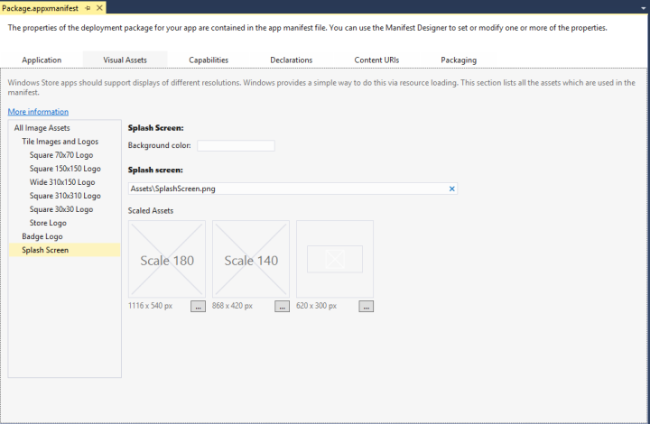

# Add a splash screen

Set your app's splash screen image and background color using Microsoft Visual Studio.

## Set the splash screen image and background color in Visual Studio

When you use a Visual Studio template to create your app, a default image is added to your project and set as the splash screen image. The background color for your splash screen defaults to a light gray. If you want to change the default image or color of your app's splash screen, follow these steps:

1. Open your existing Universal Windows Platform (UWP) app project in Visual Studio.
2. From **Solution Explorer**, open the "Package.appxmanifest" file. You can also open this file from the menu bar by choosing **Project** &gt; **Store** &gt; **Edit App Manifest**.
3. Open the **Visual Assets** tab and select **Splash Screen** from the **All Visual Assets** pane on the left side of the "Package.appxmanifest" window. If you're changing your splash screen for the first time, you'll see the "Assets\\SplashScreen.png" path in the **Splash Screen** field.

    The following screen shot shows the "Package.appxmanifest" window in Visual Studio. Depending on the type of project, you will see a slightly different set of visual assets.

    

    If you open "Package.appxmanifest" in a text editor, the [**SplashScreen element**](/uwp/schemas/appxpackage/appxmanifestschema/element-splashscreen) appears as a child of the [**VisualElements element**](/uwp/schemas/appxpackage/appxmanifestschema/element-visualelements). The default splash screen markup in the manifest file looks like this in a text editor:

    ```xml
    <uap:SplashScreen Image="Assets\SplashScreen.png" />
    ```

4. To select a new splash screen image for a UWP app, press the button with an ellipsis that appears next to the **1240 x 600 px** label below **Scaled Assets**. Choose the 1240 x 600 pixel image (.png, .jpg, or .jpeg) you'd like to use for your splash screen image.

    **Important**  The splash screen image you choose must be 620 x 300 pixels using a 1x scaling factor. Also, when designing your splash screen, note that it is smaller than the screen, and centered. It does not fill the screen like a splash screen for a Windows Phone Store app does.

5. To select a new splash screen image for a Windows Phone Store app, press the button with an ellipsis that appears next to the **1152 x 1920 px** label below **Scaled Assets**. Choose the 1152 x 1920 pixel image (.png, .jpg, or .jpeg) you'd like to use for your splash screen image.

    **Important**  The splash screen image you choose must be 1152 x 1920 pixels which is the correct size for a 2.4x scaling factor. If this is the only asset you provide then it will be scaled down for 1.4x and 1x scaling factors.

6. In the **Background Color** field of the **Splash Screen** section, set the background color displayed with your splash screen image. You can enter either the name of a color or '\#' and the hex value of a color. For a list of the names of available colors, see [**SplashScreen element**](/uwp/schemas/appxpackage/appxmanifestschema/element-splashscreen). Setting a background color for your splash screen is optional. If you don't specify a color for a UWP app, the splash screen background color defaults to a light gray (hex value \#464646). This is the same color as the default **Tile** background color (see the **Background Color** field of the **Tile Images and Logos** section in the **Visual Assets** tab). If you don't specify a color for a Windows Phone, or set it to "transparent", then the splash screen background color will be transparent.

## Summary and next steps

If your app takes a while to load, consider adding an extended splash screen. For step-by-step guidance, see [Create a customized splash screen](create-a-customized-splash-screen.md).

## Related topics

* [Create a customized splash screen](create-a-customized-splash-screen.md)
* [Package manifest schema reference: SplashScreen element](/uwp/schemas/appxpackage/appxmanifestschema/element-splashscreen)
* [Windows.ApplicationModel.Activation.SplashScreen class](/uwp/api/Windows.ApplicationModel.Activation.SplashScreen)