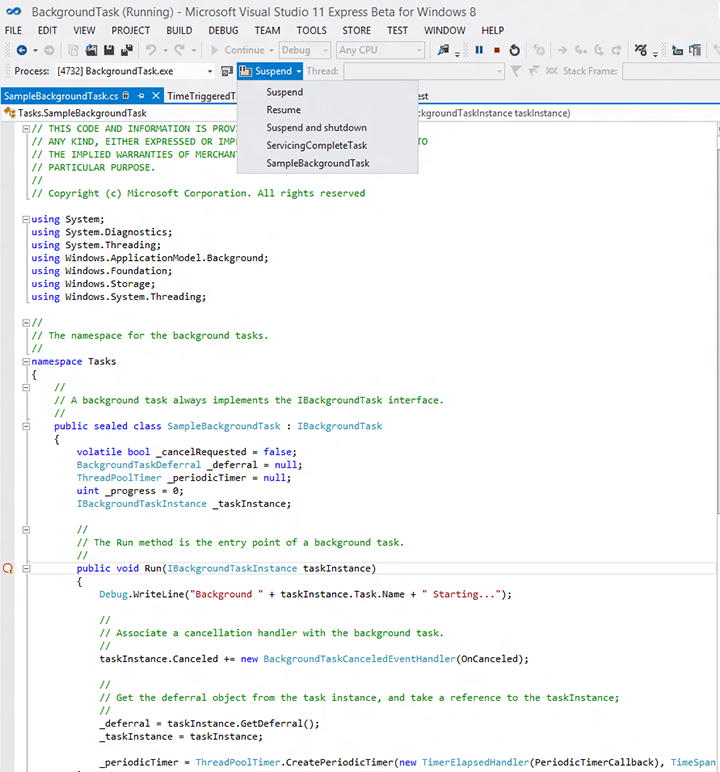
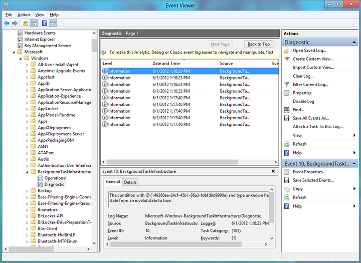

# Debug a background task

**Important APIs**
-   [Windows.ApplicationModel.Background](/uwp/api/Windows.ApplicationModel.Background)

Learn how to debug a background task, including background task activation and debug tracing in the Windows event log.

## Debugging out-of-process vs. in-process background tasks
This topic primarily addresses background tasks that run in a separate process than the host app. If you are debugging an in-process background task, then you won't have a separate background task project and can  set a breakpoint on **OnBackgroundActivated()** (where your in-process background code runs) and see step 2 in [Trigger background tasks manually to debug background task code](#trigger-background-tasks-manually-to-debug-background-task-code), below, for instructions about how to trigger your background code to execute.

## Make sure the background task project is set up correctly

This topic assumes that you already have an existing app with a background task to debug. The following is specific to background tasks that run out-of-process and does not apply to in-process background tasks.

-   In C# and C++, make sure the main project references the background task project. If this reference is not in place, the background task won't be included in the app package.
-   In C# and C++, make sure the **Output type** of the background task project is "Windows Runtime Component".
-   The background class must be declared in the entry point attribute in the package manifest.

## Trigger background tasks manually to debug background task code

Background tasks can be triggered manually through Microsoft Visual Studio. Then you can step through the code and debug it.

1.  In C#, put a breakpoint in the Run method of the background class (for in-process background tasks put the breakpoint in App.OnBackgroundActivated()), and/or write debugging output by using [**System.Diagnostics**](/dotnet/api/system.diagnostics).

    In C++, put a breakpoint in the Run function of the background class (for in-process background tasks put the breakpoint in App.OnBackgroundActivated()), and/or write debugging output by using [**OutputDebugString**](/windows/desktop/api/debugapi/nf-debugapi-outputdebugstringw).

2.  Run your application in the debugger and then trigger the background task using the **Lifecycle Events** toolbar. This drop down shows the names of the background tasks that can be activated by Visual Studio.

> [!NOTE]
> The Lifecycle Events toolbar options are not shown by default in Visual Studio. 
> To show these options, right-click on the current toolbar in Visual Studio and ensure the option **Debug Location** is enabled.

    For this to work, the background task must already be registered and it must still be waiting for the trigger. For example, if a background task was registered with a one-shot TimeTrigger and that trigger has already fired, launching the task through Visual Studio will have no effect.

> [!Note]
> Background tasks using the following triggers cannot be activated in this manner:
> [**Application trigger**](/uwp/api/windows.applicationmodel.background.applicationtrigger), [**MediaProcessing trigger**](/uwp/api/windows.applicationmodel.background.mediaprocessingtrigger),  [**ControlChannelTrigger**](/uwp/api/Windows.Networking.Sockets.ControlChannelTrigger),  [**PushNotificationTrigger**](/uwp/api/Windows.ApplicationModel.Background.PushNotificationTrigger), and background tasks using a [**SystemTrigger**](/uwp/api/Windows.ApplicationModel.Background.SystemTrigger) with the [**SmsReceived**](/uwp/api/Windows.ApplicationModel.Background.SystemTriggerType) trigger type.  
> **Application trigger** and **MediaProcessingTrigger** can be signaled manually in code with `trigger.RequestAsync()`.

3.  When the background task activates, the debugger will attach to it and display debug output in VS.

## Debug background task activation

> [!NOTE]
> This section is specific to background tasks the run out-of-process and does not apply to in-process background tasks.

Background task activation depends on three things:

-   The name and namespace of the background task class
-   The entry point attribute specified in the package manifest
-   The entry point specified by your app when registering the background task

1.  Use Visual Studio to note the entry point of the background task:

    -   In C# and C++, note the name and namespace of the background task class specified in the background task project.

2.  Use the manifest designer to check that the background task is correctly declared in the package manifest:

    -   In C# and C++, the entry point attribute must match the background task namespace followed by the class name. For example: RuntimeComponent1.MyBackgroundTask.
    -   All the trigger type(s) used with the task must also be specified.
    -   The executable MUST NOT be specified unless you are using the [**ControlChannelTrigger**](/uwp/api/Windows.Networking.Sockets.ControlChannelTrigger) or [**PushNotificationTrigger**](/uwp/api/Windows.ApplicationModel.Background.PushNotificationTrigger).

3.  Windows only. To see the entry point used by Windows to activate the background task, enable debug tracing and use the Windows event log.

    If you follow this procedure and the event log shows the wrong entry point or trigger for the background task, your app is not registering the background task correctly. For help with this task see [Register a background task](register-a-background-task.md).

    1.  Open event viewer by going to the Start screen and searching for eventvwr.exe.
    2.  Go to **Application and Services Logs** -&gt; **Microsoft** -&gt; **Windows** -&gt; **BackgroundTaskInfrastructure** in the event viewer.
    3.  In the actions pane, select **View** -&gt; **Show Analytic and Debug Logs** to enable the diagnostic logging.
    4.  Select the **Diagnostic log** and click **Enable Log**.
    5.  Now try using your app to register and activate the background task again.
    6.  View the diagnostic logs for detailed error information. This will include the entry point registered for the background task.

## Background tasks and Visual Studio package deployment

If an app that uses background tasks is deployed using Visual Studio, and the version (major and/or minor) specified in Manifest Designer is then updated, subsequently re-deploying the app with Visual Studio may cause the app’s background tasks to stall. This can be remedied as follows:

-   Use Windows PowerShell to deploy the updated app (instead of Visual Studio) by running the script generated alongside the package.
-   If you already deployed the app using Visual Studio and its background tasks are now stalled, reboot or log off/log in to get the app’s background tasks working again.
-   You can select the "Always re-install my package" debugging option to avoid this in C# projects.
-   Wait until the app is ready for final deployment to increment the package version (don’t change it while debugging).

## Remarks

-   Make sure your app checks for existing background task registrations before registering the background task again. Multiple registrations of the same background task can cause unexpected results by running the background task more than once each time it is triggered.
-   If the background task requires lock screen access make sure to put the app on the lock screen before trying to debug the background task. For info on specifying manifest options for lock screen-capable apps, see [Declare background tasks in the application manifest](declare-background-tasks-in-the-application-manifest.md).
-   Background task registration parameters are validated at the time of registration. An error is returned if any of the registration parameters are invalid. Ensure that your app gracefully handles scenarios where background task registration fails - if instead your app depends on having a valid registration object after attempting to register a task, it may crash.

For more info on using VS to debug a background task see [How to trigger suspend, resume, and background events in UWP apps](/visualstudio/debugger/how-to-trigger-suspend-resume-and-background-events-for-windows-store-apps-in-visual-studio?view=vs-2015).

## Related topics

* [Create and register an out-of-process background task](create-and-register-a-background-task.md)
* [Create and register an in-process background task](create-and-register-an-inproc-background-task.md)
* [Register a background task](register-a-background-task.md)
* [Declare background tasks in the application manifest](declare-background-tasks-in-the-application-manifest.md)
* [Guidelines for background tasks](guidelines-for-background-tasks.md)
* [How to trigger suspend, resume, and background events in UWP apps](/visualstudio/debugger/how-to-trigger-suspend-resume-and-background-events-for-windows-store-apps-in-visual-studio?view=vs-2015)
* [Analyzing the code quality of UWP apps with Visual Studio code analysis](/visualstudio/test/analyze-the-code-quality-of-store-apps-using-visual-studio-static-code-analysis?view=vs-2015)

 

 