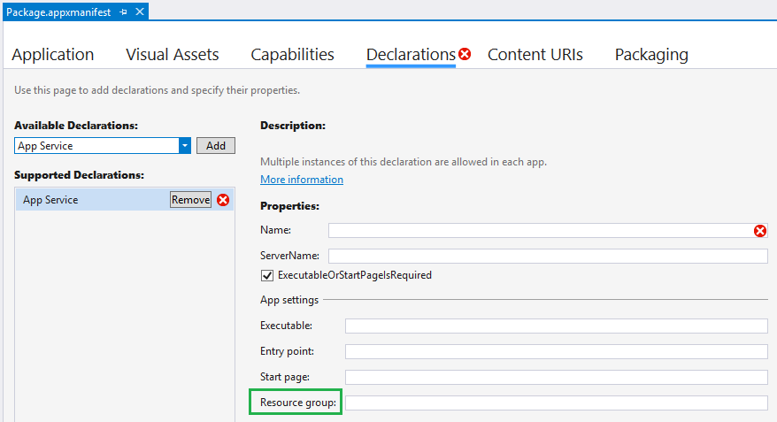

# Guidelines for background tasks

Ensure your app meets the requirements for running background tasks.

## Background task guidance

Consider the following guidance when developing your background task, and before publishing your app.

If you use a background task to play media in the background, see [Play media in the background](../audio-video-camera/background-audio.md) for information about improvements in Windows 10, version 1607, that make it much easier.

**In-process versus out-of-process background tasks:** Windows 10, version 1607, introduced [in-process background tasks](create-and-register-an-inproc-background-task.md) which allows you to run background code in the same process as your foreground app. Consider the following factors when deciding whether to have in-process vs. out-of-process background tasks:

|Consideration | Impact |
|--------------|--------|
|Resilience   | If your background process is running in another process, a crash in your background process won't take down your foreground application. Also, background activity can be terminated, even within your app, if it runs past execution time limits. Separating background work into a task separate from the foreground app may be a better choice when it isn't necessary for the foreground and background processes to communicate with each other (since one of the main advantages of in-process background tasks are that they remove the need for inter-process communication). |
|Simplicity    | In-process background tasks don't require cross-process communication and are less complex to write.  |
|Available triggers | In-process background tasks don't support the following triggers: [DeviceUseTrigger](/uwp/api/windows.applicationmodel.background.deviceusetrigger?f=255&MSPPError=-2147217396), [DeviceServicingTrigger](/uwp/api/windows.applicationmodel.background.deviceservicingtrigger) and **IoTStartupTask**. |
|VoIP | In-process background tasks don't support activating a VoIP background task within your application. |  

**Limits on the number of trigger instances:** There are limits to how many instances of some triggers an app can register. An app can only register   [ApplicationTrigger](/uwp/api/Windows.ApplicationModel.Background.ApplicationTrigger), [MediaProcessingTrigger](/uwp/api/windows.applicationmodel.background.mediaprocessingtrigger) and [DeviceUseTrigger](/uwp/api/windows.applicationmodel.background.deviceusetrigger?f=255&MSPPError=-2147217396) once per instance of the app. If an app goes over this limit, registration will throw an exception.

**CPU quotas:** Background tasks are limited by the amount of wall-clock usage time they get based on trigger type. Most triggers are limited to 30 seconds of wall-clock usage, while some have the ability to run up to 10 minutes in order to complete intensive tasks. Background tasks should be lightweight to save battery life and provide a better user experience for foreground apps. See [Support your app with background tasks](support-your-app-with-background-tasks.md) for the resource constraints applied to background tasks.

**Manage background tasks:** Your app should get a list of registered background tasks, register for progress and completion handlers, and handle those events appropriately. Your background task classes should report progress, cancellation, and completion. For more info see [Handle a cancelled background task](handle-a-cancelled-background-task.md), and [Monitor background task progress and completion](monitor-background-task-progress-and-completion.md).

**Use [BackgroundTaskDeferral](/uwp/api/Windows.ApplicationModel.Background.BackgroundTaskDeferral):** If your background task class runs asynchronous code, make sure to use deferrals. Otherwise your background task may be terminated prematurely when the [Run](/uwp/api/windows.applicationmodel.background.ibackgroundtask.run) method returns (or the [OnBackgroundActivated](/uwp/api/windows.ui.xaml.application.onbackgroundactivated) method in the case of in-process background tasks). For more information, see [Create and register an out-of-process background task](create-and-register-a-background-task.md).

Alternatively, request one deferral, and use **async/await** to complete asynchronous method calls. Close the deferral after the **await** method calls.

**Update the app manifest:**  For background tasks that run out-of-process, declare each background task in the application manifest, along with the type of triggers it is used with. Otherwise your app will not be able to register the background task at runtime.

If you have multiple background tasks, consider whether they should run in the same host process or be separated into different host processes. Put them in separate host processes if you are concerned that a failure in one background task could bring down other background tasks.  Use the **Resource group** entry in the manifest designer to group background tasks into different host processes. 

To set the **Resource group**, open the Package.appxmanifest designer, choose **Declarations**, and add an **App Service** declaration:

See the [application schema reference](/uwp/schemas/appxpackage/uapmanifestschema/element-application) for more information about the resource group setting.

Background tasks that run in the same process as the foreground app do not need to declare themselves in the application manifest. For more information about declaring background tasks that run out-of-process in the manifest, see [Declare background tasks in the application manifest](declare-background-tasks-in-the-application-manifest.md).

**Prepare for app updates:** If your app will be updated, create and register a **ServicingComplete** background task (see [SystemTriggerType](/uwp/api/Windows.ApplicationModel.Background.SystemTriggerType)) to unregister background tasks for the previous version of the app, and register the background tasks for the new version. This is also an appropriate time to perform app updates that may be necessary outside the context of running in the foreground.

**Request to execute background tasks:**

> **Important**  Starting in Windows 10, apps are no longer required to be on the lock screen as a prerequisite to run background tasks.

Universal Windows Platform (UWP) apps can run all supported task types without being pinned to the lock screen. However, apps must call [**GetAccessState**](/uwp/api/windows.applicationmodel.background.backgroundexecutionmanager.getaccessstatus) and check that the app is not denied from running in the background. Ensure that **GetAccessStatus** does not return one of the denied [**BackgroundAccessStatus**](/uwp/api/windows.applicationmodel.background.backgroundaccessstatus) enums. For example, this method will return **BackgroundAccessStatus.DeniedByUser** if the user has explicitly denied background task permissions for your app in the device's settings.

If your app is denied from running in the background, your app should call [**RequestAccessAsync**](/uwp/api/windows.applicationmodel.background.backgroundexecutionmanager.getaccessstatus) and ensure the response is not denied before registering background tasks.

For more information on user choice around background activity and Battery Saver, see [Optimize Background Activity](../debug-test-perf/optimize-background-activity.md). 
## Background task checklist

*Applies to both in-process and out-of-process background tasks*

-   Associate your background task with the correct trigger.
-   Add conditions to help ensure your background task runs successfully.
-   Handle background task progress, completion, and cancellation.
-   Re-register your background tasks during app launch. This ensures that they are registered the first time the app is launched. It also provides a way to detect whether the user has disabled your app's background execution capabilities (in the event registration fails).
-   Check for background task registration errors. If appropriate, attempt to register the background task again with different parameter values.
-   For all device families except desktop, if the device becomes low on memory, background tasks may be terminated. If an out of memory exception is not surfaced, or the app does not handle it, then the background task will be terminated without warning and without raising the OnCanceled event. This helps to ensure the user experience of the app in the foreground. Your background task should be designed to handle this scenario.

*Applies only to out-of-process background tasks*

-   Create your background task in a Windows Runtime component.
-   Do not display UI other than toasts, tiles, and badge updates from the background task.
-   In the [Run](/uwp/api/windows.applicationmodel.background.ibackgroundtask.run) method, request deferrals for each asynchronous method call, and close them when the method is done. Or, use one deferral with **async/await**.
-   Use persistent storage to share data between the background task and the app.
-   Declare each background task in the application manifest, along with the type of triggers it is used with. Make sure the entry point and trigger types are correct.
-   Do not specify an Executable element in the manifest unless you are using a trigger that should be run in the same context as the app (such as the [**ControlChannelTrigger**](/uwp/api/Windows.Networking.Sockets.ControlChannelTrigger)).

*Applies only to in-process background tasks*

- When cancelling a task, ensure that the `BackgroundActivated` event handler exits before the cancellation occurs or the whole process will be terminated.
-   Write background tasks that are short-lived. Background tasks are limited to 30 seconds of wall-clock usage.
-   Do not rely on user interaction in background tasks.

## Related topics

* [Create and register an in-process background task](create-and-register-an-inproc-background-task.md).
* [Create and register an out-of-process background task](create-and-register-a-background-task.md)
* [Declare background tasks in the application manifest](declare-background-tasks-in-the-application-manifest.md)
* [Play media in the background](../audio-video-camera/background-audio.md)
* [Handle a cancelled background task](handle-a-cancelled-background-task.md)
* [Monitor background task progress and completion](monitor-background-task-progress-and-completion.md)
* [Register a background task](register-a-background-task.md)
* [Respond to system events with background tasks](respond-to-system-events-with-background-tasks.md)
* [Set conditions for running a background task](set-conditions-for-running-a-background-task.md)
* [Update a live tile from a background task](update-a-live-tile-from-a-background-task.md)
* [Use a maintenance trigger](use-a-maintenance-trigger.md)
* [Run a background task on a timer](run-a-background-task-on-a-timer-.md)
* [Debug a background task](debug-a-background-task.md)
* [How to trigger suspend, resume, and background events in UWP apps (when debugging)](/previous-versions/hh974425(v=vs.110))

 

 