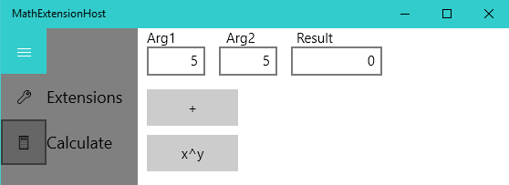

# Create and host an app extension

This article shows you how to create a Windows 10 app extension and host it in an app. App extensions are supported in UWP apps and [packaged desktop apps](/windows/apps/desktop/modernize/#msix-packages).

To demonstrate how to create an app extension, this article uses package manifest XML and code snippets from the [Math Extension code sample](https://github.com/MicrosoftDocs/windows-topic-specific-samples/tree/MathExtensionSample). This sample is a UWP app, but the features demonstrated in the sample are also applicable to packaged desktop apps. Follow these instructions to get started with the sample:

- Download and unzip the [Math Extension code sample](https://github.com/MicrosoftDocs/windows-topic-specific-samples/archive/MathExtensionSample.zip).
- In Visual Studio 2019, open MathExtensionSample.sln. Set the build type to x86 (**Build** > **Configuration Manager**, then change **Platform** to **x86** for both projects).
- Deploy the solution: **Build** > **Deploy Solution**.

## Introduction to app extensions

In Windows 10, app extensions provide functionality similar to what plug-ins, add-ins, and add-ons do on other platforms. App extensions were introduced in the Windows 10 Anniversary edition (version 1607, build 10.0.14393).

App extensions are UWP apps or packaged desktop apps that have an extension declaration that allows them to share content and deployment events with a host app. An extension app can provide multiple extensions.

Because app extensions are just UWP apps or packaged desktop apps, they can also be fully functional apps, host extensions, and provide extensions to other apps--all without creating separate app packages.

When you create an app extension host, you create an opportunity to develop an ecosystem around your app in which other developers can enhance your app in ways that you may not have expected or had the resources for. Consider Microsoft Office extensions, Visual Studio extensions, browser extensions, etc. These create richer experiences for those apps that go beyond the functionality they shipped with. Extensions can add value and longevity to your app.

At a high level, to set up an app extension relationship, we need to:

1. Declare an app to be an extension host.
2. Declare an app to be an extension.
3. Decide whether to implement the extension as an app service, background task, or some other way.
4. Define how the hosts and its extensions will communicate.
5. Use the [Windows.ApplicationModel.AppExtensions](/uwp/api/Windows.ApplicationModel.AppExtensions) API in the host app to access the extensions.

Let's see how this is done by examining the [Math Extension code sample](https://github.com/MicrosoftDocs/windows-topic-specific-samples/archive/MathExtensionSample.zip) which implements a hypothetical calculator that you can add new functions to by using extensions. In Microsoft Visual Studio 2019, load **MathExtensionSample.sln** from the code sample.



## Declare an app to be an extension host

An app identifies itself as an app extension host by declaring the `<AppExtensionHost>` element in its Package.appxmanifest file. See the **Package.appxmanifest** file in the **MathExtensionHost** project to see how this is done.

_Package.appxmanifest in the MathExtensionHost project_
```xml
<Package
  ...
  xmlns:uap3="http://schemas.microsoft.com/appx/manifest/uap/windows10/3"
  IgnorableNamespaces="uap uap3 mp">
  ...
    <Applications>
      <Application Id="App" ... >
        ...
        <Extensions>
            <uap3:Extension Category="windows.appExtensionHost">
                <uap3:AppExtensionHost>
                  <uap3:Name>com.microsoft.mathext</uap3:Name>
                </uap3:AppExtensionHost>
          </uap3:Extension>
        </Extensions>
      </Application>
    </Applications>
    ...
</Package>
```

Notice the `xmlns:uap3="http://..."` and the presence of `uap3` in `IgnorableNamespaces`. These are necessary because we are using the uap3 namespace.

`<uap3:Extension Category="windows.appExtensionHost">` identifies this app as an extension host.

The **Name** element in `<uap3:AppExtensionHost>` is the _extension contract_ name. When an extension specifies the same extension contract name, the host will be able to find it. By convention, we recommend building the extension contract name using your app or publisher name to avoid potential collisions with other extension contract names.

You can define multiple hosts and multiple extensions in the same app. In this example, we declare one host. The extension is defined in another app.

## Declare an app to be an extension

An app identifies itself as an app extension by declaring the `<uap3:AppExtension>` element in its **Package.appxmanifest** file. Open the **Package.appxmanifest** file in the **MathExtension** project to see how this is done.

_Package.appxmanifest in the MathExtension project:_
```xml
<Package
  ...
  xmlns:uap3="http://schemas.microsoft.com/appx/manifest/uap/windows10/3"
  IgnorableNamespaces="uap uap3 mp">
  ...
    <Applications>
      <Application Id="App" ... >
        ...
        <Extensions>
          ...
          <uap3:Extension Category="windows.appExtension">
            <uap3:AppExtension Name="com.microsoft.mathext"
                               Id="power"
                               DisplayName="x^y"
                               Description="Exponent"
                               PublicFolder="Public">
              <uap3:Properties>
                <Service>com.microsoft.powservice</Service>
              </uap3:Properties>
              </uap3:AppExtension>
          </uap3:Extension>
        </Extensions>
      </Application>
    </Applications>
    ...
</Package>
```

Again, notice the `xmlns:uap3="http://..."` line, and the presence of `uap3` in `IgnorableNamespaces`. These are necessary because we are using the `uap3` namespace.

`<uap3:Extension Category="windows.appExtension">` identifies this app as an extension.

The meaning of the `<uap3:AppExtension>` attributes are as follows:

|Attribute|Description|Required|
|---------|-----------|:------:|
|**Name**|This is the extension contract name. When it matches the **Name** declared in a host, that host will be able to find this extension.| :heavy_check_mark: |
|**ID**| Uniquely identifies this extension. Because there can be multiple extensions that use the same extension contract name (imagine a paint app that supports several extensions), you can use the ID to tell them apart. App extension hosts can use the ID to infer something about the type of extension. For example, you could have one Extension designed for desktop and another for mobile, with the ID being the differentiator. You could also use the **Properties** element, discussed below, for that.| :heavy_check_mark: |
|**DisplayName**| Can be used from your host app to identify the extension to the user. It is queryable from, and can use, the [new resource management system](../app-resources/using-mrt-for-converted-desktop-apps-and-games.md) (`ms-resource:TokenName`) for localization. The localized content is loaded from the app extension package, not the host app. | |
|**Description** | Can be used from your host app to describe the extension to the user. It is queryable from, and can use, the [new resource management system](../app-resources/using-mrt-for-converted-desktop-apps-and-games.md) (`ms-resource:TokenName`) for localization. The localized content is loaded from the app extension package, not the host app. | |
|**PublicFolder**|The name of a folder, relative to the package root, where you can share content with the extension host. By convention the name is "Public", but you can use any name that matches a folder in your extension.| :heavy_check_mark: |

`<uap3:Properties>` is an optional element that contains custom metadata that hosts can read at runtime. In the code sample, the extension is implemented as an app service so host needs a way to get the name of that app service so it can call it. The name of the app service is defined in the <Service> element, which we defined (we could have called it anything we wanted). The host in the code sample looks for this property at runtime to learn the name of the app service.

## Decide how you will implement the extension.

The [Build 2016 session about app extensions](https://channel9.msdn.com/Events/Build/2016/B808) demonstrates how to use the public folder that is shared between the host and the extensions. In that example, the extension is implemented by a Javascript file that is stored in the public folder, which the host invokes. That approach has the advantage of being lightweight, does not require compilation, and can support making the default landing page that provides instructions for the extension and a link to the host app's Microsoft Store page. See the [Build 2016 app extension code sample](https://github.com/Microsoft/App-Extensibility-Sample) for details. Specifically, see the **InvertImageExtension** project and `InvokeLoad()` in ExtensionManager.cs in the **ExtensibilitySample** project.

In this example, we'll use an app service to implement the extension. App services have the following advantages:

- If the extension crashes, it won't take down the host app because the host app runs in its own process.
- You can use the language of your choice to implement the service. It doesn't have to match language used to implement the host app.
- The app service has access to its own app container--which may have different capabilities than the host has.
- There is isolation between data in service and the host app.

### Host app service code

Here is the host code that invokes the extension's app service:

_ExtensionManager.cs in the MathExtensionHost project_
```cs
public async Task<double> Invoke(ValueSet message)
{
    if (Loaded)
    {
        try
        {
            // make the app service call
            using (var connection = new AppServiceConnection())
            {
                // service name is defined in appxmanifest properties
                connection.AppServiceName = _serviceName;
                // package Family Name is provided by the extension
                connection.PackageFamilyName = AppExtension.Package.Id.FamilyName;

                // open the app service connection
                AppServiceConnectionStatus status = await connection.OpenAsync();
                if (status != AppServiceConnectionStatus.Success)
                {
                    Debug.WriteLine("Failed App Service Connection");
                }
                else
                {
                    // Call the app service
                    AppServiceResponse response = await connection.SendMessageAsync(message);
                    if (response.Status == AppServiceResponseStatus.Success)
                    {
                        ValueSet answer = response.Message as ValueSet;
                        if (answer.ContainsKey("Result")) // When our app service returns "Result", it means it succeeded
                        {
                            return (double)answer["Result"];
                        }
                    }
                }
            }
        }
        catch (Exception)
        {
             Debug.WriteLine("Calling the App Service failed");
        }
    }
    return double.NaN; // indicates an error from the app service
}
```

This is typical code for invoking an app service. For details on how to implement and call an app service, see [How to create and consume an app service](how-to-create-and-consume-an-app-service.md).

One thing to note is how the name of the app service to call is determined. Because the host doesn't have information about the implementation of the extension, the extension needs to provide the name of its app service. In the code sample, the extension declares the name of the app service in its  file in the `<uap3:Properties>` element:

_Package.appxmanifest in the MathExtension project_
```xml
    ...
    <uap3:Extension Category="windows.appExtension">
      <uap3:AppExtension ...>
        <uap3:Properties>
          <Service>com.microsoft.powservice</Service>
        </uap3:Properties>
        </uap3:AppExtension>
    </uap3:Extension>
```

You can define your own XML in the `<uap3:Properties>` element. In this case, we define the name of the app service so that the host can it when it invokes the extension.

When the host loads an extension, code like this extracts the name of the service from the properties defined in the extension's Package.appxmanifest:

_`Update()` in ExtensionManager.cs, in the MathExtensionHost project_
```cs
...
var properties = await ext.GetExtensionPropertiesAsync() as PropertySet;

...
#region Update Properties
// update app service information
_serviceName = null;
if (_properties != null)
{
   if (_properties.ContainsKey("Service"))
   {
       PropertySet serviceProperty = _properties["Service"] as PropertySet;
       this._serviceName = serviceProperty["#text"].ToString();
   }
}
#endregion
```

With the name of the app service stored in `_serviceName`, the host is able to use it to invoke the app service.

Calling an app service also requires the family name of the package that contains the app service. Fortunately, the app extension API provides this information which is obtained in the line: `connection.PackageFamilyName = AppExtension.Package.Id.FamilyName;`

### Define how the host and the extension will communicate

App services use a [ValueSet](/uwp/api/windows.foundation.collections.valueset) to exchange information. As the author of the host, you need to come up with a protocol for communicating with extensions that is flexible. In the code sample, that means accounting for extensions that may take 1, 2, or more arguments in the future.

For this example, the protocol for the arguments is a **ValueSet** containing the key value pairs named 'Arg' + the argument number, for example, `Arg1` and `Arg2`. The host passes all of the arguments in the **ValueSet**, and the extension makes use of the ones that it needs. If the extension is able to calculate a result, then the host expects the **ValueSet** returned from the extension to have a key named `Result` that contains the value of the calculation. If that key is not present, the host assumes that the extension couldn't complete the calculation.

### Extension app service code

In the code sample, the extension's app service is not implemented as a background task. Instead, it uses the single proc app service model in which the app service runs in the same process as the extension app that hosts it. This is still a different process from the host app, providing the benefits of process separation, while gaining some performance benefits by avoiding cross-process communication between the extension process and the background process that implements the app service. See [Convert an app service to run in the same process as its host app](convert-app-service-in-process.md) to see the difference between an app service that runs as a background task versus in the same process.

The system makes to `OnBackgroundActivate()` when the app service is activated. That code sets up event handlers to handle the actual app service call when it comes (`OnAppServiceRequestReceived()`) as well as deal with housekeeping events such as getting a deferral object handling a cancel or closed event.

_App.xaml.cs in the MathExtension project._
```cs
protected override void OnBackgroundActivated(BackgroundActivatedEventArgs args)
{
    base.OnBackgroundActivated(args);

    if ( _appServiceInitialized == false ) // Only need to setup the handlers once
    {
        _appServiceInitialized = true;

        IBackgroundTaskInstance taskInstance = args.TaskInstance;
        taskInstance.Canceled += OnAppServicesCanceled;

        AppServiceTriggerDetails appService = taskInstance.TriggerDetails as AppServiceTriggerDetails;
        _appServiceDeferral = taskInstance.GetDeferral();
        _appServiceConnection = appService.AppServiceConnection;
        _appServiceConnection.RequestReceived += OnAppServiceRequestReceived;
        _appServiceConnection.ServiceClosed += AppServiceConnection_ServiceClosed;
    }
}
```

The code that does the work of the extension is in `OnAppServiceRequestReceived()`. This function is called when the app service is invoked to perform a calculation. It extracts the values it needs from the **ValueSet**. If it can do the calculation, it puts the result, under a key named **Result**, in the **ValueSet** that is returned to the host. Recall that according to the protocol defined for how this host and its extensions will communicate, the presence of a **Result** key will indicate success; otherwise failure.

_App.xaml.cs in the MathExtension project._
```cs
private async void OnAppServiceRequestReceived(AppServiceConnection sender, AppServiceRequestReceivedEventArgs args)
{
    // Get a deferral because we use an awaitable API below (SendResponseAsync()) to respond to the message
    // and we don't want this call to get cancelled while we are waiting.
    AppServiceDeferral messageDeferral = args.GetDeferral();
    ValueSet message = args.Request.Message;
    ValueSet returnMessage = new ValueSet();

    double? arg1 = Convert.ToDouble(message["arg1"]);
    double? arg2 = Convert.ToDouble(message["arg2"]);
    if (arg1.HasValue && arg2.HasValue)
    {
        returnMessage.Add("Result", Math.Pow(arg1.Value, arg2.Value)); // For this sample, the presence of a "Result" key will mean the call succeeded
    }

    await args.Request.SendResponseAsync(returnMessage);
    messageDeferral.Complete();
}
```

## Manage extensions

Now that we've seen how to implement the relationship between a host and its extensions, let's see how a host finds  extensions installed on the system and reacts to the addition and removal of packages containing extensions.

The Microsoft Store delivers extensions as packages. The [AppExtensionCatalog](/uwp/api/windows.applicationmodel.appextensions.appextensioncatalog) finds installed packages that contain extensions matching the host's extension contract name, and supplies events that fire when an app extension package relevant to the host is installed or removed.

In the code sample, the `ExtensionManager` class (defined in **ExtensionManager.cs** in the **MathExtensionHost** project) wraps the logic for loading extensions and responding to extension package installs and uninstalls.

The `ExtensionManager` constructor uses the `AppExtensionCatalog` to find the app extensions on the system that have the same extension contract name as the host:

_ExtensionManager.cs in the MathExtensionHost project._
```cs
public ExtensionManager(string extensionContractName)
{
   // catalog & contract
   ExtensionContractName = extensionContractName;
   _catalog = AppExtensionCatalog.Open(ExtensionContractName);
   ...
}
```

When an extension package is installed, the `ExtensionManager` gathers information about the extensions in the package that have the same extension contract name as the host. An install may represent an update in which case the affected extension's information is updated. When an extension package is uninstalled, the `ExtensionManager` removes information about the affected extensions so that the user knows which extensions are no longer available.

The `Extension` class (defined in **ExtensionManager.cs** in the **MathExtensionHost** project) was created for the code sample to access an extension's ID, description, logo, and app specific information such as whether the user has enabled the extension.

To say that the extension is loaded (see `Load()` in **ExtensionManager.cs**) means that the package status is fine and that we've obtained its ID, logo, description, and public folder (which we don't use in this sample-its just to show how you get it). The extension package itself isn't being loaded.

The concept of unloading is used for keeping track of which extensions should no longer be presented to the user.

The `ExtensionManager` provides a collection `Extension` instances so that the extensions, their names, descriptions, and logos can be data bound to UI. The **ExtensionsTab** page binds to this collection and provides UI for enabling/disabling extensions as well as removing them.


 When an extension is removed, the system prompts the user to verify that they want to uninstall the package that contains the extension (and possibly contains other extensions). If the user agrees, the package is uninstalled and the `ExtensionManager` removes the extensions in the uninstalled package from the list of extensions available to the host app.

 

## Debugging app extensions and hosts

Often, the extension host and extension are not part of the same solution. In that case, to debug the host and the extension:

1. Load your host project in one instance of Visual Studio.
2. Load your extension in another instance of Visual Studio.
3. Launch your host app in the debugger.
4. Launch the extension app in the debugger. (If you want to deploy the extension, rather than debug it, to test the host's package install event, do **Build &gt; Deploy Solution**, instead).

Now you will be able to hit breakpoints in the host and the extension.
If you start debugging the extension app itself, you will see a blank window for the app. If you don't want to see the blank window, you can change the debugging settings for the extension project to not launch the app but instead debug it when it starts (right-click the extension project, **Properties** > **Debug** > select **Do not launch, but debug my code when it starts**)  You'll still need to start debugging (**F5**) the extension project, but it will  wait until the host activates the extension and then your breakpoints in the extension will be hit.

**Debug the code sample**

In the code sample, the host and the extension are in the same solution. Do the following to debug:

1. Ensure that **MathExtensionHost** is the startup project (right-click the **MathExtensionHost** project, click **Set as StartUp project**).
2. Put a breakpoint on `Invoke` in ExtensionManager.cs, in the **MathExtensionHost** project.
3. **F5** to run the **MathExtensionHost** project.
4. Put a breakpoint on `OnAppServiceRequestReceived` in App.xaml.cs in the **MathExtension** project.
5. Start debugging the **MathExtension** project (right-click the **MathExtension** project, **Debug > Start new instance**) which will deploy it and trigger the package install event in the host.
6. In the **MathExtensionHost** app, navigate to the **Calculation** page, and click **x^y** to activate the extension. The `Invoke()` breakpoint is hit first and you can see the extensions app service call being made. Then the `OnAppServiceRequestReceived()` method in the extension is hit, and you can see the app service calculate the result and return it.

**Troubleshooting extensions implemented as an app service**

If your extension host has trouble connecting to the app service for your extension, ensure that the `<uap:AppService Name="...">` attribute matches what you put in your `<Service>` element. If they don't match, the service name that your extension provides the host won't match the app service name you implemented, and the host won't be able to activate your extension.

_Package.appxmanifest in the MathExtension project:_
```xml
<Extensions>
   <uap:Extension Category="windows.appService">
     <uap:AppService Name="com.microsoft.sqrtservice" />      <!-- This must match the contents of <Service>...</Service> -->
   </uap:Extension>
   <uap3:Extension Category="windows.appExtension">
     <uap3:AppExtension Name="com.microsoft.mathext" Id="sqrt" DisplayName="Sqrt(x)" Description="Square root" PublicFolder="Public">
       <uap3:Properties>
         <Service>com.microsoft.powservice</Service>   <!-- this must match <uap:AppService Name=...> -->
       </uap3:Properties>
     </uap3:AppExtension>
   </uap3:Extension>
</Extensions>   
```

## A checklist of basic scenarios to test

When you build an extension host and are ready to test how well it supports extensions, here are some basic scenarios to try:

- Run the host and then deploy an extension app  
    - Does the host pick up new extensions that come along while its running?  
- Deploy the extension app and then deploy and run the host.
    - Does the host pick up previously-existing extensions?  
- Run the host and then remove extension app.
    - Does the host detect the removal correctly?
- Run the host and then update the extension app to a newer version.
    - Does the host pick up the change and unload the old versions of the extension properly?  

**Advanced scenarios to test:**

- Run the host, move the extension app to removable media, remove the media
    - Does the host detect the change in package status and disable the extension?
- Run the host, then corrupt the extension app (make it invalid, signed differently, etc.)
    - Does the host detect the tampered extension and handle it correctly?
- Run the host, then deploy an extension app that has invalid content or properties
    - Does the host detect invalid content and handle it correctly?

## Design considerations

- Provide UI that shows the user which extensions are available and allows them to enable/disable them. You might also consider adding glyphs for extensions that become unavailable because a package goes offline, etc.
- Direct the user to where they can get extensions. Perhaps your extension page can provide a Microsoft Store search query that brings up a list of extensions that can be used with your app.
- Consider how to notify the user of the addition and removal of extensions. You might create a notification for when a new extension is installed and invite the user to enable it. Extensions should be disabled by default so that users are in control.

## How app extensions differ from optional packages

The key differentiator between [optional packages](/windows/msix/package/optional-packages) and app extensions are open ecosystem versus closed ecosystem, and dependent package versus independent package.

App extensions participate in an open ecosystem. If your app can host app extensions, anyone can write an extension for your host as long as they comply with your method of passing/receiving information from the extension. This differs from optional packages which participate in a closed ecosystem where the publisher decides who is allowed to make an optional package that can be used with the app.

App extensions are independent packages and can be standalone apps. They cannot have a deployment dependency on another app. Optional packages require the primary package and cannot run without it.

An expansion pack for a game would be a good candidate for an optional package because it's tightly bound to the game, it can't run independently of the game, and you may not want expansion packs to be created by just any developer in the ecosystem.

If that same game had customizable UI add-ons or theming, then an app extension could be a good choice because the app providing the extension could run on its own, and any 3rd party could make them.

## Remarks

This topic provides an introduction to app extensions. The key things to note are the creation of the host and marking it as such in its Package.appxmanifest file, creating the extension and marking it as such in its Package.appxmanifest file, determining how to implement the extension (such as an app service, background task, or other means), defining how the host will communicate with extensions, and using the [AppExtensions API](/uwp/api/windows.applicationmodel.appextensions) to access and manage extensions.

## Related topics

* [Introduction to App Extensions](/windows/msix/)
* [Build 2016 session about app extensions](https://channel9.msdn.com/Events/Build/2016/B808)
* [Build 2016 app extension code sample](https://github.com/Microsoft/App-Extensibility-Sample)
* [Support your app with background tasks](support-your-app-with-background-tasks.md)
* [How to create and consume an app service](how-to-create-and-consume-an-app-service.md).
* [AppExtensions namespace](/uwp/api/windows.applicationmodel.appextensions)
* [Extend your app with services, extensions, and packages](./extend-your-app-with-services-extensions-packages.md)