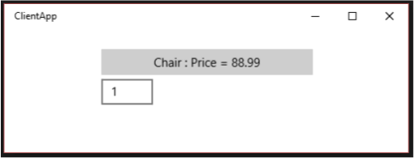

# Create and consume an app service

App services are UWP apps that provide services to other UWP apps. They are analogous to web services, on a device. An app service runs as a background task in the host app and can provide its service to other apps. For example, an app service might provide a bar code scanner service that other apps could use. Or perhaps an Enterprise suite of apps has a common spell checking app service that is available to the other apps in the suite.  App services let you create UI-less services that apps can call on the same device, and starting with Windows 10, version 1607, on remote devices.

Starting in Windows 10, version 1607, you can create app services that run in the same process as the host app. This article focuses on creating and consuming an app service that runs in a separate background process. See [Convert an app service to run in the same process as its host app](convert-app-service-in-process.md) for more details about running an app service in the same process as the provider.

For an app service code sample, see [Universal Windows Platform (UWP) app samples](https://github.com/Microsoft/Windows-universal-samples/tree/master/Samples/AppServices).

## Create a new app service provider project

In this how-to, we'll create everything in one solution for simplicity.

1. In Visual Studio 2015 or later, create a new UWP app project and name it **AppServiceProvider**.
    1. Select **File > New > Project...** 
    2. In the **Create a new project** dialog box, select **Blank App (Universal Windows) C#**. This will be the app that makes the app service available to other UWP apps.
    3. Click **Next**, and then name the project **AppServiceProvider**, choose a location for it, and then click **Create**.

2. When asked to select a **Target** and **Minimum version** for the project, select at least **10.0.14393**. If you want to use the new **SupportsMultipleInstances** attribute, you must be using Visual Studio 2017 or Visual Studio 2019, and target **10.0.15063** (**Windows 10 Creators Update**) or higher.

<span id="appxmanifest"/>

## Add an app service extension to Package.appxmanifest

In the **AppServiceProvider** project, open the **Package.appxmanifest** file in a text editor: 

1. Right-click it in the **Solution Explorer**. 
2. Select **Open With**. 
3. Select **XML (Text) Editor**. 

Add the following `AppService` extension inside the `<Application>` element. This example advertises the `com.microsoft.inventory` service and is what identifies this app as an app service provider. The actual service will be implemented as a background task. The app service project exposes the service to other apps. We recommend using a reverse domain name style for the service name.

Note that the `xmlns:uap4` namespace prefix and the `uap4:SupportsMultipleInstances` attribute are only valid if you are targeting Windows SDK version 10.0.15063 or higher. You can safely remove them if you are targeting older SDK versions.

``` xml
<Package
    ...
    xmlns:uap3="http://schemas.microsoft.com/appx/manifest/uap/windows10/3"
    xmlns:uap4="http://schemas.microsoft.com/appx/manifest/uap/windows10/4"
    ...
    <Applications>
        <Application Id="AppServiceProvider.App"
          Executable="$targetnametoken$.exe"
          EntryPoint="AppServiceProvider.App">
          ...
          <Extensions>
            <uap:Extension Category="windows.appService" EntryPoint="MyAppService.Inventory">
              <uap3:AppService Name="com.microsoft.inventory" uap4:SupportsMultipleInstances="true"/>
            </uap:Extension>
          </Extensions>
          ...
        </Application>
    </Applications>
```

The `Category` attribute identifies this application as an app service provider.

The `EntryPoint` attribute identifies the namespace qualified class that implements the service, which we'll implement next.

The `SupportsMultipleInstances` attribute indicates that each time the app service is called that it should run in a new process. This is not required but is available to you if you need that functionality and are targeting the 10.0.15063 SDK (**Windows 10 Creators Update**) or higher. It also should be prefaced by the `uap4` namespace.

## Create the app service

1.  An app service can be implemented as a background task. This enables a foreground application to invoke an app service in another application. To create an app service as a background task, add a new Windows Runtime component project to the solution (**File &gt; Add &gt; New Project**) named **MyAppService**. In the **Add New Project** dialog box, choose **Installed > Visual C# > Windows Runtime Component (Universal Windows)**.
2.  In the **AppServiceProvider** project, add a project-to-project reference to the new **MyAppService** project (in the **Solution Explorer**, right-click on the **AppServiceProvider** project > **Add** > **Reference** > **Projects** > **Solution**, select **MyAppService** > **OK**). This step is critical because if you do not add the reference, the app service won't connect at runtime.
3.  In the **MyAppService** project, add the following **using** statements to the top of **Class1.cs**:
    ```cs
    using Windows.ApplicationModel.AppService;
    using Windows.ApplicationModel.Background;
    using Windows.Foundation.Collections;
    ```

4.  Rename **Class1.cs** to **Inventory.cs**, and replace the stub code for **Class1** with a new background task class named **Inventory**:

    ```cs
    public sealed class Inventory : IBackgroundTask
    {
        private BackgroundTaskDeferral backgroundTaskDeferral;
        private AppServiceConnection appServiceconnection;
        private String[] inventoryItems = new string[] { "Robot vacuum", "Chair" };
        private double[] inventoryPrices = new double[] { 129.99, 88.99 };

        public void Run(IBackgroundTaskInstance taskInstance)
        {
            // Get a deferral so that the service isn't terminated.
            this.backgroundTaskDeferral = taskInstance.GetDeferral();

            // Associate a cancellation handler with the background task.
            taskInstance.Canceled += OnTaskCanceled;

            // Retrieve the app service connection and set up a listener for incoming app service requests.
            var details = taskInstance.TriggerDetails as AppServiceTriggerDetails;
            appServiceconnection = details.AppServiceConnection;
            appServiceconnection.RequestReceived += OnRequestReceived;
        }

        private async void OnRequestReceived(AppServiceConnection sender, AppServiceRequestReceivedEventArgs args)
        {
            // This function is called when the app service receives a request.
        }

        private void OnTaskCanceled(IBackgroundTaskInstance sender, BackgroundTaskCancellationReason reason)
        {
            if (this.backgroundTaskDeferral != null)
            {
                // Complete the service deferral.
                this.backgroundTaskDeferral.Complete();
            }
        }
    }
    ```

    This class is where the app service will do its work.

    **Run** is called when the background task is created. Because background tasks are terminated after **Run** completes, the code takes out a deferral so that the background task will stay up to serve requests. An app service that is implemented as a background task will stay alive for about 30 seconds after it receives a call unless it is called again within that time window or a deferral is taken out. If the app service is implemented in the same process as the caller, the lifetime of the app service is tied to the lifetime of the caller.

    The lifetime of the app service depends on the caller:

    * If the caller is in the foreground, the app service lifetime is the same as the caller.
    * If the caller is in the background, the app service gets 30 seconds to run. Taking out a deferral provides an additional one time 5 seconds.

    **OnTaskCanceled** is called when the task is canceled. The task is canceled when the client app disposes the [AppServiceConnection](/uwp/api/Windows.ApplicationModel.AppService.AppServiceConnection), the client app is suspended, the OS is shut down or sleeps, or the OS runs out of resources to run the task.

## Write the code for the app service

**OnRequestReceived** is where the code for the app service goes. Replace the stub **OnRequestReceived** in **MyAppService**'s **Inventory.cs** with the code from this example. This code gets an index for an inventory item and passes it, along with a command string, to the service to retrieve the name and the price of the specified inventory item. For your own projects, add error handling code.

```cs
private async void OnRequestReceived(AppServiceConnection sender, AppServiceRequestReceivedEventArgs args)
{
    // Get a deferral because we use an awaitable API below to respond to the message
    // and we don't want this call to get canceled while we are waiting.
    var messageDeferral = args.GetDeferral();

    ValueSet message = args.Request.Message;
    ValueSet returnData = new ValueSet();

    string command = message["Command"] as string;
    int? inventoryIndex = message["ID"] as int?;

    if (inventoryIndex.HasValue &&
        inventoryIndex.Value >= 0 &&
        inventoryIndex.Value < inventoryItems.GetLength(0))
    {
        switch (command)
        {
            case "Price":
            {
                returnData.Add("Result", inventoryPrices[inventoryIndex.Value]);
                returnData.Add("Status", "OK");
                break;
            }

            case "Item":
            {
                returnData.Add("Result", inventoryItems[inventoryIndex.Value]);
                returnData.Add("Status", "OK");
                break;
            }

            default:
            {
                returnData.Add("Status", "Fail: unknown command");
                break;
            }
        }
    }
    else
    {
        returnData.Add("Status", "Fail: Index out of range");
    }

    try
    {
        // Return the data to the caller.
        await args.Request.SendResponseAsync(returnData);
    }
    catch (Exception e)
    {
        // Your exception handling code here.
    }
    finally
    {
        // Complete the deferral so that the platform knows that we're done responding to the app service call.
        // Note for error handling: this must be called even if SendResponseAsync() throws an exception.
        messageDeferral.Complete();
    }
}
```

Note that **OnRequestReceived** is **async** because we make an awaitable method call to [SendResponseAsync](/uwp/api/windows.applicationmodel.appservice.appservicerequest.sendresponseasync) in this example.

A deferral is taken so that the service can use **async** methods in the **OnRequestReceived** handler. It ensures that the call to **OnRequestReceived** does not complete until it is done processing the message.  [SendResponseAsync](/uwp/api/windows.applicationmodel.appservice.appservicerequest.sendresponseasync) sends the result to the caller. **SendResponseAsync** does not signal the completion of the call. It is the completion of the deferral that signals to [SendMessageAsync](/uwp/api/windows.applicationmodel.appservice.appserviceconnection.sendmessageasync) that **OnRequestReceived** has completed. The call to **SendResponseAsync** is wrapped in a try/finally block because you must complete the deferral even if **SendResponseAsync** throws an exception.

App services use [ValueSet](/uwp/api/Windows.Foundation.Collections.ValueSet) objects to exchange information. The size of the data you may pass is only limited by system resources. There are no predefined keys for you to use in your **ValueSet**. You must determine which key values you will use to define the protocol for your app service. The caller must be written with that protocol in mind. In this example, we have chosen a key named `Command` that has a value that indicates whether we want the app service to provide the name of the inventory item or its price. The index of the inventory name is stored under the `ID` key. The return value is stored under the `Result` key.

An [AppServiceClosedStatus](/uwp/api/Windows.ApplicationModel.AppService.AppServiceClosedStatus) enum is returned to the caller to indicate whether the call to the app service succeeded or failed. An example of how the call to the app service could fail is if the OS aborts the service endpoint because its resources have been exceeded. You can return additional error information via the [ValueSet](/uwp/api/Windows.Foundation.Collections.ValueSet). In this example, we use a key named `Status` to return more detailed error information to the caller.

The call to [SendResponseAsync](/uwp/api/windows.applicationmodel.appservice.appservicerequest.sendresponseasync) returns the [ValueSet](/uwp/api/Windows.Foundation.Collections.ValueSet) to the caller.

## Deploy the service app and get the package family name

The app service provider must be deployed before you can call it from a client. You can deploy it by selecting **Build > Deploy Solution** in Visual Studio.

You will also need the package family name of the app service provider in order to call it. You can get it by opening the **AppServiceProvider** project's **Package.appxmanifest** file in the designer view (double-click it in the **Solution Explorer**). Select the **Packaging** tab, copy the value next to **Package family name**, and paste it somewhere like Notepad for now.

## Write a client to call the app service

1.  Add a new blank Windows Universal app project to the solution with **File &gt; Add &gt; New Project**. In the **Add New Project** dialog box, choose **Installed > Visual C# > Blank App (Universal Windows)** and name it **ClientApp**.

2.  In the **ClientApp** project, add the following **using** statement to the top of **MainPage.xaml.cs**:
    ```cs
    using Windows.ApplicationModel.AppService;
    ```

3.  Add a text box called **textBox** and a button to **MainPage.xaml**.

4.  Add a button click handler for the button called **button_Click**, and add the keyword **async** to the button handler's signature.

5. Replace the stub of your button click handler with the following code. Be sure to include the `inventoryService` field declaration.
    ```cs
   private AppServiceConnection inventoryService;

   private async void button_Click(object sender, RoutedEventArgs e)
   {
       // Add the connection.
       if (this.inventoryService == null)
       {
           this.inventoryService = new AppServiceConnection();

           // Here, we use the app service name defined in the app service 
           // provider's Package.appxmanifest file in the <Extension> section.
           this.inventoryService.AppServiceName = "com.microsoft.inventory";

           // Use Windows.ApplicationModel.Package.Current.Id.FamilyName 
           // within the app service provider to get this value.
           this.inventoryService.PackageFamilyName = "Replace with the package family name";

           var status = await this.inventoryService.OpenAsync();

           if (status != AppServiceConnectionStatus.Success)
           {
               textBox.Text= "Failed to connect";
               this.inventoryService = null;
               return;
           }
       }

       // Call the service.
       int idx = int.Parse(textBox.Text);
       var message = new ValueSet();
       message.Add("Command", "Item");
       message.Add("ID", idx);
       AppServiceResponse response = await this.inventoryService.SendMessageAsync(message);
       string result = "";

       if (response.Status == AppServiceResponseStatus.Success)
       {
           // Get the data  that the service sent to us.
           if (response.Message["Status"] as string == "OK")
           {
               result = response.Message["Result"] as string;
           }
       }

       message.Clear();
       message.Add("Command", "Price");
       message.Add("ID", idx);
       response = await this.inventoryService.SendMessageAsync(message);

       if (response.Status == AppServiceResponseStatus.Success)
       {
           // Get the data that the service sent to us.
           if (response.Message["Status"] as string == "OK")
           {
               result += " : Price = " + response.Message["Result"] as string;
           }
       }

       textBox.Text = result;
   }
   ```
    
    Replace the package family name in the line `this.inventoryService.PackageFamilyName = "Replace with the package family name";` with the package family name of the **AppServiceProvider** project that you obtained above in [Deploy the service app and get the package family name](#deploy-the-service-app-and-get-the-package-family-name).

    > [!NOTE]
    > Make sure to paste in the string literal, rather than putting it in a variable. It will not work if you use a variable.

    The code first establishes a connection with the app service. The connection will remain open until you dispose `this.inventoryService`. The app service name must match the `AppService` element's `Name` attribute that you added to the **AppServiceProvider** project's **Package.appxmanifest** file. In this example, it is `<uap3:AppService Name="com.microsoft.inventory"/>`.

    A [ValueSet](/uwp/api/Windows.Foundation.Collections.ValueSet) named `message` is created to specify the command that we want to send to the app service. The example app service expects a command to indicate which of two actions to take. We get the index from the text box in the client app, and then call the service with the `Item` command to get the description of the item. Then, we make the call with the `Price` command to get the item's price. The button text is set to the result.

    Because [AppServiceResponseStatus](/uwp/api/Windows.ApplicationModel.AppService.AppServiceResponseStatus) only indicates whether the operating system was able to connect the call to the app service, we check the `Status` key in the [ValueSet](/uwp/api/Windows.Foundation.Collections.ValueSet) we receive from the app service to ensure that it was able to fulfill the request.

6. Set the **ClientApp** project to be the startup project (right-click it in the **Solution Explorer** > **Set as StartUp Project**) and run the solution. Enter the number 1 into the text box and click the button. You should get "Chair : Price = 88.99" back from the service.

    

If the app service call fails, check the following in the **ClientApp** project:

1.  Verify that the package family name assigned to the inventory service connection matches the package family name of the **AppServiceProvider** app. See the line in **button\_Click** with `this.inventoryService.PackageFamilyName = "...";`.
2.  In **button\_Click**, verify that the app service name that is assigned to the inventory service connection matches the app service name in the **AppServiceProvider**'s **Package.appxmanifest** file. See: `this.inventoryService.AppServiceName = "com.microsoft.inventory";`.
3.  Ensure that the **AppServiceProvider** app has been deployed. (In the **Solution Explorer**, right-click the solution and choose **Deploy Solution**).

## Debug the app service

1.  Ensure that the solution is deployed before debugging because the app service provider app must be deployed before the service can be called. (In Visual Studio, **Build &gt; Deploy Solution**).
2.  In the **Solution Explorer**, right-click the **AppServiceProvider** project and choose **Properties**. From the **Debug** tab, change the **Start action** to **Do not launch, but debug my code when it starts**. (Note, if you were using C++ to implement your app service provider, from the **Debugging** tab you would change **Launch Application** to **No**).
3.  In the **MyAppService** project, in the **Inventory.cs** file, set a breakpoint in **OnRequestReceived**.
4.  Set the **AppServiceProvider** project to be the startup project and press **F5**.
5.  Start **ClientApp** from the Start menu (not from Visual Studio).
6.  Enter the number 1 into the text box and press the button. The debugger will stop in the app service call on the breakpoint in your app service.

## Debug the client

1.  Follow the instructions in the preceding step to debug the client that calls the app service.
2.  Launch **ClientApp** from the Start menu.
3.  Attach the debugger to the **ClientApp.exe** process (not the **ApplicationFrameHost.exe** process). (In Visual Studio, choose **Debug &gt; Attach to Process...**.)
4.  In the **ClientApp** project, set a breakpoint in **button\_Click**.
5.  The breakpoints in both the client and the app service will now be hit when you enter the number 1 into the text box of **ClientApp** and click the button.

## General app service troubleshooting

If you encounter an **AppUnavailable** status after trying to connect to an app service, check the following:

- Ensure that the app service provider project and app service project are deployed. Both need to be deployed before running the client because otherwise the client won't have anything to connect to. You can deploy from Visual Studio by using **Build** > **Deploy Solution**.
- In the **Solution Explorer**, ensure that your app service provider project has a project-to-project reference to the project that implements the app service.
- Verify that the `<Extensions>` entry, and its child elements, have been added to the **Package.appxmanifest** file belonging to the app service provider project as specified above in [Add an app service extension to Package.appxmanifest](#appxmanifest).
- Ensure that the [AppServiceConnection.AppServiceName](/uwp/api/windows.applicationmodel.appservice.appserviceconnection.appservicename) string in your client that calls the app service provider matches the `<uap3:AppService Name="..." />` specified in the app service provider project's **Package.appxmanifest** file.
- Ensure that the [AppServiceConnection.PackageFamilyName](/uwp/api/windows.applicationmodel.appservice.appserviceconnection.packagefamilyname) matches the package family name of the app service provider component as specified above in [Add an app service extension to Package.appxmanifest](#appxmanifest)
- For out-of-proc app services such as the one in this example, validate that the `EntryPoint` specified in the `<uap:Extension ...>` element of your app service provider project's **Package.appxmanifest** file matches the namespace and class name of the public class that implements [IBackgroundTask](/uwp/api/windows.applicationmodel.background.ibackgroundtask) in your app service project.

### Troubleshoot debugging

If the debugger does not stop at breakpoints in your app service provider or app service projects, check the following:

- Ensure that the app service provider project and app service project are deployed. Both need to be deployed before running the client. You can deploy them from Visual Studio by using **Build** > **Deploy Solution**.
- Ensure that the project you want to debug is set as the startup project and that the debugging properties for that project are set to not run the project when **F5** is pressed. Right-click the project, then click **Properties**, and then **Debug** (or **Debugging** in C++). In C#, change the **Start action** to **Do not launch, but debug my code when it starts**. In C++, set **Launch Application** to **No**.

## Remarks

This example provides an introduction to creating an app service that runs as a background task and calling it from another app. The key things to note are:

* Create a background task to host the app service.
* Add the `windows.appService` extension to the app service provider's **Package.appxmanifest** file.
* Obtain the package family name of the app service provider so that we can connect to it from the client app.
* Add a project-to-project reference from the app service provider project to the app service project.
* Use [Windows.ApplicationModel.AppService.AppServiceConnection](/uwp/api/Windows.ApplicationModel.AppService.AppServiceConnection) to call the service.

## Full code for MyAppService

```cs
using System;
using Windows.ApplicationModel.AppService;
using Windows.ApplicationModel.Background;
using Windows.Foundation.Collections;

namespace MyAppService
{
    public sealed class Inventory : IBackgroundTask
    {
        private BackgroundTaskDeferral backgroundTaskDeferral;
        private AppServiceConnection appServiceconnection;
        private String[] inventoryItems = new string[] { "Robot vacuum", "Chair" };
        private double[] inventoryPrices = new double[] { 129.99, 88.99 };

        public void Run(IBackgroundTaskInstance taskInstance)
        {
            // Get a deferral so that the service isn't terminated.
            this.backgroundTaskDeferral = taskInstance.GetDeferral();

            // Associate a cancellation handler with the background task.
            taskInstance.Canceled += OnTaskCanceled;

            // Retrieve the app service connection and set up a listener for incoming app service requests.
            var details = taskInstance.TriggerDetails as AppServiceTriggerDetails;
            appServiceconnection = details.AppServiceConnection;
            appServiceconnection.RequestReceived += OnRequestReceived;
        }

        private async void OnRequestReceived(AppServiceConnection sender, AppServiceRequestReceivedEventArgs args)
        {
            // Get a deferral because we use an awaitable API below to respond to the message
            // and we don't want this call to get canceled while we are waiting.
            var messageDeferral = args.GetDeferral();

            ValueSet message = args.Request.Message;
            ValueSet returnData = new ValueSet();

            string command = message["Command"] as string;
            int? inventoryIndex = message["ID"] as int?;

            if (inventoryIndex.HasValue &&
                 inventoryIndex.Value >= 0 &&
                 inventoryIndex.Value < inventoryItems.GetLength(0))
            {
                switch (command)
                {
                    case "Price":
                        {
                            returnData.Add("Result", inventoryPrices[inventoryIndex.Value]);
                            returnData.Add("Status", "OK");
                            break;
                        }

                    case "Item":
                        {
                            returnData.Add("Result", inventoryItems[inventoryIndex.Value]);
                            returnData.Add("Status", "OK");
                            break;
                        }

                    default:
                        {
                            returnData.Add("Status", "Fail: unknown command");
                            break;
                        }
                }
            }
            else
            {
                returnData.Add("Status", "Fail: Index out of range");
            }

            // Return the data to the caller.
            await args.Request.SendResponseAsync(returnData);

            // Complete the deferral so that the platform knows that we're done responding to the app service call.
            // Note for error handling: this must be called even if SendResponseAsync() throws an exception.
            messageDeferral.Complete();
        }


        private void OnTaskCanceled(IBackgroundTaskInstance sender, BackgroundTaskCancellationReason reason)
        {
            if (this.backgroundTaskDeferral != null)
            {
                // Complete the service deferral.
                this.backgroundTaskDeferral.Complete();
            }
        }
    }
}
```

## Related topics

* [Convert an app service to run in the same process as its host app](convert-app-service-in-process.md)
* [Support your app with background tasks](support-your-app-with-background-tasks.md)
* [App service code sample (C#, C++, and VB)](https://github.com/Microsoft/Windows-universal-samples/tree/master/Samples/AppServices)