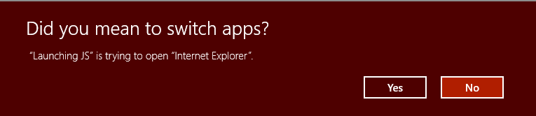

# Launch the default app for a URI


**Important APIs**

- [**LaunchUriAsync**](/uwp/api/windows.system.launcher.launchuriasync)
- [**PreferredApplicationPackageFamilyName**](/uwp/api/windows.system.launcheroptions.preferredapplicationpackagefamilyname)
- [**DesiredRemainingView**](/uwp/api/windows.system.launcheroptions.desiredremainingview)

Learn how to launch the default app for a Uniform Resource Identifier (URI). URIs allow you to launch another app to perform a specific task. This topic also provides an overview of the many URI schemes built into Windows. You can launch custom URIs too. For more info about registering a custom URI scheme and handling URI activation, see [Handle URI activation](handle-uri-activation.md).

URI schemes let you open apps by clicking hyperlinks. Just as you can start a new email using **mailto:**, you can open the default web browser using **http:**

This topic describes the following URI schemes built into Windows:

| URI Scheme | Launches |
| ----------:|----------|
|[bingmaps:, ms-drive-to:, and ms-walk-to: ](#maps-app-uri-schemes) | Maps app |
|[http:](#http-uri-scheme) | Default web browser |
|[mailto:](#email-uri-scheme) | Default email app |
|[ms-call:](#call-app-uri-scheme) |  Call app |
|[ms-chat:](#messaging-app-uri-scheme) | Messaging app |
|[ms-people:](#people-app-uri-scheme) | People app |
|[ms-photos:](#photos-app-uri-scheme) | Photos app |
|[ms-settings:](#settings-app-uri-scheme) | Settings app |
|[ms-store:](#store-app-uri-scheme)  | Store app |
|[ms-tonepicker:](#tone-picker-uri-scheme) | Tone picker |
|[ms-yellowpage:](#nearby-numbers-app-uri-scheme) | Nearby Numbers app |
|[msnweather:](#weather-app-uri-scheme) | Weather app |

<br>
For example, the following URI opens the default browser and displays the Bing web site.

`https://bing.com`

You can also launch custom URI schemes too. If there is no app installed to handle that URI, you can recommend an app for the user to install. For more info, see [Recommend an app if one is not available to handle the URI](#recommend-an-app-if-one-is-not-available-to-handle-the-uri).

In general, your app can't select the app that is launched. The user determines which app is launched. More than one app can register to handle the same URI scheme. The exception to this is for reserved URI schemes. Registrations of reserved URI schemes are ignored. For the full list of reserved URI schemes, see [Handle URI activation](handle-uri-activation.md). In cases where more than one app may have registered the same URI scheme, your app can recommend a specific app to be launched. For more info, see [Recommend an app if one is not available to handle the URI](#recommend-an-app-if-one-is-not-available-to-handle-the-uri).

### Call LaunchUriAsync to launch a URI

Use the [**LaunchUriAsync**](/uwp/api/windows.system.launcher.launchuriasync) method to launch a URI. When you call this method, your app must be the foreground app, that is, it must be visible to the user. This requirement helps ensure that the user remains in control. To meet this requirement, make sure that you tie all URI launches directly to the UI of your app. The user must always take some action to initiate a URI launch. If you attempt to launch a URI and your app isn't in the foreground, the launch will fail and your error callback will be invoked.

First create a [**System.Uri**](https://docs.microsoft.com/dotnet/api/system.uri) object to represent the URI, then pass that to the [**LaunchUriAsync**](/uwp/api/windows.system.launcher.launchuriasync) method. Use the return result to see if the call succeeded, as shown in the following example.

```cs
private async void launchURI_Click(object sender, RoutedEventArgs e)
{
   // The URI to launch
   var uriBing = new Uri(@"http://www.bing.com");

   // Launch the URI
   var success = await Windows.System.Launcher.LaunchUriAsync(uriBing);

   if (success)
   {
      // URI launched
   }
   else
   {
      // URI launch failed
   }
}
```

In some cases, the operating system will prompt the user to see if they actually want to switch apps.



If you always want this prompt to occur, use the [**Windows.System.LauncherOptions.TreatAsUntrusted**](https://docs.microsoft.com/uwp/api/windows.system.launcheroptions.treatasuntrusted) property to tell the operating system to display a warning.

```cs
// The URI to launch
var uriBing = new Uri(@"http://www.bing.com");

// Set the option to show a warning
var promptOptions = new Windows.System.LauncherOptions();
promptOptions.TreatAsUntrusted = true;

// Launch the URI
var success = await Windows.System.Launcher.LaunchUriAsync(uriBing, promptOptions);
```

### Recommend an app if one is not available to handle the URI

In some cases, the user might not have an app installed to handle the URI that you are launching. By default, the operating system handles these cases by providing the user with a link to search for an appropriate app on the store. If you want to give the user a specific recommendation for which app to acquire in this scenario, you can do so by passing that recommendation along with the URI that you are launching.

Recommendations are also useful when more than one app has registered to handle a URI scheme. By recommending a specific app, Windows will open that app if it is already installed.

To make a recommendation, call the [**Windows.System.Launcher.LaunchUriAsync(Uri, LauncherOptions)**](https://docs.microsoft.com/uwp/api/windows.system.launcher.launchuriasync#Windows_System_Launcher_LaunchUriAsync_Windows_Foundation_Uri_Windows_System_LauncherOptions_) method with [**LauncherOptions.preferredApplicationPackageFamilyName**](https://docs.microsoft.com/uwp/api/windows.system.launcheroptions.preferredapplicationpackagefamilyname) set to the package family name of the app in the store that you want to recommend. The operating system uses this info to replace the general option to search for an app in the store with a specific option to acquire the recommended app from the store.

```cs
// Set the recommended app
var options = new Windows.System.LauncherOptions();
options.PreferredApplicationPackageFamilyName = "Contoso.URIApp_8wknc82po1e";
options.PreferredApplicationDisplayName = "Contoso URI Ap";

// Launch the URI and pass in the recommended app
// in case the user has no apps installed to handle the URI
var success = await Windows.System.Launcher.LaunchUriAsync(uriContoso, options);
```

### Set remaining view preference

Source apps that call [**LaunchUriAsync**](/uwp/api/windows.system.launcher.launchuriasync) can request that they remain on screen after a URI launch. By default, Windows attempts to share all available space equally between the source app and the target app that handles the URI. Source apps can use the [**DesiredRemainingView**](/uwp/api/windows.system.launcheroptions.desiredremainingview) property to indicate to the operating system that they prefer their app window to take up more or less of the available space. **DesiredRemainingView** can also be used to indicate that the source app doesn't need to remain on screen after the URI launch and can be completely replaced by the target app. This property only specifies the preferred window size of the calling app. It doesn't specify the behavior of other apps that may happen to also be on screen at the same time.

**Note**  Windows takes into account multiple different factors when it determines the source app's final window size, for example, the preference of the source app, the number of apps on screen, the screen orientation, and so on. By setting [**DesiredRemainingView**](/uwp/api/windows.system.launcheroptions.desiredremainingview), you aren't guaranteed a specific windowing behavior for the source app.

```cs
// Set the desired remaining view.
var options = new Windows.System.LauncherOptions();
options.DesiredRemainingView = Windows.UI.ViewManagement.ViewSizePreference.UseLess;

// Launch the URI
var success = await Windows.System.Launcher.LaunchUriAsync(uriContoso, options);
```

## URI Schemes ##

The various URI schemes are described below.

### Call app URI scheme

Use the **ms-call:** URI scheme to launch the Call app.

| URI Scheme       | Result                   |
|------------------|--------------------------|
| ms-call:settings | Calls app settings page. |

### Email URI scheme

Use the **mailto:** URI scheme to launch the default mail app.

| URI Scheme |Results                          |
|------------|---------------------------------|
| mailto:    | Launches the default email app. |
| mailto:\[email address\] | Launches the email app and creates a new message with the specified email address on the To line. Note that the email is not sent until the user taps send. |

### HTTP URI scheme

Use the **http:** URI scheme to launch the default web browser.

| URI Scheme | Results                           |
|------------|-----------------------------------|
| http:      | Launches the default web browser. |

### Maps app URI schemes

Use the **bingmaps:**, **ms-drive-to:**, and **ms-walk-to:** URI schemes to [launch the Windows Maps app](launch-maps-app.md) to specific maps, directions, and search results. For example, the following URI opens the Windows Maps app and displays a map centered over New York City.

`bingmaps:?cp=40.726966~-74.006076`


For more info, see [Launch the Windows Maps app](launch-maps-app.md). To use the map control in your own app, see [Display maps with 2D, 3D, and Streetside views](../maps-and-location/display-maps.md).

### Messaging app URI scheme

Use the **ms-chat:** URI scheme to launch the Windows Messaging app.

| URI scheme |Results |
|------------|--------|
| ms-chat:   | Launches the Messaging app. |
| ms-chat:?ContactID={contacted}  |  Allows the messaging application to be launched with a particular contact’s information.   |
| ms-chat:?Body={body} | Allows the messaging application to be launched with a string to use as the content of the message.|
| ms-chat:?Addresses={address}&Body={body} | Allows the messaging application to be launched with a particular addresses' information, and with a string to use as the content of the message. Note: Addresses can be concatenated. |
| ms-chat:?TransportId={transportId}  | Allows the messaging application to be launched with a particular transport ID. |

### Tone picker URI scheme

Use the **ms-tonepicker:** URI scheme to choose ringtones, alarms, and system tones. You can also save new ringtones and get the display name of a tone.

| URI Scheme | Results |
|------------|---------|
| ms-tonepicker: | Pick ringtones, alarms, and system tones. |

Parameters are passed via a [ValueSet](/uwp/api/windows.foundation.collections.valueset) to the LaunchURI API. See [Choose and save tones using the ms-tonepicker URI scheme](launch-ringtone-picker.md) for details.

### Nearby Numbers app URI scheme

Use the **ms-yellowpage:** URI scheme to launch the Nearby Numbers app.

| URI Scheme | Results |
|------------|---------|
| ms-yellowpage:?input=\[keyword\]&method=\[String or T9\] | Launches the Nearby Numbers app.<br>`input` refers to the keyword you want to search.<br>`method` refers to the type of search (string or T9 search).<br>If `method` is `T9` (a type of keyboard) then `keyword` should be a numeric string that maps to the T9 keyboard letters to search for.<br>If `method` is `String` then `keyword` is the keyword to search for. |

### People app URI scheme

Use the **ms-people:** URI scheme to launch the People app.
For more info, see [Launch the People app](launch-people-apps.md).

### Photos app URI scheme

Use the **ms-photos:** URI scheme to launch the Photos app to view an image or edit a video. For example:  
To view an image: `ms-photos:viewer?fileName=c:\users\userName\Pictures\image.jpg`  
Or to edit a video: `ms-photos:videoedit?InputToken=123abc&Action=Trim&StartTime=01:02:03`  

> [!NOTE]
> The URIs to edit a video or display an image are only available on desktop.

| URI scheme |Results |
|------------|--------|
| ms-photos:viewer?fileName={filename} | Launches the Photos app to view the specified image where {filename} is a fully-qualified path name. For example: `c:\users\userName\Pictures\ImageToView.jpg` |
| ms-photos:videoedit?InputToken={input token} | Launches the Photos app in video editing mode for the file represented by the file token. **InputToken** is required. Use the  [SharedStorageAccessManager](/uwp/api/Windows.ApplicationModel.DataTransfer.SharedStorageAccessManager) to get a token for a file. |
| ms-photos:videoedit?Action={action} | A parameter that indicates which video editing mode to open the Photos app in, where {action} is one of: **SlowMotion**, **FrameExtraction**, **Trim**, **View**, **Ink**. **Action** is required. |
| ms-photos:videoedit?StartTime={timespan} | An optional parameter that specifies where to start playing the video. `{timespan}` must be in the format `"hh:mm:ss.ffff"`. If not specified, defaults to `00:00:00.0000` |

### Settings app URI scheme

Use the **ms-settings:** URI scheme to [launch the Windows Settings app](launch-settings-app.md). Launching to the Settings app is an important part of writing a privacy-aware app. If your app can't access a sensitive resource, we recommend providing the user a convenient link to the privacy settings for that resource. For example, the following URI opens the Settings app and displays the camera privacy settings.

`ms-settings:privacy-webcam`


For more info, see [Launch the Windows Settings app](launch-settings-app.md) and [Guidelines for privacy-aware apps](https://docs.microsoft.com/windows/uwp/security/index).

### Store app URI scheme

Use the **ms-windows-store:** URI scheme to [Launch the UWP app](launch-store-app.md). Open product detail pages, product review pages, and search pages, etc. For example, the following URI opens the UWP app and launches the home page of the Store.

`ms-windows-store://home/`

For more info, see [Launch the UWP app](launch-store-app.md).

### Weather app URI scheme

Use the **msnweather:** URI scheme to launch the Weather app.

| URI Scheme | Results |
|------------|---------|
| msnweather://forecast?la=\[latitude\]&lo=\[longitude\] | Launches the Weather app in the Forecast page based on a location geographic coordinates.<br>`latitude` refers to the latitude of the location.<br> `longitude` refers to the longitude of the location.<br> |