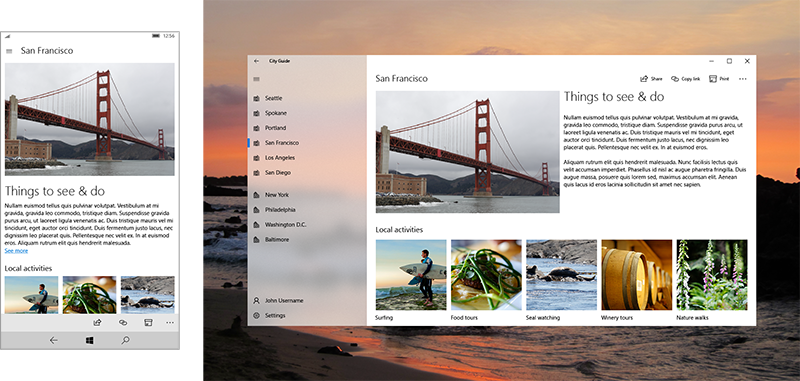

# Layout for UWP apps
<link rel="stylesheet" href="https://az835927.vo.msecnd.net/sites/uwp/Resources/css/custom.css"> 

App structure, page layout, and navigation are the foundation of your app's user experience. The articles in this section help you create an app that is easy to navigate and looks great on a variety of devices and screen sizes.

## Intro

  

  
<b>[Intro to app UI design](design-and-ui-intro.md)</b> 
   When you design a UWP app, you create a user interface that suits a variety of devices with different display sizes. This article provides an overview of UI-related features and benefits of UWP apps and some tips & tricks for designing a responsive UI. 

  

  

    
  

## App layout and structure
Check out these recommendations for structuring your app and using the three types of UI elements: navigation, command, and content.

  

<b>[Navigation basics](navigation-basics.md)</b> 
Navigation in UWP apps is based on a flexible model of navigation structures, navigation elements, and system-level features. This article introduces you to these components and shows you how to use them together to create a good navigation experience.

<b>[Content basics](content-basics.md)</b> 
The main purpose of any app is to provide access to content: in a photo-editing app, the photo is the content; in a travel app, maps and info about travel destinations is the content; and so on. This article provides content design recommendations for the three content scenarios: consumption, creation, and interaction.

 
  

  

<b>[Command basics](commanding-basics.md)</b>  
Command elements are the interactive UI elements that enable the user to perform actions, such as sending an email, deleting an item, or submitting a form. This article describes the command elements, such as buttons and check boxes, the interactions they support, and the command surfaces (such as command bars and context menus) for hosting them.

  

## Page layout 
These articles help you create a flexible UI that looks great on different screen sizes, window sizes, resolutions, and orientations. 

  

   
<b>[Screen sizes and breakpoints](screen-sizes-and-breakpoints-for-responsive-design.md)</b> 
   The number of device targets and screen sizes across the Windows 10 ecosystem is too great to worry about optimizing your UI for each one. Instead, we recommended designing for a few key widths (also called "breakpoints"): 360, 640, 1024 and 1366 epx.

  

  

 
<b>[Define layouts with XAML](layouts-with-xaml.md)</b>  
 How to use XAML properties and layout panels to make your app responsive and adaptive.

  

  

   
<b>[Layout panels](layout-panels.md)</b>  
   Learn about each type of layout each panel and show how to use them to layout XAML UI elements.

  

  

 
<b>[Alignment, margins, and padding](alignment-margin-padding.md)</b>  
 In addition to dimension properties (width, height, and constraints) elements can also have alignment, margin, and padding properties that influence the layout behavior when an element goes through a layout pass and is rendered in a UI.
 
  

