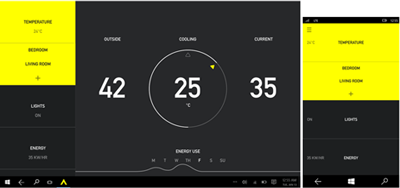
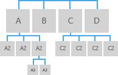

#  Navigation design basics for UWP apps

<link rel="stylesheet" href="https://az835927.vo.msecnd.net/sites/uwp/Resources/css/custom.css">

For a typical app, navigation is the starting point of the user experience. Users navigate from page to page and within the page to get to the content and features they want. Creating a good navigation system is essential to a good user experience. 

## Prinicples of good navigation design 
Research and experience have shown that these three principles form the foundation of good navigation design: 

* Be consistent: Meet user expectations.
* Keep it simple: Don't do more than you need to.
* Keep it clean: Don't let navigation features get in the user's way.

### Be consistent 
Navigation should be consistent with user expectations, leaning on standard conventions  for icons, location and styling. 

For example, in the following illustration, you can see the spots where users will typically expect to find functionality, like the navigation pane and command bar. Different device families have their own conventions for navigational elements. For example,  the navigation pane typically appears on the left side of the screen for tablets, but up top for mobile devices.

<figure class="wdg-figure">
  
  <figcaption>Users expect to find certain UI elements in standard locations.</figcaption>
</figure> 

### Keep it simple
Another important factor in navigation design is the Hick-Hyman Law, often cited in relation to navigational options. This law encourages us to add fewer options to the menu. The more options there are, the slower user interactions with them will be, particularly when users are exploring a new app. 

<figure class="wdg-figure">
  
  <figcaption> On the left, notice there are fewer options for the  user to select, whereas on the right, there are several. The  Hick-Hyman Law indicates that the menu on the left will be  easier for users to understand and utilize.
</figcaption>
</figure> 

### Keep it clean
The final key characteristic of navigation is clean interaction, which refers to the physical way that users interact with navigation across a variety of contexts. This is one area where putting yourself in the users position will inform your design. Try to understand your user and their behaviors. For example, if you're designing a cooking app, you might consider providing easy access to a shopping list and a timer. 

## General rules
Several rules of thumb help designers to encapsulate consistency, simplicity and clean interaction in their navigation design. Most of these come from the web design world and will apply to touch and non-touch devices. As with any rule of thumb, use them as starting points and tweak as needed. 

1. Avoid deep navigational hierarchies. How many levels of navigation are best for your users? A top-level navigation and one level beneath it is usually plenty. If you go beyond three levels of navigation, then you break the principle of simplicity. Even worse, you risk stranding your user in a deep hierarchy that they will have difficulty leaving.

2. Avoid too many navigational options. Three to six navigation elements per level are most common. If your navigation needs more than this, especially at the top level of your hierarchy, then you might consider splitting your app into multiple apps, since you may be trying to do too much in one place. Too many navigation elements in an app usually lead to inconsistent and unrelated objectives.

3. Avoid pogo-sticking. Pogo-sticking occurs when there is related content, but navigating to it requires the user to go up a level and then down again. Pogo-sticking violates the principle of clean interaction by requiring unnecessary clicks or interactions to achieve an obvious goal—in this case, looking at related content in a series. (The exception to this rule is in search and browse, where pogo-sticking may be the only way to provide the diversity and depth required.)
<figure class="wdg-figure">
  
  <figcaption> Pogo-sticking to navigate through an app—the user has to go back (green back arrow)  to the main page in order to navigate to the “Projects” tab.
</figcaption>
</figure> 
<figure class="wdg-figure">
  
  <figcaption>You can resolve some pogo-sticking issues with an icon (note the swipe gesture in green).
</figcaption>
</figure> 

## Building blocks
Navigation in Universal Windows Platform (UWP) apps is based on a flexible model of navigation structures, navigation elements, and system-level features. Together, they enable a variety of intuitive user experiences for moving between apps, pages, and content.

In some cases, you might be able to fit all of your app's content and functionality onto a single page without requiring the user to do anything more than pan to navigate through that content. However, the majority of apps typically have multiple pages of content and functionality with which to explore, engage, and interact. When an app has more than one page, you need to provide the right navigation experience.

To be successful and make sense to users, multi-page navigation experiences in UWP apps include:

-   **The right navigation structure**

    Building a navigation structure that makes sense to the user is crucial to creating an intuitive navigation experience.

-   **Compatible navigation elements** that support the chosen structure.

    Navigation elements can help the user get to the content they want and can also let users know where they are within the app. However, they also take up space that could be used for content or commanding elements, so it's important to use the navigation elements that are right for your app's structure.

-   **Appropriate responses to system-level navigation features (such as Back)**

    To provide a consistent experience that feels intuitive, respond to system-level navigation features in predictable ways.

## Build the right navigation structure

Let's look at an app as a collection of groups of pages, with each page containing a unique set of content or functionality. For example, a photo app might have a page for taking photos, a page for image editing, and another page for managing your image library. The way you arrange these pages into groups defines the app's navigation structure. There are two common ways to arrange a group of pages:

<table class="uwpd-noborder uwpd-top-aligned-table">
<colgroup>
<col width="50%" />
<col width="50%" />
</colgroup>
<thead>
<tr class="header">
<th align="left">In a hierarchy</th>
<th align="left">As peers</th>
</tr>
</thead>
<tbody>
<tr class="odd">
<td style="text-align: center;">

</td>
<td style="text-align: center;">

</td>
</tr>
<tr class="even">
<td style="vertical-align: top">Pages are organized into a tree-like structure. Each child page has only one parent, but a parent can have one or more child pages. To reach a child page, you travel through the parent. </td>
<td style="vertical-align: top"> Pages exist side-by-side. You can go from one page to another in any order. </td>
</tr>
</tbody>
</table>

 

A typical app will use both arrangements, with some portions being arranged as peers and some portions being arranged into hierarchies.

So, when should you arrange pages into hierarchies and when you should arrange them as peers? To answer that question we must consider the number of pages in the group, whether the pages should be traversed in a particular order, and the relationship between the pages. In general, flatter structures are easier to understand and faster to navigate, but sometimes it's appropriate to have a deep hierarchy.

  
We recommend using a hierarchical relationship when
<ul>
<li>You expect the user to traverse the pages in a specific order. Arrange the hierarchy to enforce that order.</li>
<li>There is a clear parent-child relationship between one of the pages and the other pages in the group.</li>
<li>There are more than 7 pages in the group.

When there are more than 7 pages in the group, it might be difficult for users to understand how the pages are unique or to understand their current location within the group. If you don't think that's an issue for your app, go ahead and make the pages peers. Otherwise, consider using a hierarchical structure to break the pages into two or more smaller groups. (A hub control can help you group pages into categories.)
</li>
</ul>
  

  
We recommend using a peer relationship when
<ul>
<li>The pages can be viewed in any order.</li>
<li>The pages are clearly distinct from each other and don't have an obvious parent/child relationship.</li>
<li>
There are fewer than 8 pages in the group.

When there are more than 7 pages in the group, it might be difficult for users to understand how the pages are unique or to understand their current location within the group. If you don't think that's an issue for your app, go ahead and make the pages peers. Otherwise, consider using a hierarchical structure to break the pages into two or more smaller groups. (A hub control can help you group pages into categories.)
</li>
</ul>
  

 

## Use the right navigation elements

Navigation elements can provide two services: they help the user get to the content they want, and some elements also let users know where they are within the app. However, they also take up space that the app could use for content or commanding elements, so it's important to use the navigation elements that are just right for your app's structure.

### Peer-to-peer navigation elements

Peer-to-peer navigation elements enable navigation between pages in the same level of the same subtree.

For peer-to-peer navigation, we recommend using tabs or a navigation pane.

<table>
<thead>
<tr class="header">
<th align="left">Navigation element</th>
<th align="left">Description</th>
</tr>
</thead>
<tbody>
<tr class="odd">
<td style="vertical-align:top;">[Tabs and pivot](../controls-and-patterns/tabs-pivot.md)

</td>
<td style="vertical-align:top;">Displays a persistent list of links to pages at the same level.

Use tabs/pivots when:

<ul>
<li>
There are 2-5 pages.

(You can use tabs/pivots when there are more than 5 pages, but it might be difficult to fit all the tabs/pivots on the screen.)
</li>
<li>You expect users to switch between pages frequently.</li>
</ul>

This design for a restaurant-finding app uses tabs/pivots:

</td>
</tr>
<tr class="even">
<td style="vertical-align:top;">[Nav pane](../controls-and-patterns/nav-pane.md)

</td>
<td style="vertical-align:top;">Displays a list of links to top-level pages.

Use a navigation pane when:

<ul>
<li>You don't expect users to switch between pages frequently.</li>
<li>You want to conserve space at the expense of slowing down navigation operations.</li>
<li>The pages exist at the top level.</li>
</ul>

This design for a smart home app features a nav pane:

</td>
</tr>
</tbody>
</table>

 

If your navigation structure has multiple levels, we recommend that peer-to-peer navigation elements only link to the peers within their current subtree. Consider the following illustration, which shows a navigation structure that has three levels:

-   For level 1, the peer-to-peer navigation element should provide access to pages A, B, C, and D.
-   At level 2, the peer-to-peer navigation elements for the A2 pages should only link to the other A2 pages. They should not link to level 2 pages in the C subtree.

### Hierarchical navigation elements

Hierarchical navigation elements provide navigation between a parent page and its child pages.

<table>
<thead>
<tr class="header">
<th align="left">Navigation element</th>
<th align="left">Description</th>
</tr>
</thead>
<tbody>
<tr class="odd">
<td style="vertical-align:top;">[Hub](../controls-and-patterns/hub.md)

</td>
<td align="left">A hub is a special type of navigation control that provides previews/summaries of its child pages. Unlike the navigation pane or tabs, it provides navigation to these child pages through links and section headers embedded in the page itself.

Use a hub when:

<ul>
<li>You expect that users would want to view some of the content of the child pages without having to navigate to each one.</li>
</ul>

Hubs promote discovery and exploration, which makes them well suited for media, news-reader, and shopping apps.

</td>
</tr>

<tr class="even">
<td style="vertical-align:top;">[Master/details](../controls-and-patterns/master-details.md)

</td>
<td align="left">Displays a list (master view) of item summaries. Selecting an item displays its corresponding items page in the details section.

Use the Master/details element when:

<ul>
<li>You expect users to switch between child items frequently.</li>
<li>You want to enable the user to perform high-level operations, such as deleting or sorting, on individual items or groups of items, and also want to enable the user to view or update the details for each item.</li>
</ul>

Master/details elements are well suited for email inboxes, contact lists, and data entry.

This design for a stock-tracking app makes use of a master/details pattern:

</td>
</tr>
</tbody>
</table>

 

### Historical navigation elements

<table>
<thead>
<tr class="header">
<th align="left">Navigation element</th>
<th align="left">Description</th>
</tr>
</thead>
<tbody>
<tr class="odd">
<td style="vertical-align:top;">[Back](navigation-history-and-backwards-navigation.md)</td>
<td style="vertical-align:top;">Lets the user traverse the navigation history within an app and, depending on the device, from app to app. For more info, see the [Navigation history and backwards navigation article](navigation-history-and-backwards-navigation.md).</td>
</tr>
</tbody>
</table>

 

### Content-level navigation elements

<table>
<thead>
<tr class="header">
<th align="left">Navigation element</th>
<th align="left">Description</th>
</tr>
</thead>
<tbody>
<tr class="odd">
<td style="vertical-align:top;">Hyperlinks and buttons</td>
<td style="vertical-align:top;">Content-embedded navigation elements appear in a page's content. Unlike other navigation elements, which should be consistent across the page's group or subtree, content-embedded navigation elements are unique from page to page.</td>
</tr>
</tbody>
</table>

 

### Combining navigation elements

You can combine navigation elements to create a navigation experience that's right for your app. For example, your app might use a nav pane to provide access to top-level pages and tabs to provide access to second-level pages.

 

