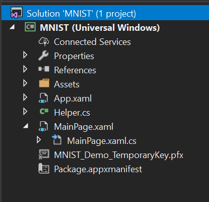
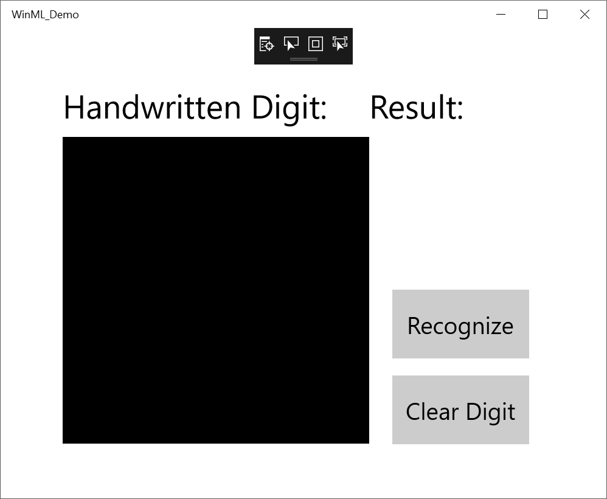
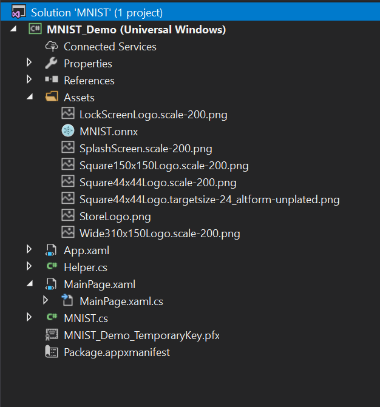
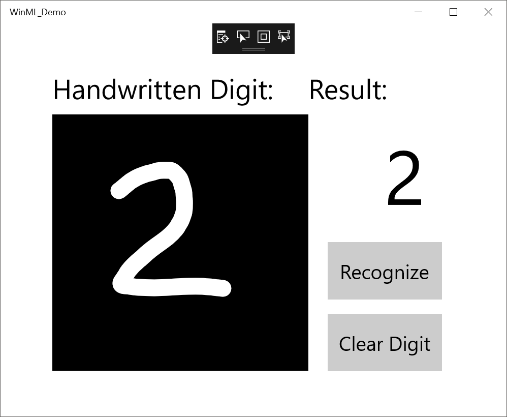

# Get started with Windows Machine Learning

In this tutorial, we'll build a simple UWP app that uses a trained machine learning model to recognize a numeric digit drawn by the user. This tutorial primarily focuses on how to load and use Windows Machine Learning in your app.

## Prerequisites
- [Windows SDK - Build 17110+](https://www.microsoft.com/en-us/software-download/windowsinsiderpreviewSDK)
- [Visual Studio (Version 15.7 - Preview 1)](https://www.visualstudio.com/vs/preview/): Note that you'll need to check off the optional Windows 10 Preview SDK (10.0.17110.0) inside Visual Studio Installer.

## 1. Download the sample
First, you'll need to download our [MNIST_GetStarted sample](https://github.com/Microsoft/Windows-Machine-Learning) from GitHub. We've provided a template with implemented XAML controls and events, including:
- An [InkCanvas](https://docs.microsoft.com/uwp/api/windows.ui.xaml.controls.inkcanvas) to draw the digit.
- [Buttons](https://docs.microsoft.com/uwp/api/windows.ui.xaml.controls.button) to interpret the digit and clear the canvas. 
- Helper routines to convert the InkCanvas output to a [VideoFrame](https://docs.microsoft.com/uwp/api/windows.media.videoframe). 

A completed MNIST sample is also available to download from GitHub.

## 2. Open project in Visual Studio Preview
Launch Visual Studio Preview, and open the MNIST sample application. Note that if the solution is shown as unavailable, you'll need to right-click and select "Reload Project."

Inside the solution explorer, the project has three main code files:
- `MainPage.xaml` - All of our XAML code to create the UI for the InkCanvas, buttons, and labels.
- `MainPage.xaml.cs` - Where our application code lives.
- `Helper.cs` - Helper routines to crop and convert image formats. 



## 3. Build and run project
In the Visual Studio toolbar, change the Solution Platform from "ARM" to "x64" to run the project on your local machine.

To run the project, click the **Start Debugging** button on the toolbar, or press F5. The application should show an InkCanvas where users can write a digit, a "Recognize" button to interpret the number, an empty label field where the interpreted digit will be displayed as text, and a "Clear Digit" button to clear the InkCanvas.

  

## 4. Download a model
Next, let's get a machine learning model to add to our app. For this tutorial, we'll use a pre-trained **MNIST model** that was trained with the [Microsoft Cognitive Toolkit (CNTK)](https://docs.microsoft.com/cognitive-toolkit/) and [exported to ONNX format](https://github.com/onnx/tutorials/blob/master/tutorials/CntkOnnxExport.ipynb). 

If you are using the MNIST_GetStarted sample from GitHub, the MNIST model has already been included in your Assets folder, and you will need to add it to your application as an existing item. You can also download the pre-trained model from the [ONNX Model Zoo](https://github.com/onnx/models) on GitHub.

If you're interested in training your own model, you can follow this [tutorial](train-ai-model.md) that we used to train this MNIST model.

## 5. Add the model 
After downloading the MNIST model, right click on the Assets folder in the Solution Explorer, and select "**Add** > **Existing Item**". Point the file picker to the location of your ONNX model, and click add. 

The project should now have two new files:
- `MNIST.onnx` - your trained model.
- `MNIST.cs` - the Windows ML generated code. 



To make sure the model builds when we compile our application, right click on the `mnist.onnx` file, and select **Properties**. For **Build Action**, select **Content**. 

Now, let's take a look at the newly generated code in the `MNIST.cs` file. We have three classes:
- **MNISTModel** creates the machine learning model representation, binds the specific inputs and outputs to model, and evaluates the model asynchronously. 
- **MNISTModelInput** initializes the input types that the model expects. In this case, the input expects a VideoFrame.
- **MNISTModelOutput** initializes the types that the model will output. In this case, the output will be a list called "classLabel" of type `<long>` and a Dictionary called "prediction" of type `<long, float>`

We'll now use these classes to load, bind, and evaluate the model in our project. 

## 6. Load, bind, and evaluate the model
For Windows ML applications, the pattern we want to follow is: Load > Bind > Evaluate.
- Load the machine learning model.
- Bind inputs and outputs to the model.
- Evaluate the model and view results.

We'll use the interface code generated in `MNIST.cs` to load, bind, and evaluate the model in our app.

First, in `MainPage.xaml.cs`, let's instantiate the model, inputs, and outputs.
```csharp
namespace MNIST_Demo
{
	public sealed partial class MainPage : Page
	{
	    private MNISTModel ModelGen = new MNISTModel();
	    private MNISTModelInput ModelInput = new MNISTModelInput();
	    private MNISTModelOutput ModelOutput = new MNISTModelOutput();
	    ...
	}
}

```
Then, in LoadModel(), we'll load the model.
```csharp
private async void LoadModel()
{
    //Load a machine learning model
    StorageFile modelFile = await StorageFile.GetFileFromApplicationUriAsync(new Uri($"ms-appx:///Assets/MNIST.onnx"));
    ModelGen = await MNISTModel.CreateMNISTModel(modelFile);
}
```

Next, we want to bind our inputs and outputs to the model. 

In this case, our model is expecting an input of type VideoFrame. 
Using our included helper functions in `helper.cs`, we will copy the contents of the InkCanvas, convert it to type VideoFrame, and bind it to our model.

```csharp
private async void recognizeButton_Click(object sender, RoutedEventArgs e)
{
     //Bind model input with contents from InkCanvas
     ModelInput.Input3 = await helper.GetHandWrittenImage(inkGrid);
}
```

For output, we simply call EvaluateAsync() with the specified input. Since the model returns a list of digits with a corresponding probability, we need to parse the returned list to determine which digit had the highest probability and display that one.

```csharp
private async void recognizeButton_Click(object sender, RoutedEventArgs e)
{
    //Bind model input with contents from InkCanvas
    ModelInput.Input3 = await helper.GetHandWrittenImage(inkGrid);
    
    //Evaluate the model
    ModelOutput = await ModelGen.EvaluateAsync(ModelInput);
            
    //Iterate through evaluation output to determine highest probability digit
    float maxProb = 0;
    int maxIndex = 0;
    for (int i = 0; i < 10; i++)
    {
        if (ModelOutput.Plus214_Output_0[i] > maxProb)
        {
            maxIndex = i;
            maxProb = ModelOutput.Plus214_Output_0[i];
        }
    }
    numberLabel.Text = maxIndex.ToString();
}
```

Finally, we'll want to clear out the InkCanvas to allow users to draw another number.
```csharp
private void clearButton_Click(object sender, RoutedEventArgs e)
{
    inkCanvas.InkPresenter.StrokeContainer.Clear();
    numberLabel.Text = "";
}
```

## 7. Launch the app
Once we build and launch the app, we'll be able to recognize a number drawn on the InkCanvas.



## 8. Next steps
That's it - you've made your first Windows ML app! For more samples to get started with Windows ML, check out [Sample apps](samples.md).
