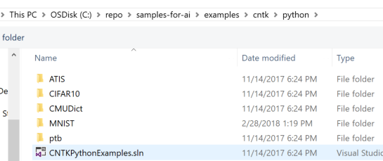
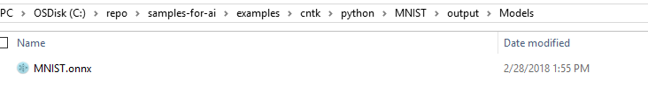

# How to train a model for Windows ML in Visual Studio
In this tutorial, we'll use [Visual Studio Tools for AI](http://aka.ms/vstoolsforai), a development extension for building, testing, and deploying Deep Learning & AI solutions, to train a model for the MNIST sample app in [Get Started](get-started.md).

We'll train the model with the [Microsoft Cognitive Toolkit (CNTK)](http://www.microsoft.com/en-us/cognitive-toolkit) framework and the [MNIST dataset](http://yann.lecun.com/exdb/mnist/), which has a training set of 60,000 examples and a test set of 10,000 examples of handwritten digits. We'll then save the model using the [Open Neural Network Exchange (ONNX)](https://onnx.ai/) format to use with Windows ML. 

## Prerequisites
### Install Visual Studio Tools for AI
To get started, you'll need to download and install [Visual Studio](https://www.visualstudio.com/downloads/). Once you have Visual Studio open, activate the **Visual Studio Tools for AI** extension:

1. Click on the menu bar in Visual Studio and select "Extensions and Updates..."
2. Click on "Online" tab and select "Search Visual Studio Marketplace."
3. Search for "Visual Studio Tools for AI." 
3. Click on the **Download** button. 
4. After installation, restart Visual Studio. 

The extension will be active once Visual Studio restarts. If you're having trouble, check out [Finding Visual Studio extensions](hhttps://docs.microsoft.com/visualstudio/ide/finding-and-using-visual-studio-extensions).

### Download sample code
Download the [Samples for AI](https://github.com/Microsoft/samples-for-ai) repo on GitHub. The samples cover getting started with deep learning across TensorFlow, CNTK, Theano and more.

### Install CNTK
Install [CNTK for Python on Windows](https://docs.microsoft.com/en-us/cognitive-toolkit/setup-windows-python?tabs=cntkpy24). Note that you'll also have to install Python if you haven't already.

Alternatively, to prepare your machine for deep learning model development, see [Preparing your development environment](https://github.com/Microsoft/samples-for-ai/blob/master/README.md) for a simplified installer for installing Python, CNTK, TensorFlow, NVIDIA GPU drivers (optional) and more.

## 1. Open project

Launch Visual Studio and select **File > Open > Project/Solution**. From the Samples for AI repository, select the **examples\cntk\python** folder, and open the **CNTKPythonExamples.sln** file.

## 2. Train the model

To set the MNIST project as the startup project, right-click on the python project and select **Set as Startup Project**.

Next, open the ConvNet_MNIST.py file and **Run** the project by pressing F5 or the green Run button.

## 3. View the model and add it to your app

Open the **output/Models** folder in the Samples for AI repository. There will be one trained DNN model file for each epoch of the training experiment, and the final step will write the **MNIST.onnx** model file. 

Now, you can use this trained **MNIST.onnx** model file to build the MNIST sample app in [Get Started](get-started.md)! 

## 4. Learn more
To learn how to speed up training deep learning models by using [Azure GPU Virtual Machines](https://docs.microsoft.com/en-us/visualstudio/ai/tensorflow-vm) and more, visit [Artificial Intelligence at Microsoft](https://www.microsoft.com/ai) and [Microsoft Machine Learning Technologies](https://docs.microsoft.com/en-us/azure/machine-learning/#More-Microsoft-Machine-Learning-Technologies).