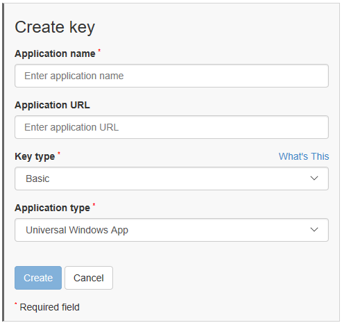

# Request a maps authentication key


Your [Universal Windows app](https://msdn.microsoft.com/library/windows/apps/dn894631) must be authenticated before it can use the [**MapControl**](https://msdn.microsoft.com/library/windows/apps/dn637004) and map services in the [**Windows.Services.Maps**](https://msdn.microsoft.com/library/windows/apps/dn636979) namespace. To authenticate your app, you must specify a maps authentication key. This topic describes how to request a maps authentication key from the [Bing Maps Developer Center](https://www.bingmapsportal.com/) and add it to your app.

**Tip** To learn more about using maps in your app, download the following sample from the [Windows-universal-samples repo](http://go.microsoft.com/fwlink/p/?LinkId=619979) on GitHub:

-   [Universal Windows Platform (UWP) map sample](http://go.microsoft.com/fwlink/p/?LinkId=619977)

## Get a key


Create and manage map authentication keys for your Universal Windows apps using the [Bing Maps Developer Center](https://www.bingmapsportal.com/).

To create a new key

1.  In your browser, navigate to the Bing Maps Developer Center ([https://www.bingmapsportal.com](https://www.bingmapsportal.com/)).

2.  If you are asked to sign in, enter your Microsoft account and click **Sign in**.

3.  Choose the account to associate with your Bing Maps account. If you want to use your Microsoft account, click **Yes**. Otherwise, click **Sign in with another account**.

4.  If you don't already have a Bing Maps account, create a new Bing Maps account. Enter the **Account Name**, **Contact Name**, **Company Name**, **Email Address**, and **Phone Number**. After accepting the terms of use, click **Create**.

5.  Under the **My account** menu, click **My Keys**.

6.  If you have previously created a key, click on the link to create a new key. Otherwise proceed to the Create Key form.

7.  Complete the **Create Key** form and then click **Create**.

    -   **Application name:** The name of your application.
    -   **Application URL (optional):** The URL of your application.
    -   **Key type:** Select **Basic** or **Enterprise**.
    -   **Application type:** Select **Universal Windows App** for use in your Universal Windows app.

    This is an example of what the form looks like.

    

8.  After you click **Create**, the new key appears below the **Create Key** form. Copy it to a safe place or immediately add it to your app, as described in the next step.

## Add the key to your app


The map authentication key is required to use the [**MapControl**](https://msdn.microsoft.com/library/windows/apps/dn637004) and map services ([**Windows.Services.Maps**](https://msdn.microsoft.com/library/windows/apps/dn636979)) in your Universal Windows app. Add it to the map control and map service objects, as applicable.

### To add the key to a map control

To authenticate the [**MapControl**](https://msdn.microsoft.com/library/windows/apps/dn637004), set the [**MapServiceToken**](https://msdn.microsoft.com/library/windows/apps/dn637036) property to the authentication key value. You can set this property in code or in XAML markup, depending on your preferences. For more info about using the **MapControl**, see [Display maps with 2D, 3D, and Streetside views](display-maps.md).

-   This example sets the **MapServiceToken** to the value of the authentication key in code.

    ```cs
    MapControl1.MapServiceToken = "abcdef-abcdefghijklmno";
    ```

-   This example sets the **MapServiceToken** to the value of the authentication key in XAML markup.

    ```xml
    <Maps:MapControl x:Name="MapControl1" MapServiceToken="abcdef-abcdefghijklmno"/>
    ```

### To add the key to map services

To use services in the [**Windows.Services.Maps**](https://msdn.microsoft.com/library/windows/apps/dn636979) namespace, set the [**ServiceToken**](https://msdn.microsoft.com/library/windows/apps/dn636977) property to the authentication key value. For more info about using map services, see [Display routes and directions](routes-and-directions.md) and [Perform geocoding and reverse geocoding](geocoding.md).

-   This example sets the **ServiceToken** to the value of the authentication key in code.

    ```cs
    MapService.ServiceToken = "abcdef-abcdefghijklmno";
    ```

## Related topics

* [Bing Maps Developer Center](https://www.bingmapsportal.com/)
* [UWP map sample](http://go.microsoft.com/fwlink/p/?LinkId=619977)
* [Design guidelines for maps](https://msdn.microsoft.com/library/windows/apps/dn596102)
* [Build 2015 video: Leveraging Maps and Location Across Phone, Tablet, and PC in Your Windows Apps](https://channel9.msdn.com/Events/Build/2015/2-757)
* [UWP traffic app sample](http://go.microsoft.com/fwlink/p/?LinkId=619982)
