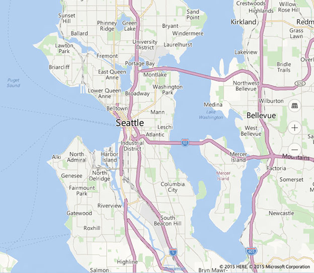
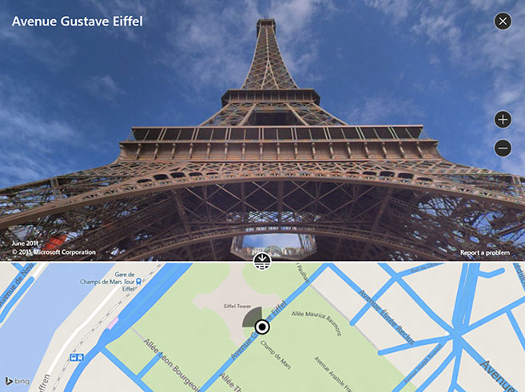
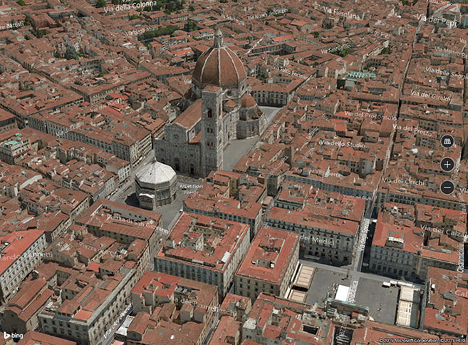
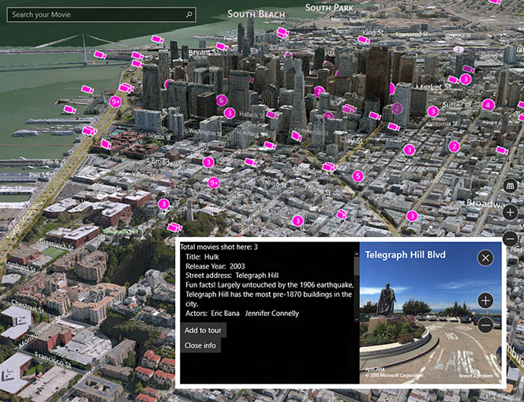

# Map control

\[ Updated for UWP apps on Windows 10. For Windows 8.x articles, see the [archive](http://go.microsoft.com/fwlink/p/?linkid=619132) \]

The map control can display road maps, aerial, 3D, views, directions, search results, and traffic. On a map, you can display the user's location, directions, and points of interest. A map can also show aerial 3D views, Streetside views, traffic, transit, and local businesses.

## Is this the right control?

Use a map control when you want a map within your app that allows users to view app-specific or general geographic information. Having a map control in your app means that users don't have to go outside your app to get that information.

**Note**  If you don't mind users going outside your app, consider using the Windows Maps app to provide that information. Your app can launch the Windows Maps app to display specific maps, directions, and search results. For more info, see [Launch the Windows Maps app](https://msdn.microsoft.com/library/windows/apps/mt228341).

## Examples

This example shows a map with a Streetside view:

 

This example shows a map with an aerial 3D view:

 

This example shows an app with both an aerial 3D view and a Streetside view:

## Recommendations

-   Use ample screen space (or the entire screen) to display the map so that users don't have to pan and zoom excessively to view geographical information.

-   If the map is only used to present a static, informational view, then using a smaller map might be more appropriate. If you go with a smaller, static map, base its dimensions on usability—small enough to conserve enough screen real estate, but large enough to remain legible.

-   Embed the points of interest in the map scene using [**map elements**](https://msdn.microsoft.com/library/windows/apps/dn637034); any additional information can be displayed as transient UI that overlays the map scene.

## Related topics

* [Display maps with 2D, 3D, and Streetside views](https://msdn.microsoft.com/library/windows/apps/mt219695)
* [Display points of interest (POI) on a map](https://msdn.microsoft.com/library/windows/apps/mt219696)
* [Bing Maps Developer Center](https://www.bingmapsportal.com/)
* [UWP map sample](http://go.microsoft.com/fwlink/p/?LinkId=619977)
* [//Build 2015 video: Leveraging Maps and Location Across Phone, Tablet, and PC in Your Windows Apps](https://channel9.msdn.com/Events/Build/2015/2-757)
* [Launch the Windows Maps app](https://msdn.microsoft.com/library/windows/apps/mt228341)
 

 
