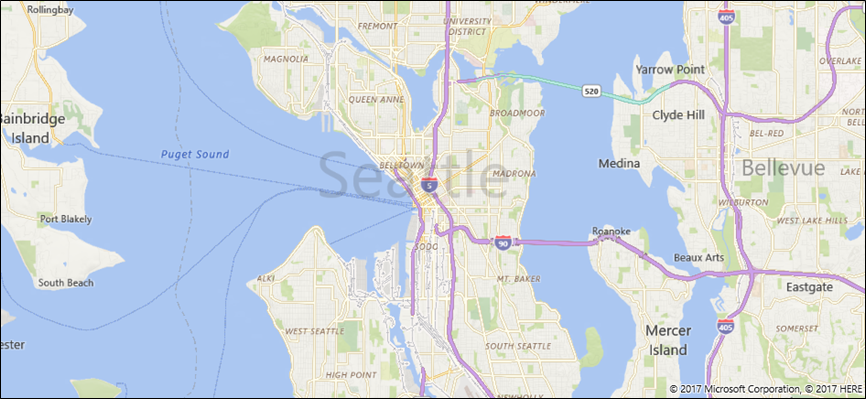
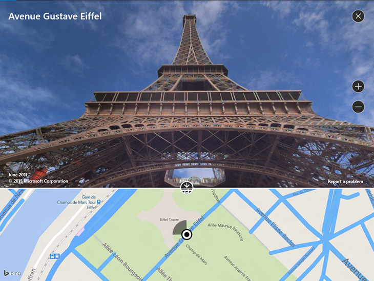
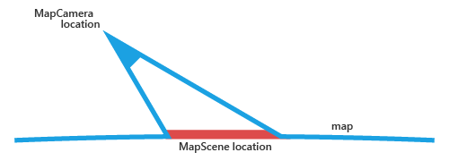
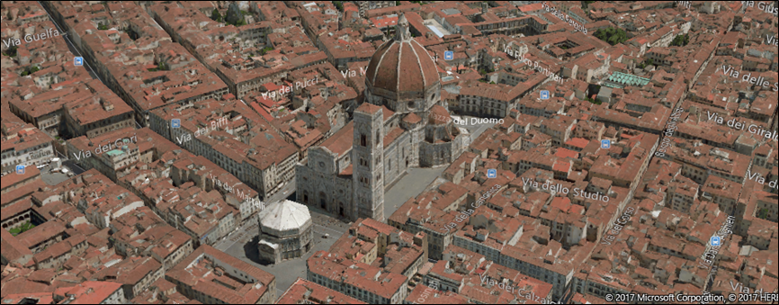

# Display maps with 2D, 3D, and Streetside views


\[ Updated for UWP apps on Windows 10. For Windows 8.x articles, see the [archive](http://go.microsoft.com/fwlink/p/?linkid=619132) \]


Display customizable maps in your app by using the [**MapControl**](https://msdn.microsoft.com/library/windows/apps/dn637004) class. This topic also introduces aerial 3D and Streetside views.

**Tip** To learn more about using maps in your app, download the following sample from the [Windows-universal-samples repo](http://go.microsoft.com/fwlink/p/?LinkId=619979) on GitHub.

-   [Universal Windows Platform (UWP) map sample](http://go.microsoft.com/fwlink/p/?LinkId=619977)

## Add the map control to your app


Display a map on a XAML page by adding a [**MapControl**](https://msdn.microsoft.com/library/windows/apps/dn637004). To use the **MapControl**, you must declare the [**Windows.UI.Xaml.Controls.Maps**](https://msdn.microsoft.com/library/windows/apps/dn610751) namespace in the XAML page or in your code. If you drag the control from the Toolbox, this namespace declaration is added automatically. If you add the **MapControl** to the XAML page manually, you must add the namespace declaration manually at the top of the page.

The following example displays a basic map control and configures the map to display the zoom and tilt controls in addition to accepting touch inputs. For more info about customizing the appearance of the map, see [Configure the map](#configure-the-map).

```xml
<Page
    x:Class="MapsAndLocation1.DisplayMaps"
    xmlns="http://schemas.microsoft.com/winfx/2006/xaml/presentation"
    xmlns:x="http://schemas.microsoft.com/winfx/2006/xaml"
    xmlns:local="using:MapsAndLocation1"
    xmlns:d="http://schemas.microsoft.com/expression/blend/2008"
    xmlns:mc="http://schemas.openxmlformats.org/markup-compatibility/2006"
    xmlns:Maps="using:Windows.UI.Xaml.Controls.Maps"
    mc:Ignorable="d">

 <Grid x:Name="pageGrid" Background="{ThemeResource ApplicationPageBackgroundThemeBrush}">

    <Maps:MapControl
       x:Name="MapControl1"            
       ZoomInteractionMode="GestureAndControl"
       TiltInteractionMode="GestureAndControl"   
       MapServiceToken="EnterYourAuthenticationKeyHere"/>

 </Grid>
</Page>
```

If you add the map control in your code, you must declare the namespace manually at the top of the code file.

```csharp
using Windows.UI.Xaml.Controls.Maps;
...

// Add the MapControl and the specify maps authentication key.
MapControl MapControl2 = new MapControl();
MapControl2.ZoomInteractionMode = MapInteractionMode.GestureAndControl;
MapControl2.TiltInteractionMode = MapInteractionMode.GestureAndControl;
MapControl2.MapServiceToken = "EnterYourAuthenticationKeyHere";
pageGrid.Children.Add(MapControl2);
```

## Get and set a maps authentication key


Before you can use [**MapControl**](https://msdn.microsoft.com/library/windows/apps/dn637004) and map services, you must specify the maps authentication key as the value of the [**MapServiceToken**](https://msdn.microsoft.com/library/windows/apps/dn637036) property. In the previous examples, replace `EnterYourAuthenticationKeyHere` with the key you get from the [Bing Maps Developer Center](https://www.bingmapsportal.com/). The text **Warning: MapServiceToken not specified** continues to appear below the control until you specify the maps authentication key. For more info about getting and setting a maps authentication key, see [Request a maps authentication key](authentication-key.md).

## Set a starting location for the map


Set the location to display on the map by specifying the [**Center**](https://msdn.microsoft.com/library/windows/apps/dn637005) property of the [**MapControl**](https://msdn.microsoft.com/library/windows/apps/dn637004) in your code or by binding the property in your XAML markup. The following example displays a map with the city of Seattle as its center.

**Tip**  Since a string can't be converted to a [**Geopoint**](https://msdn.microsoft.com/library/windows/apps/dn263675), you can't specify a value for the [**Center**](https://msdn.microsoft.com/library/windows/apps/dn637005) property in XAML markup unless you use data binding. (This limitation also applies to the [**MapControl.Location**](https://msdn.microsoft.com/library/windows/apps/dn653264) attached property.)

 

```csharp
protected override void OnNavigatedTo(NavigationEventArgs e)
{
   // Specify a known location.
   BasicGeoposition cityPosition = new BasicGeoposition() { Latitude = 47.604, Longitude = -122.329 };
   Geopoint cityCenter = new Geopoint(cityPosition);

   // Set the map location.
   MapControl1.Center = cityCenter;
   MapControl1.ZoomLevel = 12;
   MapControl1.LandmarksVisible = true;
}
```



## Set the current location of the map


Before your app can access the user’s location, your app must call the [**RequestAccessAsync**](https://msdn.microsoft.com/library/windows/apps/dn859152) method. At that time, your app must be in the foreground and **RequestAccessAsync** must be called from the UI thread. Until the user grants your app permission to their location, your app can't access location data.

Get the current location of the device (if location is available) by using the [**GetGeopositionAsync**](https://msdn.microsoft.com/library/windows/apps/hh973536) method of the [**Geolocator**](https://msdn.microsoft.com/library/windows/apps/br225534) class. To obtain the corresponding [**Geopoint**](https://msdn.microsoft.com/library/windows/apps/dn263675), use the [**Point**](https://msdn.microsoft.com/library/windows/apps/dn263665) property of the geoposition's geocoordinate. For more info, see [Get current location](get-location.md).

```csharp
// Set your current location.
var accessStatus = await Geolocator.RequestAccessAsync();
switch (accessStatus)
{
   case GeolocationAccessStatus.Allowed:

      // Get the current location.
      Geolocator geolocator = new Geolocator();
      Geoposition pos = await geolocator.GetGeopositionAsync();
      Geopoint myLocation = pos.Coordinate.Point;

      // Set the map location.
      MapControl1.Center = myLocation;
      MapControl1.ZoomLevel = 12;
      MapControl1.LandmarksVisible = true;
      break;

   case GeolocationAccessStatus.Denied:
      // Handle the case  if access to location is denied.
      break;

   case GeolocationAccessStatus.Unspecified:
      // Handle the case if  an unspecified error occurs.
      break;
}
```

When you display your device's location on a map, consider displaying graphics and setting the zoom level based on the accuracy of the location data. For more info, see [Guidelines for location-aware apps](https://msdn.microsoft.com/library/windows/apps/hh465148).

## Change the location of the map


To change the location that appears in a 2D map, call one of the overloads of the [**TrySetViewAsync**](https://msdn.microsoft.com/library/windows/apps/dn637060) method. Use that method to specify new values for [**Center**](https://msdn.microsoft.com/library/windows/apps/dn637005), [**ZoomLevel**](https://msdn.microsoft.com/library/windows/apps/dn637068), [**Heading**](https://msdn.microsoft.com/library/windows/apps/dn637019), and [**Pitch**](https://msdn.microsoft.com/library/windows/apps/dn637044). You can also specify an optional animation to use when the view changes by providing a constant from the [**MapAnimationKind**](https://msdn.microsoft.com/library/windows/apps/dn637002) enumeration.

To change the location of a 3D map, use the [**TrySetSceneAsync**](https://msdn.microsoft.com/library/windows/apps/dn974296) method instead. For more info, see [Display 3D views](#display-aerial-3d-views).

Call the [**TrySetViewBoundsAsync**](https://msdn.microsoft.com/library/windows/apps/dn637065) method to display the contents of a [**GeoboundingBox**](https://msdn.microsoft.com/library/windows/apps/dn607949) on the map. Use this method, for example, to display a route or a portion of a route on the map. For more info, see [Display routes and directions on a map](routes-and-directions.md).

## Configure the map


Configure the map and its appearance by setting the values of the following properties of the [**MapControl**](https://msdn.microsoft.com/library/windows/apps/dn637004).

**Map settings**

-   Set the **center** of the map to a geographic point by setting the [**Center**](https://msdn.microsoft.com/library/windows/apps/dn637005) property.
-   Set the **zoom level** of the map by setting the [**ZoomLevel**](https://msdn.microsoft.com/library/windows/apps/dn637068) property to a value between 1 and 20.
-   Set the **rotation** of the map by setting the [**Heading**](https://msdn.microsoft.com/library/windows/apps/dn637019) property, where 0 or 360 degrees = North, 90 = East, 180 = South, and 270 = West.
-   Set the **tilt** of the map by setting the [**DesiredPitch**](https://msdn.microsoft.com/library/windows/apps/dn637012) property to a value between 0 and 65 degrees.

**Map appearance**

-   Specify the **type** of map - for example, a road map or an aerial map - by setting the [**Style**](https://msdn.microsoft.com/library/windows/apps/dn637051) property with one of the [**MapStyle**](https://msdn.microsoft.com/library/windows/apps/dn637127) constants.
-   Set the **color scheme** of the map to light or dark by setting the [**ColorScheme**](https://msdn.microsoft.com/library/windows/apps/dn637010) property with one of the [**MapColorScheme**](https://msdn.microsoft.com/library/windows/apps/dn637003) constants.

Show information on the map by setting the values of the following properties of the [**MapControl**](https://msdn.microsoft.com/library/windows/apps/dn637004).

-   Display **buildings and landmarks** on the map by enabling or disabling the [**LandmarksVisible**](https://msdn.microsoft.com/library/windows/apps/dn637023) property.
-   Display **pedestrian features** such as public stairs on the map by enabling or disabling the [**PedestrianFeaturesVisible**](https://msdn.microsoft.com/library/windows/apps/dn637042) property.
-   Display **traffic** on the map by enabling or disabling the [**TrafficFlowVisible**](https://msdn.microsoft.com/library/windows/apps/dn637055) property.
-   Specify whether the **watermark** is displayed on the map by setting the [**WatermarkMode**](https://msdn.microsoft.com/library/windows/apps/dn637066) property to one of the [**MapWatermarkMode**](https://msdn.microsoft.com/library/windows/apps/dn610749) constants.
-   Display a **driving or walking route** on the map by adding a [**MapRouteView**](https://msdn.microsoft.com/library/windows/apps/dn637122) to the [**Routes**](https://msdn.microsoft.com/library/windows/apps/dn637047) collection of the Map control. For more info and an example, see [Display routes and directions on a map](routes-and-directions.md).

For info about how to display pushpins, shapes, and XAML controls in the [**MapControl**](https://msdn.microsoft.com/library/windows/apps/dn637004), see [Display points of interest (POI) on a map](display-poi.md).

## Display Streetside views


A Streetside view is a street-level perspective of a location that appears on top of the map control.



Consider the experience "inside" the Streetside view separate from the map originally displayed in the map control. For example, changing the location in the Streetside view does not change the location or appearance of the map "under" the Streetside view. After you close the Streetside view (by clicking the **X** in the upper right corner of the control), the original map remains unchanged.

To display a Streetside view

1.  Determine if Streetside views are supported on the device by checking [**IsStreetsideSupported**](https://msdn.microsoft.com/library/windows/apps/dn974271).
2.  If Streetside view is supported, create a [**StreetsidePanorama**](https://msdn.microsoft.com/library/windows/apps/dn974360) near the specified location by calling [**FindNearbyAsync**](https://msdn.microsoft.com/library/windows/apps/dn974361).
3.  Determine if a nearby panorama was found by checking if the [**StreetsidePanorama**](https://msdn.microsoft.com/library/windows/apps/dn974360) is not null
4.  If a nearby panorama was found, create a [**StreetsideExperience**](https://msdn.microsoft.com/library/windows/apps/dn974356) for the map control's [**CustomExperience**](https://msdn.microsoft.com/library/windows/apps/dn974263) property.

This example shows how to display a Streetside view similar to the previous image.

**Note**  The overview map will not appear if the map control is sized too small.

 

```csharp
private async void showStreetsideView()
{
   // Check if Streetside is supported.
   if (MapControl1.IsStreetsideSupported)
   {
      // Find a panorama near Avenue Gustave Eiffel.
      BasicGeoposition cityPosition = new BasicGeoposition() { Latitude = 48.858, Longitude = 2.295};
      Geopoint cityCenter = new Geopoint(cityPosition);
      StreetsidePanorama panoramaNearCity = await StreetsidePanorama.FindNearbyAsync(cityCenter);

      // Set the Streetside view if a panorama exists.
      if (panoramaNearCity != null)
      {
         // Create the Streetside view.
         StreetsideExperience ssView = new StreetsideExperience(panoramaNearCity);
         ssView.OverviewMapVisible = true;
         MapControl1.CustomExperience = ssView;
      }
   }
   else
   {
      // If Streetside is not supported
      ContentDialog viewNotSupportedDialog = new ContentDialog()
      {
         Title = "Streetside is not supported",
         Content ="\nStreetside views are not supported on this device.",
         PrimaryButtonText = "OK"
      };
      await viewNotSupportedDialog.ShowAsync();            
   }
}
```

## Display aerial 3D views


Specify a 3D perspective of the map by using the [**MapScene**](https://msdn.microsoft.com/library/windows/apps/dn974329) class. The map scene represents the 3D view that appears in the map. The [**MapCamera**](https://msdn.microsoft.com/library/windows/apps/dn974244) class represents the position of the camera that would display such a view.



To make buildings and other features on the map surface appear in 3D, set the map control's [**Style**](https://msdn.microsoft.com/library/windows/apps/dn637051) property to [**MapStyle.Aerial3DWithRoads**](https://msdn.microsoft.com/library/windows/apps/dn637127). This is an example of a 3D view with the **Aerial3DWithRoads** style.



To display a 3D view

1.  Determine if 3D views are supported on the device by checking [**Is3DSupported**](https://msdn.microsoft.com/library/windows/apps/dn974265).
2.  If 3D views is supported, set the map control's [**Style**](https://msdn.microsoft.com/library/windows/apps/dn637051) property to [**MapStyle.Aerial3DWithRoads**](https://msdn.microsoft.com/library/windows/apps/dn637127).
3.  Create a [**MapScene**](https://msdn.microsoft.com/library/windows/apps/dn974329) object using one of the many **CreateFrom** methods, such as [**CreateFromLocationAndRadius**](https://msdn.microsoft.com/library/windows/apps/dn974336) and [**CreateFromCamera**](https://msdn.microsoft.com/library/windows/apps/dn974334).
4.  Call [**TrySetSceneAsync**](https://msdn.microsoft.com/library/windows/apps/dn974296) to display the 3D view. You can also specify an optional animation to use when the view changes by providing a constant from the [**MapAnimationKind**](https://msdn.microsoft.com/library/windows/apps/dn637002) enumeration.

This example shows how to display a 3D view.

```csharp
private async void display3DLocation()
{
   if (MapControl1.Is3DSupported)
   {
      // Set the aerial 3D view.
      MapControl1.Style = MapStyle.Aerial3DWithRoads;

      // Specify the location.
      BasicGeoposition hwGeoposition = new BasicGeoposition() { Latitude = 34.134, Longitude = -118.3216};
      Geopoint hwPoint = new Geopoint(hwGeoposition);

      // Create the map scene.
      MapScene hwScene = MapScene.CreateFromLocationAndRadius(hwPoint,
                                                                           80, /* show this many meters around */
                                                                           0, /* looking at it to the North*/
                                                                           60 /* degrees pitch */);
      // Set the 3D view with animation.
      await MapControl1.TrySetSceneAsync(hwScene,MapAnimationKind.Bow);
   }
   else
   {
      // If 3D views are not supported, display dialog.
      ContentDialog viewNotSupportedDialog = new ContentDialog()
      {
         Title = "3D is not supported",
         Content = "\n3D views are not supported on this device.",
         PrimaryButtonText = "OK"
      };
      await viewNotSupportedDialog.ShowAsync();
   }
}
```

## Get info about locations and elements


Get info about locations on the map by calling the following methods of the [**MapControl**](https://msdn.microsoft.com/library/windows/apps/dn637004).

-   [**GetLocationFromOffset**](https://msdn.microsoft.com/library/windows/apps/dn637016) method - Get the geographic location that corresponds to the specified point in the viewport of the Map control.
-   [**GetOffsetFromLocation**](https://msdn.microsoft.com/library/windows/apps/dn637018) method - Get the point in the viewport of the Map control that corresponds to the specified geographic location.
-   [**IsLocationInView**](https://msdn.microsoft.com/library/windows/apps/dn637022) method - Determine whether the specified geographic location is currently visible in the viewport of the Map control.
-   [**FindMapElementsAtOffset**](https://msdn.microsoft.com/library/windows/apps/dn637014) method - Get the elements on the map located at the specified point in the viewport of the Map control.

## Handle user interaction and changes


Handle user input gestures on the map by handling the following events of the [**MapControl**](https://msdn.microsoft.com/library/windows/apps/dn637004). Get info about the geographic location on the map and the physical position in the viewport where the gesture occurred by checking the values of the [**Location**](https://msdn.microsoft.com/library/windows/apps/dn637091) and [**Position**](https://msdn.microsoft.com/library/windows/apps/dn637093) properties of the [**MapInputEventArgs**](https://msdn.microsoft.com/library/windows/apps/dn637090).

-   [**MapTapped**](https://msdn.microsoft.com/library/windows/apps/dn637038)
-   [**MapDoubleTapped**](https://msdn.microsoft.com/library/windows/apps/dn637032)
-   [**MapHolding**](https://msdn.microsoft.com/library/windows/apps/dn637035)

Determine whether the map is loading or completely loaded by handling the control's [**LoadingStatusChanged**](https://msdn.microsoft.com/library/windows/apps/dn637028) event.

Handle changes that happen when the user or the app changes the settings of the map by handling the following events of the [**MapControl**](https://msdn.microsoft.com/library/windows/apps/dn637004). [Guidelines for maps](https://msdn.microsoft.com/library/windows/apps/dn596102)

-   [**CenterChanged**](https://msdn.microsoft.com/library/windows/apps/dn637006)
-   [**HeadingChanged**](https://msdn.microsoft.com/library/windows/apps/dn637020)
-   [**PitchChanged**](https://msdn.microsoft.com/library/windows/apps/dn637045)
-   [**ZoomLevelChanged**](https://msdn.microsoft.com/library/windows/apps/dn637069)

## Related topics

* [Bing Maps Developer Center](https://www.bingmapsportal.com/)
* [UWP map sample](http://go.microsoft.com/fwlink/p/?LinkId=619977)
* [Get current location](get-location.md)
* [Design guidelines for location-aware apps](https://msdn.microsoft.com/library/windows/apps/hh465148)
* [Design guidelines for maps](https://msdn.microsoft.com/library/windows/apps/dn596102)
* [Build 2015 video: Leveraging Maps and Location Across Phone, Tablet, and PC in Your Windows Apps](https://channel9.msdn.com/Events/Build/2015/2-757)
* [UWP traffic app sample](http://go.microsoft.com/fwlink/p/?LinkId=619982)
* [**MapControl**](https://msdn.microsoft.com/library/windows/apps/dn637004)
