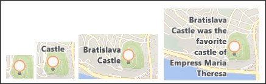
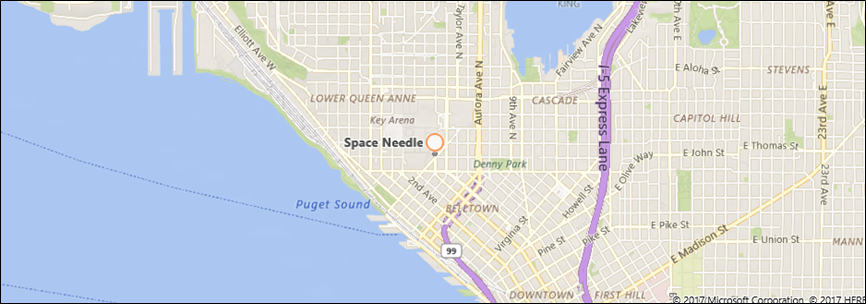
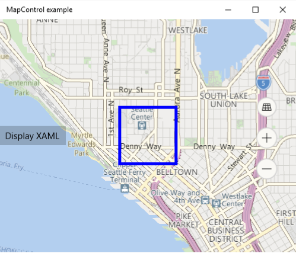

---
author: normesta
title: Display points of interest (POI) on a map
description: Add points of interest (POI) to a map using pushpins, images, shapes, and XAML UI elements.
ms.assetid: CA00D8EB-6C1B-4536-8921-5EAEB9B04FCA
ms.author: normesta
ms.date: 02/08/2017
ms.topic: article
ms.prod: windows
ms.technology: uwp
keywords: windows 10, uwp, map, location, pushpins
---

# Display points of interest (POI) on a map


\[ Updated for UWP apps on Windows 10. For Windows 8.x articles, see the [archive](http://go.microsoft.com/fwlink/p/?linkid=619132) \]


Add points of interest (POI) to a map using pushpins, images, shapes, and XAML UI elements. A POI is a specific point on the map that represents something of interest. For example, the location of a business, city, or friend.

**Tip** To learn more about displaying POI on your app, download the following sample from the [Windows-universal-samples repo](http://go.microsoft.com/fwlink/p/?LinkId=619979) on GitHub.

-   [Universal Windows Platform (UWP) map sample](http://go.microsoft.com/fwlink/p/?LinkId=619977)

Display pushpins, images, and shapes on the map by adding [**MapIcon**](https://msdn.microsoft.com/library/windows/apps/dn637077), [**MapPolygon**](https://msdn.microsoft.com/library/windows/apps/dn637103), and [**MapPolyline**](https://msdn.microsoft.com/library/windows/apps/dn637114) objects to the [**MapElements**](https://msdn.microsoft.com/library/windows/apps/dn637033) collection of the map control. Use data binding or add items programmatically; you can't bind to the **MapElements** collection declaratively in your XAML markup.

Display XAML user interface elements such as a [**Button**](https://msdn.microsoft.com/library/windows/apps/br209265), a [**HyperlinkButton**](https://msdn.microsoft.com/library/windows/apps/br242739), or a [**TextBlock**](https://msdn.microsoft.com/library/windows/apps/br209652) on the map by adding them as [**Children**](https://msdn.microsoft.com/library/windows/apps/dn637008) of the [**MapControl**](https://msdn.microsoft.com/library/windows/apps/dn637004). You can also add them to the [**MapItemsControl**](https://msdn.microsoft.com/library/windows/apps/dn637094), or bind the **MapItemsControl** to a collection of items.

In summary:

-   [Add a MapIcon to the map](#mapicon) to display an image such as a pushpin with optional text.
-   [Add a MapPolygon to the map](#mappolygon) to display a multi-point shape.
-   [Add a MapPolyline to the map](#mappolyline) to display lines on the map.
-   [Add XAML to the map](#mapxaml) to display custom UI elements.

If you have a large number of elements to place on the map, consider [overlaying tiled images on the map](overlay-tiled-images.md). To display roads on the map, see [Display routes and directions](routes-and-directions.md).

## Add a MapIcon


Display an image such a pushpin, with optional text, on the map by using the [**MapIcon**](https://msdn.microsoft.com/library/windows/apps/dn637077) class. You can accept the default image or provide a custom image by using the [**Image**](https://msdn.microsoft.com/library/windows/apps/dn637078) property. The following image displays the default image for a **MapIcon** with no value specified for the [**Title**](https://msdn.microsoft.com/library/windows/apps/dn637088) property, with a short title, with a long title, and with a very long title.



The following example shows a map of the city of Seattle and adds a [**MapIcon**](https://msdn.microsoft.com/library/windows/apps/dn637077) with the default image and an optional title to indicate the location of the Space Needle. It also centers the map over the icon and zooms in. For general info about using the map control, see [Display maps with 2D, 3D, and Streetside views](display-maps.md).

```csharp
      private void displayPOIButton_Click(object sender, RoutedEventArgs e)
      {
         // Specify a known location.
         BasicGeoposition snPosition = new BasicGeoposition() { Latitude = 47.620, Longitude = -122.349 };
         Geopoint snPoint = new Geopoint(snPosition);

         // Create a MapIcon.
         MapIcon mapIcon1 = new MapIcon();
         mapIcon1.Location = snPoint;
         mapIcon1.NormalizedAnchorPoint = new Point(0.5, 1.0);
         mapIcon1.Title = "Space Needle";
         mapIcon1.ZIndex = 0;

         // Add the MapIcon to the map.
         MapControl1.MapElements.Add(mapIcon1);

         // Center the map over the POI.
         MapControl1.Center = snPoint;
         MapControl1.ZoomLevel = 14;
      }
```

This example displays the following POI on the map (the default image in the center).



The following line of code displays the [**MapIcon**](https://msdn.microsoft.com/library/windows/apps/dn637077) with a custom image saved in the Assets folder of the project. The [**Image**](https://msdn.microsoft.com/library/windows/apps/dn637078) property of the **MapIcon** expects a value of type [**RandomAccessStreamReference**](https://msdn.microsoft.com/library/windows/apps/hh701813). This type requires a **using** statement for the [**Windows.Storage.Streams**](https://msdn.microsoft.com/library/windows/apps/br241791) namespace.

**Tip** If you use the same image for multiple map icons, declare the [**RandomAccessStreamReference**](https://msdn.microsoft.com/library/windows/apps/hh701813) at the page or app level for the best performance.

```csharp
    MapIcon1.Image =
        RandomAccessStreamReference.CreateFromUri(new Uri("ms-appx:///Assets/customicon.png"));
```

Keep these considerations in mind when working with the [**MapIcon**](https://msdn.microsoft.com/library/windows/apps/dn637077) class:

-   The [**Image**](https://msdn.microsoft.com/library/windows/apps/dn637078) property supports a maximum image size of 2048×2048 pixels.
-   By default, the map icon's image is not guaranteed to be shown. It may be hidden when it obscures other elements or labels on the map. To keep it visible, set the map icon's [**CollisionBehaviorDesired**](https://msdn.microsoft.com/library/windows/apps/dn974327) property to [**MapElementCollisionBehavior.RemainVisible**](https://msdn.microsoft.com/library/windows/apps/dn974314).
-   The optional [**Title**](https://msdn.microsoft.com/library/windows/apps/dn637088) of the [**MapIcon**](https://msdn.microsoft.com/library/windows/apps/dn637077) is not guaranteed to be shown. If you don't see the text, zoom out by decreasing the value of the [**ZoomLevel**](https://msdn.microsoft.com/library/windows/apps/dn637068) property of the [**MapControl**](https://msdn.microsoft.com/library/windows/apps/dn637004).
-   When you display a [**MapIcon**](https://msdn.microsoft.com/library/windows/apps/dn637077) image that points to a specific location on the map - for example, a pushpin or an arrow - consider setting the value of the [**NormalizedAnchorPoint**](https://msdn.microsoft.com/library/windows/apps/dn637082) property to the approximate location of the pointer on the image. If you leave the value of **NormalizedAnchorPoint** at its default value of (0, 0), which represents the upper left corner of the image, changes in the [**ZoomLevel**](https://msdn.microsoft.com/library/windows/apps/dn637068) of the map may leave the image pointing to a different location.

## Add a MapPolygon


Display a multi-point shape on the map by using the [**MapPolygon**](https://msdn.microsoft.com/library/windows/apps/dn637103) class. The following example, from the [UWP map sample](http://go.microsoft.com/fwlink/p/?LinkId=619977), displays a red box with blue border on the map.

```csharp
private void mapPolygonAddButton_Click(object sender, Windows.UI.Xaml.RoutedEventArgs e)
{
   double centerLatitude = myMap.Center.Position.Latitude;
   double centerLongitude = myMap.Center.Position.Longitude;
   MapPolygon mapPolygon = new MapPolygon();
   mapPolygon.Path = new Geopath(new List<BasicGeoposition>() {
         new BasicGeoposition() {Latitude=centerLatitude+0.0005, Longitude=centerLongitude-0.001 },                
         new BasicGeoposition() {Latitude=centerLatitude-0.0005, Longitude=centerLongitude-0.001 },                
         new BasicGeoposition() {Latitude=centerLatitude-0.0005, Longitude=centerLongitude+0.001 },
         new BasicGeoposition() {Latitude=centerLatitude+0.0005, Longitude=centerLongitude+0.001 },

   });

   mapPolygon.ZIndex = 1;
   mapPolygon.FillColor = Colors.Red;
   mapPolygon.StrokeColor = Colors.Blue;
   mapPolygon.StrokeThickness = 3;
   mapPolygon.StrokeDashed = false;
   myMap.MapElements.Add(mapPolygon);
}
```

## Add a MapPolyline


Display a line on the map by using the [**MapPolyline**](https://msdn.microsoft.com/library/windows/apps/dn637114) class. The following example, from the [UWP map sample](http://go.microsoft.com/fwlink/p/?LinkId=619977), displays a dashed line on the map.

```csharp
private void mapPolylineAddButton_Click(object sender, Windows.UI.Xaml.RoutedEventArgs e)
{
   double centerLatitude = myMap.Center.Position.Latitude;
   double centerLongitude = myMap.Center.Position.Longitude;
   MapPolyline mapPolyline = new MapPolyline();
   mapPolyline.Path = new Geopath(new List<BasicGeoposition>() {                
         new BasicGeoposition() {Latitude=centerLatitude-0.0005, Longitude=centerLongitude-0.001 },                
         new BasicGeoposition() {Latitude=centerLatitude+0.0005, Longitude=centerLongitude+0.001 },
   });

   mapPolyline.StrokeColor = Colors.Black;
   mapPolyline.StrokeThickness = 3;
   mapPolyline.StrokeDashed = true;
   myMap.MapElements.Add(mapPolyline);
}
```

## Add XAML


Display custom UI elements on the map using XAML. Position XAML on the map by specifying the location and normalized anchor point of the XAML.

-   Set the location on the map where the XAML is placed by calling [**SetLocation**](https://msdn.microsoft.com/library/windows/desktop/ms704369).
-   Set the relative location on the XAML that corresponds to the specified location by calling [**SetNormalizedAnchorPoint**](https://msdn.microsoft.com/library/windows/apps/dn637050).

The following example shows a map of the city of Seattle and adds a XAML [**Border**](https://msdn.microsoft.com/library/windows/apps/br209250) control to indicate the location of the Space Needle. It also centers the map over the area and zooms in. For general info about using the map control, see [Display maps with 2D, 3D, and Streetside views](display-maps.md).

```csharp
private void displayXAMLButton_Click(object sender, RoutedEventArgs e)
{
   // Specify a known location.
   BasicGeoposition snPosition = new BasicGeoposition() { Latitude = 47.620, Longitude = -122.349 };
   Geopoint snPoint = new Geopoint(snPosition);

   // Create a XAML border.
   Border border = new Border
   {
      Height = 100,
      Width = 100,
      BorderBrush = new SolidColorBrush(Windows.UI.Colors.Blue),
      BorderThickness = new Thickness(5),
   };

   // Center the map over the POI.
   MapControl1.Center = snPoint;
   MapControl1.ZoomLevel = 14;

   // Add XAML to the map.
   MapControl1.Children.Add(border);
   MapControl.SetLocation(border, snPoint);
   MapControl.SetNormalizedAnchorPoint(border, new Point(0.5, 0.5));
}
```

This example displays a blue border on the map.



The next examples show how to add XAML UI elements directly in the XAML markup of the page using data binding. As with other XAML elements that display content, [**Children**](https://msdn.microsoft.com/library/windows/apps/dn637008) is the default content property of the [**MapControl**](https://msdn.microsoft.com/library/windows/apps/dn637004) and does not have to be specified explicitly in XAML markup.

This example shows how to display two XAML controls as implicit children of the [**MapControl**](https://msdn.microsoft.com/library/windows/apps/dn637004).

```xml
<maps:MapControl>
    <TextBox Text="Seattle" maps:MapControl.Location="{Binding SeattleLocation}"/>
    <TextBox Text="Bellevue" maps:MapControl.Location="{Binding BellevueLocation}"/>
</maps:MapControl>
```

This example shows how to display two XAML controls contained within a [**MapItemsControl**](https://msdn.microsoft.com/library/windows/apps/dn637094).

```xml
<maps:MapControl>
  <maps:MapItemsControl>
    <TextBox Text="Seattle" maps:MapControl.Location="{Binding SeattleLocation}"/>
    <TextBox Text="Bellevue" maps:MapControl.Location="{Binding BellevueLocation}"/>
  </maps:MapItemsControl>
</maps:MapControl>
```

This example displays a collection of XAML elements bound to a [**MapItemsControl**](https://msdn.microsoft.com/library/windows/apps/dn637094).

```xml
<maps:MapControl x:Name="MapControl" MapTapped="MapTapped" MapDoubleTapped="MapTapped" MapHolding="MapTapped">
  <maps:MapItemsControl ItemsSource="{Binding StateOverlays}">
    <maps:MapItemsControl.ItemTemplate>
      <DataTemplate>
        <StackPanel Background="Black" Tapped="Overlay_Tapped">
          <TextBlock maps:MapControl.Location="{Binding Location}" Text="{Binding Name}" maps:MapControl.NormalizedAnchorPoint="0.5,0.5" FontSize="20" Margin="5"/>
        </StackPanel>
      </DataTemplate>
    </maps:MapItemsControl.ItemTemplate>
  </maps:MapItemsControl>
</maps:MapControl>
```

## Related topics

* [Bing Maps Developer Center](https://www.bingmapsportal.com/)
* [UWP map sample](http://go.microsoft.com/fwlink/p/?LinkId=619977)
* [Design guidelines for maps](https://msdn.microsoft.com/library/windows/apps/dn596102)
* [Build 2015 video: Leveraging Maps and Location Across Phone, Tablet, and PC in Your Windows Apps](https://channel9.msdn.com/Events/Build/2015/2-757)
* [UWP traffic app sample](http://go.microsoft.com/fwlink/p/?LinkId=619982)
* [**MapIcon**](https://msdn.microsoft.com/library/windows/apps/dn637077)
* [**MapPolygon**](https://msdn.microsoft.com/library/windows/apps/dn637103)
* [**MapPolyline**](https://msdn.microsoft.com/library/windows/apps/dn637114)
