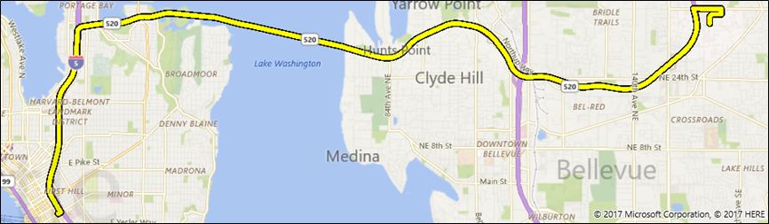

# Display routes and directions on a map


\[ Updated for UWP apps on Windows 10. For Windows 8.x articles, see the [archive](http://go.microsoft.com/fwlink/p/?linkid=619132) \]


Request routes and directions, and display them in your app.

**Tip** To learn more about using maps in your app, download the following sample from the [Windows-universal-samples repo](http://go.microsoft.com/fwlink/p/?LinkId=619979) on GitHub.

-   [Universal Windows Platform (UWP) map sample](http://go.microsoft.com/fwlink/p/?LinkId=619977)

**Tip**  If mapping isn't a core feature of your app, consider launching the Windows Maps app instead. You can use the `bingmaps:`, `ms-drive-to:`, and `ms-walk-to:` URI schemes to launch the Windows Maps app to specific maps and turn-by-turn directions. For more info, see [Launch the Windows Maps app](https://msdn.microsoft.com/library/windows/apps/mt228341).

 

## An intro to MapRouteFinder results


Here's how the classes for routes and directions are related:

-   The [**MapRouteFinder**](https://msdn.microsoft.com/library/windows/apps/dn636938) class has methods that get routes and directions.
-   These methods return a [**MapRouteFinderResult**](https://msdn.microsoft.com/library/windows/apps/dn636939).
-   The [**MapRouteFinderResult**](https://msdn.microsoft.com/library/windows/apps/dn636939) contains a [**MapRoute**](https://msdn.microsoft.com/library/windows/apps/dn636937) object. Access this object through the [**Route**](https://msdn.microsoft.com/library/windows/apps/dn636940) property of the **MapRouteFinderResult**.
-   The [**MapRoute**](https://msdn.microsoft.com/library/windows/apps/dn636937) contains a collection of [**MapRouteLeg**](https://msdn.microsoft.com/library/windows/apps/dn636955) objects. Access this collection through the [**Legs**](https://msdn.microsoft.com/library/windows/apps/dn636973) property of the **MapRoute**.
-   Each [**MapRouteLeg**](https://msdn.microsoft.com/library/windows/apps/dn636955) contains a collection of [**MapRouteManeuver**](https://msdn.microsoft.com/library/windows/apps/dn636961) objects. Access this collection through the [**Maneuvers**](https://msdn.microsoft.com/library/windows/apps/dn636959) property of the **MapRouteLeg**.

## Display directions


Get a driving or walking route and directions by calling the methods of the [**MapRouteFinder**](https://msdn.microsoft.com/library/windows/apps/dn636938) class—for example, [**GetDrivingRouteAsync**](https://msdn.microsoft.com/library/windows/apps/dn636943) or [**GetWalkingRouteAsync**](https://msdn.microsoft.com/library/windows/apps/dn636953). The [**MapRouteFinderResult**](https://msdn.microsoft.com/library/windows/apps/dn636939) object contains a [**MapRoute**](https://msdn.microsoft.com/library/windows/apps/dn636937) object that you can access through its [**Route**](https://msdn.microsoft.com/library/windows/apps/dn636940) property.

When you request a route, you can specify the following things:

-   You can provide a start point and end point only, or you can provide a series of waypoints to compute the route.
-   You can specify optimizations - for example, minimize the distance.
-   You can specify restrictions - for example, avoid highways.

The computed [**MapRoute**](https://msdn.microsoft.com/library/windows/apps/dn636937) has properties that provide the time to traverse the route, the length of the route, and the collection of [**MapRouteLeg**](https://msdn.microsoft.com/library/windows/apps/dn636955) objects that contain the legs of the route. Each **MapRouteLeg** object contains a collection of [**MapRouteManeuver**](https://msdn.microsoft.com/library/windows/apps/dn636961) objects. The **MapRouteManeuver** object contains directions that you can access through its [**InstructionText**](https://msdn.microsoft.com/library/windows/apps/dn636964) property.

**Important**  You must specify a maps authentication key before you can use map services. For more info, see [Request a maps authentication key](authentication-key.md).

 

```csharp
using System;
using Windows.UI.Xaml;
using Windows.UI.Xaml.Controls;
using Windows.Services.Maps;
using Windows.Devices.Geolocation;
...
private async void button_Click(object sender, RoutedEventArgs e)
{
   // Start at Microsoft in Redmond, Washington.
   BasicGeoposition startLocation = new BasicGeoposition() {Latitude=47.643,Longitude=-122.131};

   // End at the city of Seattle, Washington.
   BasicGeoposition endLocation = new BasicGeoposition() {Latitude = 47.604,Longitude= -122.329};

   // Get the route between the points.
   MapRouteFinderResult routeResult =
         await MapRouteFinder.GetDrivingRouteAsync(
         new Geopoint(startLocation),
         new Geopoint(endLocation),
         MapRouteOptimization.Time,
         MapRouteRestrictions.None);

   if (routeResult.Status == MapRouteFinderStatus.Success)
   {
      System.Text.StringBuilder routeInfo = new System.Text.StringBuilder();

      // Display summary info about the route.
      routeInfo.Append("Total estimated time (minutes) = ");
      routeInfo.Append(routeResult.Route.EstimatedDuration.TotalMinutes.ToString());
      routeInfo.Append("\nTotal length (kilometers) = ");
      routeInfo.Append((routeResult.Route.LengthInMeters / 1000).ToString());

      // Display the directions.
      routeInfo.Append("\n\nDIRECTIONS\n");

      foreach (MapRouteLeg leg in routeResult.Route.Legs)
      {
         foreach (MapRouteManeuver maneuver in leg.Maneuvers)
         {
            routeInfo.AppendLine(maneuver.InstructionText);
         }
      }

      // Load the text box.
      tbOutputText.Text = routeInfo.ToString();
   }
   else
   {
      tbOutputText.Text =
            "A problem occurred: " + routeResult.Status.ToString();
   }
}
```

This example displays the following results to the `tbOutputText` text box.

``` syntax
Total estimated time (minutes) = 18.4833333333333
Total length (kilometers) = 21.847

DIRECTIONS
Head north on 157th Ave NE.
Turn left onto 159th Ave NE.
Turn left onto NE 40th St.
Turn left onto WA-520 W.
Enter the freeway WA-520 from the right.
Keep left onto I-5 S/Portland.
Keep right and leave the freeway at exit 165A towards James St..
Turn right onto James St.
You have reached your destination.
```

## Display routes


To display a [**MapRoute**](https://msdn.microsoft.com/library/windows/apps/dn636937) on a [**MapControl**](https://msdn.microsoft.com/library/windows/apps/dn637004), construct a [**MapRouteView**](https://msdn.microsoft.com/library/windows/apps/dn637122) with the **MapRoute**. Then, add the **MapRouteView** to the [**Routes**](https://msdn.microsoft.com/library/windows/apps/dn637047) collection of the **MapControl**.

**Important**  You must specify a maps authentication key before you can use map services or the map control. For more info, see [Request a maps authentication key](authentication-key.md).

 

```csharp
using System;
using Windows.Devices.Geolocation;
using Windows.Services.Maps;
using Windows.UI;
using Windows.UI.Xaml.Controls;
using Windows.UI.Xaml.Controls.Maps;
...
private async void ShowRouteOnMap()
{
   // Start at Microsoft in Redmond, Washington.
   BasicGeoposition startLocation = new BasicGeoposition() { Latitude = 47.643, Longitude = -122.131 };

   // End at the city of Seattle, Washington.
   BasicGeoposition endLocation = new BasicGeoposition() { Latitude = 47.604, Longitude = -122.329 };


   // Get the route between the points.
   MapRouteFinderResult routeResult =
         await MapRouteFinder.GetDrivingRouteAsync(
         new Geopoint(startLocation),
         new Geopoint(endLocation),
         MapRouteOptimization.Time,
         MapRouteRestrictions.None);

   if (routeResult.Status == MapRouteFinderStatus.Success)
   {
      // Use the route to initialize a MapRouteView.
      MapRouteView viewOfRoute = new MapRouteView(routeResult.Route);
      viewOfRoute.RouteColor = Colors.Yellow;
      viewOfRoute.OutlineColor = Colors.Black;

      // Add the new MapRouteView to the Routes collection
      // of the MapControl.
      MapWithRoute.Routes.Add(viewOfRoute);

      // Fit the MapControl to the route.
      await MapWithRoute.TrySetViewBoundsAsync(
            routeResult.Route.BoundingBox,
            null,
            Windows.UI.Xaml.Controls.Maps.MapAnimationKind.None);
   }
}
```

This example displays the following on a [**MapControl**](https://msdn.microsoft.com/library/windows/apps/dn637004) named **MapWithRoute**.



## Related topics

* [Bing Maps Developer Center](https://www.bingmapsportal.com/)
* [UWP map sample](http://go.microsoft.com/fwlink/p/?LinkId=619977)
* [Design guidelines for maps](https://msdn.microsoft.com/library/windows/apps/dn596102)
* [Build 2015 video: Leveraging Maps and Location Across Phone, Tablet, and PC in Your Windows Apps](https://channel9.msdn.com/Events/Build/2015/2-757)
* [UWP traffic app sample](http://go.microsoft.com/fwlink/p/?LinkId=619982)
