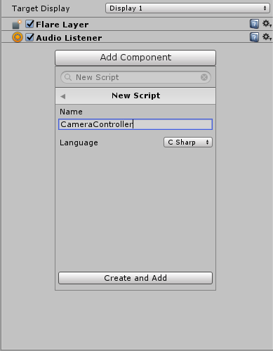
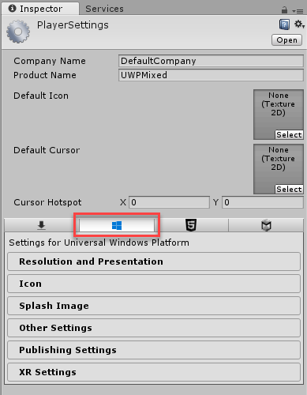

# Getting Started with UWP on Windows Mixed Reality

The following instructions will show you how to create the commonly known Unity [roll-a-ball tutorial]() using the Unity IDE, convert the project to a Visual Studio solution and then run the project in the Windows Mixed Reality environment.

## Before you start

Before you start you will need to do the following:

- Set up a PC with the latest version of Windows 10. You must have the [Windows 10 Fall Creators Update](http://www.microsoft.com/en-us/software-download/windows10) installed at a minimum to work with Mixed Reality applications..

- Install the latest version of [Microsoft Visual Studio 2017](http://www.visualstudio.com/). The free **Community** version is sufficient for this tutorial.

- Install the latest version of the [Unity Editor](http://unity3d.com/). The free **Personal** version is sufficient for this tutorial.

### Configuring Your Immersive Reality Headset

If you have not already configured your immersive reality headset, you should follow the instructions at the following link to configure your headset and immersive reality environment:

[Windows Mixed Reality Immersive Headset Setup](https://developer.microsoft.com/en-us/windows/mixed-reality/immersive_headset_setup)

## Build the roll-a-ball Project

The following section fo the setup guide is based on the [Unity Roll-a-ball Tutorial](https://unity3d.com/learn/tutorials/projects/roll-ball-tutorial)

### Create the Scene and Assets

1. Open the **Unity Editor**.

1. In the **Projects** dialog, click the **New** button.

    

1. Fill out the form for a new project using the following steps:

    1. For the **Project name**, provide the value **UWPMixed**.
    
    1. Leave the **Location** set to the default value. 
    
    1. Select the **3D** option.
    
    1. Click the **Create project** button.
    
      

1. The Unity Editor will open and display the default project layout.

    

1.  In the *Hierarchy* pane, right-click the **Untitled** scene and select the **Save Scene As** option. 

    

1. In the **Windows Explorer** dialog, provide the value **MiniGame** as the name of the scene and save the scene by clicking the **Save** button.

    

1. In the *Hierarchy* pane, click the **Create** button, hover over the **3D Object** option and then select the **Plane** option.

    

    

1. Change the name of the **Plane** object to the name **Ground** by right-clicking the object and selecting the **Rename** option.

    

1. Click the **Inspector** tab to show the *Inspector* pane.

    

1. In the *Inspector* pane, right-click the **Transform** section and click the **Reset** option.

    

1. Click the **Gizmos** button to show the *Gizmos* pane. In the *Gizmos* pane, uncheck the **Show Grid** option.

    

1. In the *Inspector* pane,  update the value of the **Scale** properties in the **Transform** category for the ground object with the following values:

    - **X**: 2
    
    - **Y**: 1

    - **Z**: 2

    

1. In the *Hierarchy* pane, click the **Create** button, hover over the **3D Object** option and then select the **Sphere** option.

    

    

1. Change the name of the **Sphere** object to the name **Player** by right-clicking the object and selecting the **Rename** option.

    

1. In the *Inspector* pane, right-click the **Transform** section and click the **Reset** option.

    

1. Update the value of the **Position** properties in the **Transform** category for the ground object with the following values:

    - **X**: 0
    
    - **Y**: 0.5

    - **Z**: 0

    
    
    

1. In the *Project* pane, right-click the **Assets** folder, hover over the **Create** option and then select the **Material** option.

    

1. Once created, you will have an opportunity to name the new material. Use the name **Background** for the new material.

    

1. Select the **Background** material in the Assets folder.

    

1. In the *Inspector* pane, update the value of the **Albedo** property by clicking the color box and then providing the following **RGBA** values:

    - **R**: 0
    
    - **G**: 32
    
    - **B**: 64
    
    - **A**: 255

    

1. Drag the **Background** material from the *Assets* pane into the *Scene* view to apply the color to the **Ground** object.

    

1. In the *Hierarchy* pane, select the **Directional Light** object.

    

1. In the *Inspector* pane, update the value of the **Rotation** properties in the **Transform** category for the ground object with the following values:

    - **X**: 50
    
    - **Y**: 60

    - **Z**: 0

    

### Create Movement Logic

1. In the *Hierarchy* pane, select the **Player** object.

1. In the *Inspector* pane, click the **Add Component** button.

    

1. In the **Add Component** menu, search for and select the **Rigidbody** component.

    
    
1. In the *Inspector* pane, click the **Add Component** button again.

1. In the **Add Component** menu, search for and select the **New Script** component.

    

1. In the additional dialog that displays, fill out the form using the following steps:

    1. For the **Name**, provide the value **PlayerController**.
    
    1. For the **Language**, select the **C Sharp** option. 
    
    1. Click the **Create and Add** button.

    

1. In the *Assets* pane, double-click the **PlayerController** script to open the script in **Visual Studio**.

    

    
    
1. In the **Visual Studio** editor, replace the contents of the **PlayerController.cs** file with the following code and then **save** the file.

    ```
    using UnityEngine;
    using System.Collections;

    public class PlayerController : MonoBehaviour 
    {
        public float speed;
        private Rigidbody rb;
        void Start ()
        {
            rb = GetComponent<Rigidbody>();
        }
        void FixedUpdate ()
        {
            float moveHorizontal = Input.GetAxis ("Horizontal");
            float moveVertical = Input.GetAxis ("Vertical");
            Vector3 movement = new Vector3 (moveHorizontal, 0.0f, moveVertical);
            rb.AddForce (movement * speed);
        }
    }
    ```

    

1. Close the **Visual Studio** application.
    
1. Back in the **Unity Editor**, select the **Player** object within the *Hierarchy* pane.

1. In the *Inspector* pane, locate the **Player Controller (Script)** category and update the value of the new **Speed** property to **10**.

    

    > [!NOTE]
    > At this point, you can test the game by clicking the **play** button at the top of the **Unity Editor**. Now you should be able to control the ball using the keyboard and it should rotate and move around. You can stop testing the game by clicking the **play** button again.

### Create Camera Logic
    
1. In the *Hierarchy* pane, select the **Main Camera** object.

1. In the *Inspector* pane, update the value of the **Position** properties in the **Transform** category for the ground object with the following values:

    - **X**: 0
    
    - **Y**: 10.5

    - **Z**: -10

1. In the *Inspector* pane, update the value of the **Rotation** properties in the **Transform** category for the ground object with the following values:

    - **X**: 45
    
    - **Y**: 0

    - **Z**: 0

    
   
1. In the *Inspector* pane, click the **Add Component** button again.

1. In the **Add Component** menu, search for and select the **New Script** component.

    

1. In the additional dialog that displays, fill out the form using the following steps:

    1. For the **Name**, provide the value **CameraController**.
    
    1. For the **Language**, select the **C Sharp** option. 
    
    1. Click the **Create and Add** button.

    

1. In the *Assets* pane, double-click the **CameraController** script to open the script in **Visual Studio**.

    

    
    
1. In the **Visual Studio** editor, replace the contents of the **PlayerController.cs** file with the following code and then **save** the file.

    ```
    using UnityEngine;

    public class CameraController : MonoBehaviour
    {

        public GameObject player;

        private Vector3 offset;

        void Start()
        {
            offset = transform.position - player.transform.position;
        }

        void LateUpdate()
        {
            transform.position = player.transform.position + offset;
        }
    }
    ```

    

1. Close the **Visual Studio** application.
    
1. Back in the **Unity Editor**, select the **Main Camera** object within the *Hierarchy* pane.

1. In the *Inspector* pane, locate the **Camera Controller (Script)** category and update the value of the new **Player** property by draggin the **Player** object from the *Hierarchy* pane onto this form field.

    

    > [!NOTE]
    > At this point, you can test the game by clicking the **play** button again. You will see the camera following the ball in it's movement.

## Test the UWP Game on Your Desktop

1. In the **Unity Editor**, click the **File** menu button and then select the **Build Settings...** option.

    

1. In the **Build Settings** dialog, click the **Add Open Scenes** button.

    

1. Select the **Universal Windows Platform** option and then click the **Build and Run** button.

    

1. In the **Windows Explorer** dialog, create a new folder named **Solution** and select that folder as the target for the new **Visual Studio** solution.

    

1. Aftere the build process is finished, the game will automatically launch on your local machine as a UWP application.

1. Close the UWP application.

## Configure the Unity Project for Immersive Reality

> [!NOTE]
> Before starting with this section, unplug your immersive headset so that we can verify that the UWP application works with and without a headset.

1. Back in the **Unity Editor**, click the **File** menu button and then select the **Build Settings...** option.

1. In the **Build Settings** dialog, ensure the **Universal Windows Platform** option is selected and then click the **Player Settings...** button.

1. Close the **Build Settings** dialog.

1. In the *Player Settings* pane, click the **Windows** icon to display the **Settings for Universal Windows Platform** tab.

    

1. Expand the **XR Settings** category and *check* the **Virutal Reality Supported** option:

    

    > [!NOTE]
    > The **Windows Mixed Reality** SDK will automatically be added to the list of **Virtual Reality SDKs** as long as you have the latest versions of **Unity** and **Windows 10**.

1. Back in the **Unity Editor**, click the **File** menu button and then select the **Build Settings...** option.

1. In the **Build Settings** dialog, ensure the **Universal Windows Platform** option is selected and then click the **Build** button.

1. In the **Windows Explorer** dialog, create a new folder named **SolutionXR** and select that folder as the target for the new **Visual Studio** solution.

    

1. Aftere the build process is finished, the Unity project folder will open automatically in the **Windows Explorer**. Locate and open the **UWPMixed.sln** file located in the **SolutionXR** subfolder you have just created. This file will automatically open a solution in **Visual Studio**.

    

1. At the top of the **Visual Studio** window, ensure that the **Debug platform** is set to **x86** and the **Debug target** is set to **Local Machine**.

    

1. Press **F5** or click the **green arrow** to *debug* your UWP application.

    > [!NOTE]
    > You may see a prompt asking you to rebuild outdated projects. You can safely rebuild these projects.

1. Observe that the UWP application runs on your local machine. Close the UWP application.

    > [!NOTE]
    > The arrow key controls will not work as the project has been configured to use the [Mixed Reality motion controllers](https://developer.microsoft.com/en-us/windows/mixed-reality/motion_controllers).

1. Plug-in your [immersive headset](https://developer.microsoft.com/en-us/windows/mixed-reality/immersive_headset_hardware_details) and turn-on your [motion controllers](https://developer.microsoft.com/en-us/windows/mixed-reality/motion_controllers).

1. Start the **Mixed Reality Portal** application on your local machine.

1. In **Visual Studio**, press **F5** or click the **green arrow** to *debug* your UWP application again.

  > [!NOTE]
  > The application will run within your Mixed Reality portal as an immersive 3D application. You may also notice that the *joystick* on the left *motion controller* can control the movement of the ball.

## That's it!


## See also  
- [Windows Mixed Reality](https://developer.microsoft.com/en-us/windows/mixed-reality)