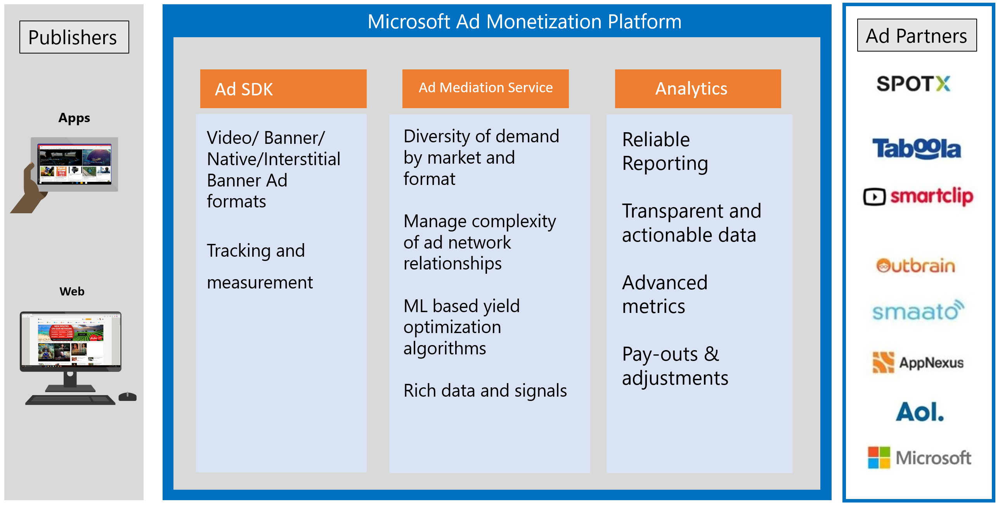

# Microsoft ad mediation service

>[!WARNING]
> As of June 1, 2020, the Microsoft Ad Monetization platform for Windows UWP apps will be shut down. [Learn more](https://social.msdn.microsoft.com/Forums/windowsapps/en-US/db8d44cb-1381-47f7-94d3-c6ded3fea36f/microsoft-ad-monetization-platform-shutting-down-june-1st?forum=aiamgr)

When you use the [Microsoft Advertising SDK](https://marketplace.visualstudio.com/items?itemName=AdMediator.MicrosoftAdvertisingSDK) to [display ads in your apps](display-ads-in-your-app.md), you can optionally use the Microsoft ad mediation service to maximize your ad revenue. This article provides an overview of the ad mediation service and its goals.

The ad mediation service is a part of the [Microsoft Ad Monetization platform](https://developer.microsoft.com/windows/ad-monetization-platform). The platform is composed of the following parts.

The ad mediation service aims to maximize ad revenue for your apps by building on these capabilities.

## Diversity of demand by market and format

The ad mediation service integrates with a variety of ad networks across the different ad formats (banner, interstitial banner, interstitial video, and native). The ad mediation service works with each ad network to ensure that they can serve ads with the highest potential for engaging the end user. We will continue to add different ad partners to expand the variety and quality of demand.

## Manage complexity of ad network relationships  

The ad mediation service integrates with a wide variety of ad networks so that you don't need to do this work. After you use the Microsoft Advertising SDK to display ads in your app, you can modify your ad mediation settings [in Partner Center](../publish/in-app-ads.md#mediation-settings) to display ads from multiple ad networks. You benefit from getting ads from new ad networks without having to make any changes to your code.

We manage the end-to-end relationship with the ad networks on your behalf. Everything from ad network integration to serving ads, reporting and payouts are taken care of by us with no additional effort from you.

## Machine learning-based yield optimization algorithms

The ad mediation service works to generate the highest yield for developers. To do so, it employs machine learning-based yield optimization algorithms. For every ad call, the algorithms determine the best *waterfall* order in which the ad networks need to be called to maximize revenue for you. This is done by considering many factors, including:

* The user making the request.
* The application the request is made for.
* Past performance of the ad network.
* The ad format and market where the request is coming from.
* The time of the ad call.
* The category of the app content.
* The user segment.
* The user's location.

New ad networks are automatically included and evaluated for performance through a learning budget. Within a short period of time, they find their place in the waterfall. This makes the ad networks more competitive and helps the developer make the most of monetizing through apps.

We highly recommend using our [recommended mediation settings](../publish/in-app-ads.md#mediation-settings) to maximize revenue made from ads in your apps. This allows for our algorithms to enable the best yield for your app. However, you also have the freedom to choose your own mediation settings in Partner Center to have more control over the ad networks that serve ads and the order in which they do.

## Rich data and signals

The ad mediation service works with various ad networks to improve user targeting to show more relevant ads for each user. This is done by sending richer signals about the user and the app to the ad network, while keeping privacy requirements in mind.

## Related topics

* [Microsoft Advertising SDK](https://marketplace.visualstudio.com/items?itemName=AdMediator.MicrosoftAdvertisingSDK)
* [Mediation settings](../publish/in-app-ads.md#mediation-settings)
* [Advertising performance report](../publish/advertising-performance-report.md)
