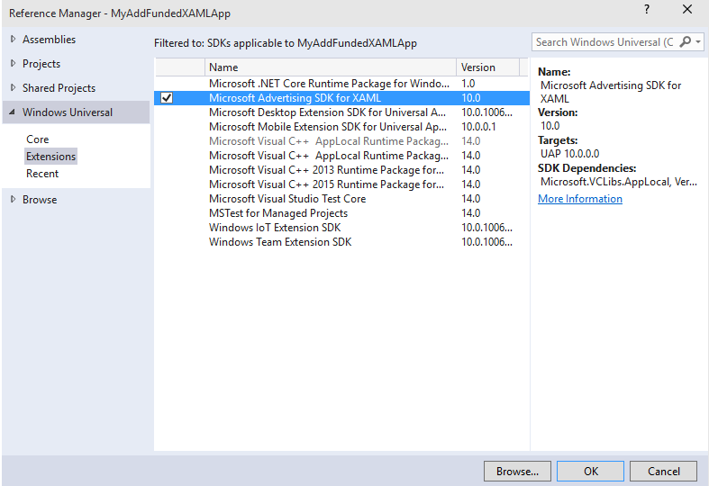

# AdControl in XAML and .NET


This walkthrough shows how to use the [AdControl](https://msdn.microsoft.com/library/windows/apps/microsoft.advertising.winrt.ui.adcontrol.aspx) class to display banner ads in a XAML app for Windows 10 (UWP), Windows 8.1, or Windows Phone 8.1. This walkthrough does not use the **AdMediatorControl** or ad mediation.

For a complete sample project that demonstrates how to add banner ads to a XAML app using C# and C++, see the [advertising samples on GitHub](http://aka.ms/githubads).

## Prerequisites

* For UWP apps: install the [Microsoft Store Services SDK](http://aka.ms/store-em-sdk) with Visual Studio 2015.
* For Windows 8.1 or Windows Phone 8.1 apps: install the [Microsoft Advertising SDK for Windows and Windows Phone 8.x](http://aka.ms/store-8-sdk) with Visual Studio 2015 or Visual Studio 2013.

## Code development

1. In Visual Studio, open your project or create a new project.

2. If your project targets **Any CPU**, update your project to use an architecture-specific build output (for example, **x86**). If your project targets **Any CPU**, you will not be able to successfully add a reference to the Microsoft advertising library in the following steps. For more information, see [Reference errors caused by targeting Any CPU in your project](known-issues-for-the-advertising-libraries.md#reference_errors).

1.  From the **Solution Explorer** window, right click **References**, and select **Add Reference…**

2.  In **Reference Manager**, select one of the following references depending on your project type:

    -   For a Universal Windows Platform (UWP) project: Expand **Universal Windows**, click **Extensions**, and then select the check box next to **Microsoft Advertising SDK for XAML** (Version 10.0).

    -   For a Windows 8.1 project: Expand **Windows 8.1**, click **Extensions**, and then select the check box next to **Ad Mediator SDK for Windows 8.1 XAML**. This option will add both the Microsoft advertising and ad mediator libraries to your project, but you can ignore the ad mediator libraries.

    -   For a Windows Phone 8.1 project: Expand **Windows Phone 8.1**, click **Extensions**, and then select the check box next to **Ad Mediator SDK for Windows Phone 8.1 XAML**. This option will add both the Microsoft advertising and ad mediator libraries to your project, but you can ignore the ad mediator libraries.

  

    > **Note**&nbsp;&nbsp;This image is for Visual Studio 2015 building a UWP project for Windows 10. If you are building a Windows 8.1 or Windows Phone 8.1 app or using Visual Studio 2013, your screen will look different.

3.  In **Reference Manager**, click OK.
4.  Modify the XAML for the page where you are embedding advertising to include the **Microsoft.Advertising.WinRT.UI** namespace. For example, in the default sample app generated by Visual Studio (named, in this app, MyAdFundedWindows10AppXAML), the XAML page is **MainPage.XAML**.

  The **Page** section of the MainPage.xaml file generated by Visual Studio has the following code.

  ``` xml
  <Page
      x:Class="MyAdFundedWindows10AppXAML.MainPage"
      xmlns="http://schemas.microsoft.com/winfx/2006/xaml/presentation"
      xmlns:x="http://schemas.microsoft.com/winfx/2006/xaml"
      xmlns:local="using:MyAdFundedWindows10AppXAML"
      xmlns:d="http://schemas.microsoft.com/expression/blend/2008"
      xmlns:mc="http://schemas.openxmlformats.org/markup-compatibility/2006"
      mc:Ignorable="d">
      <Grid Background="{ThemeResource ApplicationPageBackgroundThemeBrush}">
      </Grid>
  </Page>
  ```

  Add the namespace reference **Microsoft.Advertising.WinRT.UI** so the **Page** section of the MainPage.xaml file has the following code.

  ``` xml
  <Page
      x:Class="MyAdFundedWindows10AppXAML.MainPage"
      xmlns="http://schemas.microsoft.com/winfx/2006/xaml/presentation"
      xmlns:x="http://schemas.microsoft.com/winfx/2006/xaml"
      xmlns:local="using:MyAdFundedWindows10AppXAML"
      xmlns:d="http://schemas.microsoft.com/expression/blend/2008"
      xmlns:mc="http://schemas.openxmlformats.org/markup-compatibility/2006"
      xmlns:UI="using:Microsoft.Advertising.WinRT.UI"
      mc:Ignorable="d">
      <Grid Background="{ThemeResource ApplicationPageBackgroundThemeBrush}">
      </Grid>
  </Page>
  ```

5. In the **Grid** tag, add the code for the **AdControl**. Assign the [ApplicationId](https://msdn.microsoft.com/library/windows/apps/microsoft.advertising.winrt.ui.adcontrol.applicationid.aspx) and [AdUnitId](https://msdn.microsoft.com/library/windows/apps/microsoft.advertising.winrt.ui.adcontrol.adunitid.aspx) properties in the **Page** to the test values provided in [Test mode values](test-mode-values.md). Also adjust the height and width of the control so it is one of the [supported ad sizes for banner ads](supported-ad-sizes-for-banner-ads.md).

  > **Note**&nbsp;&nbsp;You will replace the test application ID and ad unit ID values with live values before submitting your app for submission.

  The complete **Grid** tag looks like this code.

  ``` xml
  <Grid Background="{StaticResource ApplicationPageBackgroundThemeBrush}">
      <UI:AdControl ApplicationId="3f83fe91-d6be-434d-a0ae-7351c5a997f1"
            AdUnitId="10865270"
            HorizontalAlignment="Left"
            Height="250"
            VerticalAlignment="Top"
            Width="300"/>
  </Grid>
  ```

  The complete code for the MainPage.xaml file should look like this.

  ``` xml
  <Page
      x:Class="MyAdFundedWindows10AppXAML.MainPage"
      xmlns="http://schemas.microsoft.com/winfx/2006/xaml/presentation"
      xmlns:x="http://schemas.microsoft.com/winfx/2006/xaml"
      xmlns:local="using:MyAdFundedWindows10AppXAML"
      xmlns:d="http://schemas.microsoft.com/expression/blend/2008"
      xmlns:mc="http://schemas.openxmlformats.org/markup-compatibility/2006"
      xmlns:UI="using:Microsoft.Advertising.WinRT.UI"
      mc:Ignorable="d">
      <Grid Background="{StaticResource ApplicationPageBackgroundThemeBrush}">
            <UI:AdControl ApplicationId="3f83fe91-d6be-434d-a0ae-7351c5a997f1"
                  AdUnitId="10865270"
                  HorizontalAlignment="Left"
                  Height="250"
                  VerticalAlignment="Top"
                  Width="300"/>
        </Grid>
    </Page>
    ```

6.  Compile and run the app to see it with an ad.

## Release your app with live ads using Windows Dev Center

1.  In the Dev Center dashboard, go to the **Monetization** &gt; **Monetize with ads** page for your app, and [create a standalone Microsoft Advertising unit](../publish/monetize-with-ads.md). For the ad unit type, specify **Banner**. Make note of both the ad unit ID and the application ID.

2.  In your code, replace the test ad unit values (**ApplicationId** and **AdUnitId**) with the live values you generated in Dev Center.

3.  [Submit your app](../publish/app-submissions.md) to the Store using the Dev Center dashboard.

4.  Review your [advertising performance reports](../publish/advertising-performance-report.md) in the Dev Center dashboard.

## Notes

* C#: See [XAML properties example](xaml-properties-example.md) for an example of how to assign event handlers to **AdControl** events. Then see [AdControl events in C#](adcontrol-events-in-c.md) for sample code that shows event handlers written in C#.

* C++: The current release of the Microsoft advertising libraries support C++. The **AdControl** class is implemented in native C++, and does not load the .NET CLR. For code examples that demonstrate how to use **AdControl** in C++, see the [advertising samples on GitHub](http://aka.ms/githubads).

* Visual Basic: See [XAML properties example](xaml-properties-example.md) for an example of how to assign event handlers to **AdControl** events.

* Error Handling: To learn about how to handle errors, see [AdControl error handling](adcontrol-error-handling.md).

## Related topics

* [Advertising samples on GitHub](http://aka.ms/githubads)

 
