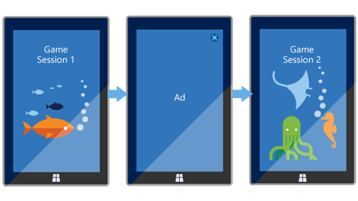
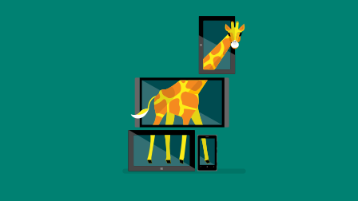

# Display ads in your app with the Microsoft Advertising SDK

Increase your revenue opportunities by putting ads in your Universal Windows Platform (UWP) app for Windows 10 by using the Microsoft Advertising SDK. Our ad monetization platform offers a variety of ad formats that can be seamlessly integrated into your apps and supports mediation with many popular ad networks. Our platform is compliant with the OpenRTB, VAST 2.x, MRAID 2, and VPAID 3 standards and is compatible with MOAT and IAS. 

 

<table style="border: none !important;">
<colgroup>
<col width="10%" />
<col width="23%" />
<col width="10%" />
<col width="23%" />
<col width="10%" />
<col width="23%" />
</colgroup>
<tbody>
<tr>
<td align="left"></td>
<td align="left"><b>Get started</b>  
    <a href="http://aka.ms/ads-sdk-uwp">Install the Microsoft Advertising SDK</a>
</td>
<td align="left"></td>
<td align="left"><b>Developer guides</b>  
    <a href="banner-ads.md">Banner ads</a>
     
    <a href="interstitial-ads.md">Interstitial ads</a>
     
    <a href="native-ads.md">Native ads</a>
    </td>
<td align="left"></td>
<td align="left"><b>Other resources</b>  
    <a href="set-up-ad-units-in-your-app.md">Set up ad units in your app</a>
     
    <a href="best-practices-for-ads-in-apps.md">Best practices</a>
     
    <a href="https://msdn.microsoft.com/en-us/library/windows/apps/mt691884.aspx">API reference</a>
    </td>
</tr>
</tbody>
</table>

## Step 1: Install the Microsoft Advertising SDK

To get started, install the [Microsoft Advertising SDK](http://aka.ms/ads-sdk-uwp) on the development computer you use to build your app. For installation instructions, see [this article](install-the-microsoft-advertising-libraries.md).

## Step 2: Implement ads in your app

The Microsoft Advertising SDK provides several different types of ad controls you can use in your app. Choose which types of ads are best for your scenario and then add code to your app to display those ads. During this step, you will use a test ad unit so you can see how your app renders ads during testing.

### Banner ads

These are static display ads that utilize a rectangular portion of a page in your app to display promotional content. These ads can refresh automatically at regular intervals. This is a good place to start if you are new to advertising in your app.

For instructions and code examples, see [this article](adcontrol-in-xaml-and--net.md).

### Interstitial video and interstitial banner ads

These are full-screen ads that typically require the user to watch a video or click through them to continue in the app or game. We support two types of interstitial ads: video and banner.

For instructions and code examples, see [this article](interstitial-ads.md).

### Native ads

These are component-based ads. Each piece of the ad creative (such as the title, image, description, and call-to-action text) is delivered to your app as an individual element that you can integrate into your app using your own fonts, colors, and other UI components.

For instructions and code examples, see [this article](native-ads.md).

## Step 3: Create an ad unit and configure mediation

After you finish testing your app and you are ready to submit it to the Store, create an ad unit on the [In-app ads](../publish/in-app-ads.md) page in the Windows Dev Center dashboard. Then, update your app code to use this ad unit so that your app will receive live ads. For more information, see [Set up ad units in your app](set-up-ad-units-in-your-app.md#live-ad-units).

By default, your app will show ads from Microsoft's network for paid ads. To maximize your ad revenue, you can enable [ad mediation](ad-mediation-service.md) for your ad unit to display ads from additional paid ad networks such as Taboola and Smaato. You can also increase your app promotion capabilities by serving ads from Microsoft app promotion campaigns.

To start using ad mediation in your UWP app, [configure ad mediation settings](../publish/in-app-ads.md#mediation-settings) for your ad unit. By default, we automatically configure the mediation settings using machine-learning algorithms to help you maximize your ad revenue across the markets your app supports. However, you also have the option to manually choose the networks you want to use. Either way, the mediation settings are configured entirely on our servers; you do not need to make any code changes in your app.    

## Step 4: Submit your app and review performance

After you finish developing your app with ads, you can [submit your updated app](https://docs.microsoft.com/windows/uwp/publish/app-submissions) to the Dev Center dashboard so it is available in the Store. Apps that display ads must meet the additional requirements that are specified in [section 10.10 of the Microsoft Store Policies](https://docs.microsoft.com/legal/windows/agreements/store-policies#1010-advertising-conduct-and-content) and [Exhibit E of the App Developer Agreement](https://docs.microsoft.com/legal/windows/agreements/app-developer-agreement).

After your app is published and available in the Store, you can review your [advertising performance reports](../publish/advertising-performance-report.md) in the dashboard and continue to make changes to your mediation settings to optimize the performance of your ads. Your advertising revenue is included in your [payout summary](../publish/payout-summary.md).

## Additional help

For additional help using the Microsoft Advertising SDK, use the following resources.

|  Task    | Resource |               
|----------|-------|
| Report a bug or get assisted support for advertising     | Visit the [support page](https://developer.microsoft.com/en-us/windows/support) and choose **Ads-In-Apps**.        |
| Get community support     | Visit the [forum](http://go.microsoft.com/fwlink/p/?LinkId=401266).       |
| Download sample projects that demonstrate how to add banner and interstitial ads to apps.     | See the [Advertising samples on GitHub](http://aka.ms/githubads).       |
| Learn about the latest monetization opportunities for Windows apps     | Visit [Monetize your apps](https://developer.microsoft.com/store/monetize).        |

## Windows 8.1 and Windows Phone 8.x apps

For Windows 8.1 and Windows Phone 8.x apps, we provide the [Microsoft Advertising SDK for Windows and Windows Phone 8.x](http://aka.ms/store-8-sdk). For more information about using this SDK to show ads in Windows 8.1 and Windows Phone 8.x apps, see [this article](https://msdn.microsoft.com/library/windows/apps/xaml/dn792120.aspx).

## Related topics

* [Microsoft Advertising SDK](http://aka.ms/ads-sdk-uwp)
* [Advertising performance report](../publish/advertising-performance-report.md)
* [Windows Premium Ads Publishers Program](windows-premium-ads-publishers-program.md)
