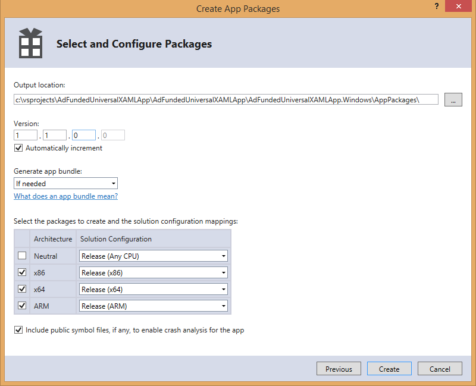

# Known issues and troubleshooting for ads in apps

>[!WARNING]
> As of June 1, 2020, the Microsoft Ad Monetization platform for Windows UWP apps will be shut down. [Learn more](https://social.msdn.microsoft.com/Forums/windowsapps/en-US/db8d44cb-1381-47f7-94d3-c6ded3fea36f/microsoft-ad-monetization-platform-shutting-down-june-1st?forum=aiamgr)

This topic lists the known issues with the current release of the Microsoft Advertising SDK. For additional troubleshooting guidance, see the following topics.

* [HTML and JavaScript troubleshooting guide](html-and-javascript-troubleshooting-guide.md)
* [XAML and C# troubleshooting guide](xaml-and-c-troubleshooting-guide.md)

## AdControl interface unknown in XAML

The XAML markup for an [AdControl](/uwp/api/microsoft.advertising.winrt.ui.adcontrol) may incorrectly show a blue curvy line implying that the interface is unknown. This occurs only when targeting x86, and it may be ignored.

## lastError from previous ad request

If there is a leftover **lastError** from the previous ad request, the event may be fired twice during the next ad call. While the new ad request will still be made and may yield a valid ad, this behavior may cause confusion.

## Interstitial ads and navigation buttons on phones

On phones (or emulators) that have software **Back**, **Start**, and **Search** buttons instead of hardware buttons, the countdown timer and click through buttons for interstitial ads may be obscured.

## Recently created ads are not being served to your app

If you have created an ad recently (less than a day), it might not be available immediately. If the ad has been approved for editorial content, it will be served once the advertising server has processed it and the ad is available as inventory.

## No ads are shown in your app

There are many reasons you may see no ads, including network errors. Other reasons might include:

* Selecting an ad unit in Partner Center with a size that is greater or less than the size of the **AdControl** in your app's code.

* Ads will not appear if you're using a [test mode value](set-up-ad-units-in-your-app.md#test-ad-units) for your ad unit ID when running a live app.

* If you created a new ad unit ID in the past half-hour, you might not see an ad until the servers propagate new data through the system. Existing IDs that have shown ads before should show ads immediately.

If you can see test ads in the app, your code is working and is able to display ads. If you encounter issues, contact [product support](https://developer.microsoft.com/windows/support). On that page, choose **Contact us**.

You can also post a question in the [forum](https://social.msdn.microsoft.com/forums/windowsapps/en-US/home?category=windowsapps).

## Test ads are showing in your app instead of live ads

Test ads can be shown, even when you are expecting live ads. This can happen in the following scenarios:

* Our advertising platform cannot verify or find the live application ID used in the Store. In this case, when an ad unit is created by a user, its status can start as live (non-test) but will move to test status within 6 hours after the first ad request. It will change back to live if there are no requests from test apps for 10 days.

* Side-loaded apps or apps that are running in the emulator will not show live ads.

When a live ad unit is serving test ads, the ad unit’s status shows **Active and serving test ads** in Partner Center. This does not currently apply to phone apps.

## Reference errors caused by targeting Any CPU in your project

When using the Microsoft Advertising SDK, you cannot target **Any CPU** in your project. If your project targets the **Any CPU** platform, you may see a warning after adding the reference similar to this one.

To remove this warning, update your project to use an architecture-specific build output (for example, **x86**). Use **Configuration Manager** to set the platform targets for debug and release configurations.

When you create your app packages for store submission (as shown in the following images), be sure to include the architectures you intend to target. You may opt to skip x64 if you intend to run x86 builds on the x64 OS.

## Z-order in JavaScript/HTML apps

JavaScript/HTML apps must not place elements into the reserved MAX-10 range of z-order. The sole exception is an interrupt overlay, such as an inbound call notification for a Skype app.

## Do not use borders

Setting border-related properties inherited by the **AdControl** from its parent class will cause the ad placement to be wrong.

## More Information

For more information about the latest known issues and to post questions related to the Microsoft Advertising SDK, visit the [forum](https://social.msdn.microsoft.com/forums/windowsapps/en-US/home?category=windowsapps).

 

 