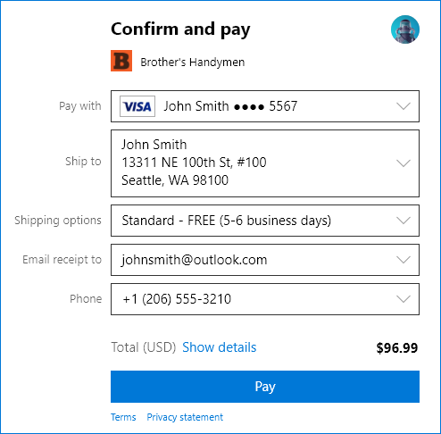
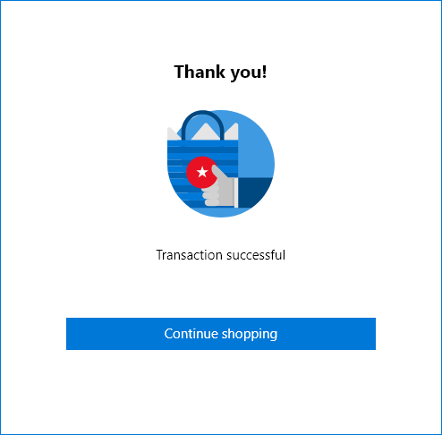

---
author: msatranjr
description: The Payment Request API provides an integrated solution for UWP apps to bypass the process of requiring a user to input payment information and select shipping methods.
title: Simplify payments with the Payment Request API
ms.author: misatran
ms.date: 09/26/2017
ms.topic: article
ms.prod: windows
ms.technology: uwp
keywords: windows 10, uwp, payment request
---

# Simplify payments with the Payment Request API
The Payment Request API  for UWP apps is based on the [W3C Payment Request API spec](https://w3c.github.io/browser-payment-api/). It gives you the ability to streamline the checkout process in your UWP apps. Users can speed through checkout by using payment options and shipping addresses already saved with their Microsoft account. You can increase your conversion rate and reduce your risk of data breaches because the payment information is tokenized. Starting with the Windows 10 Creators Update, users can use their saved payment options to pay easily across  experiences in UWP apps.

## Prerequisites
Before you begin using the Payment Request API, there are a few things you must do or be aware of.

### Getting a Merchant ID
As part of the payment-request process, Microsoft requests payment tokens on your behalf from your service provider. So before you can start using the API, we need your authorization to request those tokens.  You must follow a few steps to register for a seller account and provide the necessary authorization. To do that, go to [Microsoft Seller Center](https://seller.microsoft.com/en-us/dashboard/registration/seller/?accountprogram=uwp). Once you have done this, copy the resulting merchant ID from the dashboard into your app when constructing the payment request. Then, when your application submits a payment request, you will receive a payment token from your processor which you will need to submit your payment.

### Geographic restrictions and language support
The Payment Request API can be used only by US-based businesses to process transactions in the United States.

## Using the Payment Request API in your app: step by step
This section demonstrates how to use the [UWP Payment Request API](https://docs.microsoft.com/en-us/uwp/api/windows.applicationmodel.payments) in your app. We use the API here in its simplest form for the sake of clarity. For an example of more advanced use of these APIs, see the [UWP Shopping app sample on GitHub](https://github.com/Microsoft/Windows-appsample-shopping).

### 1. Create a set of all the payment options that you accept.
> [!Note]
> Replace the **merchant-id-from-seller-portal** text with the merchant ID that you received from the Seller Center.

[!code-cs[SnippetEnumerate](./code/PaymentsApiSample/PaymentsApiSample/MainPage.xaml.cs#SnippetEnumerate)]

### 2. Pull the payment details together. 

These details will be shown to the user in the payment app. 

[!code-cs[SnippetDisplayItems](./code/PaymentsApiSample/PaymentsApiSample/MainPage.xaml.cs#SnippetDisplayItems)]

### 3. Include the sales tax. 

> [!Important]
> The API does not add up items or calculate the sales tax for you. Remember that tax rates vary by jurisdiction. For clarity, we use a hypothetical 9.5% tax rate.

[!code-cs[SnippetTaxes](./code/PaymentsApiSample/PaymentsApiSample/MainPage.xaml.cs#SnippetTaxes)]

### 4. (Optional)  Add discounts or other modifiers to the total. 

Here's an example of adding a discount for using a specific Contoso credit card to the display items. (*Contoso* is a fictitious name.)

[!code-cs[SnippetDiscountRate](./code/PaymentsApiSample/PaymentsApiSample/MainPage.xaml.cs#SnippetDiscountRate)]

### 5. Assemble all the payment details.

[!code-cs[SnippetAggregate](./code/PaymentsApiSample/PaymentsApiSample/MainPage.xaml.cs#SnippetAggregate)]
[!code-cs[SnippetPaymentOptions](./code/PaymentsApiSample/PaymentsApiSample/MainPage.xaml.cs#SnippetPaymentOptions)]

### 6. Submit the payment request. 

Call the **SubmitPaymentRequestAsync** method to submit your payment request. This brings up the payment app showing the available payment options.

[!code-cs[SnippetSubmit](./code/PaymentsApiSample/PaymentsApiSample/MainPage.xaml.cs#SnippetSubmit)]

The user is prompted to sign in with their Microsoft account.

After the user signs in, they can select payment options and shipping address that were previously saved.

Your app waits for the user to tap **Pay**, then completes the order.

[!code-cs[SnippetComplete](./code/PaymentsApiSample/PaymentsApiSample/MainPage.xaml.cs#SnippetComplete)]

After payment is complete, the user is presented with an **Order confirmed** screen.

## See also
- [Windows.ApplicationModel.Payments reference documentation](https://docs.microsoft.com/en-us/uwp/api/windows.applicationmodel.payments)
- [UWP shopping app sample on GitHub](https://github.com/Microsoft/Windows-appsample-shopping)
- [W3C Payment Request API specification](http://www.w3.org/TR/payment-request/)
- [Payment Request API ](https://docs.microsoft.com/en-us/microsoft-edge/dev-guide/device/payment-request-api)

