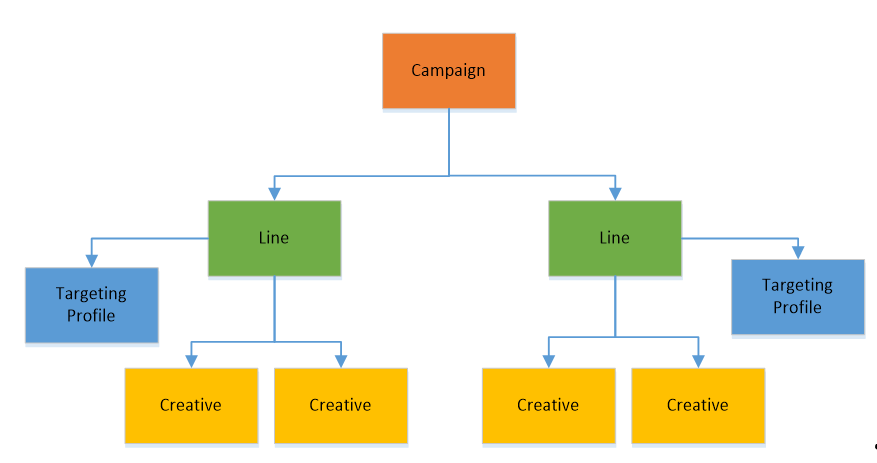

# Run ad campaigns using Store services

Use the *Microsoft Store promotions API* to programmatically manage promotional ad campaigns for apps that are registered to your or your organization's Partner Center account. This API enables you to create, update and monitor your campaigns and other related assets such as targeting and creatives. This API is especially useful for developers who create large volumes of campaigns, and who want to do so without using Partner Center. This API uses Azure Active Directory (Azure AD) to authenticate the calls from your app or service.

The following steps describe the end-to-end process:

1.  Make sure that you have completed all the [prerequisites](#prerequisites).
2.  Before you call a method in the Microsoft Store promotions API, [obtain an Azure AD access token](#obtain-an-azure-ad-access-token). After you obtain a token, you have 60 minutes to use this token in calls to the Microsoft Store promotions API before the token expires. After the token expires, you can generate a new token.
3.  [Call the Microsoft Store promotions API](#call-the-windows-store-promotions-api).

You can alternatively create and manage ad campaigns using Partner Center, and any ad campaigns that you create programmatically via the Microsoft Store promotions API can also be accessed in Partner Center. For more information about managing ad campaigns in Partner Center, see [Create an ad campaign for your app](../publish/create-an-ad-campaign-for-your-app.md).

> [!NOTE]
> Any developer with a Partner Center account can use the Microsoft Store promotions API to manage ad campaigns for their apps. Media agencies can also request access to this API to run ad campaigns on behalf of their advertisers. If you are a media agency who wants to know more about this API or request access to it, send your request to storepromotionsapi@microsoft.com.

<span id="prerequisites" />

## Step 1: Complete prerequisites for using the Microsoft Store promotions API

Before you start writing code to call the Microsoft Store promotions API, make sure that you have completed the following prerequisites.

* Before you can successfully create and start an ad campaign using this API, you must first [create one paid ad campaign using the **Ad campaigns** page in Partner Center](../publish/create-an-ad-campaign-for-your-app.md), and you must add at least one payment instrument on this page. After you do this, you will be able to successfully create billable delivery lines for ad campaigns using this API. Delivery lines for ad campaigns you create using this API will automatically bill the default payment instrument chosen on the **Ad campaigns** page in Partner Center.

* You (or your organization) must have an Azure AD directory and you must have [Global administrator](/azure/active-directory/users-groups-roles/directory-assign-admin-roles) permission for the directory. If you already use Microsoft 365 or other business services from Microsoft, you already have Azure AD directory. Otherwise, you can [create a new Azure AD in Partner Center](../publish/associate-azure-ad-with-partner-center.md#create-a-brand-new-azure-ad-to-associate-with-your-partner-center-account) for no additional charge.

* You must associate an Azure AD application with your Partner Center account, retrieve the tenant ID and client ID for the application and generate a key. The Azure AD application represents the app or service from which you want to call the Microsoft Store promotions API. You need the tenant ID, client ID and key to obtain an Azure AD access token that you pass to the API.
    > [!NOTE]
    > You only need to perform this task one time. After you have the tenant ID, client ID and key, you can reuse them any time you need to create a new Azure AD access token.

To associate an Azure AD application with your Partner Center account and retrieve the required values:

1.  In Partner Center, [associate your organization's Partner Center account with your organization's Azure AD directory](../publish/associate-azure-ad-with-partner-center.md).

2.  Next, from the **Users** page in the **Account settings** section of Partner Center, [add the Azure AD application](../publish/add-users-groups-and-azure-ad-applications.md#add-azure-ad-applications-to-your-partner-center-account) that represents the app or service that you will use to manage promotion campaigns for your Partner Center account. Make sure you assign this application the **Manager** role. If the application doesn't exist yet in your Azure AD directory, you can [create a new Azure AD application in Partner Center](../publish/add-users-groups-and-azure-ad-applications.md#create-a-new-azure-ad-application-account-in-your-organizations-directory-and-add-it-to-your-partner-center-account). 

3.  Return to the **Users** page, click the name of your Azure AD application to go to the application settings, and copy down the **Tenant ID** and **Client ID** values.

4. Click **Add new key**. On the following screen, copy down the **Key** value. You won't be able to access this info again after you leave this page. For more information, see [Manage keys for an Azure AD application](../publish/add-users-groups-and-azure-ad-applications.md#manage-keys).

<span id="obtain-an-azure-ad-access-token" />

## Step 2: Obtain an Azure AD access token

Before you call any of the methods in the Microsoft Store promotions API, you must first obtain an Azure AD access token that you pass to the **Authorization** header of each method in the API. After you obtain an access token, you have 60 minutes to use it before it expires. After the token expires, you can refresh the token so you can continue to use it in further calls to the API.

To obtain the access token, follow the instructions in [Service to Service Calls Using Client Credentials](/azure/active-directory/azuread-dev/v1-oauth2-client-creds-grant-flow) to send an HTTP POST to the ```https://login.microsoftonline.com/<tenant_id>/oauth2/token``` endpoint. Here is a sample request.

```syntax
POST https://login.microsoftonline.com/<tenant_id>/oauth2/token HTTP/1.1
Host: login.microsoftonline.com
Content-Type: application/x-www-form-urlencoded; charset=utf-8

grant_type=client_credentials
&client_id=<your_client_id>
&client_secret=<your_client_secret>
&resource=https://manage.devcenter.microsoft.com
```

For the *tenant\_id* value in the POST URI and the *client\_id* and *client\_secret* parameters, specify the tenant ID, client ID and the key for your application that you retrieved from Partner Center in the previous section. For the *resource* parameter, you must specify ```https://manage.devcenter.microsoft.com```.

After your access token expires, you can refresh it by following the instructions [here](/azure/active-directory/azuread-dev/v1-protocols-oauth-code#refreshing-the-access-tokens).

<span id="call-the-windows-store-promotions-api" />

## Step 3: Call the Microsoft Store promotions API

After you have an Azure AD access token, you are ready to call the Microsoft Store promotions API. You must pass the access token to the **Authorization** header of each method.

In the context of the Microsoft Store promotions API, an ad campaign consists of a *campaign* object that contains high-level information about the campaign, and additional objects that represent the *delivery lines*, *targeting profiles*, and *creatives* for the ad campaign. The API includes different sets of methods that are grouped by these object types. To create a campaign, you typically call a different POST method for each of these objects. The API also provides GET methods you can use to retrieve any object and PUT methods you can use to edit campaign, delivery line, and targeting profile objects.

For more information about these objects and their related methods, see the following table.


| Object       | Description   |
|---------------|-----------------|
| Campaigns |  This object represents the ad campaign, and it sits at the top of the object model hierarchy for ad campaigns. This object identifies the type of campaign you are running (paid, house, or community), the campaign objective, the delivery lines for the campaign, and other details. Each campaign can be associated with only one app.<br/><br/>For more information about the methods related to this object, see [Manage ad campaigns](manage-ad-campaigns.md).<br/><br/>**Note**&nbsp;&nbsp;After you create an ad campaign, you can retrieve performance data for the campaign by using the [Get ad campaign performance data](get-ad-campaign-performance-data.md) method in the [Microsoft Store analytics API](access-analytics-data-using-windows-store-services.md).  |
| Delivery lines | Every campaign has one or more delivery lines that are used to buy inventory and deliver your ads. For each delivery line, you can set targeting, set your bid price, and decide how much you want to spend by setting a budget and linking to creatives you want to use.<br/><br/>For more information about the methods related to this object, see [Manage delivery lines for ad campaigns](manage-delivery-lines-for-ad-campaigns.md). |
| Targeting profiles | Every delivery line has one targeting profile that specifies the users, geographies and inventory types that you want to target. Targeting profiles can be created as a template and shared across delivery lines.<br/><br/>For more information about the methods related to this object, see [Manage targeting profiles for ad campaigns](manage-targeting-profiles-for-ad-campaigns.md). |
| Creatives | Every delivery line has one or more creatives that represent the ads that are shown to customers as part of the campaign. A creative may be associated with one or more delivery lines, even across ad campaigns, provided it always represents the same app.<br/><br/>For more information about the methods related to this object, see [Manage creatives for ad campaigns](manage-creatives-for-ad-campaigns.md). |


The following diagram illustrates the relationship between campaigns, delivery lines, targeting profiles, and creatives.



## Code example

The following code example demonstrates how to obtain an Azure AD access token and call the Microsoft Store promotions API from a C# console app. To use this code example, assign the *tenantId*, *clientId*, *clientSecret*, and *appID* variables to the appropriate values for your scenario. This example requires the [Json.NET package](https://www.newtonsoft.com/json) from Newtonsoft to deserialize the JSON data returned by the Microsoft Store promotions API.

:::code language="csharp" source="~/../snippets-windows/windows-uwp/monetize/StoreServicesExamples_Promotions/cs/Program.cs" id="PromotionsApiExample":::

## Related topics

* [Manage ad campaigns](manage-ad-campaigns.md)
* [Manage delivery lines for ad campaigns](manage-delivery-lines-for-ad-campaigns.md)
* [Manage targeting profiles for ad campaigns](manage-targeting-profiles-for-ad-campaigns.md)
* [Manage creatives for ad campaigns](manage-creatives-for-ad-campaigns.md)
* [Get ad campaign performance data](get-ad-campaign-performance-data.md)


 
