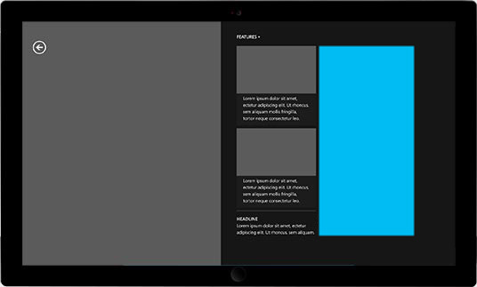
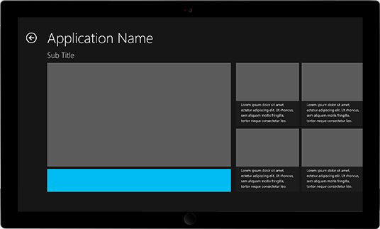

# Supported banner ad sizes

>[!WARNING]
> As of June 1, 2020, the Microsoft Ad Monetization platform for Windows UWP apps will be shut down. [Learn more](https://social.msdn.microsoft.com/Forums/windowsapps/en-US/db8d44cb-1381-47f7-94d3-c6ded3fea36f/microsoft-ad-monetization-platform-shutting-down-june-1st?forum=aiamgr)

The following banner ad sizes are supported for Universal Windows Platform (UWP) apps. When you instantiate your **AdControl** object in your app, make sure you set the width and height properties to match one of these supported sizes.

Sizes are width x height.

* 160x600
* 300x50
* 300x250
* 300x600
* 320x50
* 640x100
* 728x90

> [!NOTE]
> For the best experience, we recommend using the following sizes on Windows 10 Mobile devices: 300x50, 320x50, and 640x100.

The following table provides examples that illustrate each banner ad size.

<table>
<colgroup>
<col width="20%" />
<col width="80%" />
</colgroup>
<thead>
<tr class="header">
<th align="left">Ad size</th>
<th align="left">Example</th>
</tr>
</thead>
<tbody>
<tr class="even">
<td align="left">
160x600
</td>
<td align="left"></td>
</tr>
<tr class="even">
<td align="left">
300x250
</td>
<td align="left"></td>
</tr>
<tr class="odd">
<td align="left">
300x600
</td>
<td align="left"></td>
</tr>
<tr class="odd">
<td align="left">
728x90
</td>
<td align="left"></td>
</tr>
<tr class="odd">
<td align="left">
300x50
</td>
<td align="left"></td>
</tr>
<tr class="even">
<td align="left">
320x50
</td>
<td align="left"></td>
</tr>
<tr class="even">
<td align="left">
640x100
</td>
<td align="left"></td>
</tr>
</tbody>
</table>

 

 

 
