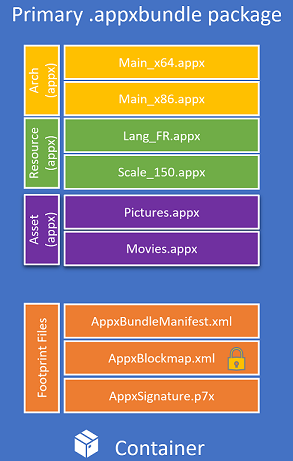

# Introduction to asset packages

> [!IMPORTANT]
> If you intend to submit your app to the Store, you need to contact [Windows developer support](https://developer.microsoft.com/windows/support) and get approval to use asset packages.

Asset packages are a type of package that act as a centralized location for an application’s common files – effectively eliminating the necessity for duplicated files throughout its architecture packages. Asset packages are similar to resource packages in that they are both designed to contain static content needed for your app to run, but different in that all asset packages are always downloaded, regardless of the user’s system architecture, language, or display scale.



Because asset packages contain all the architecture, language, and scale agnostic files, leveraging asset packages results in a reduced overall packaged app size (since these files are no longer duplicated), helping you manage local development disk space usage for large apps and manage your app’s packages in general. 

### How do asset packages affect publishing?
The most obvious benefit of asset packages is the reduced size of packaged apps. Smaller app packages speed up the app’s publishing process by letting the Store process less files; however this is not the most important benefit of asset packages.

When an asset package is created, you can specify whether the package should be allowed to execute. Since asset packages should contain only architecture agnostic files, they generally don't contain any .dll or .exe files, so for asset packages typically don't need to execute. The importance of this distinction is that during the publishing process, all executable packages must be scanned to ensure that they do not contain malware, and this scanning process takes longer for larger packages. However, if a package is designated as non-executable, the installation of the app will ensure that files contained in this package cannot be executed. This guarantee eliminates the need for a complete package scan and will greatly reduce the malware scan time during the publication of the app (and for updates too) - thus making publishing significantly faster for apps that use asset packages. Note that [flat bundle app packages](flat-bundles.md) must also be used to get this publishing benefit since this is what allows the Store to process each .appx package file in parallel. 


### Should I use asset packages?
Updating the file structure of your app to leverage the use of asset packages can yield tangible benefits: reduced package size and leaner development iterations. If your architecture packages all contain significant amount of files in common or if the bulk of your app is made up of non-executing files, it is highly recommended that you invest the extra time to convert to using asset packages.

However, it should be cautioned that asset packages are not a means to achieve app content optionality. Asset package files are non-optional and will **always** be downloaded regardless of the target device’s architecture, language, or scale - any optional content that you want your app to support should be implemented using [optional packages](optional-packages.md). 


### How to create an asset package
The easiest way to create asset packages is using the packaging layout. However, asset packages can also be created manually using MakeAppx.exe. To specify which files to include in the asset package, you will need to create a “mapping file”. In this example, the only file in the asset package is "Video.mp4”, but all the asset package’s files should be listed here. Note that the **ResourceDimensions** specifier in **ResourceMetadata** is omitted for asset packages (as compared to a mapping file for resource packages).

```example 
[ResourceMetadata]
"ResourceId"        "Videos"

[Files]
"Video.mp4"         "Video.mp4"
```

Use this command to create the asset package using MakeAppx.exe: 

```syntax 
MakeAppx.exe pack /r /m AppxManifest.xml /f MappingFile.txt /p Videos.appx
```
It should be noted here that all of the files referenced in the AppxManifest (the logo files) cannot be moved into asset packages – these files must be duplicated across architecture packages. 
Asset packages should also not contain a resources.pri; MRT cannot be used to access asset package files. To learn more about how to access asset package files and why asset packages require your app to be installed to an NTFS drive, see [Developing with asset packages and package folding](Package-Folding.md).

To control whether an asset package is allowed to execute or not, you can use **[uap6:AllowExecution](https://docs.microsoft.com/uwp/schemas/appxpackage/uapmanifestschema/element-uap6-allowexecution)** in the **Properties** element of the AppxManifest You must also add **uap6** to the top level **Package** element to become the following: 

```XML
<Package IgnorableNamespaces="uap uap6" 
xmlns:uap6="http://schemas.microsoft.com/appx/manifest/uap/windows10/6" 
xmlns:uap="http://schemas.microsoft.com/appx/manifest/uap/windows10" 
xmlns="http://schemas.microsoft.com/appx/manifest/foundation/windows10">
```

 If not specified, the default value for **AllowExecution** is **true** – set it to **false** for asset packages with no executables to make publishing faster.  


