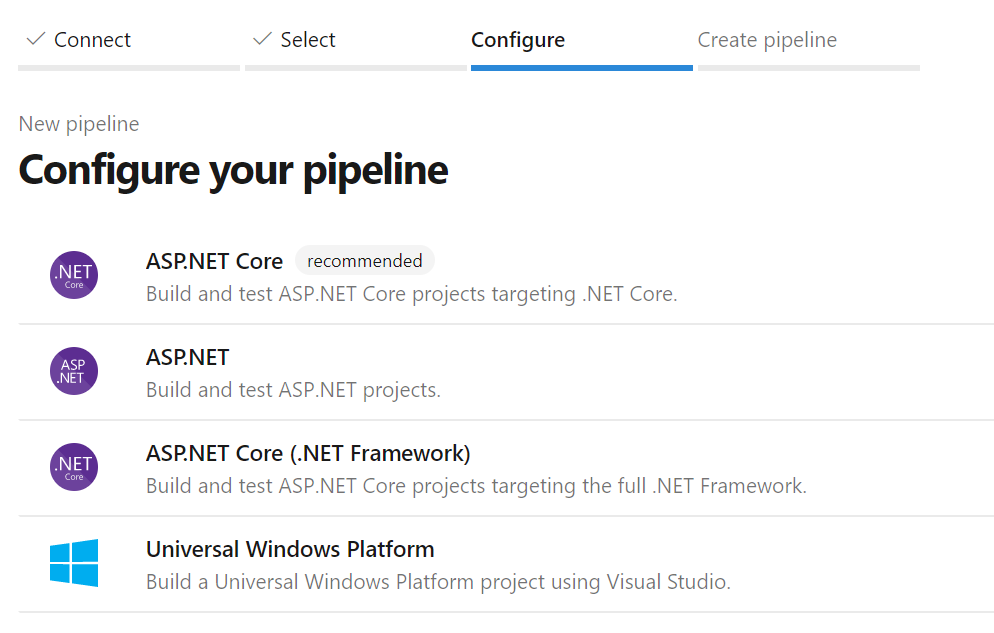
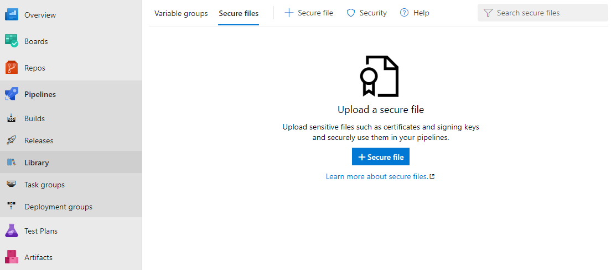
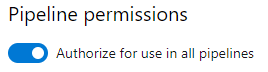
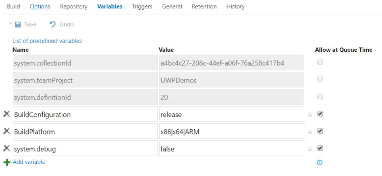
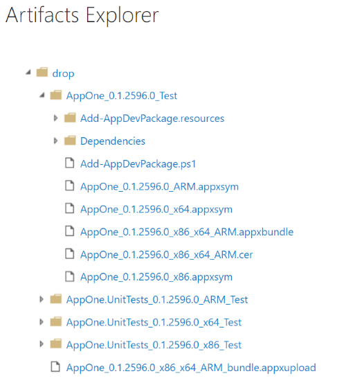

# Set up automated builds for your UWP app

You can use Azure Pipelines to create automated builds for UWP projects. In this article, we’ll look at different ways to do this. We’ll also show you how to perform these tasks by using the command line so that you can integrate with any other build system.

## Create a new Azure Pipeline

Begin by [signing up for Azure Pipelines](/azure/devops/pipelines/get-started/pipelines-sign-up) if you haven't done so already.

Next, create a pipeline that you can use to build your source code. For a tutorial about building a pipeline to build a GitHub repository, see [Create your first pipeline](/azure/devops/pipelines/get-started-yaml). Azure Pipelines supports the repository types listed [in this article](/azure/devops/pipelines/repos).

## Set up an automated build

We’ll start with the default UWP build definition that’s available in Azure Dev Ops and then show you how to configure the pipeline.

In the list of build definition templates, choose the **Universal Windows Platform** template.



This template includes the basic configuration to build your UWP project:

```yml
trigger:
- master

pool:
  vmImage: 'windows-latest'

variables:
  solution: '**/*.sln'
  buildPlatform: 'x86|x64|ARM'
  buildConfiguration: 'Release'
  appxPackageDir: '$(build.artifactStagingDirectory)\AppxPackages\\'

steps:
- task: NuGetToolInstaller@0

- task: NuGetCommand@2
  inputs:
    restoreSolution: '$(solution)'

- task: VSBuild@1
  inputs:
    platform: 'x86'
    solution: '$(solution)'
    configuration: '$(buildConfiguration)'
    msbuildArgs: '/p:AppxBundlePlatforms="$(buildPlatform)" /p:AppxPackageDir="$(appxPackageDir)" /p:AppxBundle=Always /p:UapAppxPackageBuildMode=StoreUpload'

```

The default template tries to sign the package with the certificate specified in the .csproj file. If you want to sign your package during the build you must have access to the private key. Otherwise, you can disable signing by adding the parameter `/p:AppxPackageSigningEnabled=false` to the `msbuildArgs` section in the YAML file.

## Add your project certificate to the Secure files library

You should avoid submitting certificates to your repo if at all possible, and git ignores them by default. To manage the safe handling of sensitive files like certificates, Azure DevOps supports the [secure files](/azure/devops/pipelines/library/secure-files?view=azure-devops) feature.

To upload a certificate for your automated build:

1. In Azure Pipelines, expand **Pipelines** in the navigation pane and click **Library**.
2. Click the **Secure files** tab and then click **+ Secure file**.

    

3. Browse to the certificate file and click **OK**.
4. After you upload the certificate, select it to view its properties. Under **Pipeline permissions**, enable the **Authorize for use in all pipelines** toggle.

    

5. If the private key in the certificate has a password, we recommend that you store your password in [Azure Key Vault](/azure/key-vault/about-keys-secrets-and-certificates) and then link the password to a [variable group](/azure/devops/pipelines/library/variable-groups). You can use the variable to access the password from the pipeline. Note that a password is only supported for the private key; using a certificate file that is itself password-protected is not currently supported.

> [!NOTE]
> Starting in Visual Studio 2019, a temporary certificate is no longer generated in UWP projects. To create or export certificates, use the PowerShell cmdlets described in [this article](/windows/msix/package/create-certificate-package-signing).

## Configure the Build solution build task

This task compiles any solution that’s in the working folder to binaries and produces the output app package file. This task uses MSBuild arguments. You’ll have to specify the value of those arguments. Use the following table as a guide.

|**MSBuild argument**|**Value**|**Description**|
|--------------------|---------|---------------|
| AppxPackageDir | $(Build.ArtifactStagingDirectory)\AppxPackages | Defines the folder to store the generated artifacts. |
| AppxBundlePlatforms | $(Build.BuildPlatform) | Enables you to define the platforms to include in the bundle. |
| AppxBundle | Always | Creates an .msixbundle/.appxbundle with the .msix/.appx files for the platform specified. |
| UapAppxPackageBuildMode | StoreUpload | Generates the .msixupload/.appxupload file and the **_Test** folder for sideloading. |
| UapAppxPackageBuildMode | CI | Generates the .msixupload/.appxupload file only. |
| UapAppxPackageBuildMode | SideloadOnly | Generates the **_Test** folder for sideloading only. |
| AppxPackageSigningEnabled | true | Enables package signing. |
| PackageCertificateThumbprint | Certificate Thumbprint | This value **must** match the thumbprint in the signing certificate, or be an empty string. |
| PackageCertificateKeyFile | Path | The path to the certificate to use. This is retrieved from the secure file metadata. |
| PackageCertificatePassword | Password | The password for the private key in the certificate. We recommend that you store your password in [Azure Key Vault](/azure/key-vault/about-keys-secrets-and-certificates) and link the password to [variable group](/azure/devops/pipelines/library/variable-groups). You can pass the variable to this argument. |

### Configure the build

If you want to build your solution by using the command line, or by using any other build system, run MSBuild with these arguments.

```powershell
/p:AppxPackageDir="$(Build.ArtifactStagingDirectory)\AppxPackages\\"
/p:UapAppxPackageBuildMode=StoreUpload
/p:AppxBundlePlatforms="$(Build.BuildPlatform)"
/p:AppxBundle=Always
```

### Configure package signing

To sign the MSIX (or .appx) package the pipeline needs to retrieve the signing certificate. To do this, add a DownloadSecureFile task prior to the VSBuild task.
This will give you access to the signing certificate via ```signingCert```.

```yml
- task: DownloadSecureFile@1
  name: signingCert
  displayName: 'Download CA certificate'
  inputs:
    secureFile: '[Your_Pfx].pfx'
```

Next, update the VSBuild task to reference the signing certificate:

```yml
- task: VSBuild@1
  inputs:
    platform: 'x86'
    solution: '$(solution)'
    configuration: '$(buildConfiguration)'
    msbuildArgs: '/p:AppxBundlePlatforms="$(buildPlatform)" 
                  /p:AppxPackageDir="$(appxPackageDir)" 
                  /p:AppxBundle=Always 
                  /p:UapAppxPackageBuildMode=StoreUpload 
                  /p:AppxPackageSigningEnabled=true
                  /p:PackageCertificateThumbprint="" 
                  /p:PackageCertificateKeyFile="$(signingCert.secureFilePath)"'
```

> [!NOTE]
> The PackageCertificateThumbprint argument is intentionally set to an empty string as a precaution. If the thumbprint is set in the project but does not match the signing certificate, the build will fail with the error: `Certificate does not match supplied signing thumbprint`.

### Review parameters

The parameters defined with the `$()` syntax are variables defined in the build definition, and will change in other build systems.



To view all predefined variables, see [Predefined build variables](/azure/devops/pipelines/build/variables).

## Configure the Publish Build Artifacts task

The default UWP pipeline does not save the generated artifacts. To add the publish capabilities to your YAML definition, add the following tasks.

```yml
- task: CopyFiles@2
  displayName: 'Copy Files to: $(build.artifactstagingdirectory)'
  inputs:
    SourceFolder: '$(system.defaultworkingdirectory)'
    Contents: '**\bin\$(BuildConfiguration)\**'
    TargetFolder: '$(build.artifactstagingdirectory)'

- task: PublishBuildArtifacts@1
  displayName: 'Publish Artifact: drop'
  inputs:
    PathtoPublish: '$(build.artifactstagingdirectory)'
```

You can see the generated artifacts in the **Artifacts** option of the build results page.



Because we’ve set the `UapAppxPackageBuildMode` argument to `StoreUpload`, the artifacts folder includes the package for submission to the Store (.msixupload/.appxupload). Note that you can also submit a regular app package (.msix/.appx) or an app bundle (.msixbundle/.appxbundle/) to the Store. For the purposes of this article, we'll use the .appxupload file.

## Address bundle errors

If you add more than one UWP project to your solution and then try to create a bundle, you might receive an error like this one.

  `MakeAppx(0,0): Error : Error info: error 80080204: The package with file name "AppOne.UnitTests_0.1.2595.0_x86.appx" and package full name "8ef641d1-4557-4e33-957f-6895b122f1e6_0.1.2595.0_x86__scrj5wvaadcy6" is not valid in the bundle because it has a different package family name than other packages in the bundle`

This error appears because at the solution level, it’s not clear which app should appear in the bundle. To resolve this issue, open each project file and add the following properties at the end of the first `<PropertyGroup>` element.

|**Project**|**Properties**|
|-------|----------|
|App|`<AppxBundle>Always</AppxBundle>`|
|UnitTests|`<AppxBundle>Never</AppxBundle>`|

Then, remove the `AppxBundle` MSBuild argument from the build step.

## Related topics

- [Build your .NET app for Windows](/vsts/build-release/get-started/dot-net)
- [Packaging UWP apps](/windows/msix/package/packaging-uwp-apps)
- [Sideload LOB apps in Windows 10](/windows/deploy/sideload-apps-in-windows-10)
- [Create a certificate for package signing](/windows/msix/package/create-certificate-package-signing)