# Set up automated builds for your UWP app

You can use Visual Studio Team Services (VSTS) to create automated builds for UWP projects. 
In this article, we’ll look at different ways to do that.  We’ll also show you how to perform these tasks by using the command line so that you can integrate with other build systems such as AppVeyor. 

## Select the right type of build agent

Choose the type of build agent that you want VSTS to use when it executes the build process. 
A hosted build agent is deployed with the most common tools and sdks, and it will work for most scenarios, see the [Software on the hosted build server](https://www.visualstudio.com/docs/build/admin/agents/hosted-pool#software) article. However, you can create a custom build agent if you need more control over the build steps. You can use the following table to help you make that decision.

| **Scenario** | **Custom Agent** | **Hosted Build Agent** |
|-------------|----------------|----------------------|
| Basic UWP build (including .NET native)| :white_check_mark: | :white_check_mark: |
| Generate packages for Sideloading| :white_check_mark: | :white_check_mark: |
| Generate packages for Store submission| :white_check_mark: | :white_check_mark: |
| Use custom certificates| :white_check_mark: | |
| Build targeting a custom Windows SDK| :white_check_mark: |  |
| Run unit tests| :white_check_mark: |  |
| Use incremental builds| :white_check_mark: |  |

#### Create a custom build agent (optional)

If you choose to create a custom build agent, you’ll need the Universal Windows Platform tools. These tools are part of Visual Studio. You can use the community edition of Visual Studio.

To learn more, see [Deploy an agent on Windows](https://www.visualstudio.com/docs/build/admin/agents/v2-windows). 

To run UWP unit tests, you’ll have to do these things: 
- Deploy and start your app 
- Run the VSTS agent in interactive mode 
- Configure your agent to auto-logon after a reboot 

## Set up an automated build
We’ll start with the default UWP build definition that’s available in VSTS and then show you how to configure that definition so that you can accomplish more advanced build tasks.

**Add the certificate of your project to a source code repository**

VSTS works with both TFS and GIT based code repositories.  
If you use a Git repository, add the certificate file of your project to the repository so that the build agent can sign the app package. If you don’t do this, the Git repository will ignore the certificate file. 
To add the certificate file to your repository, right-click the certificate file in Solution Explorer, and then in the shortcut menu, choose the Add Ignored File to Source Control command. 

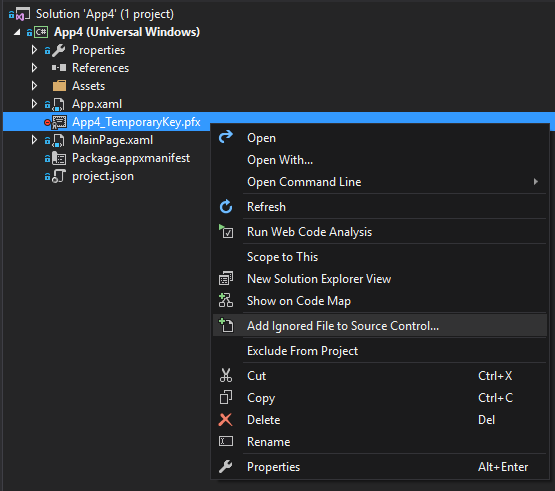

We’ll discuss [advanced certificate management](#certificates-best-practices) later in this guide. 

To create your first build definition in VSTS, navigate to the Builds tab, and then select the + button.

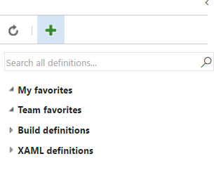

In the list of build definition templates, choose the *Universal Windows Platform* template.

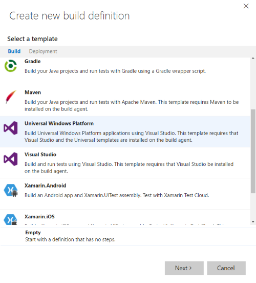

This build definition contains the following build tasks:

- NuGet restore **\*.sln
- Build solution **\*.sln
- Publish Symbols
- Publish Artifact: drop

#### Configure the NuGet restore build task

This task restores the NuGet Packages that are defined in your project. Some packages require a custom version of NuGet.exe. If you’re using a package that requires one, refer to that version NuGet.exe in your repo and then reference it in the *Path to NuGet.exe* advanced property.

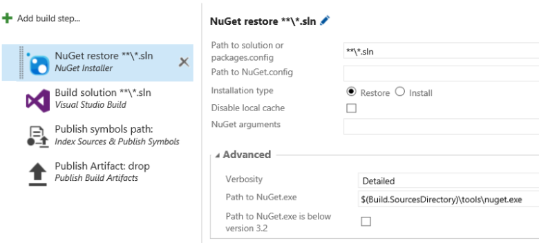

#### Configure the Build solution build task

This task compiles any solution that’s in the working folder to binaries and produces the output AppX file. 
This task uses MSbuild arguments.  You’ll have to specify the value of those arguments. Use the following table as a guide. 

|**MSBuild Argument**|**Value**|**Description**|
|--------------------|---------|---------------|
|AppxPackageDir|$(Build.ArtifactStagingDirectory)\AppxPackages|Defines the folder to store the generated artifacts.|
|AppxBundlePlatforms|$(Build.BuildPlatform)|Allows you to define the platforms to include in the bundle.|
|AppxBundle|Always|Creates an appxbundle with the appx files for the platform specified.|
|**UapAppxPackageBuildMode**|StoreUpload|Defines the kind of app package to generate. (Not included by default)|


If you want to build your solution by using the command line, or by using any other build system, run msbuild with these arguments.

```
/p:AppxPackageDir="$(Build.ArtifactStagingDirectory)\AppxPackages\\"  
/p:UapAppxPackageBuildMode=StoreUpload 
/p:AppxBundlePlatforms="$(Build.BuildPlatform)"
/p:AppxBundle=Always
```

The parameters defined with the $() syntax are variables defined in the build definition, and will change in other build systems.


To view all predefined variables, see [Use build variables.](https://www.visualstudio.com/docs/build/define/variables)

#### Configure the Publish Artifact build task 
This task stores the generated artifacts in VSTS. You can see them in the Artifacts tab of the build results page. 
VSTS uses the `$(Build.ArtifactStagingDirectory)\AppxPackages` folder that we previously defined.


Because we’ve set the `UapAppxPackageBuildMode` property to `StoreUpload`, the artifacts folder includes the package that recommended for submission to the Store (.appxupload). Note that you can also submit a regular app pacakge (.appx) or an app bundle (.appxbundle) to the Store. For the purposes of this article, we'll use the .appxupload file.


>[!NOTE]
> By default, the VSTS agent maintains the latest generated app packages. If you want to store only the artifacts of the current build, configure the build to clean the binaries directory. To do that, add a variable named `Build.Clean` and then set it to the value `all`. To learn more, see [Specify the repository](https://www.visualstudio.com/docs/build/define/repository#how-can-i-clean-the-repository-in-a-different-way).

#### The types of automated builds
Next, you’ll use your build definition to create an automated build. The following table describes each type of automated build that you can create. 

|**Type of Build**|**Artifact**|**Recommended Frequency**|**Description**|
|-----------------|------------|-------------------------|---------------|
|Continuous Integration|Build Log, Test Results|Each commit|This type of build is fast and run several times a day.|
|Continuous Deployment build for sideloading|Deployment Packages|Daily |This type of build can Include unit tests but it takes a bit longer. It allows manual testing and you can integrate it with other tools such as HockeyApp.|
|Continuous Deployment build that submits a package to the Store|Publishing Packages|On demand|This type of build creates a package that you can publish to the Store.|

Let’s look at how to configure each one.


## Set up a Continuous Integration (CI) build 
This type of a build helps you to diagnose code related problems quickly. They’re typically executed for only one platform, and they don’t need to be processed by the .NET native toolchain. Also, with CI builds, you can run unit tests that produce a test results report.  

If you want to run UWP unit tests as part of your CI build you’ll need to use a custom build agent instead of the hosted build agent.

>[!NOTE]
> If you bundle more than one app in the same solution, you might receive an error. See the following topic for help resolving that error: [Address errors that appear when you bundle more than one app in the same solution.](#bundle-errors) 


### Configure a CI build definition
Use the default UWP template to create a build definition. Then, configure the Trigger to execute on each check in.  

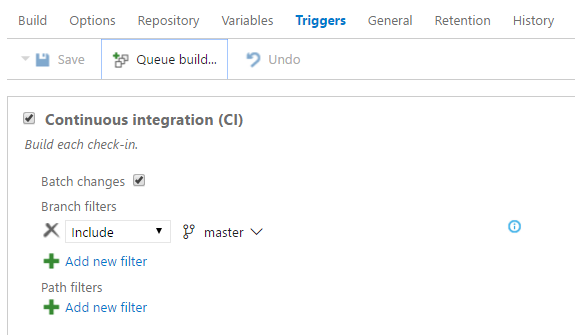

Because the CI build won’t be deployed to users, it’s a good idea to maintain different versioning numbers to avoid confusion with the CD builds. For example: 
`$(BuildDefinitionName)_0.0.$(DayOfYear)$(Rev:.r)`


#### Configure a custom build agent for unit testing

1. Enable Developer Mode on your PC. See [Enable your device for development](https://docs.microsoft.com/windows/uwp/get-started/enable-your-device-for-development) for more information. 
2. Enable the service to run as an interactive process. To learn more, see [Deploy an agent on Windows](https://docs.microsoft.com/vsts/build-release/actions/agents/v2-windows). 
3. Deploy the signing certificate to the agent.

To deploy a signing certificate, double-click the `.cer` file, choose **Local Machine**, and then choose **Trusted People Store**.

<span id="uwp-unit-tests" />

### Configure the build definition to run UWP Unit Tests
To execute a unit test, use the Visual Studio Test build step.


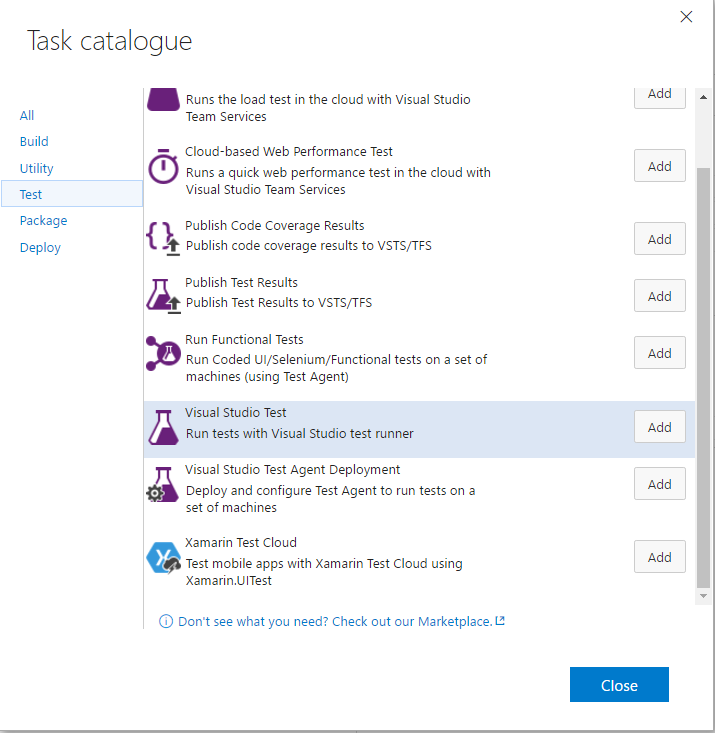

UWP unit tests are executed in the context of a given appxrecipe file so you can’t use the generated bundle. Also, you’ll have to specify the path to a concrete platform appxrecipe file. For example:

```
$(Build.ArtifactStagingDirectory)\AppxPackages\MyUWPApp.UnitTest\x86\MyUWPApp.UnitTest_$(AppxVersion)_x86.appxrecipe
```

In order for the tests to run a console parameter will have to be added to vstest.console.exe. This parameter can be provide through: **Execution Options => Other console options**. Please add following parameter: 

```
/framework:FrameworkUap10
```

>[!NOTE]
> Use the following command to execute the unit tests locally from the command line:
`"%ProgramFiles(x86)%\Microsoft Visual Studio 14.0\Common7\IDE\CommonExtensions\Microsoft\TestWindow\vstest.console.exe"`

#### Access test results
In VSTS, the build summary page shows the test results for each build that executes unit tests. From there, you can open the **Test Results** page to see more detail about the test results. 

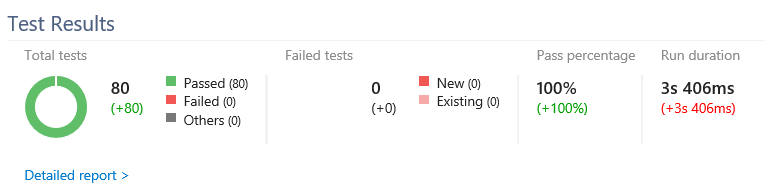

#### Improve the speed of a CI build
If you want to use your CI build only to monitor the quality of your check-ins, you can reduce your build times.

#### To improve the speed of a CI build
1.	Build for only one platform.
2.	Edit the BuildPlatform variable to use only x86. 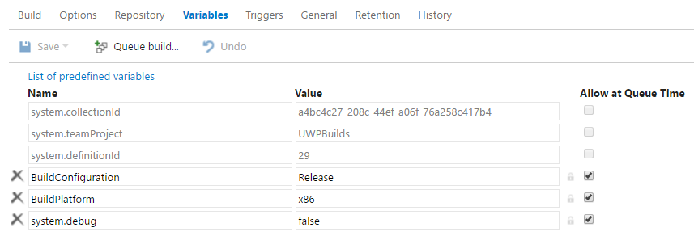 
3.	In the build step, add /p:AppxBundle=Never to the MSBuild Arguments property, and then set the Platform property. 
4.	In the unit test project, disable .NET Native. 

To do that, open the project file, and in the project properties, set the `UseDotNetNativeToolchain` property to `false`.

Using the .NET native tool chain is an important part of the workflow and should still be used to test release builds. 

<span id="bundle-errors" />

#### Address errors that appear when you bundle more than one app in the same solution 
If you add more than one UWP project to your solution, and then try to create a bundle, you might receive an error like this one: 

```
MakeAppx(0,0): Error : Error info: error 80080204: The package with file name "AppOne.UnitTests_0.1.2595.0_x86.appx" and package full name "8ef641d1-4557-4e33-957f-6895b122f1e6_0.1.2595.0_x86__scrj5wvaadcy6" is not valid in the bundle because it has a different package family name than other packages in the bundle
```

This error appears because at the solution level, it’s not clear which app should appear in the bundle. 
To resolve this issue, open each project file and add the following properties at the end of the first `<PropertyGroup>` element:

|**Project**|**Properties**|
|-------|----------|
|App|`<AppxBundle>Always</AppxBundle>`|
|UnitTests|`<AppxBundle>Never</AppxBundle>`|

Then, remove the `AppxBundle` msbuild argument from the build step.

## Set up a continuous deployment build for sideloading
When this type of build completes, users can download the .appxbundle file from the artifacts section of the build results page. 
If you want to beta test the app by creating a more complete distribution, you can use the HockeyApp service. This service offers advanced capabilities for beta testing, user analytics and crash diagnostics.

### Applying version numbers to your builds

The manifest file contains the app version number.  Update the manifest file in your source control repository to change the version number. 
Another way to update the version number of your app is to use the build number that is generated by VSTS, and then modify the app manifest just before you compile the app. Just don’t commit those changes to the source code repository.

You’ll have to define your versioning build number format in the build definition, and then use the resulting version number to update the AppxManifest and optionally, the AssemblyInfo.cs files, before you compile.

Define the build number format in the *General* tab of your build definition.

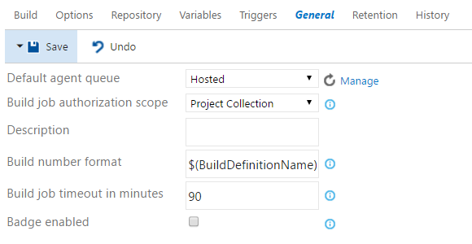 

For example, if you set the build number format to the following value:
``` 
$(BuildDefinitionName)_1.1.$(DayOfYear)$(Rev:r).0 
```

VSTS generates a version number like:
```
CI_MyUWPApp_1.1.2501.0
```

>[!NOTE]
>The Store will require that the last number in the version to be 0.

So that you can extract the version number and apply it to the manifest and/or `AssemblyInfo` files, use a custom PowerShell script (available [here](https://go.microsoft.com/fwlink/?prd=12560&pver=14&plcid=0x409&clcid=0x9&ar=DevCenter&sar=docs)). That script reads the version number from the environment variable `BUILD_BUILDNUMBER`, and then modifies the AssemblyInfo and AppxManifest files. Make sure to add this script to your source repository, and then configure a PowerShell build task as shown here:


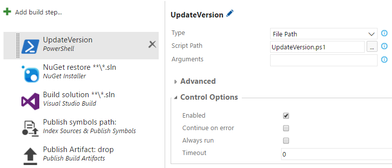 

The `$(AppxVersion)` variable contains the version number. You can use that number in other build steps. 


#### Optional: Integrate with HockeyApp
First, install the [HockeyApp](https://marketplace.visualstudio.com/items?itemName=ms.hockeyapp) Visual Studio extension. You will need to install this extension as a VSTS administrator. 

 

Next, configure the HockeyApp connection by using this guide: [How to use HockeyApp with Visual Studio Team Services (VSTS) or Team Foundation Server (TFS).](https://support.hockeyapp.net/kb/third-party-bug-trackers-services-and-webhooks/how-to-use-hockeyapp-with-visual-studio-team-services-vsts-or-team-foundation-server-tfs) 
You can use your Microsoft account, social media account or just an email address to set up your HockeyApp account. The free plan comes with two apps, one owner, and no data restrictions.

Then, you can create a HockeyApp app manually, or by uploading an existing appx package file. To learn more, see [How to create a new app](https://support.hockeyapp.net/kb/app-management-2/how-to-create-a-new-app).  

To use an existing appx package file, add a build step, and set the Binary File Path parameter of the build step. 

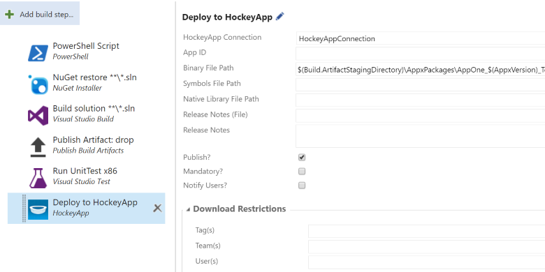 

To set this parameter, combine the app name, the AppxVersion variable and the supported platforms together into one string such as this one:

``` 
$(Build.ArtifactStagingDirectory)\AppxPackages\MyUWPApp_$(AppxVersion)_Test\MyUWPApp_$(AppxVersion)_x86_x64_ARM.appxbundle
```

Although the HockeyApp task allows you to specify the path to the symbols file, it’s a best practice to include the symbols (appxsym files) with the bundle.

## Set up a continuous deployment build that submits a package to the Store 

To generate Store submission packages, associate your app with the Store by using the Store Association Wizard in Visual Studio.

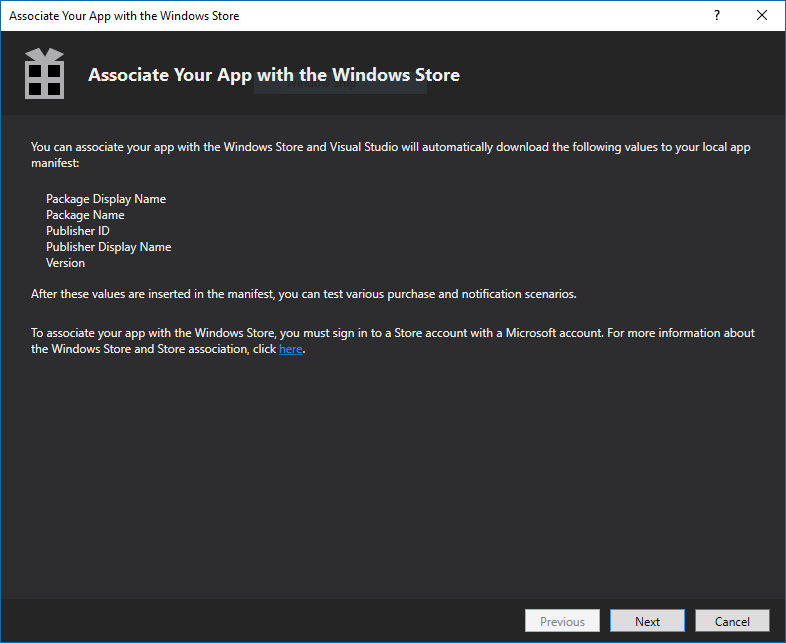 

The Store Association Wizard generates a file named Package.StoreAssociation.xml that contains the Store association information. If you store your source code in a public repository such as GitHub, this file will contain all the app reserved names for that account. You can exclude or delete this file before making it public.

If you don’t have access to the Dev Center account that was used to publish the app, you can follow the instructions in this document: [Building an app for a 3rd party? How to package their Store app](https://blogs.windows.com/buildingapps/2015/12/15/building-an-app-for-a-3rd-party-how-to-package-their-store-app/#e35YzR5aRG6uaBqK.97). 

Then you need to verify that the build step includes the following parameter:

```
/p:UapAppxPackageBuildMode=StoreUpload 
```

This will generate an .appxupload file that can be submitted to the Store.


#### Configure automatic Store submission

Use the Visual Studio Team Services extension for the Microsoft Store to integrate with the Store API, and send your app package to the Store.

You need to connect your Dev Center account with Azure Active Directory (AD), and then create an app in your AD to authenticate the requests. You can follow the guidance in the extension page to accomplish that. 

Once you’ve configured the extension, you can add the build task, and configure it with your app ID and the location of the .appxupload file.

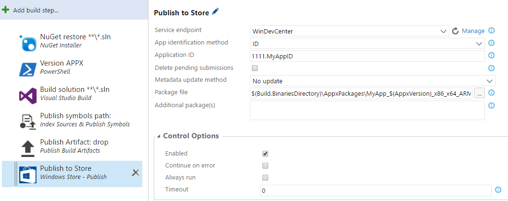 

Where the value of the `Package File` parameter will be:

```
$(Build.ArtifactStagingDirectory)\
AppxPackages\MyUWPApp__$(AppxVersion)_x86_x64_ARM_bundle.appxupload
```

You have to manually activate this build. You can use it to update existing apps but you can’t use it to for your first submission to the Store. For more information, see [Create and manage Store submissions by using Microsoft Store Services.](https://msdn.microsoft.com/windows/uwp/monetize/create-and-manage-submissions-using-windows-store-services)

## Best Practices

<span id="sideloading-best-practices"/>

### Best Practices for Sideloading apps

If you want to distribute your app without publishing it to the Store, you can sideload your app directly to devices as long as those devices trust the certificate that was used to sign the app package. 

Use the `Add-AppDevPackage.ps1` PowerShell script to install apps. This script will add the certificate to the Trusted Root Certification section for the local machine, and will then install or update the appx file.

#### Sideloading your app with the Windows 10 Anniversary Update
In the Windows 10 Anniversary Update, you can double-click the appxbundle file and install your app by choosing the Install button in a dialog box. 

 

>[!NOTE]
> This method doesn’t install the certificate or the associated dependencies.

If you want to distribute your appx packages from a website such as VSTS or HockeyApp, you’ll need to add that site to the list of trusted sites in your browser. Otherwise, Windows marks the file as locked. 

<span id="certificates-best-practices"/>

### Best Practices for Signing Certificates 
Visual Studio generates a certificate for each project. This makes it difficult to maintain a curated list of valid certificates. If you plan to create several apps, you can create a single certificate to sign all of your apps. Then, each device that trusts your certificate will be able to sideload any of your apps without installing another certificate. To learn more, see [Create a certificate for package signing](https://docs.microsoft.com/windows/uwp/packaging/create-certificate-package-signing).


#### Create a Signing Certificate
Use the [MakeCert.exe](https://msdn.microsoft.com/library/windows/desktop/ff548309.aspx) tool to create a certificate.

The following example creates a certificate by using the MakeCert.exe tool.

```
MakeCert /n publisherName /r /h 0 /eku "1.3.6.1.5.5.7.3.3,1.3.6.1.4.1.311.10.3.13" /e expirationDate /sv MyKey.pvk MyKey.cer
```

Then you can use Pvk2Pfx tool to generate a PFX file that contains the private key protected with a password.

Provide these certificates to each machine role:

|**Machine**|**Usage**|**Certificate**|**Certificate Store**|
|-----------|---------|---------------|---------------------|
|Developer/Build Machine|Sign Builds|MyCert.PFX|Current User/Personal|
|Developer/Build Machine|Run|MyCert.cer|Local Machine/Trusted People|
|User|Run|MyCert.cer|Local Machine/Trusted People|

>Note: You can also use an enterprise certificate that is already trusted by your users.

#### Sign your UWP app
Visual Studio and MSBuild offers different options to manage the certificate that you use to sign the app:

One option is to include the certificate with the private key (normally in the form of a .PFX file) in your solution, and then reference the pfx in the project file. You can manage this by using the Package tab of the manifest editor.


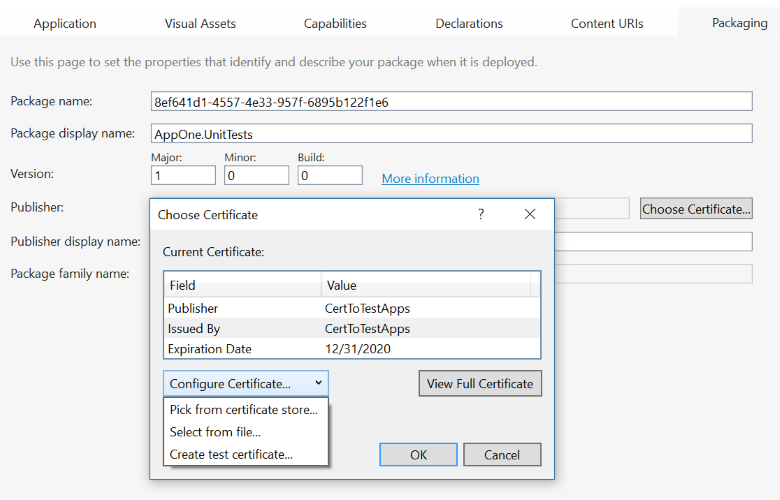 

Another option is to install the certificate onto the build machine (Current User/Personal), and then use the Pick from Certificate store option. This specifies the Thumbprint of the certificate in the project file so that the certificate should be installed in all the machines that will be used to build the project.

#### Trust the signing certificate in the target devices
A target device has to trust the certificate before the app can be installed on it. 

Register the public key of the certificate in the Trusted People or Trust Root location in the Local Machine certificate store.

The quickest way to register the certificate is to double-click in the .cer file, and then follow the steps in the wizard to save the certificate in the **Local Machine** and **Trusted People** store.

## Related Topics
* [Build your .NET app for Windows](https://www.visualstudio.com/docs/build/get-started/dot-net) 
* [Packaging UWP apps](https://msdn.microsoft.com/windows/uwp/packaging/packaging-uwp-apps)
* [Sideload LOB apps in Windows 10](https://technet.microsoft.com/itpro/windows/deploy/sideload-apps-in-windows-10)
* [Create a certificate for package signing](https://docs.microsoft.com/windows/uwp/packaging/create-certificate-package-signing)
