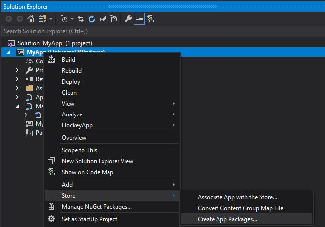
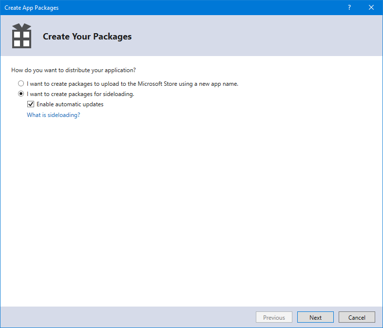
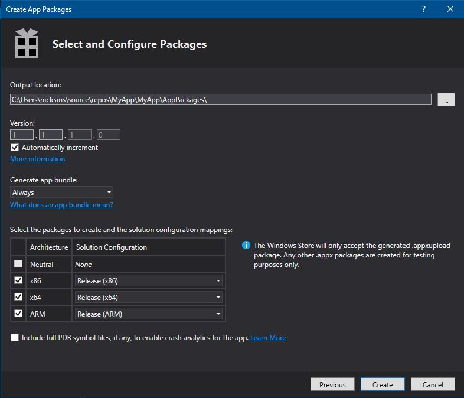
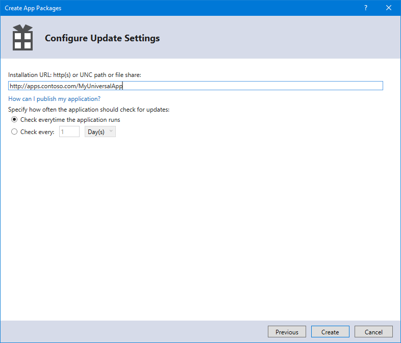

# Create an App Installer file with Visual Studio

Starting with Windows 10, Version 1804, and Visual Studio 2017, Update 15.7, sideloaded apps can be configured to receive automatic updates using an `.appinstaller` file. Visual Studio supports enabling these updates.

## App Installer file location
The `.appinstaller` file can be hosted in a shared location like a HTTP endpoint or a UNC shared folder, and includes the path to find the app packages to be installed. Users install the app from the shared location and enable periodic checks for new updates. 


### Configure the project to target the correct Windows version

You can either configure the `TargetPlatformMinVersion` property when you create the project, or change it later from the project properties. 

>[!IMPORTANT]
> The app installer file is only generated when the `TargetPlatformMinVersion` is Windows 10, Version 1804 or greater.


### Create Packages

To distribute an app via sideloading, you must create an app package (.appx) or app bundle (.appxbundle) and publish it in a shared location.

To do that, use the **Create App Packages** wizard in Visual Studio with the following steps.

1. Right-click the project and choose **Store** -> **Create App Packages**.  

   

The **Create App Packages** wizard appears.

2. Select **I want to create packages for sideloading.** and **Enable automatic updates**  

  

**Enable automatic updates** is enabled only if the project's `TargetPlatformMinVersion` is set to the correct version of Windows 10.

3. The **Select and Configure Packages** dialog allows you to select the supported architecture configurations. If you select a bundle it will generate a single installer, however if you don't want a bundle and prefer one package per architecture you will also get one installer file per architecture.  If you're unsure which architecture(s) to choose, or want to learn more about which architectures are used by various devices, see [App package architectures](device-architecture.md).

4. Configure any additional details, such as version numbering or the package output location.

  

5. If you checked **Enable automatic updates** in Step 2, the **Configure Update Settings** dialog will appear. Here, you can specify the **Installation URL** and the frequency of update checks.

  

6. When your app has been successfully packaged, a dialog will display the location of the output folder containing your app package. The output folder includes all the files needed to sideload the app, including an HTML page that can be used to promote your app.

### Publish packages

To make the application available the generated files must be published to the location specified:

#### Publish to shared folders (UNC)

If you want to publish your packages over Universal Naming Convention (UNC) shared folders, configure the app package output folder and the Installation URL (see Step 6 for details) to the same path. The wizard will generate the files in the correct location, and users will get both the app and future updates from the same path.

#### Publish to a web location (HTTP)

Publishing to a web location requires access to publish content to the web server, making sure the final URL matches the Installation URL defined in the wizard (see Step 6 for details). Typically, File Transfer Protocol (FTP) or SSH File Transfer Protocol (SFTP) are used to upload the files, but there are other publishing methods like MSDeploy, SSH, or Blob storage, depending on your web provider.

To configure the web server you must verify the MIME types used for the file types in use. This example is of the `web.config` for Internet Information Services (IIS):

```xml
<configuration>
  <system.webServer>
    <staticContent>
      <mimeMap fileExtension=".appx" mimeType="application/vns.ms-appx" />
      <mimeMap fileExtension=".appxbundle" mimeType="application/vns.ms-appx" />
      <mimeMap fileExtension=".appinstaller" mimeType="application/xml" />
    </staticContent>  
  </system.webServer>  
</configuration>
```


