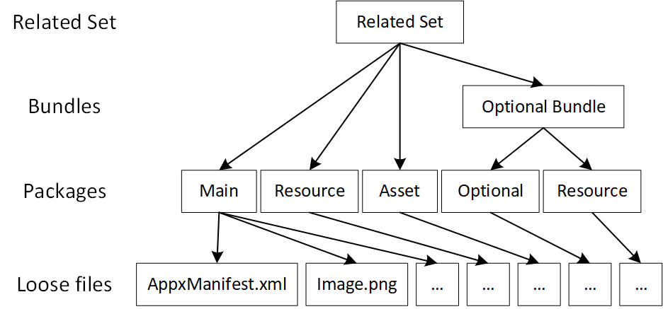

# Package creation with the packaging layout  

With the introduction of asset packages, developers now have the tools to build more packages in addition to more package types. As an app gets larger and more complex, it will often be comprised of more packages, and the difficulty of managing these packages will increase (especially if you are building outside of Visual Studio and using mapping files). To simplify the management of an app’s packaging structure, you can use the packaging layout supported by MakeAppx.exe. 

The packaging layout is a single XML document that describes packaging structure of the app. It specifies the bundles of an app (primary and optional), the packages in the bundles, and the files in the packages. Files can be selected from different folders, drives, and network locations. Wildcards can be used to select or exclude files.

After the packaging layout for an app has been set up, it's used with MakeAppx.exe to create all of the packages for an app in a single command line call. The packaging layout can be edited to alter the package structure to fit your deployment needs. 


## Simple packaging layout example

Here's an example of what a simple packaging layout looks like:

```xml
<PackagingLayout xmlns="http://schemas.microsoft.com/appx/makeappx/2017">
  <PackageFamily ID="MyGame" FlatBundle="true" ManifestPath="C:\mygame\appxmanifest.xml" ResourceManager="false">
    
    <!-- x64 code package-->
    <Package ID="x64" ProcessorArchitecture="x64">
      <Files>
        <File DestinationPath="*" SourcePath="C:\mygame\*"/>
        <File ExcludePath="*C:\mygame\*.txt"/>
      </Files>
    </Package>
    
    <!-- Media asset package -->
    <AssetPackage ID="Media" AllowExecution="false">
      <Files>
        <File DestinationPath="Media\**" SourcePath="C:\mygame\media\**"/>
      </Files>
    </AssetPackage>

  </PackageFamily>
</PackagingLayout>
```

Let's break this example down to understand how it works.

### PackageFamily
This packaging layout will create a single flat .appxbundle file with an x64 architecture package and a “Media” asset package. 

The **PackageFamily** element is used to define an app bundle. You must use the **ManifestPath** attribute to provide an **AppxManifest** for the bundle, the **AppxManifest** should correspond to the **AppxManifest** for the architecture package of the bundle. The **ID** attribute must also be provided. This is used with MakeAppx.exe during package creation so that you can create just this package if you want to, and this will be the file name of the resulting package. The **FlatBundle** attribute is used to describe what type of bundle you want to create, **true** for a flat bundle (which you can read more about here), and **false** for a classic bundle. The **ResourceManager** attribute is used to specify if the resource packages within this bundle will use MRT in order to access the files. This is by default **true**, but as of Windows 10, version 1803, this is not yet ready, so this attribute must be set to **false**.


### Package and AssetPackage
Within the **PackageFamily**, the packages that the app bundle contains or references are defined. Here, the architecture package (also called the main package) is defined with the **Package** element, and the asset package is defined with the **AssetPackage** element. The architecture package must specify which architecture the package is for, either “x64”, “x86”, “arm”, or “neutral”. You can also (optionally) directly provide an **AppxManifest** specifically for this package by using the **ManifestPath** attribute again. If an **AppxManifest** is not provided, one will be automatically generated from the **AppxManifest** provided for the **PackageFamily**. 

By default and **AppxManifest** will be generated for every package within the bundle. For the asset package, you can also set the **AllowExecution** attribute. Setting this to **false** (the default), will help decrease the publishing time for your app since packages that don’t need to execute won’t have their virus scan block the publishing process (you can learn more about this at [Introduction to asset packages](asset-packages.md)). 

### Files
Within each package definition, you can use the **File** element to select files to be included in this package. The **SourcePath** attribute is where the files are locally. You can select files from different folders (by providing relative paths), different drives (by providing absolute paths), or even network shares (by providing something like `\\myshare\myapp\*`). The **DestinationPath** is where the files will end up within the package, relative to the package root. **ExcludePath** can be used (instead of the other two attributes) to select files to be excluded from the ones selected by other **File** elements’ **SourcePath** attributes within the same package.

Each **File** element can be used to select multiple files by using wildcards. In general, single wildcard (`*`) can be used anywhere within the path any number of times. However, a single wildcard will only match the files within a folder and not any subfolders. For example, `C:\MyGame\*\*` can be used in the **SourcePath** to select the files `C:\MyGame\Audios\UI.mp3` and `C:\MyGame\Videos\intro.mp4`, but it cannot select `C:\MyGame\Audios\Level1\warp.mp3`. The double wildcard (`**`) can also be used in place of folder or file names to match anything recursively (but it cannot be next to partial names). For example, `C:\MyGame\**\Level1\**` can select `C:\MyGame\Audios\Level1\warp.mp3` and `C:\MyGame\Videos\Bonus\Level1\DLC1\intro.mp4`. Wildcards can also be used to directly change file names as part of the packaging process if the wildcards are used in different places between the source and destination. For example, having `C:\MyGame\Audios\*` for **SourcePath** and `Sound\copy_*` for **DestinationPath** can select `C:\MyGame\Audios\UI.mp3` and have it appear in the package as `Sound\copy_UI.mp3`. In general, the number of single wildcards and double wildcards must be the same for the **SourcePath** and **DestinationPath** of a single **File** element.


## Advanced packaging layout example

Here's an example of a more complicated packaging layout:

```xml
<PackagingLayout xmlns="http://schemas.microsoft.com/appx/makeappx/2017">
  <!-- Main game -->
  <PackageFamily ID="MyGame" FlatBundle="true" ManifestPath="C:\mygame\appxmanifest.xml" ResourceManager="false">
    
    <!-- x64 code package-->
    <Package ID="x64" ProcessorArchitecture="x64">
      <Files>
        <File DestinationPath="*" SourcePath="C:\mygame\*"/>
        <File ExcludePath="*C:\mygame\*.txt"/>
      </Files>
    </Package>

    <!-- Media asset package -->
    <AssetPackage ID="Media" AllowExecution="false">
      <Files>
        <File DestinationPath="Media\**" SourcePath="C:\mygame\media\**"/>
      </Files>
    </AssetPackage>
    
    <!-- English resource package -->
    <ResourcePackage ID="en">
      <Files>
        <File DestinationPath="english\**" SourcePath="C:\mygame\english\**"/>
      </Files>
      <Resources Default="true">
        <Resource Language="en"/>
      </Resources>
    </ResourcePackage>

    <!-- French resource package -->
    <ResourcePackage ID="fr">
      <Files>
        <File DestinationPath="french\**" SourcePath="C:\mygame\french\**"/>
      </Files>
      <Resources>
        <Resource Language="fr"/>
      </Resources>
    </ResourcePackage>
  </PackageFamily>

  <!-- DLC in the related set -->
  <PackageFamily ID="DLC" Optional="true" ManifestPath="C:\DLC\appxmanifest.xml">
    <Package ID="DLC.x86" Architecture="x86">
      <Files>
        <File DestinationPath="**" SourcePath="C:\DLC\**"/>
      </Files>
    </Package>
  </PackageFamily>

  <!-- DLC not part of the related set -->
  <PackageFamily ID="Themes" Optional="true" RelatedSet="false" ManifestPath="C:\themes\appxmanifest.xml">
    <Package ID="Themes.main" Architecture="neutral">
      <Files>
        <File DestinationPath="**" SourcePath="C:\themes\**"/>
      </Files>
    </Package>
  </PackageFamily>

  <!-- Existing packages that need to be included/referenced in the bundle -->
  <PrebuiltPackage Path="C:\prebuilt\DLC2.appxbundle" />

</PackagingLayout>
```

This example differs from the simple example with the addition of **ResourcePackage** and **Optional** elements.

Resource packages can be specified with the **ResourcePackage** element. Within the **ResourcePackage**, the **Resources** element must be used to specify the resource qualifiers of the resource pack. The resource qualifiers are the resources that are supported by the resource pack, here, we can see that there are two resource packs defined and they each contain the English and French specific files. A resource pack can have more than one qualifier, this can be done by adding another **Resource** element within **Resources**. A default resource for the resource dimension must also be specified if the dimension exists (dimensions being language, scale, dxfl). Here, we can see that English is the default language, meaning that for users that does not have a system language of French set, they will fallback to downloading the English resource pack and display in English.


Optional packages each have their own distinct package family names and must be defined with **PackageFamily** elements, while specifying the **Optional** attribute to be **true**. The **RelatedSet** attribute is used to specify whether the optional package is within the related set (by default this is true) – whether the optional package should be updated with the primary package.

The **PrebuiltPackage** element is used to add packages that are not defined in the packaging layout to be included or referenced in the .appxbundle file(s) to be built. In this case, another DLC optional package is being included here so that the primary .appxbundle file can reference it and have it be part of the related set.


## Build app packages with a packaging layout and MakeAppx.exe
Once you have the packaging layout for your app, you can start using MakeAppx.exe to build the packages of your app. To build all of the packages defined in the packaging layout, use the command:

``` example 
MakeAppx.exe build /f PackagingLayout.xml /op OutputPackages\
```

But, if you are updating your app and some packages don't contain any changed files, you can build only the packages that have changed. Using the simple packaging layout example on this page and building the x64 architecture package, this is what our command would look like:

``` example 
MakeAppx.exe build /f PackagingLayout.xml /id "x64" /ip PreviousVersion\ /op OutputPackages\ /iv
```

The `/id` flag can be used to select the packages to be built from the packaging layout, corresponding to the **ID** attribute in the layout. The `/ip` is used to indicate where the previous version of the packages are in this case. The previous version must be provided because the .appxbundle file still needs to reference the previous version of the **Media** package. The `/iv` flag is used to automatically increment the version of the packages being built (instead of changing the version in the **AppxManifest**). Alternatively, the switches `/pv` and `/bv` can be used to directly provide a package version (for all packages to be created) and a bundle version (for all bundles to be created), respectively.
Using the advanced packaging layout example on this page, if you want to only build the **Themes** optional bundle and the **Themes.main** app package that it references, you would use this command:

``` example 
MakeAppx.exe build /f PackagingLayout.xml /id "Themes" /op OutputPackages\ /bc /nbp
```

The `/bc` flag is used to denote that the children of the **Themes** bundle should also be built (in this case **Themes.main** will be built). The `/nbp` flag is used to denote that the parent of the **Themes** bundle should not be built. The parent of **Themes**, which is an optional app bundle, is the primary app bundle: **MyGame**. Usually for an optional package in a related set, the primary app bundle must also be built for the optional package to be installable, since the optional package is also referenced in the primary app bundle when it is in a related set (to guarantee versioning between the primary and the optional packages). The parent child relationship between packages is illustrated in the following diagram:


