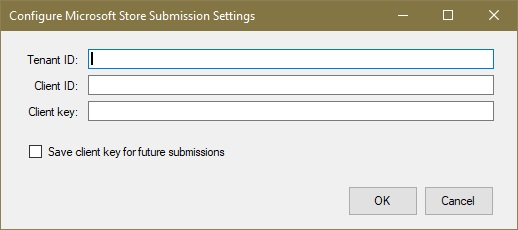
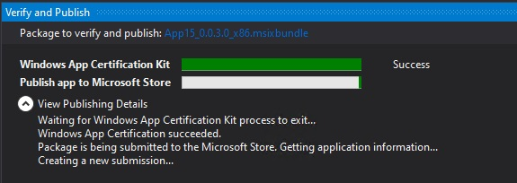

# Package a UWP app with Visual Studio

To sell your Universal Windows Platform (UWP) app or distribute it to other users, you need to package it. If you don't want to distribute your app through Microsoft Store, you can sideload the app package directly to a device or distribute it via [Web Install](installing-UWP-apps-web.md). This article describes the process of configuring, creating, and testing a UWP app package using Visual Studio. For more information about managing and deploying line-of-business (LOB) apps, see [Enterprise app management](https://docs.microsoft.com/windows/client-management/mdm/enterprise-app-management).

In Windows 10, you can submit an app package, app bundle, or a complete app package upload file to [Partner Center](https://partner.microsoft.com/dashboard). Of these options, submitting an app package upload file will provide the best experience.

## Types of app packages

- **App Package (.appx or .msix)**  
    A file that contains your app in a format that can be sideloaded on a device. Any single app package file created by Visual Studio is **not** intended to be submitted to Partner Center and should be used for sideloading and testing purposes only. If you want to submit your app to Partner Center, use the app package upload file.  

- **App Bundle (.appxbundle or .msixbundle)**  
    An app bundle is a type of package that can contain multiple app packages, each of which is built to support a specific device architecture. For example, an app bundle can contain three separate app packages for the x86, x64, and ARM configurations. App bundles should be generated whenever possible because they allow your app to be available on the widest possible range of devices.  

- **App Package Upload File (.appxupload or .msixupload)**  
    A single file that can contain multiple app packages or an app bundle to support various processor architectures. The app package upload file also contains a symbol file to [Analyze app performance](https://docs.microsoft.com/windows/uwp/publish/analytics) after your app has been published in the Microsoft Store. This file will be automatically created for you if you are packaging your app with Visual Studio with the intention of submitting it to Partner Center for publishing.

Here is an overview of the steps to prepare and create an app package:

1.  [Before packaging your app](#before-packaging-your-app). Follow these steps to ensure your app is ready to be packaged for Partner Center submission.
2.  [Configure an app package](#configure-an-app-package). Use the Visual Studio manifest designer to configure the package. For example, add tile images and choose the orientations your app supports.
3.  [Create an app package upload file](#create-an-app-package-upload-file). Use the Visual Studio app package wizard to create an app package, then certify your package with the Windows App Certification Kit.
4.  [Sideload your app package](#sideload-your-app-package). After sideloading your app to a device, you can test that it works as you expect it to.

After you have completed the steps above, you are ready to distribute your app. If you have a line-of-business (LOB) app that you don't plan to sell because it's for internal users only, you can sideload this app to install it on any Windows 10 device.

## Before packaging your app

1.  **Test your app.** Before you package your app for Partner Center submission, make sure it works as expected on all device families that you plan to support. These device families may include desktop, mobile, Surface Hub, Xbox, IoT devices, or others. For more information about deploying and testing your app using Visual Studio, see [Deploying and debugging UWP apps](../debug-test-perf/deploying-and-debugging-uwp-apps.md).
2.  **Optimize your app.** You can use Visual Studio’s profiling and debugging tools to optimize the performance of your UWP app. For example, the Timeline tool for UI responsiveness, the Memory Usage tool, the CPU Usage tool, and more. For more information about these tools, see the [Profiling Feature Tour](https://docs.microsoft.com/visualstudio/profiling/profiling-feature-tour) topic.
3.  **Check .NET Native compatibility (for VB and C# apps).** In the Universal Windows Platform, there is a native compiler that will improve the runtime performance of your app. With this change, you should test your app in this compilation environment. By default, the **Release** build configuration enables the .NET native toolchain, so it's important to test your app with this **Release** configuration and check that your app behaves as expected. Some common debugging issues that can happen with .NET Native are explained in more detail in [Debugging .NET Native Windows Universal Apps](https://devblogs.microsoft.com/devops/debugging-net-native-windows-universal-apps/).

## Configure an app package

The app manifest file (Package.appxmanifest) is an XML file that contains the properties and settings required to create your app package. For example, properties in the app manifest file describe the image to use as the tile of your app and the orientations that your app supports when a user rotates the device.

The Visual Studio manifest designer allows you to update the manifest file without editing the raw XML of the file.

### Configure a package with the manifest designer

1.  In **Solution Explorer**, expand the project node of your UWP app.
2.  Double-click the **Package.appxmanifest** file. If the manifest file is already open in the XML code view, Visual Studio prompts you to close the file.
3.  Now you can decide how to configure your app. Each tab contains information that you can configure about your app and links to more information if necessary.  
    

    Check that you have all the images that are required for a UWP app on the **Visual Assets** tab.

    From the **Packaging** tab, you can enter publishing data. This is where you can choose which certificate to use to sign your app. All UWP apps must be signed with a certificate.

    >[!IMPORTANT]
    >If you're publishing your app in Microsoft Store, your app will be signed with a trusted certificate for you. This allows the user to install and run your app without installing the associated app signing certificate.

    If you are not publishing your app and simply want to sideload an app package, you first need to trust the package. To trust the package, the certificate must be installed on the user's device. For more information about sideloading, see [Enable your device for development](https://docs.microsoft.com/windows/uwp/get-started/enable-your-device-for-development).

4.  Save your **Package.appxmanifest** file after you have made the necessary edits for your app.

If you are distributing your app via the Microsoft Store, Visual Studio can associate your package with the Store. To do this, right-click your project name in Solution Explorer and choose **Store**->**Associate App with the Store**. You can also do this in the **Create App Packages** wizard, which is described in the following section. When you associate your app, some of the fields in the Packaging tab of the manifest designer are automatically updated.

## Create an app package upload file

To distribute an app through Microsoft Store you must create an app package (.appx or .msix), app bundle (.appxbundle or .msixbundle), or an app package upload file (.appxupload or .msixupload) and [submit the packaged app to Partner Center](https://docs.microsoft.com/windows/uwp/publish/app-submissions). Although it is possible to submit an app package or app bundle to Partner Center alone, we recommend that you submit an app package upload file. You can create an app package upload file by using the **Create App Packages** wizard in Visual Studio, or you can create one manually from existing app packages or app bundles.

>[!NOTE]
> If you want to create an app package (.appx or .msix) or app bundle (.appxbundle or .msixbundle) manually, see [Create an app package with the MakeAppx.exe tool](https://docs.microsoft.com/windows/uwp/packaging/create-app-package-with-makeappx-tool).

### Create your app package upload file using Visual Studio

1.  In **Solution Explorer**, open the solution for your UWP app project.
2.  Right-click the project and choose **Store**->**Create App Packages**. If this option is disabled or does not appear at all, check that the project is a Universal Windows project.  
    

    The **Create App Packages** wizard appears.

3.  Select **I want to create packages to upload to the Microsoft Store using a new app name** in the first dialog and then click **Next**.  
    

    If you have already associated your project with an app in the Store, you also have an option to create packages for the associated Store app. If you choose **I want to create packages for sideloading**, Visual Studio will not generate the app package upload (.msixupload or .appxupload) file for Partner Center submissions. If you only want to sideload your app to run it on internal devices or for testing purposes, then you can select this option. For more information about sideloading, see [Enable your device for development](https://docs.microsoft.com/windows/uwp/get-started/enable-your-device-for-development).
4.  On the next page, sign in with your developer account to Partner Center. If you don't have a developer account yet, the wizard will help you create one.
    
5.  Select the app name for your package from the list of apps currently registered to your account, or reserve a new one if you have not already reserved one in Partner Center.  
6.  Make sure you select all three architecture configurations (x86, x64, and ARM) in the **Select and Configure Packages** dialog to ensure that your app can be deployed to the widest range of devices. In the **Generate app bundle** listbox, select **Always**. An app bundle (.appxbundle or .msixbundle) is preferred over a single app package file because it contains a collection of app packages configured for each type of processor architecture. When you choose to generate the app bundle, the app bundle will be included in the final app package upload (.appxupload or .msixupload) file along with debugging and crash analytic information. If you're unsure which architecture(s) to choose, or want to learn more about which architectures are used by various devices, see [App package architectures](https://docs.microsoft.com/windows/uwp/packaging/device-architecture).  
    
7.  Include full PDB symbol files to [Analyze app performance](https://docs.microsoft.com/windows/uwp/publish/analytics) from Partner Center after your app has been published. Configure any additional details such as version numbering or the package output location.
8.  Click **Create** to generate the app package. If you selected one of the **I want to create packages to upload to the Microsoft Store** options in step 3 and are creating a package for Partner Center submission, the wizard will create a package upload (.appxupload or .msixupload) file. If you selected **I want to create packages for sideloading** in step 3, the wizard will create either a single app package or an app bundle based on your selections in step 6.
9. When your app has been successfully packaged, you will see this dialog and you can retrieve your app package upload file from the specified output location. At this point, you can [validate your app package on the local machine or a remote machine](#validate-your-app-package) and [automate store submissions](#automate-store-submissions).
    

### Create your app package upload file manually

1. Place the following files in a folder:
    - One or more app packages (.msix or .appx) or an app bundle (.msixbundle or .appxbundle).
    - An .appxsym file. This is a compressed .pdb file containing public symbols of your app used for [crash analytics](../publish/health-report.md) in Partner Center. You can omit this file, but if you do, no crash analytic or debugging information will be available for your app.
2. Zip the folder.
3. Change the zipped folder extension name from .zip to .msixupload or .appxupload.

## Validate your app package

Validate your app before you submit it to Partner Center for certification on a local or remote machine. You can only validate release builds for your app package, not debug builds. For more information on submitting your app to Partner Center, see [App submissions](https://docs.microsoft.com/windows/uwp/publish/app-submissions).

### Validate your app package locally

1. In the final **Package Creation Completed** page of the **Create App Packages** wizard, leave the **Local machine** option selected and click **Launch Windows App Certification Kit**. For more information about testing your app with the Windows App Certification Kit, see [Windows App Certification Kit](https://docs.microsoft.com/windows/uwp/debug-test-perf/windows-app-certification-kit).

    The Windows App Certification Kit (WACK) performs various tests and returns the results. See [Windows App Certification Kit tests](https://docs.microsoft.com/windows/uwp/debug-test-perf/windows-app-certification-kit-tests) for more specific information.

    If you have a remote Windows 10 device that you want to use for testing, you will need to install the Windows App Certification Kit manually on that device. The next section will walk you through these steps. After you've done that, then you can select **Remote machine** and click **Launch Windows App Certification Kit** to connect to the remote device and run the validation tests.

2. After WACK has finished and your app has passed certification, you are ready to submit your app to Partner Center. Make sure you upload the correct file. The default location of the file can be found in the root folder of your solution `\[AppName]\AppPackages` and it will end with the .appxupload or .msixupload file extension. The name will be of the form `[AppName]_[AppVersion]_x86_x64_arm_bundle.appxupload` or `[AppName]_[AppVersion]_x86_x64_arm_bundle.msixupload` if you opted for an app bundle with all of the package architecture selected.

### Validate your app package on a remote Windows 10 device

1. Enable your Windows 10 device for development by following the [Enable your device for development](https://docs.microsoft.com/windows/uwp/get-started/enable-your-device-for-development) instructions.
    >[!IMPORTANT]
    > You cannot validate your app package on a remote ARM device for Windows 10.
2. Download and install the remote tools for Visual Studio. These tools are used to run the Windows App Certification Kit remotely. You can get more information about these tools including where to download them by visiting [Run UWP apps on a remote machine](https://docs.microsoft.com/visualstudio/debugger/run-windows-store-apps-on-a-remote-machine?view=vs-2015).
3. Download the required [Windows App Certification Kit](https://go.microsoft.com/fwlink/p/?LinkID=309666) and then install it on your remote Windows 10 device.
4. On the **Package Creation Completed** page of the wizard, choose the **Remote Machine** option button, and then choose the ellipsis button next to the **Test Connection** button.
    >[!NOTE]
    > The **Remote Machine** option button is available only if you selected at least one solution configuration that supports validation. For more information about testing your app with the WACK, see [Windows App Certification Kit](https://docs.microsoft.com/windows/uwp/debug-test-perf/windows-app-certification-kit).
5. Specify a device form inside your subnet, or provide the Domain Name Server (DNS) name or IP address of a device that's outside of your subnet.
6. In the **Authentication Mode** list, choose **None** if your device doesn't require you to log onto it by using your Windows credentials.
7. Choose the **Select** button, and then choose the **Launch Windows App Certification Kit** button. If the remote tools are running on that device, Visual Studio connects to the device and then performs the validation tests. See [Windows App Certification Kit tests](https://docs.microsoft.com/windows/uwp/debug-test-perf/windows-app-certification-kit-tests).

## Automate Store submissions

Starting in Visual Studio 2019, you can submit the generated .appxupload file to the Microsoft Store directly from the IDE by selecting the **Automatically submit to the Microsoft Store after Windows App Certification Kit validation** option at the end of the [Create App Packages wizard](#create-your-app-package-upload-file-using-visual-studio). This feature leverages Azure Active Directory for accessing the Partner Center account info needed to publish your app. To use this feature, you'll need associate Azure Active Directory with your Partner Center account and retrieve several credentials required for submissions.

### Associate Azure Active Directory with your Partner Center account

Before you can retrieve the credentials that are required for automatic Store submissions, you must first follow these steps in the [Partner Center dashboard](https://partner.microsoft.com/dashboard) if you have not done so already.

1. [Associate your Partner Center account with your organization's Azure Active Directory](https://docs.microsoft.com/windows/uwp/publish/associate-azure-ad-with-partner-center). If your organization already uses Office 365 or other business services from Microsoft, you already have Azure AD. Otherwise, you can create a new Azure AD tenant from within Partner Center at no additional charge.

2. [Add an Azure AD application to your partner Center account](https://docs.microsoft.com/windows/uwp/publish/add-users-groups-and-azure-ad-applications#add-azure-ad-applications-to-your-partner-center-account). This Azure AD application represents the app or service that you will use to access submissions for your Dev Center account. You must assign this application to the **Manager** role. If this application already exists in your Azure AD directory, you can select it on the **Add Azure AD applications** page to add it to your Dev Center account. Otherwise, you can create a new Azure AD application on the **Add Azure AD applications** page.

### Retrieve the credentials required for submissions

Next, you can retrieve the Partner Center credentials required for submissions: the **Azure Tenant ID**, the **Client ID** and the **Client key**.

1. Go to the [Partner Center dashboard](https://partner.microsoft.com/dashboard) and sign in with your Azure AD credentials.

2. On the Partner Center dashboard, select the gear icon (near the upper right corner of the dashboard) and then select **Developer settings**.

3. In the **Settings** menu in the left pane, click **Users**.

4. Click the name of your Azure AD application to go to the application's settings. On this page, copy the **Tenant ID** and **Client ID** values.

5. In the **Keys** section, click **Add new key**. On the next screen, copy the **Key** value, which corresponds to the client secret. You will not be able to access this info again after you leave this page, so make sure to not lose it. For more information, see [Manage keys for an Azure AD application](https://docs.microsoft.com/windows/uwp/publish/add-users-groups-and-azure-ad-applications#manage-keys-for-an-azure-ad-application).

### Configure automatic Store submissions in Visual Studio

After you complete the previous steps, you can configure automatic Store submissions in Visual Studio 2019.

1. At the end of the [Create App Packages wizard](#create-your-app-package-upload-file-using-visual-studio), select **Automatically submit to the Microsoft Store after Windows App Certification Kit validation** and click **Reconfigure**.

2. In the **Configure Microsoft Store Submission settings** dialog, enter the Azure tenant ID, Client ID, and Client key.

    

    > [!Important]
    > Your credentials can be saved to your profile to be used in future submissions

3. Click **OK**.

The submission will start after the WACK test have finished. You can track the submission progress in the **Verify and Publish** window.

## Sideload your app package

With UWP app packages, apps aren't installed to a device as they are with desktop apps. Typically, you download UWP apps from Microsoft Store, which also installs the app to your device for you. Apps can be installed without being published in the Store (sideloading). This lets you install and test apps using the app package file that you created. If you have an app that you don’t want to sell in the Store, like a line-of-business (LOB) app, you can sideload that app so that other users in your company can use it.

Before you can sideload your app on a target device, you must [enable your device for development](../get-started/enable-your-device-for-development.md).

To sideload your app on a Windows 10 Mobile device, use the [WinAppDeployCmd.exe](install-universal-windows-apps-with-the-winappdeploycmd-tool.md) tool. For desktops, laptops, and tablets, follow the instructions below.

### Sideload your app package on Windows 10 Anniversary Update or later

Introduced in the Windows 10 Anniversary Update (Windows 10, version 1607), app packages can be installed simply by double clicking the app package file. To use this, navigate to your app package or app bundle file, and double click it. [App Installer](https://docs.microsoft.com/windows/msix/app-installer/app-installer-root) launches and provides the basic app information as well as an install button, installation progress bar, and any relevant error messages.

> [!NOTE]
> App Installer assumes that the app is trusted by the device. If you are sideloading a developer or enterprise app, you will need to install the signing certificate to the Trusted People or Trusted Publishers Certification Authorities store on the device. If you're not sure how to do this, see [Installing Test Certificates](https://docs.microsoft.com/windows-hardware/drivers/install/installing-test-certificates).

### Sideload your app package on previous versions of Windows

1.  Copy the folders for the app version to install on the target device.

    If you've created an app bundle, then you will have a folder based on the version number and a `*_Test` folder. For example these two folders (where the version to install is 1.0.2.0):

    -   `C:\Projects\MyApp\MyApp\AppPackages\MyApp_1.0.2.0`
    -   `C:\Projects\MyApp\MyApp\AppPackages\MyApp_1.0.2.0_Test`

    If you don't have an app bundle, copy the folder for the correct architecture and its corresponding `*_Test` folder. These two folders are an example of an app package with the x64 architecture and its `*_Test` folder:

    -   `C:\Projects\MyApp\MyApp\AppPackages\MyApp_1.0.2.0_x64`
    -   `C:\Projects\MyApp\MyApp\AppPackages\MyApp_1.0.2.0_x64_Test`

2.  On the target device, open the `*_Test` folder.
3.  Right-click on the **Add-AppDevPackage.ps1** file. Choose **Run with PowerShell** and follow the prompts.  
    

    When the app package has been installed, the PowerShell window displays this message: **Your app was successfully installed.**
    >[!TIP]
    > To open the shortcut menu on a tablet, touch the screen where you want to right-click, hold until a complete circle appears, then lift your finger. The shortcut menu opens once you lift your finger.

4.  Click the Start button to search for the app by name, and then launch it.
