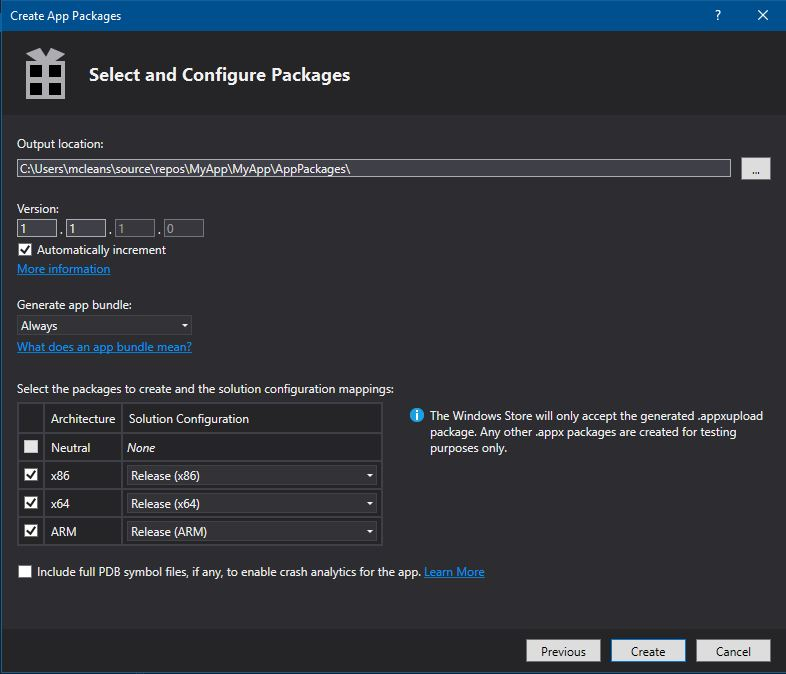

# Package a UWP app with Visual Studio

To sell your Universal Windows Platform (UWP) app or distribute it to other users, you need to package it. If you don't want to distribute your app through Microsoft Store, you can sideload the app package directly to a device or distribute it via [Web Install](installing-UWP-apps-web.md). This article describes the process of configuring, creating, and testing a UWP app package using Visual Studio. For more information about managing and deploying line-of-business (LOB) apps, see [Enterprise app management](https://docs.microsoft.com/windows/client-management/mdm/enterprise-app-management).

In Windows 10, you can submit an app package (.appx), app bundle (.appxbundle), or a complete app package upload file (.appxupload) to the Windows Dev Center. Of these options, submitting a package upload file will provide the best experience. 

## Types of app packages

- **App Package (.appx)**  
    A file that contains your app in a format that can be sideloaded on a device. Any single .appx package file created by Visual Studio is **not** intended to be submitted to Dev Center and should be used for sideloading and testing purposes only. If you want to submit your app to Dev Center, use the app package upload file.  

- **App Bundle (.appxbundle)**  
    An app bundle is a type of package that can contain multiple app packages, each of which is built to support a specific device architecture. For example, an app bundle can contain three separate app packages for the x86, x64, and ARM configurations. App bundles should be generated whenever possible because they allow your app to be available on the widest possible range of devices.  

- **App Package Upload File (.appxupload)**  
    A single file that can contain multiple app packages or an app bundle to support various processor architectures. The upload file also contains a symbol file to [Analyze app performance](https://docs.microsoft.com/windows/uwp/publish/analytics) after your app has been published in the Microsoft Store. This file will be automatically created for you if you are packaging your app with Visual Studio with the intention of submitting it to Dev Center for publishing. It's important to note that this is the **only** valid app package Dev Center submissions that can be created using Visual Studio.

Here is an overview of the steps to prepare and create an app package:

1.  [Before packaging your app](#before-packaging-your-app). Follow these steps to ensure your app is ready to be packaged for Dev Center submission.
2.  [Configure an app package](#configure-an-app-package). Use the Visual Studio manifest designer to configure the package. For example, add tile images and choose the orientations your app supports.
3.  [Create an app package upload file](#create-an-app-package-upload-file). Use the Visual Studio app package wizard to create an app package, then certify your package with the Windows App Certification Kit.
4.  [Sideload your app package](#sideload-your-app-package). After sideloading your app to a device, you can test that it works as you expect it to.

After you have completed the steps above, you are ready to distribute your app. If you have a line-of-business (LOB) app that you don't plan to sell because it's for internal users only, you can sideload this app to install it on any Windows 10 device.

## Before packaging your app

1.  **Test your app.** Before you package your app for Dev Center submission, make sure it works as expected on all device families that you plan to support. These device families may include desktop, mobile, Surface Hub, Xbox, IoT devices, or others.
2.  **Optimize your app.** You can use Visual Studio’s profiling and debugging tools to optimize the performance of your UWP app. For example, the Timeline tool for UI responsiveness, the Memory Usage tool, the CPU Usage tool, and more. For more information about these tools, see the [Profiling Feature Tour](https://docs.microsoft.com/visualstudio/profiling/profiling-feature-tour) topic.
3.  **Check .NET Native compatibility (for VB and C# apps).** In the Universal Windows Platform, there is a native compiler that will improve the runtime performance of your app. With this change, you should test your app in this compilation environment. By default, the **Release** build configuration enables the .NET native toolchain, so it's important to test your app with this **Release** configuration and check that your app behaves as expected. Some common debugging issues that can happen with .NET Native are explained in more detail in [Debugging .NET Native Windows Universal Apps](http://blogs.msdn.com/b/visualstudioalm/archive/2015/07/29/debugging-net-native-windows-universal-apps.aspx).

## Configure an app package

The app manifest file (Package.appxmanifest) is an XML file that contains the properties and settings required to create your app package. For example, properties in the app manifest file describe the image to use as the tile of your app and the orientations that your app supports when a user rotates the device.

The Visual Studio manifest designer allows you to update the manifest file without editing the raw XML of the file.

**Configure a package with the manifest designer**

1.  In **Solution Explorer**, expand the project node of your UWP app.
2.  Double-click the **Package.appxmanifest** file. If the manifest file is already open in the XML code view, Visual Studio prompts you to close the file.
3.  Now you can decide how to configure your app. Each tab contains information that you can configure about your app and links to more information if necessary.  
    

    Check that you have all the images that are required for a UWP app on the **Visual Assets** tab.

    From the **Packaging** tab, you can enter publishing data. This is where you can choose which certificate to use to sign your app. All UWP apps must be signed with a certificate. 
    
    >[!IMPORTANT]
    >If you're publishing your app in Microsoft Store, your app will be signed with a trusted certificate for you. This allows the user to install and run your app without installing the associated app signing certificate. 
    
    If you are not publishing your app and simply want to sideload an app package, you first need to trust the package. To trust the package, the certificate must be installed on the user's device. For more information about sideloading, see [Enable your device for development](https://docs.microsoft.com/windows/uwp/get-started/enable-your-device-for-development).

4.  Save your **Package.appxmanifest** file after you have made the necessary edits for your app.

If you are distributing your app via Microsoft Store, Visual Studio can associate your package with the Store. When you associate your app, some of the fields in the Packaging tab of the manifest designer are automatically updated.

## Create an app package upload file

To distribute an app through Microsoft Store you must create an app package (.appx), app bundle (.appxbundle), or an upload package (.appxupload) and [submit the packaged app to Dev Center](https://docs.microsoft.com/windows/uwp/publish/app-submissions). Although it is possible to submit an app package or app bundle to Dev Center alone, you are encouraged to submit an upload package.

>[!NOTE]
> The app package upload file (.appxupload) is the **only** type of valid app package for Dev Center that can be created using Visual Studio. Other valid [app packages can be created manually](https://docs.microsoft.com/windows/uwp/packaging/create-app-package-with-makeappx-tool), without Visual Studio. 

You can do that by using the **Create App Packages** wizard. Follow these steps to create a package suitable for Dev Center submission using Visual Studio.

**To create your app package upload file**

1.  In **Solution Explorer**, open the solution for your UWP app project.
2.  Right-click the project and choose **Store**->**Create App Packages**. If this option is disabled or does not appear at all, check that the project is a Universal Windows project.  
    

    The **Create App Packages** wizard appears.

3.  Select Yes in the first dialog asking if you want to build packages to upload to Dev Center, then click Next.  
    

    If you choose No, Visual Studio will not generate the app package upload (.appxupload) file for Dev Center submissions. If you only want to sideload your app to run it on internal devices or for testing purposes, then you can select this option. For more information about sideloading, see [Enable your device for development](https://docs.microsoft.com/windows/uwp/get-started/enable-your-device-for-development).
4.  Sign in with your developer account to the Windows Dev Center. If you don't have a developer account yet, the wizard will help you create one.
5.  Select the app name for your package, or reserve a new one if you have not already reserved one with the Windows Dev Center portal.  
    
6.  Make sure you select all three architecture configurations (x86, x64, and ARM) in the **Select and Configure Packages** dialog to ensure that your app can be deployed to the widest range of devices. In the **Generate app bundle** listbox, select **Always**. An app bundle (.appxbundle) is preferred over a single app package (.appx) because it contains a collection of app packages configured for each type of processor architecture. When you choose to generate the app bundle, the app bundle will be included in the final app package upload (.appxupload) file along with debugging and crash analytic information. If you're unsure which architecture(s) to choose, or want to learn more about which architectures are used by various devices, see [App package architectures](https://docs.microsoft.com/windows/uwp/packaging/device-architecture).  
    

7.  Include full PDB symbol files to [Analyze app performance](https://docs.microsoft.com/windows/uwp/publish/analytics) from the Windows Dev Center after your app has been published. Configure any additional details such as version numbering or the package output location.
9.  Click **Create** to generate the app package. If you selected **Yes** in step 3 and are creating a package for Dev Center submission, the wizard will create a package upload (.appxupload) file. If you selected **No** in step 3, the wizard will create either a single app package or an app bundle based on your selections in step 6.
10. When your app has been successfully packaged, you will see this dialog.  
    

    Validate your app before you submit it to Dev Center for certification on a local or remote machine. You can only validate release builds for your app package, not debug builds.

11. To validate your app locally, leave the **Local machine** option selected and click **Launch Windows App Certification Kit**. For more information about testing your app with the Windows App Certification Kit, see [Windows App Certification Kit](https://msdn.microsoft.com/library/windows/apps/Mt186449).

    The Windows App Certification Kit performs various tests and returns the results. See [Windows App Certification Kit tests](https://msdn.microsoft.com/library/windows/apps/mt186450) for more specific information.

    If you have a remote Windows 10 device that you want to use for testing, you will need to install the Windows App Certification Kit manually on that device. The next section will walk you through these steps. After you've done that, then you can select **Remote machine** and click **Launch Windows App Certification Kit** to connect to the remote device and run the validation tests.

12. After WACK has finished and your app has passed certification, you are ready to submit your app to Dev Center. Make sure you upload the correct file. The default location of the file can be found in the root folder of your solution `\[AppName]\AppPackages` and it will end with the .appxupload file extension. The name will be of the form `[AppName]_[AppVersion]_x86_x64_arm_bundle.appxupload` if you opted for an app bundle with all of the package architecture selected.

For more information on submitting your app to Dev Center, see [App submissions](https://docs.microsoft.com/windows/uwp/publish/app-submissions).

**Validate your app package on a remote Windows 10 device**

1.  Enable your Windows 10 device for development by following the [Enable your device for development](https://msdn.microsoft.com/library/windows/apps/Dn706236) instructions.
    **Important**  You cannot validate your app package on a remote ARM device for Windows 10.
2.  Download and install the remote tools for Visual Studio. These tools are used to run the Windows App Certification Kit remotely. You can get more information about these tools including where to download them by visiting [Run UWP apps on a remote machine](https://msdn.microsoft.com/library/hh441469.aspx#BKMK_Starting_the_Remote_Debugger_Monitor).
3.  Download the required [Windows App Certification Kit](http://go.microsoft.com/fwlink/p/?LinkID=309666) and then install it on your remote Windows 10 device.
4.  On the **Package Creation Completed** page of the wizard, choose the **Remote Machine** option button, and then choose the ellipsis button next to the **Test Connection** button.
    **Note**  The **Remote Machine** option button is available only if you selected at least one solution configuration that supports validation. For more information about testing your app with the WACK, see [Windows App Certification Kit](https://msdn.microsoft.com/library/windows/apps/Mt186449).
5.  Specify a device form inside your subnet, or provide the Domain Name Server (DNS) name or IP address of a device that's outside of your subnet.
6.  In the **Authentication Mode** list, choose **None** if your device doesn't require you to log onto it by using your Windows credentials.
7.  Choose the **Select** button, and then choose the **Launch Windows App Certification Kit** button. If the remote tools are running on that device, Visual Studio connects to the device and then performs the validation tests. See [Windows App Certification Kit tests](https://msdn.microsoft.com/library/windows/apps/mt186450).

## Sideload your app package

Introduced in the Windows 10 Anniversary Update, app packages can be installed simply by double clicking the app package file. To use this, simply navigate to your app package (.appx) or app bundle (.appxbundle) file, and double click it. The App Installer launches and provides the basic app information as well as an install button, installation progress bar, and any relevant error messages. 

> [!NOTE]
> The App Installer assumes that the app is trusted by the device. If you are sideloading a developer or enterprise app, you will need to install the signing certificate to the Trusted People or Trusted Publishers Certification Authorities store on the device. If you're not sure how to do this, see [Installing Test Certificates](https://docs.microsoft.com/windows-hardware/drivers/install/installing-test-certificates).

### Sideload your app on previous versions of Windows
With UWP app packages, apps aren't installed to a device as they are with Desktop apps. Typically, you download UWP apps from Microsoft Store, which also installs the app to your device for you. Apps can be installed without being published in the Store (sideloading). This lets you install and test apps using the app package (.appx) that you have created. If you have an app that you don’t want to sell in the Store, like a line-of-business (LOB) app, you can sideload that app so that other users in your company can use it.

The following list provides requirements for sideloading your app.

-   You must [enable your device for development](https://msdn.microsoft.com/library/windows/apps/Dn706236).
-   To sideload your app on a Windows 10 Mobile device, use the [WinAppDeployCmd.exe](install-universal-windows-apps-with-the-winappdeploycmd-tool.md) tool.

**Sideload an app to a desktop, laptop, or tablet**

1.  Copy the folders for the app version to install on the target device.

    If you've created an app bundle, then you will have a folder based on the version number and a `*_Test` folder. For example these two folders (where the version to install is 1.0.2.0):

    -   `C:\Projects\MyApp\MyApp\AppPackages\MyApp_1.0.2.0`
    -   `C:\Projects\MyApp\MyApp\AppPackages\MyApp_1.0.2.0_Test`

    If you don't have an app bundle, copy the folder for the correct architecture and its corresponding `*_Test` folder. These two folders are an example of an app package with the x64 architecture and its `*_Test` folder:

    -   `C:\Projects\MyApp\MyApp\AppPackages\MyApp_1.0.2.0_x64`
    -   `C:\Projects\MyApp\MyApp\AppPackages\MyApp_1.0.2.0_x64_Test`

2.  On the target device, open the `*_Test` folder.
3.  Right-click on the **Add-AppDevPackage.ps1** file. Choose **Run with PowerShell** and follow the prompts.  
    

    When the app package has been installed, the PowerShell window displays this message: **Your app was successfully installed.**

    **Tip**: To open the shortcut menu on a tablet, touch the screen where you want to right-click, hold until a complete circle appears, then lift your finger. The shortcut menu opens once you lift your finger.
4.  Click the Start button to search for the app by name, and then launch it.
