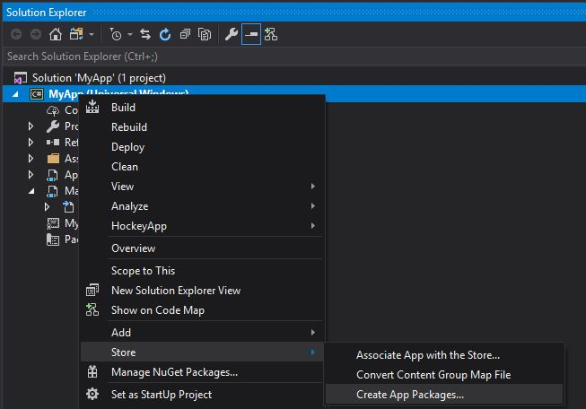

# Package a UWP app with Visual Studio

\[ Updated for UWP apps on Windows 10. For Windows 8.x articles, see the [archive](http://go.microsoft.com/fwlink/p/?linkid=619132) \]

To sell your Universal Windows Platform (UWP) app or distribute it to other users, you need to create an appxupload package for it. When you create the appxupload, another appx package will be generated to use for testing and sideloading. You can distribute your app directly by sideloading the appx package to a device. This article describes the process of configuring, creating and testing a UWP app package. For more information about sideloading, see [Sideload Apps in Windows 10](https://technet.microsoft.com/library/mt269549.aspx).

For Windows 10, you generate one package (.appxupload) that can be uploaded to the Windows Store. Your app is then available to be installed and run on any Windows 10 device. Here are the steps to create an app package.

1.  [Before packaging your app](#before-packaging-your-app). Follow these steps to make sure your app is ready to be packaged for store submission.
2.  [Configure an app package](#configure-an-app-package). Use the manifest designer to configure the package. For example, add tile images and choose the orientations your app supports.
3.  [Create an app package](#create-an-app-package). Use the wizard in Microsoft Visual Studio to create an app package and then certify your package with the Windows App Certification Kit.
4.  [Sideload your app package](#sideload-your-app-package). After sideloading your app to a device, you can test that it works correctly.

After you have completed the steps above, you are ready to sell your app in the store. If you have a line-of-business (LOB) app, that you don't plan to sell because it's for internal users only, you can sideload this app to install it on any Windows 10 device.

## Before packaging your app

1.  Test your app. Before you package your app for store submission, make sure it works as expected on all device families that you plan to support. These device families may include desktop, mobile, Surface Hub, XBOX, IoT devices, or others.
2.  Optimize your app. You can useVisual Studio’s profiling and debugging tools to optimize the performance of your UWP app. For example, the Timeline tool for UI responsiveness, the memory Usage tool, the CPU Usage tool, and more. For more information about these tools, see [Run diagnostic tools without debugging](https://msdn.microsoft.com/library/dn957936.aspx).
3.  Check .NET Native compatibility (for VB and C# apps). With the UWP, there is now a new native compiler that will improve the runtime performance of your app. With this change, it is highly recommended that you test your app in this compilation environment. By default, the **Release** build configuration enables the .NET native toolchain, so it is important to test your app with this **Release** configuration and check that your app behaves as expected. Some common debugging issues that can happen with .NET Native are explained in more detail [here](http://blogs.msdn.com/b/visualstudioalm/archive/2015/07/29/debugging-net-native-windows-universal-apps.aspx).

## Configure an app package

The app manifest file (package.appxmanifest) has the properties and settings that are required to create your app package. For example, properties in the manifest file describe the image to use as the tile of your app and the orientations that your app supports when a user rotates the device.

Visual Studio has a manifest designer that makes it easy for you to update the manifest file without editing the raw XML of the file.

Visual Studio can associate your package with the Store. When you do this, some of the fields in the Packaging tab of the manifest designer are automatically updated.

**Configure a package with the manifest designer**

1.  In **Solution Explorer**, expand the project node of your UWP app.
2.  Double-click the **Package.appxmanifest** file. If the manifest file is already open in the XML code view, Visual Studio prompts you to close the file.
3.  Now you can decide how to configure your app. Each tab contains information that you can configure about your app and links to more information if necessary. 
    

    Check that you have all the images that are required for a UWP app on the **Visual Assets** tab.

    From the **Packaging** tab, you can enter publishing data. This is where you can choose which certificate to use to sign your app. All UWP apps must be signed with a certificate. In order to sideload an app package, you need to trust the package. The certificate must be installed on that device to trust the package. For more information about sideloading, see [Enable your device for development](https://msdn.microsoft.com/library/windows/apps/Dn706236).

4.  Save your file after you have made the necessary edits for your app.

## Create an app package

To distribute an app through the Store you must create an appxupload package. You can do that by using the **Create App Packages** wizard. Follow these steps to create a package suitable for store submission with Microsoft Visual Studio 2015.

**To create your app package**

1.  In **Solution Explorer**, open the solution for your UWP app project.
2.  Right-click the project and choose **Store**->**Create App Packages**. If this option is disabled or does not appear at all, check that the project is a UWP project. 
    

    The **Create App Packages** wizard appears.

3.  Select Yes in the first dialog asking if you want to build packages to upload to the Windows Store, then click Next. 
    

    If you choose No here, Visual Studio will not generate the required .appxupload package you need for store submission. If you only want to sideload your app to run it on internal devices, then you can select this option. For more information about sideloading, see [Enable your device for development](https://msdn.microsoft.com/library/windows/apps/Dn706236).

4.  Sign in with your developer account to the Windows Dev Center. (If you don't have a developer account yet, the wizard will help you create one.)
5.  Select the app name for your package, or reserve a new one if you have not already reserved one with the Windows Dev Center portal. 
    
6.  Make sure you select all three architecture configurations (x86, x64, and ARM) in the **Select and Configure Packages** dialog. That way your app can be deployed to the widest range of devices. In the **Generate app bundle** listbox, select **Always**. This makes the store submission process much simpler because you will only have one file to upload (.appxupload). The single bundle will contain all the necessary packages to deploy to devices with each processor architecture. 
    
7.  It is a good idea to include full PDB symbol files for the best [crash analytics](http://blogs.windows.com/buildingapps/2015/07/13/crash-analysis-in-the-unified-dev-center/) experience from the Windows Dev Center. You can learn more about debugging with symbols by visiting [Debugging with Symbols](https://msdn.microsoft.com/library/windows/desktop/Ee416588).
8.  Now you can configure the details to create your package. When you're ready to publish your app, you'll upload the packages from the output location.
9.  Click **Create** to generate your appxupload package.
10. Now you will see this dialog. 
    

    Validate your app before you submit it to the Store for certification on a local or remote machine. (You can only validate release builds for your app package and not debug builds.)

11. To validate locally, leave the **Local machine** option selected and click **Launch Windows App Certification Kit**. For more information about testing your app with the Windows App Certification Kit, see [Windows App Certification Kit](https://msdn.microsoft.com/library/windows/apps/Mt186449).

    The Windows App Certification Kit performs tests and shows you the results. See [Windows App Certification Kit tests](https://msdn.microsoft.com/library/windows/apps/mt186450).

    If you have a remote Windows 10 that you want to use for testing, you will need to install the Windows App Certification Kit manually on that device. The next section will walk you through these steps. After you've done that, then you can select **Remote machine** and click **Launch Windows App Certification Kit** to connect to the remote device and run the validation tests.

12. After WACK has finished and your app has passed, you are ready to upload to the store. Make sure you upload the correct file. It can be found in the root folder of your solution \\\[AppName\]\\AppPackages and it will end with the .appxupload file extension. The name will be of the form \[AppName\]\_\[AppVersion\]\_x86\_x64\_arm\_bundle.appxupload.

**Validate your app package on a remote Windows 10 device**

1.  Enable your Windows 10 device for development by following the [Enable your device for development](https://msdn.microsoft.com/library/windows/apps/Dn706236) instructions.
    **Important**  You cannot validate your app package on a remote ARM device for Windows 10.
2.  Download and install the remote tools for Visual Studio. These tools are used to run the Windows App Certification Kit remotely. You can get more information about these tools including where to download them by visiting [Run Windows Store apps on a remote machine](https://msdn.microsoft.com/library/hh441469.aspx#BKMK_Starting_the_Remote_Debugger_Monitor).
3.  Download the required [Windows App Certification Kit](http://go.microsoft.com/fwlink/p/?LinkID=309666) and then install it on your remote Windows 10 device.
4.  On the **Package Creation Completed** page of the wizard, choose the **Remote Machine** option button, and then choose the ellipsis button next to the **Test Connection** button.
    **Note**  The **Remote Machine** option button is available only if you selected at least one solution configuration that supports validation. For more information about testing your app with the WACK, see [Windows App Certification Kit](https://msdn.microsoft.com/library/windows/apps/Mt186449).
5.  Specify a device form inside your subnet, or provide the Domain Name Server (DNS) name or IP address of a device that's outside of your subnet.
6.  In the **Authentication Mode** list, choose **None** if your device doesn't require you to log onto it by using your Windows credentials.
7.  Choose the **Select** button, and then choose the **Launch Windows App Certification Kit** button. If the remote tools are running on that device, Visual Studio connects to it and then performs the validation tests. See [Windows App Certification Kit tests](https://msdn.microsoft.com/library/windows/apps/mt186450).

## Sideload your app package

With UWP app packages, you cannot simply install an app to your device like Desktop apps. Typically, you download these apps from the Store and that is how they are installed on your device. But you can sideload apps to your device without submitting them to the Store. This lets you install them and test them out using the app package (.appx) that you have created. If you have an app that you don’t want to sell in the Store, like a line-of-business (LOB) app, you can sideload that app so that other users in your company can use it.

The following list provides requirements for sideloading your app.

-   You must [enable your device for development](https://msdn.microsoft.com/library/windows/apps/Dn706236).
-   To sideload your app on a Windows 10 Mobile device, you must use the [WinAppDeployCmd.exe](install-universal-windows-apps-with-the-winappdeploycmd-tool.md) tool.

**Sideload an app to a desktop, laptop, or tablet**

1.  Copy the folders for the version that you want to install to the target device.

    If you've created an app bundle, then you will have a folder based on the version number and a \_test folder. For example these two folders (where the version to install is 1.0.2):

    -   C:\\Projects\\MyApp\\MyApp\\AppPackages\\MyApp\_1.0.2.0
    -   C:\\Projects\\MyApp\\MyApp\\AppPackages\\MyApp\_1.0.2.0\_Test

    If you don't have an app bundle, then you can just copy the folder for the correct architecture and the corresponding test folder. For example these two folders.

    -   C:\\Projects\\MyApp\\MyApp\\AppPackages\\MyApp\_1.0.2.0\_x64
    -   C:\\Projects\\MyApp\\MyApp\\AppPackages\\MyApp\_1.0.2.0\_x64\_Test
2.  On the target device, open the test folder. For example, C:\\Projects\\MyApp\\MyApp\\AppPackages\\MyApp\_1.0.2.0\_Test
3.  Right-click on the **Add-AppDevPackage.ps1** file, then choose **Run with PowerShell** and follow the prompts. 
    

    When the app package has been installed, you will see this message in your PowerShell window: Your app was successfully installed.

    **Note**  To open the shortcut menu on a tablet, touch the screen where you want to right-click, hold until a complete circle appears, then lift your finger. The shortcut menu appears after you lift your finger.
4.  Click the Start button and then type the name of your app to launch it.
